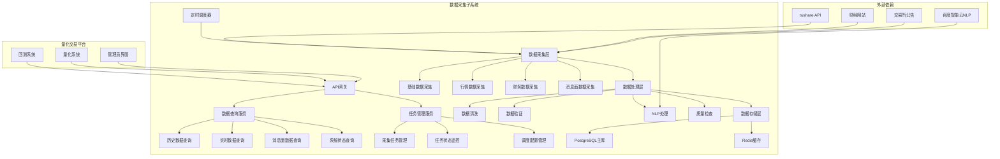
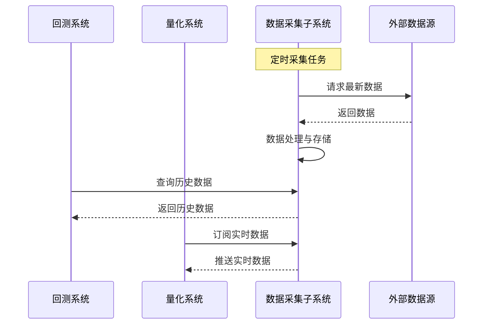
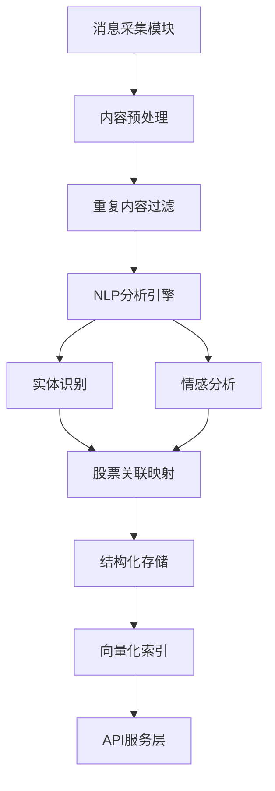
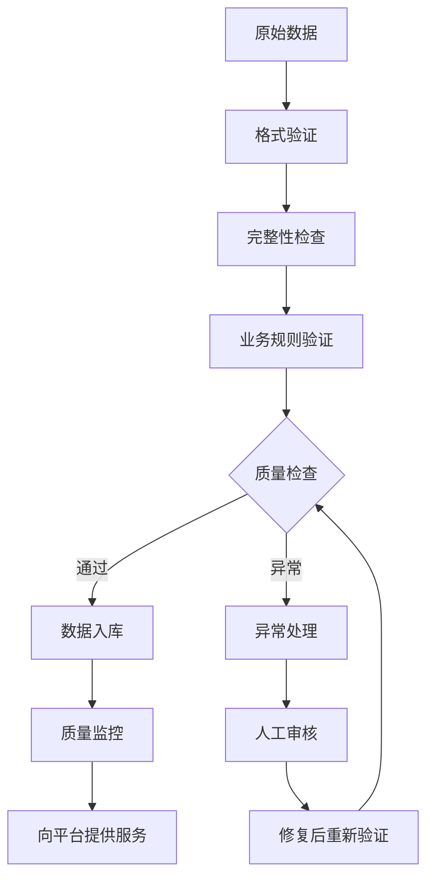
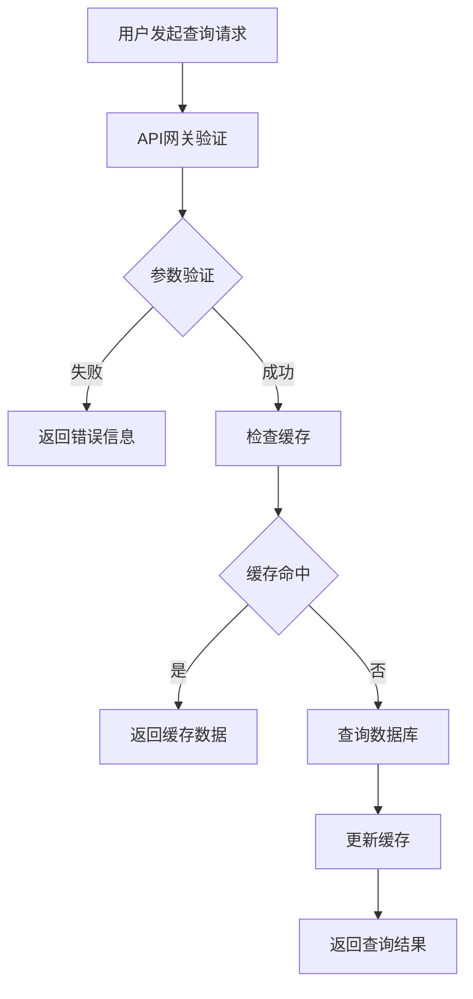
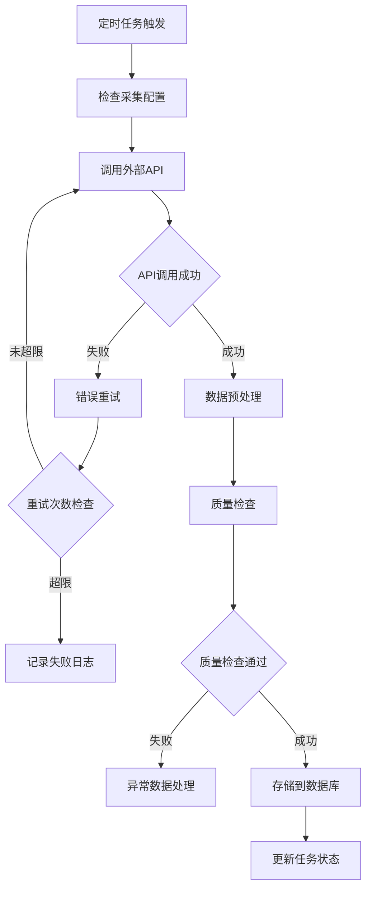
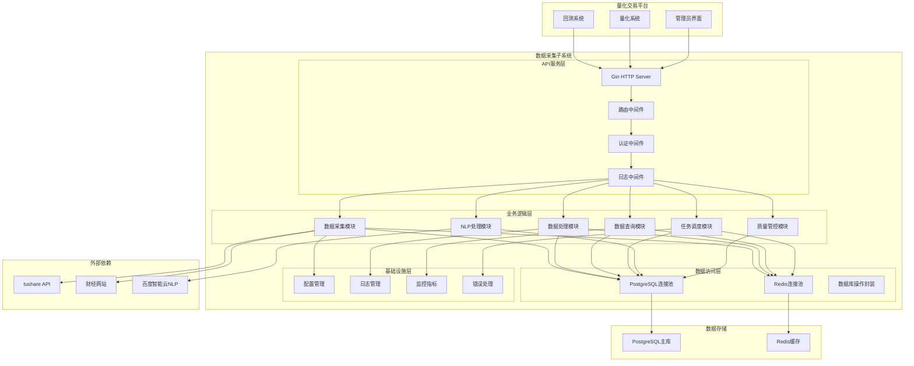

# 数据采集子系统产品需求文档 (PRD)

## 文档信息

| 项目    | 内容          |
| ----- | ----------- |
| 子系统名称 | 量化平台数据采集子系统 |
| 文档版本  | v2.1        |
| 创建日期  | 2024-01-15  |
| 最后更新  | 2024-01-15  |
| 产品经理  | \[产品经理姓名]   |
| 开发团队  | \[开发团队]     |
| 文档状态  | 待评审         |
| 所属平台  | 量化交易平台      |

## 1. 产品概述

### 1.1 子系统背景

**业务背景**

数据采集子系统是量化交易平台的核心基础设施，为平台内的回测系统、量化系统提供统一的数据服务。作为平台的数据中枢，需要解决以下核心问题：

1. **数据供应统一化**：为平台内各子系统提供标准化的数据接口
2. **数据质量保障**：确保数据的准确性和完整性，支撑策略的可靠执行
3. **数据更新及时性**：实时数据采集，保证交易决策的时效性
4. **消息面数据结构化**：将非结构化的新闻、公告转化为可用的投资信号
5. **系统间数据一致性**：确保回测系统和实盘系统使用相同的数据源

**子系统定位**

作为量化平台的数据层，本子系统承担以下职责：

* 统一数据采集：集中管理所有外部数据源的接入

* 数据标准化：提供统一的数据格式和接口规范

* 数据质量管控：建立完善的数据验证和清洗机制

* 服务化封装：为上层业务系统提供高可用的数据服务

### 1.2 子系统定位

**服务对象**

* **回测系统**：提供历史数据支持策略回测验证

* **量化系统**：提供实时数据支持策略执行和风控

* **管理员**：提供系统监控和运维管理功能

**服务特征**

| 服务对象 | 数据需求   | 调用模式 | 性能要求 |
| ---- | ------ | ---- | ---- |
| 回测系统 | 历史全量数据 | 批量查询 | 高吞吐量 |
| 量化系统 | 实时增量数据 | 实时订阅 | 低延迟  |
| 管理员  | 系统状态数据 | 定期查询 | 高可用性 |

**子系统边界**

* **职责范围**：数据采集、处理、存储、查询服务

* **上游依赖**：外部数据源（tushare、财经网站等）

* **下游服务**：回测系统、量化系统、监控系统

* **横向协作**：与平台其他子系统通过标准API交互

### 1.3 子系统目标

**服务目标**

1. **数据服务稳定性**：为平台提供99.9%可用性的数据服务
2. **数据质量保障**：确保数据完整性达到99.9%，延迟控制在5分钟内
3. **接口标准化**：提供统一的RESTful API，简化系统间集成
4. **性能优化**：API响应时间控制在100ms内，支持高并发访问

**业务价值**

1. **支撑回测准确性**：提供高质量历史数据，确保回测结果可信
2. **保障实盘稳定性**：实时数据供应，支持量化策略稳定执行
3. **降低开发成本**：统一数据接口，减少重复开发工作
4. **提升运维效率**：集中化数据管理，简化系统维护

**技术指标**

1. **可用性**：子系统可用性达到99.9%
2. **性能**：支持每秒500+并发查询（满足平台内部需求）
3. **扩展性**：支持数据量5倍增长
4. **维护性**：采用gin框架，简化开发和部署

## 2. 需求分析

### 2.1 功能需求

#### 2.1.1 核心功能列表

| 功能模块    | 功能描述          | 优先级 | 复杂度 | 预估工期 |
| ------- | ------------- | --- | --- | ---- |
| 基础数据采集  | 股票基础信息、行情数据采集 | P0  | 中   | 2周   |
| 财务数据采集  | 财报、财务指标数据采集   | P0  | 中   | 2周   |
| 消息面数据采集 | 新闻、公告数据采集     | P1  | 高   | 3周   |
| NLP数据处理 | 实体识别、情感分析     | P1  | 高   | 3周   |
| 数据质量管控  | 数据清洗、异常检测     | P0  | 中   | 2周   |
| 数据查询服务  | RESTful API接口 | P0  | 低   | 1周   |
| 任务调度管理  | 定时任务、状态监控     | P0  | 中   | 2周   |
| 系统监控告警  | 健康检查、异常告警     | P1  | 低   | 1周   |

#### 2.1.2 功能优先级排序

**P0 (必须有)**

* 基础数据采集服务

* 数据质量管控

* 数据查询API

* 任务调度管理

**P1 (应该有)**

* 消息面数据采集

* NLP数据处理

* 系统监控告警

**P2 (可以有)**

* 数据可视化界面

* 高级分析功能

* 第三方数据源集成

### 2.2 非功能需求

#### 2.2.1 性能要求

| 指标      | 目标值      | 测量方法   |
| ------- | -------- | ------ |
| API响应时间 | <100ms   | 压力测试   |
| 数据处理延迟  | <5分钟     | 端到端监控  |
| 并发处理能力  | 1000 QPS | 负载测试   |
| 数据完整性   | 99.9%    | 数据质量检查 |
| 系统可用性   | 99.9%    | 监控统计   |

#### 2.2.2 安全要求

1. **内部通信安全**：子系统内部API调用，无需复杂认证机制
2. **数据安全**：数据库连接加密，敏感配置信息环境变量管理
3. **日志记录**：关键操作日志记录，便于问题排查和系统监控

#### 2.2.3 可用性要求

1. **容错能力**：单点故障不影响核心功能
2. **数据备份**：每日自动备份，支持快速恢复
3. **监控告警**：实时监控，异常自动告警
4. **文档完善**：详细的API文档和运维手册

### 2.4 需求变更记录

| 版本   | 变更日期       | 变更内容    | 变更原因   | 影响评估     |
| ---- | ---------- | ------- | ------ | -------- |
| v1.0 | 2024-01-01 | 初始需求    | 项目启动   | -        |
| v2.0 | 2024-01-15 | 增加NLP处理 | 业务需求扩展 | 增加3周开发时间 |

## 3. 产品功能设计

### 3.1 子系统架构图



### 3.2 核心功能详述

#### 3.2.1 数据采集服务

**功能描述**

作为子系统的核心模块，负责从外部数据源采集金融市场数据，为平台内的回测系统和量化系统提供数据支撑。

**服务能力**

1. **统一数据接入**：集中管理tushare等外部数据源
2. **智能调度采集**：根据平台需求自动调度数据采集任务
3. **增量更新机制**：支持全量初始化和增量更新
4. **容错恢复**：网络中断后自动恢复，保证数据连续性
5. **频率控制**：遵守外部API限制，避免被限流

**与平台交互流程**



**异常处理策略**

1. **外部API异常**：自动重试，降级到备用数据源
2. **网络中断**：本地缓存，恢复后补齐数据
3. **数据质量异常**：标记异常数据，通知管理员
4. **存储异常**：Redis缓存，延迟写入数据库

#### 3.2.2 消息面数据处理服务

**功能描述**

为平台提供结构化的消息面数据，通过NLP技术将新闻、公告等非结构化信息转化为可用的投资信号，支撑量化策略的决策。

**服务能力**

1. **多源数据整合**：统一处理来自财经网站、交易所公告的消息数据
2. **智能内容解析**：自动提取关键信息，过滤无效内容
3. **实体关联映射**：将新闻实体精确映射到平台内的股票标的
4. **情感量化分析**：为量化系统提供可计算的情感指标
5. **实时信号推送**：重要消息实时推送给量化系统

**子系统内处理流程**



#### 3.2.3 数据质量保障服务

**功能描述**

作为子系统的质量守护者，确保向平台提供的数据符合回测和实盘交易的质量要求，建立完善的数据质量监控和异常处理机制。

**质量保障体系**

1. **入口数据验证**：对外部数据源的原始数据进行格式和完整性校验
2. **处理过程监控**：监控数据处理各环节的质量指标
3. **输出数据检查**：确保提供给平台的数据符合业务规范
4. **历史数据一致性**：保证回测数据与实盘数据的一致性
5. **实时质量监控**：建立质量指标监控大屏，及时发现问题

**质量控制流程**



**异常处理机制**

| 异常类型 | 自动处理策略  | 人工介入条件  | 对平台影响  |
| ---- | ------- | ------- | ------ |
| 数据缺失 | 历史数据补齐  | 连续缺失>3天 | 低      |
| 格式异常 | 自动转换修复  | 转换失败    | 低      |
| 异常值  | 标记异常状态  | 影响核心指标  | 中      |
| 重复数据 | 自动去重    | 去重逻辑异常  | 低      |
| 延迟更新 | 告警通知    | 延迟>30分钟 | 高      |
| 关联错误 | 告警并暂停处理 | 高       | <br /> |

#### 3.2.4 数据查询服务

**功能描述**

提供统一的RESTful API接口，支持多维度数据查询和实时数据获取。

**查询能力**

1. **多维度查询**：按股票、时间、指标等维度查询
2. **聚合查询**：支持分组、排序、统计等聚合操作
3. **实时查询**：毫秒级响应的实时数据查询
4. **批量查询**：支持批量数据导出
5. **缓存优化**：热点数据Redis缓存

**API设计原则**

1. **RESTful规范**：遵循REST API设计规范
2. **版本管理**：支持API版本控制
3. **统一响应**：标准化的响应格式
4. **错误处理**：详细的错误码和错误信息
5. **文档完善**：自动生成API文档

### 3.3 用户流程图

#### 3.3.1 数据查询流程



#### 3.3.2 数据采集流程



### 3.4 界面原型

#### 3.4.1 API文档界面

由于本系统主要提供API服务，界面原型主要包括：

1. **API文档页面**：Swagger自动生成的API文档
2. **系统监控页面**：简单的系统状态监控界面
3. **任务管理页面**：数据采集任务的管理界面

#### 3.4.2 监控大屏

```
POST /api/v1/tasks
```

## 4. 技术架构设计

### 4.1 子系统架构

**设计原则**

1. **轻量高效**：采用gin框架，简化开发和部署
2. **服务导向**：为平台内系统提供标准化数据服务
3. **模块解耦**：清晰的模块边界，便于维护和扩展
4. **成本优化**：单机部署，降低基础设施成本

**技术选型**

| 组件类型  | 技术选择          | 选择理由         | 在子系统中的作用        |
| ----- | ------------- | ------------ | --------------- |
| 开发语言  | Go 1.19+      | 高性能、并发友好     | 子系统核心开发语言       |
| Web框架 | Gin v1.9+     | 轻量级、高性能      | 提供RESTful API服务 |
| 数据库   | PostgreSQL 14 | 关系型数据、JSON支持 | 主要数据存储          |
| 缓存    | Redis 6       | 高性能缓存、消息队列   | 数据缓存和任务队列       |
| 容器化   | Docker        | 标准化部署        | 子系统容器化部署        |
| 任务调度  | Cron + Redis  | 轻量级调度方案      | 数据采集任务调度        |
| 日志    | Logrus        | 结构化日志        | 子系统日志管理         |
| 配置管理  | Viper         | 配置文件管理       | 子系统配置管理         |

### 4.2 子系统技术架构图



### 4.3 数据库设计

#### 4.3.1 核心数据表结构

**股票基础信息表 (stocks)**

```sql
CREATE TABLE stocks (
    id SERIAL PRIMARY KEY,
    symbol VARCHAR(20) NOT NULL UNIQUE COMMENT '股票代码',
    name VARCHAR(100) NOT NULL COMMENT '股票名称',
    exchange VARCHAR(10) NOT NULL COMMENT '交易所(SH/SZ)',
    industry VARCHAR(50) COMMENT '所属行业',
    sector VARCHAR(50) COMMENT '所属板块',
    market_cap DECIMAL(20,2) COMMENT '总市值',
    outstanding_shares BIGINT COMMENT '流通股本',
    total_shares BIGINT COMMENT '总股本',
    listing_date DATE COMMENT '上市日期',
    status VARCHAR(20) DEFAULT 'active' COMMENT '状态(active/suspended/delisted)',
    created_at TIMESTAMP DEFAULT CURRENT_TIMESTAMP,
    updated_at TIMESTAMP DEFAULT CURRENT_TIMESTAMP ON UPDATE CURRENT_TIMESTAMP
) COMMENT='股票基础信息表';
```

**行情数据表 (quotes)**

```sql
CREATE TABLE quotes (
    id BIGSERIAL PRIMARY KEY,
    symbol VARCHAR(20) NOT NULL COMMENT '股票代码',
    datetime TIMESTAMP NOT NULL COMMENT '时间戳',
    period_type VARCHAR(10) NOT NULL COMMENT '周期类型(1m/5m/15m/30m/1h/1d/1w/1M)',
    open_price DECIMAL(10,3) NOT NULL COMMENT '开盘价',
    high_price DECIMAL(10,3) NOT NULL COMMENT '最高价',
    low_price DECIMAL(10,3) NOT NULL COMMENT '最低价',
    close_price DECIMAL(10,3) NOT NULL COMMENT '收盘价',
    pre_close DECIMAL(10,3) COMMENT '前收盘价',
    volume BIGINT NOT NULL COMMENT '成交量(股)',
    amount DECIMAL(20,2) NOT NULL COMMENT '成交金额(元)',
    turnover_rate DECIMAL(8,4) COMMENT '换手率(%)',
    pe_ratio DECIMAL(10,2) COMMENT '市盈率',
    pb_ratio DECIMAL(10,2) COMMENT '市净率',
    total_market_cap DECIMAL(20,2) COMMENT '总市值',
    circulating_market_cap DECIMAL(20,2) COMMENT '流通市值',
    created_at TIMESTAMP DEFAULT CURRENT_TIMESTAMP,
    UNIQUE KEY uk_symbol_datetime_period (symbol, datetime, period_type)
) COMMENT='行情数据表(支持多周期)';
```

**财务数据表 (financial\_data)**

```sql
CREATE TABLE financial_data (
    id BIGSERIAL PRIMARY KEY,
    symbol VARCHAR(20) NOT NULL COMMENT '股票代码',
    report_date DATE NOT NULL COMMENT '报告期',
    report_type VARCHAR(20) NOT NULL COMMENT '报告类型(Q1/Q2/Q3/A)',
    -- 利润表数据
    revenue DECIMAL(20,2) COMMENT '营业收入',
    operating_profit DECIMAL(20,2) COMMENT '营业利润',
    net_profit DECIMAL(20,2) COMMENT '净利润',
    gross_profit DECIMAL(20,2) COMMENT '毛利润',
    operating_cost DECIMAL(20,2) COMMENT '营业成本',
    -- 资产负债表数据
    total_assets DECIMAL(20,2) COMMENT '总资产',
    total_liabilities DECIMAL(20,2) COMMENT '总负债',
    shareholders_equity DECIMAL(20,2) COMMENT '股东权益',
    current_assets DECIMAL(20,2) COMMENT '流动资产',
    current_liabilities DECIMAL(20,2) COMMENT '流动负债',
    cash_and_equivalents DECIMAL(20,2) COMMENT '货币资金',
    inventory DECIMAL(20,2) COMMENT '存货',
    -- 现金流量表数据
    operating_cash_flow DECIMAL(20,2) COMMENT '经营活动现金流',
    investing_cash_flow DECIMAL(20,2) COMMENT '投资活动现金流',
    financing_cash_flow DECIMAL(20,2) COMMENT '筹资活动现金流',
    -- 财务比率
    roe DECIMAL(8,4) COMMENT '净资产收益率',
    roa DECIMAL(8,4) COMMENT '总资产收益率',
    gross_margin DECIMAL(8,4) COMMENT '毛利率',
    net_margin DECIMAL(8,4) COMMENT '净利率',
    current_ratio DECIMAL(8,4) COMMENT '流动比率',
    quick_ratio DECIMAL(8,4) COMMENT '速动比率',
    debt_to_asset_ratio DECIMAL(8,4) COMMENT '资产负债率',
    created_at TIMESTAMP DEFAULT CURRENT_TIMESTAMP,
    UNIQUE KEY uk_symbol_report (symbol, report_date, report_type)
) COMMENT='财务数据表';
```

**技术指标数据表 (technical\_indicators)**

```sql
CREATE TABLE technical_indicators (
    id BIGSERIAL PRIMARY KEY,
    symbol VARCHAR(20) NOT NULL COMMENT '股票代码',
    trade_date DATE NOT NULL COMMENT '交易日期',
    -- 趋势指标
    ma5 DECIMAL(10,3) COMMENT '5日均线',
    ma10 DECIMAL(10,3) COMMENT '10日均线',
    ma20 DECIMAL(10,3) COMMENT '20日均线',
    ma60 DECIMAL(10,3) COMMENT '60日均线',
    ema12 DECIMAL(10,3) COMMENT '12日指数移动平均',
    ema26 DECIMAL(10,3) COMMENT '26日指数移动平均',
    -- 动量指标
    macd DECIMAL(10,6) COMMENT 'MACD值',
    macd_signal DECIMAL(10,6) COMMENT 'MACD信号线',
    macd_histogram DECIMAL(10,6) COMMENT 'MACD柱状图',
    rsi DECIMAL(8,4) COMMENT 'RSI相对强弱指标',
    -- 波动率指标
    bollinger_upper DECIMAL(10,3) COMMENT '布林带上轨',
    bollinger_middle DECIMAL(10,3) COMMENT '布林带中轨',
    bollinger_lower DECIMAL(10,3) COMMENT '布林带下轨',
    atr DECIMAL(10,6) COMMENT '平均真实波幅',
    -- 成交量指标
    volume_ma5 BIGINT COMMENT '5日成交量均线',
    volume_ma20 BIGINT COMMENT '20日成交量均线',
    obv BIGINT COMMENT '能量潮指标',
    created_at TIMESTAMP DEFAULT CURRENT_TIMESTAMP,
    UNIQUE KEY uk_symbol_date (symbol, trade_date)
) COMMENT='技术指标数据表';
```

**新闻数据表 (news)**

```sql
CREATE TABLE news (
    id BIGSERIAL PRIMARY KEY,
    title VARCHAR(500) NOT NULL COMMENT '新闻标题',
    content TEXT COMMENT '新闻内容',
    summary VARCHAR(1000) COMMENT '新闻摘要',
    source VARCHAR(100) NOT NULL COMMENT '新闻来源',
    author VARCHAR(100) COMMENT '作者',
    publish_time TIMESTAMP NOT NULL COMMENT '发布时间',
    url VARCHAR(1000) COMMENT '原文链接',
    symbols TEXT COMMENT '相关股票代码(JSON数组)',
    industries TEXT COMMENT '相关行业(JSON数组)',
    -- 情绪分析
    sentiment_score DECIMAL(3,2) COMMENT '情绪得分(-1到1)',
    sentiment_label VARCHAR(20) COMMENT '情绪标签(positive/negative/neutral)',
    confidence_score DECIMAL(3,2) COMMENT '置信度',
    -- 分类信息
    importance_level INT DEFAULT 1 COMMENT '重要程度(1-5)',
    category VARCHAR(50) COMMENT '新闻分类',
    subcategory VARCHAR(50) COMMENT '新闻子分类',
    tags TEXT COMMENT '标签(JSON数组)',
    keywords TEXT COMMENT '关键词(JSON数组)',
    -- 传播信息
    read_count INT DEFAULT 0 COMMENT '阅读量',
    comment_count INT DEFAULT 0 COMMENT '评论数',
    share_count INT DEFAULT 0 COMMENT '分享数',
    created_at TIMESTAMP DEFAULT CURRENT_TIMESTAMP,
    INDEX idx_publish_time (publish_time),
    INDEX idx_symbols (symbols(100)),
    INDEX idx_category (category),
    INDEX idx_sentiment (sentiment_label, sentiment_score)
) COMMENT='新闻数据表';
```

**宏观经济数据表 (macro\_economic\_data)**

```sql
CREATE TABLE macro_economic_data (
    id BIGSERIAL PRIMARY KEY,
    indicator_name VARCHAR(100) NOT NULL COMMENT '指标名称',
    indicator_code VARCHAR(50) NOT NULL COMMENT '指标代码',
    period_type VARCHAR(20) NOT NULL COMMENT '周期类型(daily/weekly/monthly/quarterly/yearly)',
    period_date DATE NOT NULL COMMENT '期间日期',
    value DECIMAL(20,6) COMMENT '指标值',
    unit VARCHAR(50) COMMENT '单位',
    source VARCHAR(100) COMMENT '数据来源',
    created_at TIMESTAMP DEFAULT CURRENT_TIMESTAMP,
    UNIQUE KEY uk_indicator_period (indicator_code, period_date)
) COMMENT='宏观经济数据表';
```

**市场情绪指标表 (market\_sentiment)**

```sql
CREATE TABLE market_sentiment (
    id BIGSERIAL PRIMARY KEY,
    trade_date DATE NOT NULL COMMENT '交易日期',
    -- VIX类指标
    vix_index DECIMAL(8,4) COMMENT 'VIX恐慌指数',
    -- 资金流向
    northbound_net_inflow DECIMAL(20,2) COMMENT '北向资金净流入',
    margin_balance DECIMAL(20,2) COMMENT '融资融券余额',
    new_accounts INT COMMENT '新增开户数',
    -- 市场结构
    advance_decline_ratio DECIMAL(8,4) COMMENT '涨跌比',
    limit_up_count INT COMMENT '涨停股票数',
    limit_down_count INT COMMENT '跌停股票数',
    -- 情绪指数
    fear_greed_index DECIMAL(8,4) COMMENT '恐慌贪婪指数',
    investor_sentiment_index DECIMAL(8,4) COMMENT '投资者情绪指数',
    created_at TIMESTAMP DEFAULT CURRENT_TIMESTAMP,
    UNIQUE KEY uk_trade_date (trade_date)
) COMMENT='市场情绪指标表';
```

**行业数据表 (industry\_data)**

```sql
CREATE TABLE industry_data (
    id BIGSERIAL PRIMARY KEY,
    industry_code VARCHAR(50) NOT NULL COMMENT '行业代码',
    industry_name VARCHAR(100) NOT NULL COMMENT '行业名称',
    trade_date DATE NOT NULL COMMENT '交易日期',
    -- 行业指数
    index_value DECIMAL(10,3) COMMENT '行业指数',
    change_percent DECIMAL(8,4) COMMENT '涨跌幅',
    -- 行业资金流向
    net_inflow DECIMAL(20,2) COMMENT '净流入资金',
    main_inflow DECIMAL(20,2) COMMENT '主力净流入',
    -- 行业估值
    avg_pe DECIMAL(10,2) COMMENT '平均市盈率',
    avg_pb DECIMAL(10,2) COMMENT '平均市净率',
    -- 行业成交
    total_volume BIGINT COMMENT '总成交量',
    total_amount DECIMAL(20,2) COMMENT '总成交额',
    created_at TIMESTAMP DEFAULT CURRENT_TIMESTAMP,
    UNIQUE KEY uk_industry_date (industry_code, trade_date)
) COMMENT='行业数据表';
```

#### 4.3.2 索引设计

**股票表索引**

```sql
-- 行业查询索引
CREATE INDEX idx_stocks_industry ON stocks(industry);
-- 板块查询索引
CREATE INDEX idx_stocks_sector ON stocks(sector);
-- 状态查询索引
CREATE INDEX idx_stocks_status ON stocks(status);
```

**行情数据索引**

```sql
-- 行情数据索引
CREATE INDEX idx_quotes_symbol ON quotes(symbol);
CREATE INDEX idx_quotes_datetime ON quotes(datetime);
CREATE INDEX idx_quotes_period_type ON quotes(period_type);
CREATE INDEX idx_quotes_symbol_datetime ON quotes(symbol, datetime DESC);
CREATE INDEX idx_quotes_symbol_period ON quotes(symbol, period_type, datetime DESC);
```

**财务数据索引**

```sql
CREATE INDEX idx_financial_symbol ON financial_data(symbol);
CREATE INDEX idx_financial_report_date ON financial_data(report_date);
CREATE INDEX idx_financial_symbol_date ON financial_data(symbol, report_date DESC);
```

**技术指标索引**

```sql
CREATE INDEX idx_technical_symbol ON technical_indicators(symbol);
CREATE INDEX idx_technical_date ON technical_indicators(trade_date);
CREATE INDEX idx_technical_symbol_date ON technical_indicators(symbol, trade_date DESC);
```

**新闻数据索引**

```sql
CREATE INDEX idx_news_publish_time ON news(publish_time DESC);
CREATE INDEX idx_news_symbols ON news(symbols(100));
CREATE INDEX idx_news_category ON news(category);
CREATE INDEX idx_news_sentiment ON news(sentiment_label, sentiment_score);
CREATE INDEX idx_news_importance ON news(importance_level);
```

**宏观数据索引**

```sql
CREATE INDEX idx_macro_indicator ON macro_economic_data(indicator_code);
CREATE INDEX idx_macro_period ON macro_economic_data(period_date DESC);
CREATE INDEX idx_macro_indicator_period ON macro_economic_data(indicator_code, period_date DESC);
```

**情绪数据索引**

```sql
CREATE INDEX idx_sentiment_date ON market_sentiment(trade_date DESC);
```

**行业数据索引**

```sql
CREATE INDEX idx_industry_code ON industry_data(industry_code);
CREATE INDEX idx_industry_date ON industry_data(trade_date DESC);
CREATE INDEX idx_industry_code_date ON industry_data(industry_code, trade_date DESC);
```

### 4.4 API接口设计

#### 4.4.1 子系统接口规范

**服务地址**

```
http://data-collection-service:8080/api/v1
```

**统一响应格式**

```json
{
  "code": 200,
  "message": "success",
  "data": {},
  "timestamp": 1705330200,
  "request_id": "req_123456789",
  "pagination": {
    "page": 1,
    "limit": 100,
    "total": 1000,
    "has_more": true
  }
}
```

**错误响应格式**

```json
{
  "code": 400,
  "message": "参数错误",
  "error": "ts_code参数不能为空",
  "timestamp": 1705330200,
  "request_id": "req_123456789"
}
```

**枚举类型说明**

* **交易所 (exchange)**

  * 1: 上海证券交易所 (SH)

  * 2: 深圳证券交易所 (SZ)

* **股票状态 (status)**

  * 1: 正常交易 (active)

  * 2: 停牌 (suspended)

  * 3: 退市 (delisted)

* **行情周期类型 (period\_type)**

  * 1: 日线 (1d)

  * 2: 1分钟 (1m)

  * 3: 5分钟 (5m)

  * 4: 15分钟 (15m)

  * 5: 30分钟 (30m)

  * 6: 60分钟 (1h)

* **系统状态 (system\_status)**

  * 1: 健康 (healthy)

  * 2: 警告 (warning)

  * 3: 错误 (error)

#### 4.4.2 股票基础数据接口

**股票基础数据查询**

```http
GET /api/v1/stocks
```

请求参数：

* `exchange`: 交易所 (SH/SZ)

* `industry`: 行业分类

* `sector`: 板块分类

* `status`: 股票状态 (active/suspended/delisted)

* `page`: 页码 (默认1)

* `limit`: 每页数量 (默认100，最大1000)

响应示例：

```json
{
  "code": 200,
  "data": {
    "stocks": [
      {
        "symbol": "000001",
        "name": "平安银行",
        "exchange": 2,
        "industry": "银行",
        "sector": "金融",
        "market_cap": 250000000000,
        "listing_date": "1991-04-03",
        "status": 1
      }
    ]
  },
  "pagination": {
    "page": 1,
    "limit": 100,
    "total": 4500,
    "has_more": true
  }
}
```

**股票详情查询**

```http
GET /api/v1/stocks/detail
```

请求参数：

* `symbol`: 股票代码 (必填)

#### 4.4.3 行情数据接口

**行情数据查询**

```http
GET /api/v1/quotes/stock
```

请求参数：

* `symbol`: 股票代码 (必填)

* `period_type`: 周期类型 (1m/5m/15m/30m/1h/1d/1w/1M)

* `start_datetime`: 开始时间 (YYYY-MM-DD HH:MM:SS)

* `end_datetime`: 结束时间 (YYYY-MM-DD HH:MM:SS)

* `limit`: 返回条数 (默认1000)

* `fields`: 返回字段 (open,high,low,close,volume,amount等)

**批量行情数据查询**

```http
GET /api/v1/quotes
```

请求参数：

* `symbols`: 股票代码列表 (逗号分隔，最多50个)

* `period_type`: 周期类型 (1m/5m/15m/30m/1h/1d/1w/1M)

* `start_datetime`: 开始时间

* `end_datetime`: 结束时间

* `limit`: 数据条数限制

响应示例：

```json
{
  "code": 200,
  "data": {
    "quotes": [
      {
        "symbol": "000001",
        "datetime": 1705330200,
        "period_type": 1,
        "open_price": 12.50,
        "high_price": 12.80,
        "low_price": 12.30,
        "close_price": 12.75,
        "volume": 1000000,
        "amount": 12650000.00
      }
    ]
  }
}
```

#### 4.4.4 财务数据接口

**财务数据查询**

```http
GET /api/v1/financial/stock
```

请求参数：

* `symbol`: 股票代码 (必填)

* `report_type`: 报告类型 (Q1/Q2/Q3/A)

* `start_date`: 开始报告期 (YYYY-MM-DD)

* `end_date`: 结束报告期 (YYYY-MM-DD)

* `fields`: 返回字段 (revenue,net\_profit,total\_assets等)

**财务比率查询**

```http
GET /api/v1/ratios/stock
```

请求参数：

* `symbol`: 股票代码 (必填)

* `start_date`: 开始报告期

* `end_date`: 结束报告期

* `ratios`: 比率类型 (roe,roa,gross\_margin等)

#### 4.4.5 新闻数据接口

**新闻数据查询**

```http
GET /api/v1/news
```

请求参数：

* `symbols`: 相关股票代码

* `industries`: 相关行业

* `category`: 新闻分类

* `sentiment`: 情感倾向 (positive/negative/neutral)

* `importance`: 重要程度 (1-5)

* `start_time`: 开始时间

* `end_time`: 结束时间

* `page`: 页码

* `limit`: 每页数量

**新闻详情查询**

```http
GET /api/v1/news/detail
```

请求参数：

* `news_id`: 新闻ID (必填)

**新闻情绪分析**

```http
DELETE /api/v1/tasks/delete
```

请求参数：

* `symbol`: 股票代码

* `start_time`: 开始时间

* `end_time`: 结束时间

* `aggregation`: 聚合方式 (hourly/daily/weekly)

#### 4.4.6 宏观经济数据接口

**宏观指标列表**

```http
GET /api/v1/macro/indicators
```

**宏观数据查询**

```http
GET /api/v1/macro/data
```

请求参数：

* `indicator_codes`: 指标代码列表

* `start_date`: 开始日期

* `end_date`: 结束日期

* `period_type`: 周期类型 (daily/weekly/monthly/quarterly/yearly)

#### 4.4.7 市场情绪接口

**市场情绪指标**

```http
GET /api/v1/market/sentiment
```

请求参数：

* `start_date`: 开始日期

* `end_date`: 结束日期

* `indicators`: 情绪指标类型

**资金流向数据**

```http
GET /api/v1/market/fund-flow
```

请求参数：

* `start_date`: 开始日期

* `end_date`: 结束日期

* `flow_type`: 流向类型 (northbound/margin等)

#### 4.4.8 行业数据接口

**行业列表**

```http
GET /api/v1/market/sentiment
```

**行业数据查询**

```http
GET /api/v1/industries/data
```

请求参数：

* `industry_code`: 行业代码 (必填)

* `start_date`: 开始日期

* `end_date`: 结束日期

* `fields`: 返回字段

**行业排行**

```http
GET /api/v1/industries/ranking
```

请求参数：

* `date`: 日期

* `sort_by`: 排序字段 (change\_percent/net\_inflow等)

* `order`: 排序方向 (asc/desc)

#### 4.4.9 任务管理接口

**创建数据采集任务**

```http
POST /api/v1/tasks
```

请求体：

```json
{
  "task_type": "stock_data",
  "symbol": "000001",
  "data_type": "daily_quotes",
  "schedule": "0 9 * * 1-5",
  "enabled": true,
  "config": {
    "freq": "D",
    "adjust": "qfq"
  }
}
```

**查询任务列表**

```http
GET /api/v1/tasks
```

请求参数：

* `task_type`: 任务类型

* `status`: 任务状态

* `page`: 页码

* `limit`: 每页数量

**查询任务状态**

```http
GET /api/v1/tasks/detail
```

请求参数：

* `task_id`: 任务ID (必填)

**更新任务**

```http
PUT /api/v1/tasks/update
```

请求参数：

* `task_id`: 任务ID (必填)

**删除任务**

```http
DELETE /api/v1/tasks/delete
```

请求参数：

* `task_id`: 任务ID (必填)

**手动执行任务**

```http
POST /api/v1/tasks/execute
```

请求参数：

* `task_id`: 任务ID (必填)

#### 4.4.10 系统管理接口

**系统健康检查**

```http
GET /api/v1/health
```

响应示例：

```json
{
  "code": 200,
  "data": {
    "status": "healthy",
    "database": "connected",
    "redis": "connected",
    "external_apis": {
      "tushare": "available",
      "baidu_nlp": "available"
    },
    "uptime": "72h30m",
    "last_update": 1705330200
  }
}
```

**系统统计信息**

```http
GET /api/v1/stats
```

响应示例：

```json
{
  "code": 200,
  "data": {
    "stocks_count": 5000,
    "daily_quotes_count": 1000000,
    "news_count": 50000,
    "last_update": 1705330200
  }
}
```

**数据同步状态**

```http
GET /api/v1/sync/status
```

请求参数：

* `data_type`: 数据类型

* `symbol`: 股票代码 (可选)

