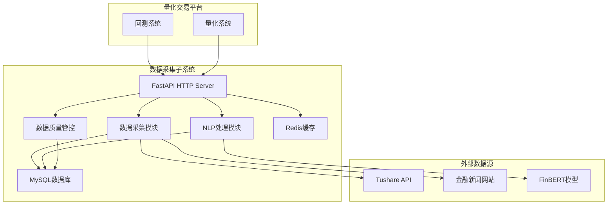

# 数据采集子系统产品需求文档 (PRD)

## 文档信息

| 项目    | 内容          |
| ----- | ----------- |
| 子系统名称 | 量化平台数据采集子系统 |
| 文档版本  | v4.0        |
| 创建日期  | 2024-01-15  |
| 最后更新  | 2024-12-19  |
| 产品经理  | [产品经理姓名]   |
| 开发团队  | [开发团队]     |
| 文档状态  | 待评审         |
| 所属平台  | 量化交易平台      |

## 1. 产品概述

### 1.1 产品背景

数据采集子系统是量化交易平台的核心基础设施，为回测系统和量化系统提供统一的数据服务。本系统专注于构建MVP（最小可行产品），解决以下核心问题：

1. **多维度数据采集**：从Tushare采集技术面、基本面、市场面数据，从金融网站采集消息面数据
2. **智能数据处理**：通过FinBERT金融NLP模型将新闻数据转化为结构化的情感指标
3. **标准化API服务**：为量化系统和回测系统提供统一的RESTful API接口
4. **增量数据更新**：支持全量初始化和日度增量更新机制

### 1.2 产品定位

**服务对象**
- **回测系统**：提供历史全量数据支持策略回测验证
- **量化系统**：提供日度更新数据支持策略分析和决策

**核心价值**
- **多维度数据支撑**：为量化策略提供技术面、基本面、市场面、消息面四维数据
- **智能消息分析**：将非结构化新闻转化为可量化的情感指标
- **统一数据接口**：为上层系统提供标准化数据服务

### 1.3 产品目标

**MVP核心目标**
1. **数据采集完整性**：成功采集全A股历史数据和日度增量数据
2. **NLP处理能力**：基于FinBERT模型实现新闻情感分析和实体识别
3. **API服务可用**：提供稳定的RESTful API接口供其他系统调用
4. **数据质量保障**：建立基础的数据验证和清洗机制

## 2. 需求分析

### 2.1 功能需求

#### 2.1.1 核心功能列表

| 功能模块    | 功能描述          | 优先级 | 复杂度 | 预估工期 |
| ------- | ------------- | --- | --- | ---- |
| Tushare数据采集 | 股票基础信息、行情、财务数据采集 | P0  | 中   | 3周   |
| 新闻数据采集  | 金融新闻爬取和预处理   | P0  | 中   | 2周   |
| NLP智能处理 | 基于FinBERT的情感分析和实体识别 | P0  | 高   | 3周   |
| 数据质量管控  | 数据验证、清洗、异常处理 | P0  | 中   | 2周   |
| HTTP API服务 | RESTful API接口 | P0  | 低   | 1周   |

#### 2.1.2 详细功能说明

**Tushare数据采集模块**
- 股票基础信息：股票代码、名称、上市日期、行业分类等
- 行情数据：日K线、周K线、月K线数据
- 财务数据：利润表、资产负债表、现金流量表
- 技术指标：MA、MACD、RSI、BOLL等常用技术指标

**新闻数据采集模块**
- 新闻爬取：从权威金融网站爬取相关新闻
- 数据预处理：文本清洗、去重、格式标准化
- 实体关联：将新闻与相关股票代码进行关联

**NLP智能处理模块**
- 情感分析：基于FinBERT模型分析新闻情感倾向
- 实体识别：识别新闻中的公司、人物、事件等实体
- 关键词提取：提取新闻的核心关键词
- 情感强度：量化情感的强度级别

**数据质量管控模块**
- 数据验证：检查数据完整性和格式正确性
- 数据清洗：处理异常值、缺失值
- 异常监控：监控数据采集异常和质量问题

**HTTP API服务模块**
- 股票数据查询：提供股票基础信息和行情数据查询
- 财务数据查询：提供财务报表和指标查询
- 新闻数据查询：提供新闻和情感分析结果查询

### 2.2 约束条件

#### 2.2.1 技术约束
1. **开发语言**：后端使用Python，统一技术栈，简化架构设计
2. **数据库**：MySQL 8.0+，支持JSON字段类型
3. **缓存**：Redis用于数据缓存和会话管理
4. **外部依赖**：
   - Tushare Pro API（需要购买积分）
   - FinBERT模型服务（本地部署）
   - 金融网站爬虫（需遵守robots.txt）
5. **系统架构**：Python单体应用架构

#### 2.2.2 资源约束
1. **开发团队**：1名全栈开发工程师（AI辅助开发）
2. **开发周期**：MVP版本开发周期6-8周
3. **硬件资源**：
   - 开发环境：本地MacOS开发机
   - 部署环境：单机4核8G内存，1TB存储空间
   - 数据库：MySQL 8.0+，支持JSON字段类型
4. **预算约束**：
   - Tushare Pro积分：约500元/月
   - FinBERT模型部署：一次性成本（开源免费）
   - 服务器成本：约300元/月

#### 2.2.3 时间约束
1. **MVP版本交付**：核心功能在6周内完成
   - 第1-2周：Tushare数据采集模块
   - 第3-4周：新闻采集和NLP处理模块
   - 第5周：HTTP API服务
   - 第6周：测试、优化和部署
2. **数据初始化**：全A股历史数据采集在1周内完成
3. **验证周期**：系统验证和调优2周

## 3. 技术架构设计

### 3.1 技术选型

| 技术类别   | 选择方案        | 版本要求      | 说明           |
| ------ | ----------- | --------- | ------------ |
| 开发语言   | Python      | 3.9+      | 统一技术栈，AI生态丰富 |
| Web框架  | FastAPI     | 0.104+    | 高性能，自动文档生成   |
| 数据库    | MySQL       | 8.0+      | 关系型数据库，JSON支持 |
| 缓存     | Redis       | 7.0+      | 内存缓存，会话管理    |
| ORM    | SQLAlchemy  | 2.0+      | Python主流ORM  |
| 任务调度   | APScheduler | 3.10+     | Python定时任务   |
| 日志     | Loguru      | 0.7+      | 结构化日志        |
| 配置管理   | Pydantic Settings | 2.0+ | 类型安全的配置管理    |
| NLP模型  | FinBERT     | -         | 金融领域专业NLP模型 |

### 3.2 系统架构图



### 3.3 数据流设计

**数据采集流程**
1. 定时任务触发数据采集
2. 从Tushare API获取股票数据
3. 从金融网站爬取新闻数据
4. 数据预处理和清洗
5. 存储到MySQL数据库
6. 更新Redis缓存

**NLP处理流程**
1. 获取新采集的新闻数据
2. 调用FinBERT模型进行情感分析
3. 提取实体和关键词
4. 计算情感强度
5. 存储处理结果到数据库

**API查询流程**
1. 接收API查询请求
2. 参数验证和处理
3. 查询Redis缓存
4. 缓存未命中时查询MySQL
5. 返回JSON格式数据

## 4. API接口设计

### 4.1 接口规范

- **协议**：HTTP/HTTPS
- **数据格式**：JSON
- **认证方式**：无需认证（MVP版本）
- **基础URL**：`http://localhost:8000/api/v1`

### 4.2 核心接口列表

#### 4.2.1 股票数据接口

**获取股票基础信息**
```http
GET /api/v1/stocks/basic?symbol={symbol}
```

**获取股票行情数据**
```http
GET /api/v1/stocks/daily?symbol={symbol}&start_date={date}&end_date={date}
```

**获取财务数据**
```http
GET /api/v1/stocks/financial?symbol={symbol}&period={period}
```

#### 4.2.2 新闻数据接口

**获取股票相关新闻**
```http
GET /api/v1/news?symbol={symbol}&start_date={date}&end_date={date}
```

**获取新闻情感分析**
```http
GET /api/v1/news/sentiment?symbol={symbol}&start_date={date}&end_date={date}
```

#### 4.2.3 系统状态接口

**获取数据同步状态**
```http
GET /api/v1/system/status
```

## 5. 数据库设计

### 5.1 核心数据表

**股票基础信息表 (stocks)**
- symbol: 股票代码
- name: 股票名称
- industry: 行业分类
- list_date: 上市日期
- market: 市场类型

**股票行情表 (stock_daily)**
- symbol: 股票代码
- trade_date: 交易日期
- open/high/low/close: 开高低收价格
- volume: 成交量
- amount: 成交额

**财务数据表 (financial_data)**
- symbol: 股票代码
- period: 报告期
- report_type: 报表类型
- data: JSON格式财务数据

**新闻数据表 (news)**
- id: 新闻ID
- title: 新闻标题
- content: 新闻内容
- source: 新闻来源
- publish_time: 发布时间
- related_stocks: 关联股票代码

**情感分析表 (sentiment_analysis)**
- news_id: 新闻ID
- symbol: 股票代码
- sentiment: 情感倾向
- confidence: 置信度
- entities: 实体识别结果
- keywords: 关键词

## 6. 部署架构

### 6.1 部署环境

**开发环境**
- 本地MacOS开发机
- Python 3.9+ 虚拟环境
- MySQL 8.0 本地实例
- Redis 7.0 本地实例

**生产环境**
- 单机部署（4核8G内存）
- Docker容器化部署
- MySQL 8.0 独立实例
- Redis 7.0 独立实例
- FinBERT模型本地部署

### 6.2 部署流程

1. **环境准备**：安装Python、MySQL、Redis
2. **代码部署**：克隆代码仓库，安装依赖
3. **数据库初始化**：创建数据库和表结构
4. **配置文件**：设置数据库连接、API密钥等
5. **服务启动**：启动FastAPI服务
6. **数据初始化**：执行历史数据采集
7. **定时任务**：配置日度数据更新任务

## 修改记录

### [2024-12-19] v4.0 文档重构和技术选型统一

**核心变更**：
1. **文档结构重构**：删除冗余内容，简化文档结构，提高可读性
2. **技术选型统一**：统一使用Python技术栈，采用单体架构
3. **NLP技术确定**：选择FinBERT开源模型，替代云服务方案
4. **功能范围明确**：聚焦MVP核心功能，删除非必要特性

**具体修改内容**：
- 删除重复的产品定位和子系统边界描述
- 移除非功能需求章节，专注功能实现
- 简化技术架构设计，统一为Python单体应用
- 删除界面原型设计，MVP无需前端界面
- 精简API接口设计，保留核心查询功能
- 优化数据库设计，突出核心数据表
- 简化部署架构，适合快速验证

**技术优势**：
- 技术栈统一，降低开发和维护复杂度
- FinBERT模型专业性强，金融NLP效果更好
- 单体架构简化部署，适合MVP快速验证
- 开源方案降低长期运营成本

**影响评估**：
- 开发复杂度显著降低
- 文档可读性大幅提升
- 技术选型更加明确和统一
- 为后续开发提供清晰指导