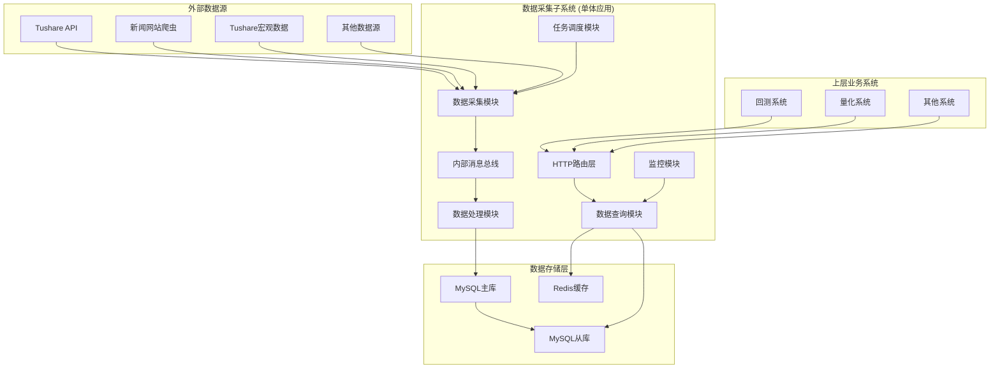
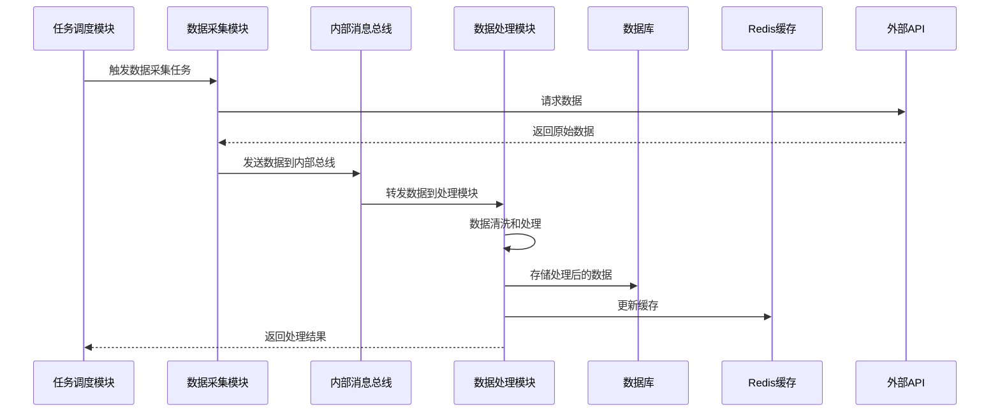
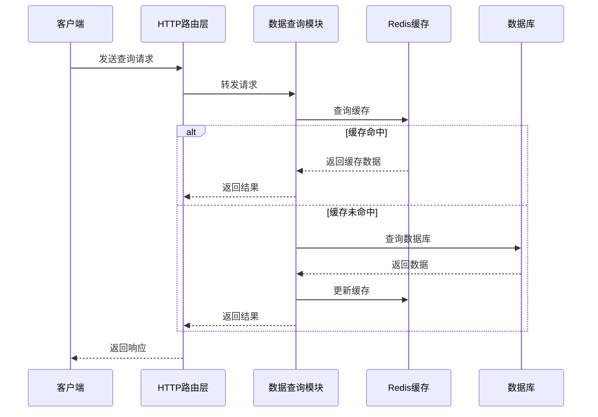
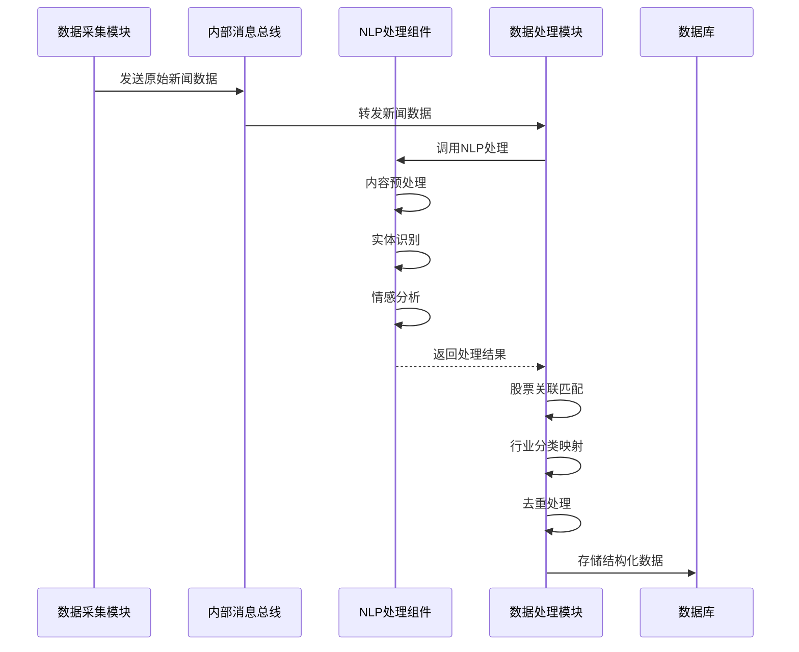

# 数据采集子系统后端技术设计文档

## 1. 文档信息

| 项目   | 内容            |
| ---- | ------------- |
| 文档名称 | 数据采集子系统后端技术设计 |
| 版本   | v1.0          |
| 创建日期 | 2024-12-19    |
| 作者   | 研发团队          |
| 审核人  | 技术负责人         |

## 2. 系统概述

数据采集子系统是量化交易平台的核心基础设施，采用Golang巨石架构，基于Gin框架构建高性能RESTful API服务。系统采用模块化设计，所有功能模块运行在同一个进程中，通过内部消息总线进行通信。系统负责从外部数据源采集金融市场数据，进行数据处理和质量管控，并为上层业务系统提供统一的数据服务。

### 2.1 技术栈选型

* **编程语言**: Go 1.21+

* **Web框架**: Gin v1.9+

* **数据库**: MySQL 8.0+ (主数据库)

* **缓存**: Redis 7.0+ (缓存层)

* **内部通信**: 基于Channel的消息总线 (模块间通信)

* **爬虫框架**: Colly v2.1+ (网页爬虫)

* **HTML解析**: goquery (DOM解析)

* **HTTP客户端**: resty v2.7+ (HTTP请求)

* **NLP处理**: 百度AI、腾讯云NLP API

* **配置管理**: Viper (配置文件管理)

* **日志**: Logrus (结构化日志)

* **监控**: Prometheus + Grafana

* **容器化**: Docker + Docker Compose

## 3. 系统架构设计

### 3.1 整体架构



### 3.2 巨石架构设计

#### 3.2.1 模块划分

采用单体应用架构，内部按功能模块进行划分，所有模块运行在同一个进程中，通过内部接口进行通信。

1. **数据采集模块 (collector)**

   * 负责从外部数据源采集数据

   * 实现数据源适配器模式（Tushare API、网页爬虫等）

   * 支持多种数据源的并发采集

   * 新闻数据通过爬虫从金融平台、政府官网获取

   * 宏观经济数据通过Tushare Pro API获取

2. **数据处理模块 (processor)**

   * 负责数据清洗、转换和质量检查

   * 实现新闻数据的NLP处理

   * 数据去重和关联处理

3. **数据查询模块 (query)**

   * 提供RESTful API接口

   * 实现数据查询和聚合

   * 缓存热点数据

4. **任务调度模块 (scheduler)**

   * 管理数据采集任务

   * 实现定时调度和手动触发

   * 任务状态监控和重试机制

5. **监控模块 (monitor)**

   * 系统健康检查

   * 性能指标收集

   * 告警通知

## 4. 数据库设计

### 4.1 数据库架构

采用MySQL单一主库架构，简化部署和维护复杂度。

### 4.2 核心数据表设计

#### 4.2.1 股票基础数据表 (stocks)

```sql
CREATE TABLE stocks (
    id BIGINT PRIMARY KEY AUTO_INCREMENT,
    symbol VARCHAR(20) NOT NULL COMMENT '股票代码',
    name VARCHAR(100) NOT NULL COMMENT '股票名称',
    exchange VARCHAR(10) NOT NULL COMMENT '交易所',
    industry VARCHAR(50) COMMENT '行业',
    sector VARCHAR(50) COMMENT '板块',
    list_date DATE COMMENT '上市日期',
    status TINYINT DEFAULT 1 COMMENT '状态: 1-正常, 0-停牌',
    created_at TIMESTAMP DEFAULT CURRENT_TIMESTAMP,
    updated_at TIMESTAMP DEFAULT CURRENT_TIMESTAMP ON UPDATE CURRENT_TIMESTAMP,
    UNIQUE KEY uk_symbol (symbol),
    KEY idx_exchange (exchange),
    KEY idx_industry (industry),
    KEY idx_status (status)
) ENGINE=InnoDB DEFAULT CHARSET=utf8mb4 COMMENT='股票基础信息表';
```

#### 4.2.2 行情数据表 (market\_data)

```sql
CREATE TABLE market_data (
    id BIGINT PRIMARY KEY AUTO_INCREMENT,
    symbol VARCHAR(20) NOT NULL COMMENT '股票代码',
    trade_date DATE NOT NULL COMMENT '交易日期',
    period VARCHAR(10) NOT NULL COMMENT '周期: 1m,5m,15m,30m,1h,1d',
    trade_time DATETIME NOT NULL COMMENT '交易时间',
    open_price DECIMAL(10,3) NOT NULL COMMENT '开盘价',
    high_price DECIMAL(10,3) NOT NULL COMMENT '最高价',
    low_price DECIMAL(10,3) NOT NULL COMMENT '最低价',
    close_price DECIMAL(10,3) NOT NULL COMMENT '收盘价',
    volume BIGINT NOT NULL COMMENT '成交量',
    amount DECIMAL(15,2) NOT NULL COMMENT '成交额',
    created_at TIMESTAMP DEFAULT CURRENT_TIMESTAMP,
    UNIQUE KEY uk_symbol_time_period (symbol, trade_time, period),
    KEY idx_symbol_date (symbol, trade_date),
    KEY idx_trade_time (trade_time)
) ENGINE=InnoDB DEFAULT CHARSET=utf8mb4 COMMENT='行情数据表';
```

#### 4.2.3 财务数据表 (financial\_data)

```sql
CREATE TABLE financial_data (
    id BIGINT PRIMARY KEY AUTO_INCREMENT,
    symbol VARCHAR(20) NOT NULL COMMENT '股票代码',
    report_date DATE NOT NULL COMMENT '报告期',
    report_type VARCHAR(5) NOT NULL COMMENT '报告类型: Q1,Q2,Q3,A',
    revenue DECIMAL(15,2) COMMENT '营业收入',
    net_profit DECIMAL(15,2) COMMENT '净利润',
    total_assets DECIMAL(15,2) COMMENT '总资产',
    total_equity DECIMAL(15,2) COMMENT '股东权益',
    roe DECIMAL(8,4) COMMENT 'ROE',
    roa DECIMAL(8,4) COMMENT 'ROA',
    gross_margin DECIMAL(8,4) COMMENT '毛利率',
    net_margin DECIMAL(8,4) COMMENT '净利率',
    current_ratio DECIMAL(8,4) COMMENT '流动比率',
    created_at TIMESTAMP DEFAULT CURRENT_TIMESTAMP,
    updated_at TIMESTAMP DEFAULT CURRENT_TIMESTAMP ON UPDATE CURRENT_TIMESTAMP,
    UNIQUE KEY uk_symbol_report (symbol, report_date, report_type),
    KEY idx_report_date (report_date)
) ENGINE=InnoDB DEFAULT CHARSET=utf8mb4 COMMENT='财务数据表';
```

#### 4.2.4 新闻数据表 (news\_data)

```sql
CREATE TABLE news_data (
    id BIGINT PRIMARY KEY AUTO_INCREMENT,
    title VARCHAR(500) NOT NULL COMMENT '新闻标题',
    content TEXT COMMENT '新闻内容',
    source VARCHAR(100) COMMENT '新闻来源',
    publish_time DATETIME NOT NULL COMMENT '发布时间',
    category VARCHAR(50) COMMENT '新闻分类',
    sentiment TINYINT COMMENT '情感倾向: 1-正面, 0-中性, -1-负面',
    sentiment_score DECIMAL(5,4) COMMENT '情感得分',
    importance_level TINYINT DEFAULT 3 COMMENT '重要程度: 1-5级',
    related_stocks JSON COMMENT '相关股票列表',
    related_industries JSON COMMENT '相关行业列表',
    processed_at TIMESTAMP NULL COMMENT '处理时间',
    created_at TIMESTAMP DEFAULT CURRENT_TIMESTAMP,
    KEY idx_publish_time (publish_time),
    KEY idx_sentiment (sentiment),
    KEY idx_importance (importance_level),
    KEY idx_category (category)
) ENGINE=InnoDB DEFAULT CHARSET=utf8mb4 COMMENT='新闻数据表';
```

#### 4.2.5 宏观经济数据表 (macro\_data)

```sql
CREATE TABLE macro_data (
    id BIGINT PRIMARY KEY AUTO_INCREMENT,
    indicator_code VARCHAR(50) NOT NULL COMMENT '指标代码',
    indicator_name VARCHAR(200) NOT NULL COMMENT '指标名称',
    period_type VARCHAR(10) NOT NULL COMMENT '周期类型: daily,weekly,monthly,quarterly,yearly',
    data_date DATE NOT NULL COMMENT '数据日期',
    value DECIMAL(20,6) NOT NULL COMMENT '指标值',
    unit VARCHAR(20) COMMENT '单位',
    created_at TIMESTAMP DEFAULT CURRENT_TIMESTAMP,
    UNIQUE KEY uk_indicator_date (indicator_code, data_date),
    KEY idx_data_date (data_date),
    KEY idx_period_type (period_type)
) ENGINE=InnoDB DEFAULT CHARSET=utf8mb4 COMMENT='宏观经济数据表';
```

#### 4.2.6 任务管理表 (data\_tasks)

```sql
CREATE TABLE data_tasks (
    id BIGINT PRIMARY KEY AUTO_INCREMENT,
    task_name VARCHAR(100) NOT NULL COMMENT '任务名称',
    task_type VARCHAR(50) NOT NULL COMMENT '任务类型',
    cron_expression VARCHAR(100) COMMENT 'Cron表达式',
    target_symbols TEXT COMMENT '目标股票代码',
    config JSON COMMENT '任务配置',
    status TINYINT DEFAULT 1 COMMENT '状态: 1-启用, 0-禁用',
    last_run_time TIMESTAMP NULL COMMENT '最后执行时间',
    next_run_time TIMESTAMP NULL COMMENT '下次执行时间',
    created_at TIMESTAMP DEFAULT CURRENT_TIMESTAMP,
    updated_at TIMESTAMP DEFAULT CURRENT_TIMESTAMP ON UPDATE CURRENT_TIMESTAMP,
    KEY idx_task_type (task_type),
    KEY idx_status (status),
    KEY idx_next_run_time (next_run_time)
) ENGINE=InnoDB DEFAULT CHARSET=utf8mb4 COMMENT='数据采集任务表';
```

### 4.3 索引优化策略

1. **复合索引设计**

   * 行情数据: (symbol, trade\_date, period)

   * 财务数据: (symbol, report\_date, report\_type)

   * 新闻数据: (publish\_time, sentiment, importance\_level)

2. **分区策略**

   * 行情数据按月分区

   * 新闻数据按季度分区

   * 宏观数据按年分区

## 5. API接口设计

### 5.1 接口规范

#### 5.1.1 统一响应格式

```go
type APIResponse struct {
    Code    int         `json:"code"`
    Message string      `json:"message"`
    Data    interface{} `json:"data"`
    Total   int64       `json:"total,omitempty"`
}
```

#### 5.1.2 分页参数

```go
type PaginationParams struct {
    Page     int `form:"page" binding:"min=1"`
    PageSize int `form:"page_size" binding:"min=1,max=1000"`
}
```

### 5.2 核心API接口

#### 5.2.1 股票基础数据接口

```go
// 获取股票列表
GET /api/v1/stocks
// 查询参数:
// - exchange: 交易所
// - industry: 行业
// - sector: 板块
// - status: 状态
// - page: 页码
// - page_size: 每页数量

// 获取股票详情
GET /api/v1/stocks/detail
// 查询参数:
// - symbol: 股票代码
```

#### 5.2.2 行情数据接口

```go
// 获取行情数据
GET /api/v1/market/data
// 查询参数:
// - symbols: 股票代码列表(逗号分隔)
// - period: 周期
// - start_date: 开始日期
// - end_date: 结束日期
// - page: 页码
// - page_size: 每页数量
```

#### 5.2.3 财务数据接口

```go
// 获取财务数据
GET /api/v1/financial/data
// 查询参数:
// - symbol: 股票代码
// - report_type: 报告类型
// - start_date: 开始日期
// - end_date: 结束日期
// - fields: 返回字段

// 获取财务比率
GET /api/v1/financial/ratios
// 查询参数:
// - symbol: 股票代码
// - report_type: 报告类型
// - start_date: 开始日期
// - end_date: 结束日期
```

#### 5.2.4 新闻数据接口

```go
// 获取新闻列表
GET /api/v1/news/list
// 查询参数:
// - symbols: 相关股票代码
// - industries: 相关行业
// - category: 新闻分类
// - sentiment: 情感倾向
// - importance: 重要程度
// - start_time: 开始时间
// - end_time: 结束时间
// - page: 页码
// - page_size: 每页数量

// 获取新闻详情
GET /api/v1/news/detail
// 查询参数:
// - news_id: 新闻ID
```

## 6. 系统时序图

### 6.1 数据采集流程



### 6.2 数据查询流程



### 6.3 新闻数据处理流程



## 7. 技术实现方案

### 7.1 项目结构

```
data-collection-system/
├── cmd/
│   └── server/            # 主应用入口
│       └── main.go
├── internal/
│   ├── config/            # 配置管理
│   ├── database/          # 数据库连接
│   ├── cache/             # 缓存管理
│   ├── models/            # 数据模型
│   ├── modules/           # 功能模块
│   │   ├── collector/     # 数据采集模块
│   │   ├── processor/     # 数据处理模块
│   │   ├── query/         # 数据查询模块
│   │   ├── scheduler/     # 任务调度模块
│   │   └── monitor/       # 监控模块
│   ├── handlers/          # HTTP处理器
│   ├── middleware/        # 中间件
│   ├── router/            # 路由配置
│   ├── bus/               # 内部消息总线
│   └── utils/             # 工具函数
├── pkg/
│   ├── logger/            # 日志组件
│   ├── validator/         # 参数验证
│   ├── errors/            # 错误处理
│   └── response/          # 响应封装
├── scripts/
│   ├── migration/         # 数据库迁移
│   └── deploy/            # 部署脚本
├── configs/
│   ├── config.yaml        # 配置文件
│   └── docker-compose.yml # Docker配置
└── docs/                  # 文档
```

### 7.2 核心组件实现

#### 7.2.1 数据采集器接口

```go
type DataCollector interface {
    Collect(ctx context.Context, params CollectParams) (*CollectResult, error)
    GetDataType() DataType
    GetSource() string
}

// Tushare数据采集器
type TushareCollector struct {
    client *http.Client
    token  string
    config *CollectorConfig
}

func (t *TushareCollector) Collect(ctx context.Context, params CollectParams) (*CollectResult, error) {
    // 实现Tushare数据采集逻辑
    // 支持股票数据、财务数据、宏观经济数据采集
}

// 新闻爬虫采集器
type NewsCrawler struct {
    collector *colly.Collector
    config    *CrawlerConfig
    nlpClient *NLPClient
}

func (n *NewsCrawler) Collect(ctx context.Context, params CollectParams) (*CollectResult, error) {
    var newsItems []*NewsItem
    
    // 配置爬虫
    c := colly.NewCollector(
        colly.UserAgent("Mozilla/5.0 (compatible; DataCollector/1.0)"),
    )
    
    // 设置请求限制
    c.Limit(&colly.LimitRule{
        DomainGlob:  "*",
        Parallelism: 2,
        Delay:       1 * time.Second,
    })
    
    // 解析新闻列表页
    c.OnHTML(".news-item", func(e *colly.HTMLElement) {
        newsItem := &NewsItem{
            Title:       e.ChildText(".title"),
            URL:         e.ChildAttr("a", "href"),
            PublishTime: parseTime(e.ChildText(".time")),
            Source:      e.ChildText(".source"),
        }
        newsItems = append(newsItems, newsItem)
    })
    
    // 解析新闻详情页
    c.OnHTML(".article-content", func(e *colly.HTMLElement) {
        content := e.Text
        // 存储新闻内容
    })
    
    // 访问目标网站
    for _, url := range n.config.TargetURLs {
        c.Visit(url)
    }
    
    return &CollectResult{
        Data:      newsItems,
        Count:     len(newsItems),
        Timestamp: time.Now(),
    }, nil
}
```

#### 7.2.2 数据处理器

```go
type DataProcessor interface {
    Process(ctx context.Context, data *RawData) (*ProcessedData, error)
    Validate(data *RawData) error
}

type NewsProcessor struct {
    nlpService *NLPService
    stockRepo  *StockRepository
    bus        *MessageBus
}

func (n *NewsProcessor) Process(ctx context.Context, data *RawData) (*ProcessedData, error) {
    // 实现新闻数据处理逻辑
    // 1. 内容预处理
    cleaned := n.preprocess(data.Content)
    
    // 2. 实体识别和情感分析
    nlpResult := n.nlpService.Analyze(cleaned)
    
    // 3. 股票关联
    relatedStocks := n.matchStocks(nlpResult.Entities)
    
    // 4. 行业映射
    industries := n.mapIndustries(relatedStocks)
    
    // 5. 构建处理结果
    processed := &ProcessedData{
        Title:           data.Title,
        Content:         cleaned,
        Sentiment:       nlpResult.Sentiment,
        SentimentScore:  nlpResult.Score,
        RelatedStocks:   relatedStocks,
        RelatedIndustries: industries,
    }
    
    return processed, nil
}
```

#### 7.2.3 内部消息总线

```go
type MessageBus struct {
    channels map[string]chan interface{}
    mutex    sync.RWMutex
}

func (m *MessageBus) Publish(topic string, data interface{}) error {
    m.mutex.RLock()
    defer m.mutex.RUnlock()
    
    if ch, exists := m.channels[topic]; exists {
        select {
        case ch <- data:
            return nil
        default:
            return errors.New("channel buffer full")
        }
    }
    return errors.New("topic not found")
}

func (m *MessageBus) Subscribe(topic string, handler func(interface{})) {
    m.mutex.Lock()
    defer m.mutex.Unlock()
    
    if _, exists := m.channels[topic]; !exists {
        m.channels[topic] = make(chan interface{}, 1000)
    }
    
    go func() {
        for data := range m.channels[topic] {
            handler(data)
        }
    }()
}
```

#### 7.2.4 缓存策略

```go
type CacheManager struct {
    redis *redis.Client
}

func (c *CacheManager) GetMarketData(symbol, period string, date time.Time) (*MarketData, error) {
    key := fmt.Sprintf("market:%s:%s:%s", symbol, period, date.Format("2006-01-02"))
    // 缓存逻辑实现
}

func (c *CacheManager) SetMarketData(data *MarketData, ttl time.Duration) error {
    // 设置缓存逻辑
}
```

### 7.3 性能优化策略

#### 7.3.1 数据库优化

1. **连接池配置**

```go
db.SetMaxOpenConns(100)    // 最大连接数
db.SetMaxIdleConns(10)     // 最大空闲连接数
db.SetConnMaxLifetime(time.Hour) // 连接最大生命周期
```

1. **查询优化**

* 使用预编译语句

* 批量插入操作

* 分页查询优化

#### 7.3.2 缓存策略

1. **两级缓存**

* L1: Redis缓存 (1小时)

* L2: 数据库

1. **缓存更新策略**

* 热点数据预加载

* 异步更新缓存

* 缓存穿透保护

#### 7.3.3 并发控制

```go
// 限流器
type RateLimiter struct {
    limiter *rate.Limiter
}

// 并发控制
type ConcurrencyController struct {
    semaphore chan struct{}
}

func (c *ConcurrencyController) Acquire() {
    c.semaphore <- struct{}{}
}

func (c *ConcurrencyController) Release() {
    <-c.semaphore
}
```

## 8. 监控和告警

### 8.1 监控指标

**数据质量指标**

* 数据完整性

* 数据及时性

* 数据准确性

### 8.2 告警规则

```yaml
alerts:
  - name: high_response_time
    condition: avg_response_time > 1000ms
    duration: 5m
    action: send_notification
    
  - name: data_delay
    condition: data_update_delay > 30m
    duration: 1m
    action: send_alert
    
  - name: api_error_rate
    condition: error_rate > 5%
    duration: 3m
    action: send_notification
```

## 9. 部署和运维

### 9.1 Docker化部署

```dockerfile
# Dockerfile
FROM golang:1.21-alpine AS builder
WORKDIR /app
COPY . .
RUN go mod download
RUN go build -o main ./cmd/query

FROM alpine:latest
RUN apk --no-cache add ca-certificates
WORKDIR /root/
COPY --from=builder /app/main .
CMD ["./main"]
```

### 9.2 配置管理

```yaml
# config.yaml
server:
  port: 8080
  mode: release

database:
  host: mysql
  port: 3306
  username: ${DB_USER}
  password: ${DB_PASSWORD}
  database: trading_data
  max_open_conns: 100
  max_idle_conns: 10
  max_lifetime: 3600

redis:
  host: redis
  port: 6379
  password: ${REDIS_PASSWORD}
  db: 0

bus:
  buffer_size: 1000
  worker_count: 10
  timeout: 30s

# Tushare配置
tushare:
  token: ${TUSHARE_TOKEN}
  base_url: "https://api.tushare.pro"
  timeout: 30s
  retry_count: 3
  rate_limit: 200  # 每分钟请求数限制

# 新闻爬虫配置
news_crawler:
  targets:
    - name: "东方财富"
      base_url: "https://finance.eastmoney.com"
      list_selector: ".news-item"
      title_selector: ".title"
      content_selector: ".article-content"
      time_selector: ".time"
    - name: "新浪财经"
      base_url: "https://finance.sina.com.cn"
      list_selector: ".news-list li"
      title_selector: "a"
      content_selector: ".article-content"
      time_selector: ".time"
    - name: "央行官网"
      base_url: "http://www.pbc.gov.cn"
      list_selector: ".news-item"
      title_selector: ".title"
      content_selector: ".content"
      time_selector: ".date"
  settings:
    user_agent: "Mozilla/5.0 (compatible; DataCollector/1.0)"
    delay: 1s
    parallelism: 2
    timeout: 30s
    retry_count: 3

# NLP服务配置
nlp:
  provider: "baidu"  # baidu, tencent
  api_key: ${NLP_API_KEY}
  secret_key: ${NLP_SECRET_KEY}
  timeout: 10s
```

