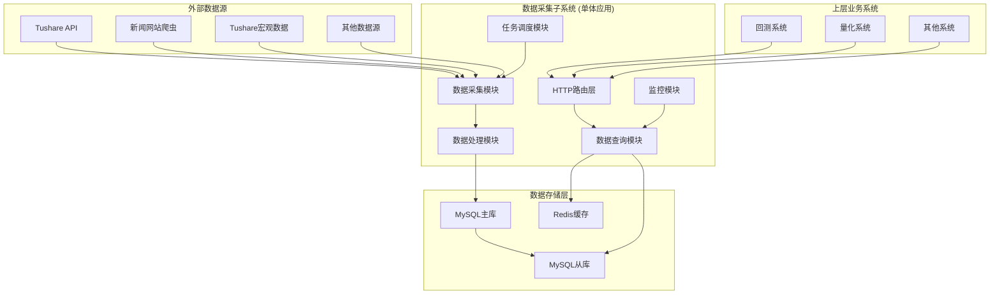
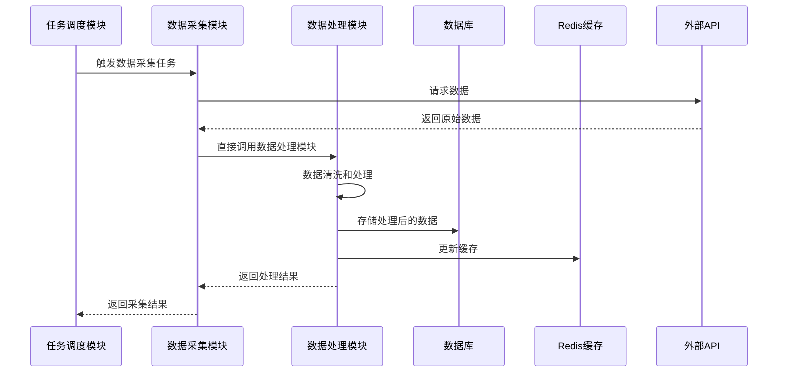
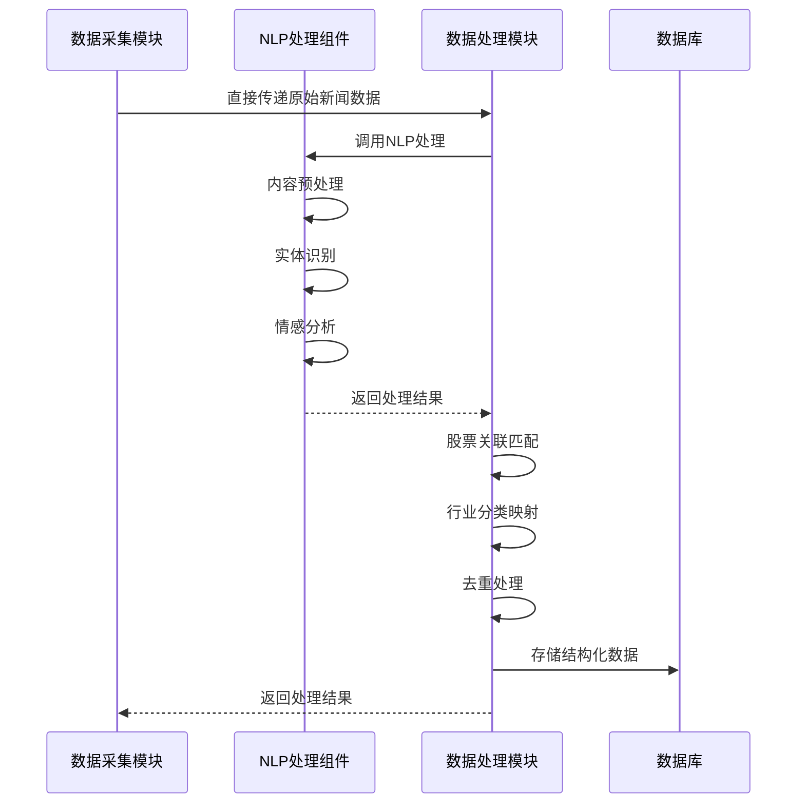

# 数据采集子系统后端技术设计文档

## 1. 文档信息

| 项目   | 内容            |
| ---- | ------------- |
| 文档名称 | 数据采集子系统后端技术设计 |
| 版本   | v1.0          |
| 创建日期 | 2024-12-19    |
| 作者   | 研发团队          |
| 审核人  | 技术负责人         |

## 2. 系统概述

数据采集子系统是量化交易平台的核心基础设施，采用Golang单体架构，基于Gin框架构建高性能RESTful API服务。系统采用模块化设计，所有功能模块运行在同一个进程中，通过直接函数调用进行通信。系统负责从外部数据源采集金融市场数据，进行数据处理和质量管控，并为上层业务系统提供统一的数据服务。

### 2.1 技术栈选型

* **编程语言**: Go 1.21+

* **Web框架**: Gin v1.9+

* **数据库**: MySQL 8.0+ (主数据库)

* **缓存**: Redis 7.0+ (缓存层)

* **内部通信**: 直接函数调用 (模块间通信)

* **爬虫框架**: Colly v2.1+ (网页爬虫)

* **HTML解析**: goquery (DOM解析)

* **HTTP客户端**: resty v2.7+ (HTTP请求)

* **NLP处理**: 百度AI、腾讯云NLP API

* **配置管理**: Viper (配置文件管理)

* **日志**: Logrus (结构化日志)

* **监控**: Prometheus + Grafana

* **容器化**: Docker + Docker Compose

## 3. 系统架构设计

### 3.1 整体架构



### 3.2 巨石架构设计

#### 3.2.1 模块划分

采用单体应用架构，内部按功能模块进行划分，所有模块运行在同一个进程中，通过内部接口进行通信。

1. **数据采集模块 (collector)**

   * 负责从外部数据源采集数据

   * 实现数据源适配器模式（Tushare API、网页爬虫等）

   * 支持多种数据源的并发采集

   * 新闻数据通过爬虫从金融平台、政府官网获取

   * 宏观经济数据通过Tushare Pro API获取

2. **数据处理模块 (processor)**

   * 负责数据清洗、转换和质量检查

   * 实现新闻数据的NLP处理

   * 数据去重和关联处理

3. **数据查询模块 (query)**

   * 提供RESTful API接口

   * 实现数据查询和聚合

   * 缓存热点数据

4. **任务调度模块 (scheduler)**

   * 管理数据采集任务

   * 实现定时调度和手动触发

   * 任务状态监控和重试机制

5. **监控模块 (monitor)**

   * 系统健康检查

   * 性能指标收集

   * 告警通知

## 4. 数据库设计

### 4.1 数据库架构

采用MySQL单一主库架构，简化部署和维护复杂度。

### 4.2 核心数据表设计

#### 4.2.1 股票基础数据表 (stocks)

```sql
CREATE TABLE stocks (
    id BIGINT PRIMARY KEY AUTO_INCREMENT,
    symbol VARCHAR(20) NOT NULL COMMENT '股票代码',
    name VARCHAR(100) NOT NULL COMMENT '股票名称',
    exchange VARCHAR(10) NOT NULL COMMENT '交易所',
    industry VARCHAR(50) COMMENT '行业',
    sector VARCHAR(50) COMMENT '板块',
    list_date DATE COMMENT '上市日期',
    status TINYINT DEFAULT 1 COMMENT '状态: 1-正常, 0-停牌',
    created_at TIMESTAMP DEFAULT CURRENT_TIMESTAMP,
    updated_at TIMESTAMP DEFAULT CURRENT_TIMESTAMP ON UPDATE CURRENT_TIMESTAMP,
    UNIQUE KEY uk_symbol (symbol),
    KEY idx_exchange (exchange),
    KEY idx_industry (industry),
    KEY idx_status (status)
) ENGINE=InnoDB DEFAULT CHARSET=utf8mb4 COMMENT='股票基础信息表';
```

#### 4.2.2 行情数据表 (market\_data)

```sql
CREATE TABLE market_data (
    id BIGINT PRIMARY KEY AUTO_INCREMENT,
    symbol VARCHAR(20) NOT NULL COMMENT '股票代码',
    trade_date DATE NOT NULL COMMENT '交易日期',
    period VARCHAR(10) NOT NULL COMMENT '周期: 1m,5m,15m,30m,1h,1d',
    trade_time DATETIME NOT NULL COMMENT '交易时间',
    open_price DECIMAL(10,3) NOT NULL COMMENT '开盘价',
    high_price DECIMAL(10,3) NOT NULL COMMENT '最高价',
    low_price DECIMAL(10,3) NOT NULL COMMENT '最低价',
    close_price DECIMAL(10,3) NOT NULL COMMENT '收盘价',
    volume BIGINT NOT NULL COMMENT '成交量',
    amount DECIMAL(15,2) NOT NULL COMMENT '成交额',
    created_at TIMESTAMP DEFAULT CURRENT_TIMESTAMP,
    UNIQUE KEY uk_symbol_time_period (symbol, trade_time, period),
    KEY idx_symbol_date (symbol, trade_date),
    KEY idx_trade_time (trade_time)
) ENGINE=InnoDB DEFAULT CHARSET=utf8mb4 COMMENT='行情数据表';
```

#### 4.2.3 财务数据表 (financial\_data)

```sql
CREATE TABLE financial_data (
    id BIGINT PRIMARY KEY AUTO_INCREMENT,
    symbol VARCHAR(20) NOT NULL COMMENT '股票代码',
    report_date DATE NOT NULL COMMENT '报告期',
    report_type VARCHAR(5) NOT NULL COMMENT '报告类型: Q1,Q2,Q3,A',
    revenue DECIMAL(15,2) COMMENT '营业收入',
    net_profit DECIMAL(15,2) COMMENT '净利润',
    total_assets DECIMAL(15,2) COMMENT '总资产',
    total_equity DECIMAL(15,2) COMMENT '股东权益',
    roe DECIMAL(8,4) COMMENT 'ROE',
    roa DECIMAL(8,4) COMMENT 'ROA',
    gross_margin DECIMAL(8,4) COMMENT '毛利率',
    net_margin DECIMAL(8,4) COMMENT '净利率',
    current_ratio DECIMAL(8,4) COMMENT '流动比率',
    created_at TIMESTAMP DEFAULT CURRENT_TIMESTAMP,
    updated_at TIMESTAMP DEFAULT CURRENT_TIMESTAMP ON UPDATE CURRENT_TIMESTAMP,
    UNIQUE KEY uk_symbol_report (symbol, report_date, report_type),
    KEY idx_report_date (report_date)
) ENGINE=InnoDB DEFAULT CHARSET=utf8mb4 COMMENT='财务数据表';
```

#### 4.2.4 新闻数据表 (news\_data)

```sql
CREATE TABLE news_data (
    id BIGINT PRIMARY KEY AUTO_INCREMENT,
    title VARCHAR(500) NOT NULL COMMENT '新闻标题',
    content TEXT COMMENT '新闻内容',
    source VARCHAR(100) COMMENT '新闻来源',
    publish_time DATETIME NOT NULL COMMENT '发布时间',
    category VARCHAR(50) COMMENT '新闻分类',
    sentiment TINYINT COMMENT '情感倾向: 1-正面, 0-中性, -1-负面',
    sentiment_score DECIMAL(5,4) COMMENT '情感得分',
    importance_level TINYINT DEFAULT 3 COMMENT '重要程度: 1-5级',
    related_stocks JSON COMMENT '相关股票列表',
    related_industries JSON COMMENT '相关行业列表',
    processed_at TIMESTAMP NULL COMMENT '处理时间',
    created_at TIMESTAMP DEFAULT CURRENT_TIMESTAMP,
    KEY idx_publish_time (publish_time),
    KEY idx_sentiment (sentiment),
    KEY idx_importance (importance_level),
    KEY idx_category (category)
) ENGINE=InnoDB DEFAULT CHARSET=utf8mb4 COMMENT='新闻数据表';
```

#### 4.2.5 宏观经济数据表 (macro\_data)

```sql
CREATE TABLE macro_data (
    id BIGINT PRIMARY KEY AUTO_INCREMENT,
    indicator_code VARCHAR(50) NOT NULL COMMENT '指标代码',
    indicator_name VARCHAR(200) NOT NULL COMMENT '指标名称',
    period_type VARCHAR(10) NOT NULL COMMENT '周期类型: daily,weekly,monthly,quarterly,yearly',
    data_date DATE NOT NULL COMMENT '数据日期',
    value DECIMAL(20,6) NOT NULL COMMENT '指标值',
    unit VARCHAR(20) COMMENT '单位',
    created_at TIMESTAMP DEFAULT CURRENT_TIMESTAMP,
    UNIQUE KEY uk_indicator_date (indicator_code, data_date),
    KEY idx_data_date (data_date),
    KEY idx_period_type (period_type)
) ENGINE=InnoDB DEFAULT CHARSET=utf8mb4 COMMENT='宏观经济数据表';
```

#### 4.2.6 任务管理表 (data\_tasks)

```sql
CREATE TABLE data_tasks (
    id BIGINT PRIMARY KEY AUTO_INCREMENT,
    task_name VARCHAR(100) NOT NULL COMMENT '任务名称',
    task_type VARCHAR(50) NOT NULL COMMENT '任务类型',
    cron_expression VARCHAR(100) COMMENT 'Cron表达式',
    target_symbols TEXT COMMENT '目标股票代码',
    config JSON COMMENT '任务配置',
    status TINYINT DEFAULT 1 COMMENT '状态: 1-启用, 0-禁用',
    last_run_time TIMESTAMP NULL COMMENT '最后执行时间',
    next_run_time TIMESTAMP NULL COMMENT '下次执行时间',
    created_at TIMESTAMP DEFAULT CURRENT_TIMESTAMP,
    updated_at TIMESTAMP DEFAULT CURRENT_TIMESTAMP ON UPDATE CURRENT_TIMESTAMP,
    KEY idx_task_type (task_type),
    KEY idx_status (status),
    KEY idx_next_run_time (next_run_time)
) ENGINE=InnoDB DEFAULT CHARSET=utf8mb4 COMMENT='数据采集任务表';
```

### 4.3 索引优化策略

1. **复合索引设计**

   * 行情数据: (symbol, trade\_date, period)

   * 财务数据: (symbol, report\_date, report\_type)

   * 新闻数据: (publish\_time, sentiment, importance\_level)

2. **分区策略**

   * 行情数据按月分区

   * 新闻数据按季度分区

   * 宏观数据按年分区

## 5. API接口设计

### 5.1 接口规范

#### 5.1.1 统一响应格式

```go
type APIResponse struct {
    Code    int         `json:"code"`
    Message string      `json:"message"`
    Data    interface{} `json:"data"`
    Total   int64       `json:"total,omitempty"`
}
```

#### 5.1.2 分页参数

```go
type PaginationParams struct {
    Page     int `form:"page" binding:"min=1"`
    PageSize int `form:"page_size" binding:"min=1,max=1000"`
}
```

### 5.2 核心API接口

#### 5.2.1 股票基础数据接口

```go
// 获取股票列表
GET /api/v1/stocks
// 查询参数:
// - exchange: 交易所
// - industry: 行业
// - sector: 板块
// - status: 状态
// - page: 页码
// - page_size: 每页数量

// 获取股票详情
GET /api/v1/stocks/detail
// 查询参数:
// - symbol: 股票代码
```

#### 5.2.2 行情数据接口

```go
// 获取行情数据
GET /api/v1/market/data
// 查询参数:
// - symbols: 股票代码列表(逗号分隔)
// - period: 周期
// - start_date: 开始日期
// - end_date: 结束日期
// - page: 页码
// - page_size: 每页数量
```

#### 5.2.3 财务数据接口

```go
// 获取财务数据
GET /api/v1/financial/data
// 查询参数:
// - symbol: 股票代码
// - report_type: 报告类型
// - start_date: 开始日期
// - end_date: 结束日期
// - fields: 返回字段

// 获取财务比率
GET /api/v1/financial/ratios
// 查询参数:
// - symbol: 股票代码
// - report_type: 报告类型
// - start_date: 开始日期
// - end_date: 结束日期
```

#### 5.2.4 新闻数据接口

```go
// 获取新闻列表
GET /api/v1/news/list
// 查询参数:
// - symbols: 相关股票代码
// - industries: 相关行业
// - category: 新闻分类
// - sentiment: 情感倾向
// - importance: 重要程度
// - start_time: 开始时间
// - end_time: 结束时间
// - page: 页码
// - page_size: 每页数量

// 获取新闻详情
GET /api/v1/news/detail
// 查询参数:
// - news_id: 新闻ID
```

## 6. 系统时序图

### 6.1 数据采集流程



### 6.2 数据查询流程


### 6.3 新闻数据处理流程



## 7. 技术实现方案

### 7.1 项目结构

采用简洁清晰的三层架构，遵循Go项目标准布局：

```
data-collection-system/
├── main.go                # 应用入口
├── config.yaml           # 配置文件
├── docker-compose.yml    # Docker配置
├── go.mod                 # Go模块文件
├── go.sum                 # Go依赖锁定
├── README.md              # 项目说明
│
├── api/                   # 接入层 (API Layer)
│   ├── http/              # HTTP接口
│   │   ├── handlers/      # HTTP处理器
│   │   ├── middleware/    # 中间件
│   │   └── routes.go      # 路由配置
│   ├── cron/              # 定时任务
│   │   ├── scheduler.go   # 任务调度器
│   │   ├── jobs/          # 定时任务定义
│   │   └── manager.go     # 任务管理器
│   └── grpc/              # gRPC接口(预留)
│
├── biz/                   # 业务编排层 (Business Layer)
│   └── collection.go      # 数据采集业务
├── service/               # 服务层 (Service Layer)
│   ├── collection/        # 数据采集服务
│   │   ├── service.go     # 采集服务
│   │   ├── tushare.go     # Tushare数据采集
│   │   ├── news.go        # 新闻数据采集
│   │   └── validator.go   # 数据验证器
│   ├── processing/        # 数据处理服务
│   │   ├── service.go     # 加工业务服务
│   │   ├── cleaner.go     # 数据清洗
│   │   ├── nlp.go         # NLP处理
│   │   └── enricher.go    # 数据增强
│   ├── query/             # 数据查询服务
│   │   ├── service.go     # 查询业务服务
│   │   ├── stock.go       # 股票数据查询
│   │   ├── news.go        # 新闻数据查询
│   │   └── aggregator.go  # 数据聚合
│   ├── task/              # 任务管理服务
│       ├── service.go     # 任务业务服务
│       ├── scheduler.go   # 任务调度
│       └── monitor.go     # 任务监控
│
├── repo/                  # 数据仓库层 (Repository Layer)
│   ├── mysql/             # MySQL数据访问
│   │   ├── stock.go       # 股票数据仓库
│   │   ├── news.go        # 新闻数据仓库
│   │   ├── market.go      # 市场数据仓库
│   │   ├── financial.go   # 财务数据仓库
│   │   └── task.go        # 任务数据仓库
│   ├── redis/             # Redis缓存访问
│   │   ├── cache.go       # 缓存操作
│   │   └── session.go     # 会话管理
│   └── external/          # 外部数据源
│       ├── tushare/       # Tushare API客户端
│       ├── crawler/       # 网页爬虫
│       └── nlp/           # NLP服务客户端
│
├── model/                 # 数据模型定义
│   ├── stock.go           # 股票模型
│   ├── news.go            # 新闻模型
│   ├── market.go          # 市场数据模型
│   ├── financial.go       # 财务数据模型
│   └── task.go            # 任务模型
│
├── pkg/                   # 公共包 (Shared Package)
│   ├── config/            # 配置管理
│   ├── logger/            # 日志组件
│   ├── errors/            # 错误定义
│   ├── utils/             # 工具函数
│   ├── types/             # 公共类型
│   └── constants/         # 常量定义
│
└── scripts/               # 脚本文件
    ├── migrate.sql        # 数据库迁移
    └── deploy.sh          # 部署脚本
```

#### 目录说明

**简洁架构分层设计**

* **api/**：接口层，负责外部接口适配，包括HTTP接口和定时任务
* **biz/**：业务逻辑层，负责业务流程编排和跨领域协调
* **module/**：模块层，按业务领域划分的核心业务服务
* **repo/**：数据仓库层，负责数据持久化和外部数据源访问
* **model/**：数据模型层，定义核心业务实体和数据结构
* **pkg/**：公共组件层，提供通用的技术组件和工具
* **scripts/**：脚本文件，包含部署和数据库迁移脚本

**各层职责**

1. **接口层 (api/)**
   - **http/**: HTTP接口适配和路由配置，包含handlers、middleware和routes
   - **cron/**: 定时任务调度，包含scheduler、jobs和manager
   - 请求参数验证和响应格式化
   - 中间件处理（认证、限流、日志等）

2. **业务逻辑层 (biz/)**
   - 业务流程编排和跨领域协调
   - 复杂业务场景的工作流管理
   - 任务执行编排，组合多个service完成具体业务
   - 跨服务的事务管理和数据一致性保证

3. **服务层 (service/)**
   - **collection/**: 数据采集服务，包含数据采集服务、Tushare采集、新闻采集等
   - **processing/**: 数据处理服务，包含数据清洗、NLP处理、数据增强等
   - **query/**: 数据查询服务，包含股票查询、新闻查询、数据聚合等
   - **task/**: 任务管理服务，只负责任务的CRUD操作，不包含业务执行逻辑

4. **数据仓库层 (repo/)**
   - **mysql/**: MySQL数据访问，包含各业务实体的DAO实现
   - **redis/**: Redis缓存访问，提供缓存操作和会话管理
   - **external/**: 外部数据源访问，包含Tushare、爬虫、NLP等客户端
   - 数据持久化实现
   - 外部服务集成

5. **数据模型层 (model/)**
   - 定义核心业务实体：股票、新闻、市场数据、财务数据、任务等
   - 数据传输对象(DTO)和值对象(VO)
   - 业务规则和约束定义

6. **公共组件层 (pkg/)**
   - **config/**: 配置管理组件
   - **logger/**: 日志组件
   - **errors/**: 错误处理组件
   - **response/**: 统一响应格式组件
   - **validator/**: 参数验证组件
   - **utils/**: 通用工具函数

#### 设计原则

1. **分层架构**：采用清晰的分层架构，各层职责明确，依赖关系单向
2. **模块化设计**：按业务领域划分模块，各模块相对独立，便于并行开发和维护
3. **依赖倒置**：高层模块不依赖低层模块的具体实现，通过接口进行解耦
4. **业务聚合**：相关业务逻辑聚合在同一模块内，减少跨模块调用
5. **接口适配**：外部接口变化不影响内部业务逻辑，通过适配层隔离
6. **可测试性**：各层职责清晰，便于单元测试和集成测试
7. **可扩展性**：预留扩展点，支持新功能和新数据源的快速接入

### 7.2 核心组件实现

#### 7.2.1 业务层服务实现

```go
// service/collection/service.go
package collection

import (
    "context"
    "fmt"
    "time"
    
    "data-collection-system/model"
    "data-collection-system/repo/mysql"
    "data-collection-system/repo/external"
)

// 数据采集业务服务
type Service struct {
    stockRepo    mysql.StockRepository
    newsRepo     mysql.NewsRepository
    tushareRepo  external.TushareRepository
    crawlerRepo  external.CrawlerRepository
}

func NewService(stockRepo mysql.StockRepository, newsRepo mysql.NewsRepository, 
    tushareRepo external.TushareRepository, crawlerRepo external.CrawlerRepository) *Service {
    return &Service{
        stockRepo:   stockRepo,
        newsRepo:    newsRepo,
        tushareRepo: tushareRepo,
        crawlerRepo: crawlerRepo,
    }
}

// 采集股票数据
func (s *Service) CollectStockData(ctx context.Context, symbols []string, dataType model.StockDataType) error {
    // 从Tushare获取股票数据
    stockData, err := s.tushareRepo.GetStockData(ctx, symbols, dataType)
    if err != nil {
        return fmt.Errorf("failed to get stock data: %w", err)
    }
    
    // 保存到数据库
    for _, data := range stockData {
        if err := s.stockRepo.SaveStockData(ctx, data); err != nil {
            return fmt.Errorf("failed to save stock data: %w", err)
        }
    }
    
    return nil
}

// 采集新闻数据
func (s *Service) CollectNewsData(ctx context.Context, sources []string, keywords []string) error {
    // 从各个新闻源爬取数据
    newsData, err := s.crawlerRepo.CrawlNews(ctx, sources, keywords)
    if err != nil {
        return fmt.Errorf("failed to crawl news: %w", err)
    }
    
    // 保存到数据库
    for _, news := range newsData {
        if err := s.newsRepo.SaveNews(ctx, news); err != nil {
            return fmt.Errorf("failed to save news: %w", err)
        }
    }
    
    return nil
}

// service/processing/service.go
package processing

import (
    "context"
    "fmt"
    
    "data-collection-system/model"
    "data-collection-system/repo/mysql"
    "data-collection-system/repo/external"
)

// 数据加工业务服务
type Service struct {
    newsRepo mysql.NewsRepository
    nlpRepo  external.NLPRepository
}

func NewService(newsRepo mysql.NewsRepository, nlpRepo external.NLPRepository) *Service {
    return &Service{
        newsRepo: newsRepo,
        nlpRepo:  nlpRepo,
    }
}

// 处理新闻数据
func (s *Service) ProcessNewsData(ctx context.Context, limit int) error {
    // 获取未处理的新闻
    newsList, err := s.newsRepo.GetUnprocessedNews(ctx, limit)
    if err != nil {
        return fmt.Errorf("failed to get unprocessed news: %w", err)
    }
    
    for _, news := range newsList {
        // NLP情感分析
        sentiment, score, err := s.nlpRepo.AnalyzeSentiment(ctx, news.Content)
        if err != nil {
            continue // 跳过处理失败的新闻
        }
        
        // 提取关键词
        keywords, err := s.nlpRepo.ExtractKeywords(ctx, news.Content)
        if err != nil {
            keywords = []string{} // 使用空关键词
        }
        
        // 提取相关股票
        stocks, err := s.nlpRepo.ExtractStocks(ctx, news.Content)
        if err != nil {
            stocks = []string{} // 使用空股票列表
        }
        
        // 更新新闻的NLP处理结果
        err = s.newsRepo.UpdateNewsNLP(ctx, news.ID, sentiment, score, keywords, stocks)
        if err != nil {
            return fmt.Errorf("failed to update news NLP: %w", err)
        }
    }
    
    return nil
}

type NLPResult struct {
    Sentiments     []SentimentResult
    Entities       []EntityResult
    Keywords       []KeywordResult
    Classifications []ClassificationResult
}
```

#### 7.2.2 任务管理业务服务

```go
// service/task/service.go
package task

import (
    "context"
    "time"
    
    "data-collection-system/model"
    "data-collection-system/repo/mysql"
)

// 任务管理业务服务 - 只负责任务的CRUD操作
type Service struct {
    taskRepo mysql.TaskRepository
}

func NewService(taskRepo mysql.TaskRepository) *Service {
    return &Service{
        taskRepo: taskRepo,
    }
}

// 创建任务
func (s *Service) CreateTask(ctx context.Context, task *model.Task) error {
    task.CreatedAt = time.Now()
    task.UpdatedAt = time.Now()
    return s.taskRepo.CreateTask(ctx, task)
}

// 获取任务
func (s *Service) GetTask(ctx context.Context, taskID int64) (*model.Task, error) {
    return s.taskRepo.GetTaskByID(ctx, taskID)
}

// 更新任务状态
func (s *Service) UpdateTaskStatus(ctx context.Context, taskID int64, status model.TaskStatus, message string) error {
    return s.taskRepo.UpdateTaskStatus(ctx, taskID, status, message)
}

// 获取任务列表
func (s *Service) GetTasks(ctx context.Context, status model.TaskStatus, limit int) ([]*model.Task, error) {
    return s.taskRepo.GetTasksByStatus(ctx, status, limit)
}

// 删除任务
func (s *Service) DeleteTask(ctx context.Context, taskID int64) error {
    return s.taskRepo.DeleteTask(ctx, taskID)
}

```

#### 7.2.3 业务编排层 - 任务执行服务

```go
// biz/task_executor.go
package biz

import (
    "context"
    "fmt"
    "time"
    
    "data-collection-system/model"
    "data-collection-system/service/collection"
    "data-collection-system/service/processing"
    "data-collection-system/service/task"
)

// 任务执行编排服务 - 负责任务执行的业务编排
type TaskExecutor struct {
    taskSvc       *task.Service
    collectionSvc *collection.Service
    processingSvc *processing.Service
}

func NewTaskExecutor(
    taskSvc *task.Service,
    collectionSvc *collection.Service,
    processingSvc *processing.Service,
) *TaskExecutor {
    return &TaskExecutor{
        taskSvc:       taskSvc,
        collectionSvc: collectionSvc,
        processingSvc: processingSvc,
    }
}

// 创建数据采集任务
func (e *TaskExecutor) CreateCollectionTask(ctx context.Context, name string, symbols []string, dataType model.StockDataType, schedule string) error {
    task := &model.Task{
        Name:        name,
        Type:        model.TaskTypeCollection,
        Status:      model.TaskStatusPending,
        Config: map[string]interface{}{
            "symbols":   symbols,
            "dataType":  dataType,
            "schedule":  schedule,
        },
        ScheduleTime: time.Now(),
        MaxRetries:   3,
    }
    
    return e.taskSvc.CreateTask(ctx, task)
}

// 创建数据处理任务
func (e *TaskExecutor) CreateProcessingTask(ctx context.Context, name string, limit int, schedule string) error {
    task := &model.Task{
        Name:        name,
        Type:        model.TaskTypeProcessing,
        Status:      model.TaskStatusPending,
        Config: map[string]interface{}{
            "limit":    limit,
            "schedule": schedule,
        },
        ScheduleTime: time.Now(),
        MaxRetries:   3,
    }
    
    return e.taskSvc.CreateTask(ctx, task)
}

// 执行任务
func (e *TaskExecutor) ExecuteTask(ctx context.Context, taskID int64) error {
    task, err := e.taskSvc.GetTask(ctx, taskID)
    if err != nil {
        return fmt.Errorf("failed to get task: %w", err)
    }
    
    // 更新任务状态为运行中
    if err := e.taskSvc.UpdateTaskStatus(ctx, taskID, model.TaskStatusRunning, "Task started"); err != nil {
        return fmt.Errorf("failed to update task status: %w", err)
    }
    
    var execErr error
    switch task.Type {
    case model.TaskTypeCollection:
        execErr = e.executeCollectionTask(ctx, task)
    case model.TaskTypeProcessing:
        execErr = e.executeProcessingTask(ctx, task)
    default:
        execErr = fmt.Errorf("unknown task type: %v", task.Type)
    }
    
    // 更新任务状态
    if execErr != nil {
        e.taskSvc.UpdateTaskStatus(ctx, taskID, model.TaskStatusFailed, execErr.Error())
        return execErr
    }
    
    return e.taskSvc.UpdateTaskStatus(ctx, taskID, model.TaskStatusCompleted, "Task completed successfully")
}

// 执行采集任务
func (e *TaskExecutor) executeCollectionTask(ctx context.Context, task *model.Task) error {
    symbols, ok := task.Config["symbols"].([]string)
    if !ok {
        return fmt.Errorf("invalid symbols config")
    }
    
    dataType, ok := task.Config["dataType"].(model.StockDataType)
    if !ok {
        return fmt.Errorf("invalid dataType config")
    }
    
    return e.collectionSvc.CollectStockData(ctx, symbols, dataType)
}

// 执行处理任务
func (e *TaskExecutor) executeProcessingTask(ctx context.Context, task *model.Task) error {
    limit, ok := task.Config["limit"].(int)
    if !ok {
        limit = 100 // 默认值
    }
    
    return e.processingSvc.ProcessNewsData(ctx, limit)
}
```

#### 7.2.3 数据模型定义

```go
// model/stock.go
package model

import (
    "time"
)

// 股票基础信息
type Stock struct {
    ID          int64     `json:"id" db:"id"`
    Symbol      string    `json:"symbol" db:"symbol"`           // 股票代码
    Name        string    `json:"name" db:"name"`               // 股票名称
    Exchange    string    `json:"exchange" db:"exchange"`       // 交易所
    Sector      string    `json:"sector" db:"sector"`           // 行业
    Industry    string    `json:"industry" db:"industry"`       // 子行业
    MarketCap   float64   `json:"market_cap" db:"market_cap"`   // 市值
    IsActive    bool      `json:"is_active" db:"is_active"`     // 是否活跃
    CreatedAt   time.Time `json:"created_at" db:"created_at"`
    UpdatedAt   time.Time `json:"updated_at" db:"updated_at"`
}

// 股票日线数据
type StockData struct {
    ID        int64     `json:"id" db:"id"`
    Symbol    string    `json:"symbol" db:"symbol"`       // 股票代码
    Date      time.Time `json:"date" db:"date"`           // 交易日期
    Open      float64   `json:"open" db:"open"`           // 开盘价
    High      float64   `json:"high" db:"high"`           // 最高价
    Low       float64   `json:"low" db:"low"`             // 最低价
    Close     float64   `json:"close" db:"close"`         // 收盘价
    Volume    int64     `json:"volume" db:"volume"`       // 成交量
    Amount    float64   `json:"amount" db:"amount"`       // 成交额
    Change    float64   `json:"change" db:"change"`       // 涨跌额
    ChangePct float64   `json:"change_pct" db:"change_pct"` // 涨跌幅
    CreatedAt time.Time `json:"created_at" db:"created_at"`
    UpdatedAt time.Time `json:"updated_at" db:"updated_at"`
}

// 股票数据类型
type StockDataType int

const (
    StockDataTypeDaily   StockDataType = iota + 1 // 日线数据
    StockDataTypeMinute                           // 分钟数据
    StockDataTypeRealtime                         // 实时数据
)
```

```go
// model/news.go
package model

import (
    "time"
)

// 新闻数据
type News struct {
    ID          int64     `json:"id" db:"id"`
    Title       string    `json:"title" db:"title"`             // 新闻标题
    Content     string    `json:"content" db:"content"`         // 新闻内容
    Summary     string    `json:"summary" db:"summary"`         // 新闻摘要
    Source      string    `json:"source" db:"source"`           // 新闻来源
    Author      string    `json:"author" db:"author"`           // 作者
    URL         string    `json:"url" db:"url"`                 // 原文链接
    PublishedAt time.Time `json:"published_at" db:"published_at"` // 发布时间
    Symbols     []string  `json:"symbols" db:"-"`               // 相关股票代码
    Tags        []string  `json:"tags" db:"-"`                  // 标签
    Sentiment   float64   `json:"sentiment" db:"sentiment"`     // 情感分析得分
    Keywords    []string  `json:"keywords" db:"-"`              // 关键词
    Entities    []string  `json:"entities" db:"-"`              // 实体
    IsProcessed bool      `json:"is_processed" db:"is_processed"` // 是否已处理
    CreatedAt   time.Time `json:"created_at" db:"created_at"`
    UpdatedAt   time.Time `json:"updated_at" db:"updated_at"`
}
```

```go
// model/task.go
package model

import (
    "time"
)

// 任务定义
type Task struct {
    ID           int64                  `json:"id" db:"id"`
    Name         string                 `json:"name" db:"name"`                   // 任务名称
    Type         TaskType               `json:"type" db:"type"`                   // 任务类型
    Status       TaskStatus             `json:"status" db:"status"`               // 任务状态
    Config       map[string]interface{} `json:"config" db:"config"`               // 任务配置
    ScheduleTime time.Time              `json:"schedule_time" db:"schedule_time"` // 调度时间
    StartTime    *time.Time             `json:"start_time" db:"start_time"`       // 开始时间
    EndTime      *time.Time             `json:"end_time" db:"end_time"`           // 结束时间
    RetryCount   int                    `json:"retry_count" db:"retry_count"`     // 重试次数
    MaxRetries   int                    `json:"max_retries" db:"max_retries"`     // 最大重试次数
    ErrorMsg     string                 `json:"error_msg" db:"error_msg"`         // 错误信息
    CreatedAt    time.Time              `json:"created_at" db:"created_at"`
    UpdatedAt    time.Time              `json:"updated_at" db:"updated_at"`
}

// 任务类型
type TaskType int

const (
    TaskTypeCollection TaskType = iota + 1 // 数据采集
    TaskTypeProcessing                     // 数据处理
    TaskTypeCleanup                        // 数据清理
)

// 任务状态
type TaskStatus int

const (
    TaskStatusPending   TaskStatus = iota + 1 // 待执行
    TaskStatusRunning                         // 执行中
    TaskStatusCompleted                       // 已完成
    TaskStatusFailed                          // 失败
    TaskStatusCancelled                       // 已取消
)
```

#### 7.2.4 数据仓库层实现

```go
// repo/mysql/stock.go
package mysql

import (
    "context"
    "database/sql"
    "fmt"
    "time"
    
    "data-collection-system/model"
)

// 股票基础数据仓储接口
type StockRepository interface {
    SaveStock(ctx context.Context, stock *model.Stock) error
    BatchSaveStocks(ctx context.Context, stocks []*model.Stock) error
    GetStockBySymbol(ctx context.Context, symbol string) (*model.Stock, error)
    GetActiveStocks(ctx context.Context) ([]*model.Stock, error)
    UpdateStock(ctx context.Context, stock *model.Stock) error
}

// 股票基础数据仓储实现
type stockRepository struct {
    db *sql.DB
}

func NewStockRepository(db *sql.DB) StockRepository {
    return &stockRepository{db: db}
}

func (r *stockRepository) SaveStock(ctx context.Context, stock *model.Stock) error {
    query := `
        INSERT INTO stocks (symbol, name, exchange, sector, industry, market_cap, is_active, created_at, updated_at)
        VALUES (?, ?, ?, ?, ?, ?, ?, ?, ?)
        ON DUPLICATE KEY UPDATE
        name = VALUES(name), exchange = VALUES(exchange), sector = VALUES(sector),
        industry = VALUES(industry), market_cap = VALUES(market_cap), is_active = VALUES(is_active),
        updated_at = VALUES(updated_at)
    `
    
    _, err := r.db.ExecContext(ctx, query,
        stock.Symbol, stock.Name, stock.Exchange, stock.Sector, stock.Industry,
        stock.MarketCap, stock.IsActive, stock.CreatedAt, stock.UpdatedAt,
    )
    
    return err
}

func (r *stockRepository) BatchSaveStocks(ctx context.Context, stocks []*model.Stock) error {
    if len(stocks) == 0 {
        return nil
    }
    
    tx, err := r.db.BeginTx(ctx, nil)
    if err != nil {
        return err
    }
    defer tx.Rollback()
    
    query := `
        INSERT INTO stocks (symbol, name, exchange, sector, industry, market_cap, is_active, created_at, updated_at)
        VALUES (?, ?, ?, ?, ?, ?, ?, ?, ?)
        ON DUPLICATE KEY UPDATE
        name = VALUES(name), exchange = VALUES(exchange), sector = VALUES(sector),
        industry = VALUES(industry), market_cap = VALUES(market_cap), is_active = VALUES(is_active),
        updated_at = VALUES(updated_at)
    `
    
    stmt, err := tx.PrepareContext(ctx, query)
    if err != nil {
        return err
    }
    defer stmt.Close()
    
    for _, stock := range stocks {
        _, err := stmt.ExecContext(ctx,
            stock.Symbol, stock.Name, stock.Exchange, stock.Sector, stock.Industry,
            stock.MarketCap, stock.IsActive, stock.CreatedAt, stock.UpdatedAt,
        )
        if err != nil {
            return err
        }
    }
    
    return tx.Commit()
}

func (r *stockRepository) GetStockBySymbol(ctx context.Context, symbol string) (*model.Stock, error) {
    query := `
        SELECT id, symbol, name, exchange, sector, industry, market_cap, is_active, created_at, updated_at
        FROM stocks WHERE symbol = ?
    `
    
    stock := &model.Stock{}
    err := r.db.QueryRowContext(ctx, query, symbol).Scan(
        &stock.ID, &stock.Symbol, &stock.Name, &stock.Exchange, &stock.Sector,
        &stock.Industry, &stock.MarketCap, &stock.IsActive, &stock.CreatedAt, &stock.UpdatedAt,
    )
    
    if err != nil {
        return nil, err
    }
    
    return stock, nil
}

func (r *stockRepository) GetActiveStocks(ctx context.Context) ([]*model.Stock, error) {
    query := `
        SELECT id, symbol, name, exchange, sector, industry, market_cap, is_active, created_at, updated_at
        FROM stocks WHERE is_active = true ORDER BY symbol
    `
    
    rows, err := r.db.QueryContext(ctx, query)
    if err != nil {
        return nil, err
    }
    defer rows.Close()
    
    var stocks []*model.Stock
    for rows.Next() {
        stock := &model.Stock{}
        err := rows.Scan(
            &stock.ID, &stock.Symbol, &stock.Name, &stock.Exchange, &stock.Sector,
            &stock.Industry, &stock.MarketCap, &stock.IsActive, &stock.CreatedAt, &stock.UpdatedAt,
        )
        if err != nil {
            return nil, err
        }
        stocks = append(stocks, stock)
    }
    
    return stocks, rows.Err()
}

func (r *stockRepository) UpdateStock(ctx context.Context, stock *model.Stock) error {
    query := `
        UPDATE stocks SET name = ?, exchange = ?, sector = ?, industry = ?, 
        market_cap = ?, is_active = ?, updated_at = ?
        WHERE symbol = ?
    `
    
    _, err := r.db.ExecContext(ctx, query,
        stock.Name, stock.Exchange, stock.Sector, stock.Industry,
        stock.MarketCap, stock.IsActive, stock.UpdatedAt, stock.Symbol,
    )
    
    return err
}

// repo/external/news_crawler.go
package external

import(
    "context"
    "fmt"
    "time"
    
    "github.com/gocolly/colly/v2"
    "data-collection-system/model"
)

type NewsCrawler struct {
    collector *colly.Collector
    crawlers map[string]NewsCrawlerInterface
}

type NewsCrawlerInterface interface {
    CrawlNews(ctx context.Context, keywords []string, category string) ([]*model.News, error)
}

type NewsSource struct {
    Name     string
    BaseURL  string
    Selectors map[string]string
}

func NewNewsCrawler() *NewsCrawler {
    c := colly.NewCollector(
        colly.UserAgent("Mozilla/5.0 (compatible; DataCollector/1.0)"),
    )
    
    c.Limit(&colly.LimitRule{
        DomainGlob:  "*",
        Parallelism: 2,
        Delay:       1 * time.Second,
    })
    
    return &NewsCrawler{
        collector: c,
        crawlers: map[string]NewsCrawlerInterface{
            "sina":       &SinaCrawler{},
            "eastmoney": &EastMoneyCrawler{},
        },
    }
}

func (n *NewsCrawler) CollectNewsData(ctx context.Context, sources []string, keywords []string, category string) ([]*model.News, error) {
    var allNews []*model.News
    
    // 从多个新闻源采集数据
    for _, source := range sources {
        crawler, exists := n.crawlers[source]
        if !exists {
            continue
        }
        
        news, err := crawler.CrawlNews(ctx, keywords, category)
        if err != nil {
            // 记录错误但继续处理其他源
            continue
        }
        
        allNews = append(allNews, news...)
    }
    
    // 去重处理
    uniqueNews := n.deduplicateNews(allNews)
    
    return uniqueNews, nil
}

func (n *NewsCrawler) deduplicateNews(news []*model.News) []*model.News {
    seen := make(map[string]bool)
    var unique []*model.News
    
    for _, item := range news {
        key := fmt.Sprintf("%s-%s", item.Title, item.Source)
        if !seen[key] {
            seen[key] = true
            unique = append(unique, item)
        }
    }
    
    return unique
}

// 具体爬虫实现示例
type SinaCrawler struct{}

func (s *SinaCrawler) CrawlNews(ctx context.Context, keywords []string, category string) ([]*model.News, error) {
    // 实现新浪财经新闻爬取逻辑
    return nil, nil
}

type EastMoneyCrawler struct{}

func (e *EastMoneyCrawler) CrawlNews(ctx context.Context, keywords []string, category string) ([]*model.News, error) {
    // 实现东方财富新闻爬取逻辑
    return nil, nil
}

// repo/external/nlp.go
package external

import (
    "context"
    "fmt"
    "strings"
    
    "data-collection-system/model"
)

type NLPService struct {
    sentimentModel SentimentAnalyzer
    entityExtractor EntityExtractor
    keywordExtractor KeywordExtractor
}

type SentimentAnalyzer interface {
    AnalyzeSentiment(ctx context.Context, text string) (string, float64, error)
}

type EntityExtractor interface {
    ExtractEntities(ctx context.Context, text string) ([]string, error)
}

type KeywordExtractor interface {
    ExtractKeywords(ctx context.Context, text string) ([]string, error)
}

func NewNLPService() *NLPService {
    return &NLPService{
        sentimentModel:   &BaiduSentimentAnalyzer{},
        entityExtractor:  &JiebaEntityExtractor{},
        keywordExtractor: &TFIDFKeywordExtractor{},
    }
}

func (n *NLPService) AnalyzeSentiment(ctx context.Context, text string) (string, float64, error) {
    return n.sentimentModel.AnalyzeSentiment(ctx, text)
}

func (n *NLPService) ExtractEntities(ctx context.Context, text string) ([]string, error) {
    return n.entityExtractor.ExtractEntities(ctx, text)
}

func (n *NLPService) ExtractKeywords(ctx context.Context, text string) ([]string, error) {
    return n.keywordExtractor.ExtractKeywords(ctx, text)
}

// 具体NLP实现示例
type BaiduSentimentAnalyzer struct{}

func (b *BaiduSentimentAnalyzer) AnalyzeSentiment(ctx context.Context, text string) (string, float64, error) {
    // 实现百度情感分析API调用
    // 这里返回模拟结果
    if strings.Contains(text, "上涨") || strings.Contains(text, "利好") {
        return "positive", 0.8, nil
    } else if strings.Contains(text, "下跌") || strings.Contains(text, "利空") {
        return "negative", 0.7, nil
    }
    return "neutral", 0.5, nil
}

type JiebaEntityExtractor struct{}

func (j *JiebaEntityExtractor) ExtractEntities(ctx context.Context, text string) ([]string, error) {
    // 实现基于jieba的实体提取
    return nil, nil
}

type TFIDFKeywordExtractor struct{}

func (t *TFIDFKeywordExtractor) ExtractKeywords(ctx context.Context, text string) ([]string, error) {
    // 实现TF-IDF关键词提取
    return nil, nil
}

// biz/processing/cleaner.go
package processing

import (
    "context"
    "fmt"
    "regexp"
    "strings"
    "time"
    
    "data-collection-system/model"
)

type DataCleaner struct {
    rules map[string][]CleaningRule
}

type CleaningRule interface {
    Apply(data interface{}) (interface{}, error)
}

func NewDataCleaner() *DataCleaner {
    return &DataCleaner{
        rules: map[string][]CleaningRule{
            "news": {
                &NewsTextCleaner{},
                &NewsDeduplicator{},
                &NewsValidator{},
            },
            model.DataTypeStock: {
                &StockDataValidator{},
                &StockDataNormalizer{},
            },
        },
    }
}

func (d *DataCleaner) CleanAndNormalize(ctx context.Context, req *processing.ProcessRequest) (*processing.ProcessResult, error) {
    rules, exists := d.rules[req.DataType]
    if !exists {
        return nil, fmt.Errorf("no cleaning rules for data type: %v", req.DataType)
    }
    
    var processedData []interface{}
    
    for _, rawItem := range req.RawData {
        cleanedItem := rawItem
        
        // 应用清洗规则
        for _, rule := range rules {
            var err error
            cleanedItem, err = rule.Apply(cleanedItem)
            if err != nil {
                // 记录错误但继续处理
                continue
            }
        }
        
        // 应用用户自定义规则
        for _, userRule := range req.Rules {
            cleanedItem = d.applyUserRule(cleanedItem, userRule)
        }
        
        if cleanedItem != nil {
            processedData = append(processedData, cleanedItem)
        }
    }
    
    return processedData, nil
}

func (d *DataCleaner) applyUserRule(data interface{}, rule string) interface{} {
    // 实现用户自定义规则应用逻辑
    return data
}

// 具体清洗规则实现
type NewsTextCleaner struct{}

func (n *NewsTextCleaner) Apply(data interface{}) (interface{}, error) {
    news, ok := data.(*model.News)
    if !ok {
        return data, nil
    }
    
    // 清理HTML标签
    htmlTagRegex := regexp.MustCompile(`<[^>]*>`)
    news.Content = htmlTagRegex.ReplaceAllString(news.Content, "")
    
    // 清理多余空白字符
    news.Content = strings.TrimSpace(news.Content)
    news.Title = strings.TrimSpace(news.Title)
    
    return news, nil
}

type NewsDeduplicator struct{}

func (n *NewsDeduplicator) Apply(data interface{}) (interface{}, error) {
    // 实现新闻去重逻辑
    return data, nil
}

type NewsValidator struct{}

func (n *NewsValidator) Apply(data interface{}) (interface{}, error) {
    news, ok := data.(*model.News)
    if !ok {
        return data, nil
    }
    
    // 验证必要字段
    if news.Title == "" || news.Content == "" {
        return nil, fmt.Errorf("invalid news: missing title or content")
    }
    
    // 验证内容长度
    if len(news.Content) < 50 {
        return nil, fmt.Errorf("news content too short")
    }
    
    return news, nil
}

type StockDataValidator struct{}

func (s *StockDataValidator) Apply(data interface{}) (interface{}, error) {
    stock, ok := data.(*model.Stock)
    if !ok {
        return data, nil
    }
    
    // 验证股票代码格式
    if stock.Symbol == "" {
        return nil, fmt.Errorf("invalid stock: missing symbol")
    }
    
    return stock, nil
}

type StockDataNormalizer struct{}

func (s *StockDataNormalizer) Apply(data interface{}) (interface{}, error) {
    stock, ok := data.(*model.Stock)
    if !ok {
        return data, nil
    }
    
    // 标准化股票代码格式
    stock.Symbol = strings.ToUpper(stock.Symbol)
    
    return stock, nil
}

// repo/mysql/stock_repository.go
package mysql

import (
    "context"
    "database/sql"
    "fmt"
    "time"
    
    "data-collection-system/model"
)

// 股票基础数据仓储实现
type StockRepository struct {
    db *sql.DB
}

func NewStockRepository(db *sql.DB) *StockRepository {
    return &StockRepository{db: db}
}

// 保存股票基础信息
func (r *StockRepository) SaveStockBasic(ctx context.Context, stock *model.Stock) error {
    query := `
        INSERT INTO stocks (symbol, name, industry, market, list_date, status, created_at, updated_at)
        VALUES (?, ?, ?, ?, ?, ?, ?, ?)
        ON DUPLICATE KEY UPDATE
            name = VALUES(name),
            industry = VALUES(industry),
            market = VALUES(market),
            status = VALUES(status),
            updated_at = VALUES(updated_at)
    `
    
    _, err := r.db.ExecContext(ctx, query,
        stock.Symbol,
        stock.Name,
        stock.Industry,
        stock.Market,
        stock.ListDate,
        stock.Status,
        time.Now(),
        time.Now(),
    )
    
    return err
}

// 批量保存股票基础信息
func (r *StockRepository) BatchSaveStockBasic(ctx context.Context, stocks []*model.Stock) error {
    if len(stocks) == 0 {
        return nil
    }
    
    tx, err := r.db.BeginTx(ctx, nil)
    if err != nil {
        return fmt.Errorf("failed to begin transaction: %w", err)
    }
    defer tx.Rollback()
    
    stmt, err := tx.PrepareContext(ctx, `
        INSERT INTO stocks (symbol, name, industry, market, list_date, status, created_at, updated_at)
        VALUES (?, ?, ?, ?, ?, ?, ?, ?)
        ON DUPLICATE KEY UPDATE
            name = VALUES(name),
            industry = VALUES(industry),
            market = VALUES(market),
            status = VALUES(status),
            updated_at = VALUES(updated_at)
    `)
    if err != nil {
        return fmt.Errorf("failed to prepare statement: %w", err)
    }
    defer stmt.Close()
    
    for _, stock := range stocks {
        _, err := stmt.ExecContext(ctx,
            stock.Symbol,
            stock.Name,
            stock.Industry,
            stock.Market,
            stock.ListDate,
            stock.Status,
            time.Now(),
            time.Now(),
        )
        if err != nil {
            return fmt.Errorf("failed to insert stock %s: %w", stock.Symbol, err)
        }
    }
    
    return tx.Commit()
}

// 获取股票基础信息
func (r *StockRepository) GetStockBasic(ctx context.Context, symbol string) (*model.Stock, error) {
    query := `
        SELECT symbol, name, industry, market, list_date, status, created_at, updated_at
        FROM stocks
        WHERE symbol = ?
    `
    
    var stock model.Stock
    err := r.db.QueryRowContext(ctx, query, symbol).Scan(
        &stock.Symbol,
        &stock.Name,
        &stock.Industry,
        &stock.Market,
        &stock.ListDate,
        &stock.Status,
        &stock.CreatedAt,
        &stock.UpdatedAt,
    )
    
    if err != nil {
        if err == sql.ErrNoRows {
            return nil, fmt.Errorf("stock not found: %s", symbol)
        }
        return nil, fmt.Errorf("failed to get stock: %w", err)
    }
    
    return &stock, nil
}

// 获取所有活跃股票列表
func (r *StockRepository) GetActiveStocks(ctx context.Context) ([]*model.Stock, error) {
    query := `
        SELECT symbol, name, industry, market, list_date, status, created_at, updated_at
        FROM stocks
        WHERE status = ?
        ORDER BY symbol
    `
    
    rows, err := r.db.QueryContext(ctx, query, model.StatusActive)
    if err != nil {
        return nil, fmt.Errorf("failed to query stocks: %w", err)
    }
    defer rows.Close()
    
    var stocks []*model.Stock
    for rows.Next() {
        var stock model.Stock
        err := rows.Scan(
            &stock.Symbol,
            &stock.Name,
            &stock.Industry,
            &stock.Market,
            &stock.ListDate,
            &stock.Status,
            &stock.CreatedAt,
            &stock.UpdatedAt,
        )
        if err != nil {
            return nil, fmt.Errorf("failed to scan stock: %w", err)
        }
        stocks = append(stocks, &stock)
    }
    
    return stocks, nil
}

// repo/mysql/stock_data_repository.go
package mysql

import (
    "context"
    "database/sql"
    "fmt"
    "time"
    
    "data-collection-system/model"
)

// 股票行情数据仓储实现
type StockDataRepository struct {
    db *sql.DB
}

func NewStockDataRepository(db *sql.DB) *StockDataRepository {
    return &StockDataRepository{db: db}
}

// 保存日线数据
func (r *StockDataRepository) SaveDailyData(ctx context.Context, data *model.StockDailyData) error {
    query := `
        INSERT INTO stock_daily_data 
        (symbol, trade_date, open_price, high_price, low_price, close_price, 
         volume, amount, pre_close, change_amount, change_percent, created_at)
        VALUES (?, ?, ?, ?, ?, ?, ?, ?, ?, ?, ?, ?)
        ON DUPLICATE KEY UPDATE
            open_price = VALUES(open_price),
            high_price = VALUES(high_price),
            low_price = VALUES(low_price),
            close_price = VALUES(close_price),
            volume = VALUES(volume),
            amount = VALUES(amount),
            pre_close = VALUES(pre_close),
            change_amount = VALUES(change_amount),
            change_percent = VALUES(change_percent)
    `
    
    _, err := r.db.ExecContext(ctx, query,
        data.Symbol,
        data.TradeDate,
        data.OpenPrice,
        data.HighPrice,
        data.LowPrice,
        data.ClosePrice,
        data.Volume,
        data.Amount,
        data.PreClose,
        data.ChangeAmount,
        data.ChangePercent,
        time.Now(),
    )
    
    return err
}

// 批量保存日线数据
func (r *StockDataRepository) BatchSaveDailyData(ctx context.Context, dataList []*model.StockDailyData) error {
    if len(dataList) == 0 {
        return nil
    }
    
    tx, err := r.db.BeginTx(ctx, nil)
    if err != nil {
        return fmt.Errorf("failed to begin transaction: %w", err)
    }
    defer tx.Rollback()
    
    stmt, err := tx.PrepareContext(ctx, `
        INSERT INTO stock_daily_data 
        (symbol, trade_date, open_price, high_price, low_price, close_price, 
         volume, amount, pre_close, change_amount, change_percent, created_at)
        VALUES (?, ?, ?, ?, ?, ?, ?, ?, ?, ?, ?, ?)
        ON DUPLICATE KEY UPDATE
            open_price = VALUES(open_price),
            high_price = VALUES(high_price),
            low_price = VALUES(low_price),
            close_price = VALUES(close_price),
            volume = VALUES(volume),
            amount = VALUES(amount),
            pre_close = VALUES(pre_close),
            change_amount = VALUES(change_amount),
            change_percent = VALUES(change_percent)
    `)
    if err != nil {
        return fmt.Errorf("failed to prepare statement: %w", err)
    }
    defer stmt.Close()
    
    for _, data := range dataList {
        _, err := stmt.ExecContext(ctx,
            data.Symbol,
            data.TradeDate,
            data.OpenPrice,
            data.HighPrice,
            data.LowPrice,
            data.ClosePrice,
            data.Volume,
            data.Amount,
            data.PreClose,
            data.ChangeAmount,
            data.ChangePercent,
            time.Now(),
        )
        if err != nil {
            return fmt.Errorf("failed to insert daily data for %s: %w", data.Symbol, err)
        }
    }
    
    return tx.Commit()
}

// 获取股票历史数据
func (r *StockDataRepository) GetDailyData(ctx context.Context, symbol string, startDate, endDate time.Time) ([]*model.StockDailyData, error) {
    query := `
        SELECT symbol, trade_date, open_price, high_price, low_price, close_price,
               volume, amount, pre_close, change_amount, change_percent, created_at
        FROM stock_daily_data
        WHERE symbol = ? AND trade_date >= ? AND trade_date <= ?
        ORDER BY trade_date DESC
    `
    
    rows, err := r.db.QueryContext(ctx, query, symbol, startDate, endDate)
    if err != nil {
        return nil, fmt.Errorf("failed to query daily data: %w", err)
    }
    defer rows.Close()
    
    var dataList []*model.StockDailyData
    for rows.Next() {
        var data model.StockDailyData
        err := rows.Scan(
            &data.Symbol,
            &data.TradeDate,
            &data.OpenPrice,
            &data.HighPrice,
            &data.LowPrice,
            &data.ClosePrice,
            &data.Volume,
            &data.Amount,
            &data.PreClose,
            &data.ChangeAmount,
            &data.ChangePercent,
            &data.CreatedAt,
        )
        if err != nil {
            return nil, fmt.Errorf("failed to scan daily data: %w", err)
        }
        dataList = append(dataList, &data)
    }
    
    return dataList, nil
}

// 获取最新交易日数据
func (r *StockDataRepository) GetLatestData(ctx context.Context, symbol string) (*model.StockDailyData, error) {
    query := `
        SELECT symbol, trade_date, open_price, high_price, low_price, close_price,
               volume, amount, pre_close, change_amount, change_percent, created_at
        FROM stock_daily_data
        WHERE symbol = ?
        ORDER BY trade_date DESC
        LIMIT 1
    `
    
    var data model.StockDailyData
    err := r.db.QueryRowContext(ctx, query, symbol).Scan(
        &data.Symbol,
        &data.TradeDate,
        &data.OpenPrice,
        &data.HighPrice,
        &data.LowPrice,
        &data.ClosePrice,
        &data.Volume,
        &data.Amount,
        &data.PreClose,
        &data.ChangeAmount,
        &data.ChangePercent,
        &data.CreatedAt,
    )
    
    if err != nil {
        if err == sql.ErrNoRows {
            return nil, fmt.Errorf("no data found for stock: %s", symbol)
        }
        return nil, fmt.Errorf("failed to get latest data: %w", err)
    }
    
    return &data, nil
}

// repo/mysql/news_repository.go
package mysql

import (
    "context"
    "database/sql"
    "fmt"
    "time"
    
    "data-collection-system/model"
)

// 新闻数据仓储实现
type NewsRepository struct {
    db *sql.DB
}

func NewNewsRepository(db *sql.DB) *NewsRepository {
    return &NewsRepository{db: db}
}

// 保存新闻数据
func (r *NewsRepository) SaveNews(ctx context.Context, news *model.News) error {
    query := `
        INSERT INTO news (title, content, source, url, publish_time, category, 
                         sentiment, sentiment_score, keywords, related_stocks, created_at, updated_at)
        VALUES (?, ?, ?, ?, ?, ?, ?, ?, ?, ?, ?, ?)
        ON DUPLICATE KEY UPDATE
            content = VALUES(content),
            sentiment = VALUES(sentiment),
            sentiment_score = VALUES(sentiment_score),
            keywords = VALUES(keywords),
            related_stocks = VALUES(related_stocks),
            updated_at = VALUES(updated_at)
    `
    
    _, err := r.db.ExecContext(ctx, query,
        news.Title,
        news.Content,
        news.Source,
        news.URL,
        news.PublishTime,
        news.Category,
        news.Sentiment,
        news.SentimentScore,
        news.Keywords,
        news.RelatedStocks,
        time.Now(),
        time.Now(),
    )
    
    return err
}

// 批量保存新闻数据
func (r *NewsRepository) BatchSaveNews(ctx context.Context, newsList []*model.News) error {
    if len(newsList) == 0 {
        return nil
    }
    
    tx, err := r.db.BeginTx(ctx, nil)
    if err != nil {
        return fmt.Errorf("failed to begin transaction: %w", err)
    }
    defer tx.Rollback()
    
    stmt, err := tx.PrepareContext(ctx, `
        INSERT INTO news (title, content, source, url, publish_time, category, 
                         sentiment, sentiment_score, keywords, related_stocks, created_at, updated_at)
        VALUES (?, ?, ?, ?, ?, ?, ?, ?, ?, ?, ?, ?)
        ON DUPLICATE KEY UPDATE
            content = VALUES(content),
            sentiment = VALUES(sentiment),
            sentiment_score = VALUES(sentiment_score),
            keywords = VALUES(keywords),
            related_stocks = VALUES(related_stocks),
            updated_at = VALUES(updated_at)
    `)
    if err != nil {
        return fmt.Errorf("failed to prepare statement: %w", err)
    }
    defer stmt.Close()
    
    for _, news := range newsList {
        _, err := stmt.ExecContext(ctx,
            news.Title,
            news.Content,
            news.Source,
            news.URL,
            news.PublishTime,
            news.Category,
            news.Sentiment,
            news.SentimentScore,
            news.Keywords,
            news.RelatedStocks,
            time.Now(),
            time.Now(),
        )
        if err != nil {
            return fmt.Errorf("failed to insert news %s: %w", news.Title, err)
        }
    }
    
    return tx.Commit()
}

// 根据ID获取新闻
func (r *NewsRepository) GetNewsByID(ctx context.Context, id int64) (*model.News, error) {
    query := `
        SELECT id, title, content, source, url, publish_time, category,
               sentiment, sentiment_score, keywords, related_stocks, created_at, updated_at
        FROM news
        WHERE id = ?
    `
    
    var news model.News
    err := r.db.QueryRowContext(ctx, query, id).Scan(
        &news.ID,
        &news.Title,
        &news.Content,
        &news.Source,
        &news.URL,
        &news.PublishTime,
        &news.Category,
        &news.Sentiment,
        &news.SentimentScore,
        &news.Keywords,
        &news.RelatedStocks,
        &news.CreatedAt,
        &news.UpdatedAt,
    )
    
    if err != nil {
        if err == sql.ErrNoRows {
            return nil, fmt.Errorf("news not found: %d", id)
        }
        return nil, fmt.Errorf("failed to get news: %w", err)
    }
    
    return &news, nil
}

// 根据股票代码获取相关新闻
func (r *NewsRepository) GetNewsByStock(ctx context.Context, symbol string, limit int) ([]*model.News, error) {
    query := `
        SELECT id, title, content, source, url, publish_time, category,
               sentiment, sentiment_score, keywords, related_stocks, created_at, updated_at
        FROM news
        WHERE JSON_CONTAINS(related_stocks, JSON_QUOTE(?))
        ORDER BY publish_time DESC
        LIMIT ?
    `
    
    rows, err := r.db.QueryContext(ctx, query, symbol, limit)
    if err != nil {
        return nil, fmt.Errorf("failed to query news by stock: %w", err)
    }
    defer rows.Close()
    
    var newsList []*model.News
    for rows.Next() {
        var news model.News
        err := rows.Scan(
            &news.ID,
            &news.Title,
            &news.Content,
            &news.Source,
            &news.URL,
            &news.PublishTime,
            &news.Category,
            &news.Sentiment,
            &news.SentimentScore,
            &news.Keywords,
            &news.RelatedStocks,
            &news.CreatedAt,
            &news.UpdatedAt,
        )
        if err != nil {
            return nil, fmt.Errorf("failed to scan news: %w", err)
        }
        newsList = append(newsList, &news)
    }
    
    return newsList, nil
}

// 根据时间范围获取新闻
func (r *NewsRepository) GetNewsByTimeRange(ctx context.Context, startTime, endTime time.Time, limit int) ([]*model.News, error) {
    query := `
        SELECT id, title, content, source, url, publish_time, category,
               sentiment, sentiment_score, keywords, related_stocks, created_at, updated_at
        FROM news
        WHERE publish_time >= ? AND publish_time <= ?
        ORDER BY publish_time DESC
        LIMIT ?
    `
    
    rows, err := r.db.QueryContext(ctx, query, startTime, endTime, limit)
    if err != nil {
        return nil, fmt.Errorf("failed to query news by time range: %w", err)
    }
    defer rows.Close()
    
    var newsList []*model.News
    for rows.Next() {
        var news model.News
        err := rows.Scan(
            &news.ID,
            &news.Title,
            &news.Content,
            &news.Source,
            &news.URL,
            &news.PublishTime,
            &news.Category,
            &news.Sentiment,
            &news.SentimentScore,
            &news.Keywords,
            &news.RelatedStocks,
            &news.CreatedAt,
            &news.UpdatedAt,
        )
        if err != nil {
            return nil, fmt.Errorf("failed to scan news: %w", err)
        }
        newsList = append(newsList, &news)
    }
    
    return newsList, nil
}

// 获取未处理的新闻（用于NLP处理）
func (r *NewsRepository) GetUnprocessedNews(ctx context.Context, limit int) ([]*model.News, error) {
    query := `
        SELECT id, title, content, source, url, publish_time, category,
               sentiment, sentiment_score, keywords, related_stocks, created_at, updated_at
        FROM news
        WHERE sentiment IS NULL OR sentiment = 0
        ORDER BY created_at ASC
        LIMIT ?
    `
    
    rows, err := r.db.QueryContext(ctx, query, limit)
    if err != nil {
        return nil, fmt.Errorf("failed to query unprocessed news: %w", err)
    }
    defer rows.Close()
    
    var newsList []*model.News
    for rows.Next() {
        var news model.News
        err := rows.Scan(
            &news.ID,
            &news.Title,
            &news.Content,
            &news.Source,
            &news.URL,
            &news.PublishTime,
            &news.Category,
            &news.Sentiment,
            &news.SentimentScore,
            &news.Keywords,
            &news.RelatedStocks,
            &news.CreatedAt,
            &news.UpdatedAt,
        )
        if err != nil {
            return nil, fmt.Errorf("failed to scan news: %w", err)
        }
        newsList = append(newsList, &news)
    }
    
    return newsList, nil
}

// 更新新闻的NLP处理结果
func (r *NewsRepository) UpdateNewsNLP(ctx context.Context, id int64, sentiment string, sentimentScore float64, keywords []string, relatedStocks []string) error {
    query := `
        UPDATE news
        SET sentiment = ?, sentiment_score = ?, keywords = ?, related_stocks = ?, updated_at = ?
        WHERE id = ?
    `
    
    _, err := r.db.ExecContext(ctx, query,
        sentiment,
        sentimentScore,
        keywords,
        relatedStocks,
        time.Now(),
        id,
    )
    
    return err
}

// repo/mysql/task_repository.go
package mysql

import (
    "context"
    "database/sql"
    "encoding/json"
    "fmt"
    "time"
    
    "data-collection-system/model"
)

// 任务调度仓储实现
type TaskRepository struct {
    db *sql.DB
}

func NewTaskRepository(db *sql.DB) *TaskRepository {
    return &TaskRepository{db: db}
}

// 创建任务
func (r *TaskRepository) CreateTask(ctx context.Context, task *model.Task) error {
    query := `
        INSERT INTO tasks (name, type, status, config, schedule_time, 
                          retry_count, max_retries, created_at, updated_at)
        VALUES (?, ?, ?, ?, ?, ?, ?, ?, ?)
    `
    
    configJSON, err := json.Marshal(task.Config)
    if err != nil {
        return fmt.Errorf("failed to marshal task config: %w", err)
    }
    
    result, err := r.db.ExecContext(ctx, query,
        task.Name,
        task.Type,
        task.Status,
        configJSON,
        task.ScheduleTime,
        task.RetryCount,
        task.MaxRetries,
        time.Now(),
        time.Now(),
    )
    if err != nil {
        return fmt.Errorf("failed to create task: %w", err)
    }
    
    id, err := result.LastInsertId()
    if err != nil {
        return fmt.Errorf("failed to get task id: %w", err)
    }
    
    task.ID = id
    return nil
}

// 更新任务状态
func (r *TaskRepository) UpdateTaskStatus(ctx context.Context, id int64, status model.TaskStatus, message string) error {
    query := `
        UPDATE tasks
        SET status = ?, message = ?, updated_at = ?
        WHERE id = ?
    `
    
    _, err := r.db.ExecContext(ctx, query, status, message, time.Now(), id)
    return err
}

// 获取待执行的任务
func (r *TaskRepository) GetPendingTasks(ctx context.Context, limit int) ([]*model.Task, error) {
    query := `
        SELECT id, name, type, status, config, schedule_time, retry_count, 
               max_retries, message, created_at, updated_at
        FROM tasks
        WHERE status = ? AND schedule_time <= ?
        ORDER BY schedule_time ASC
        LIMIT ?
    `
    
    rows, err := r.db.QueryContext(ctx, query, model.TaskStatusPending, time.Now(), limit)
    if err != nil {
        return nil, fmt.Errorf("failed to query pending tasks: %w", err)
    }
    defer rows.Close()
    
    var tasks []*model.Task
    for rows.Next() {
        var task model.Task
        var configJSON string
        
        err := rows.Scan(
            &task.ID,
            &task.Name,
            &task.Type,
            &task.Status,
            &configJSON,
            &task.ScheduleTime,
            &task.RetryCount,
            &task.MaxRetries,
            &task.Message,
            &task.CreatedAt,
            &task.UpdatedAt,
        )
        if err != nil {
            return nil, fmt.Errorf("failed to scan task: %w", err)
        }
        
        if err := json.Unmarshal([]byte(configJSON), &task.Config); err != nil {
            return nil, fmt.Errorf("failed to unmarshal task config: %w", err)
        }
        
        tasks = append(tasks, &task)
    }
    
    return tasks, nil
}

// 获取任务详情
func (r *TaskRepository) GetTaskByID(ctx context.Context, id int64) (*model.Task, error) {
    query := `
        SELECT id, name, type, status, config, schedule_time, retry_count, 
               max_retries, message, created_at, updated_at
        FROM tasks
        WHERE id = ?
    `
    
    var task model.Task
    var configJSON string
    
    err := r.db.QueryRowContext(ctx, query, id).Scan(
        &task.ID,
        &task.Name,
        &task.Type,
        &task.Status,
        &configJSON,
        &task.ScheduleTime,
        &task.RetryCount,
        &task.MaxRetries,
        &task.Message,
        &task.CreatedAt,
        &task.UpdatedAt,
    )
    
    if err != nil {
        if err == sql.ErrNoRows {
            return nil, fmt.Errorf("task not found: %d", id)
        }
        return nil, fmt.Errorf("failed to get task: %w", err)
    }
    
    if err := json.Unmarshal([]byte(configJSON), &task.Config); err != nil {
        return nil, fmt.Errorf("failed to unmarshal task config: %w", err)
    }
    
    return &task, nil
}

// 增加任务重试次数
func (r *TaskRepository) IncrementRetryCount(ctx context.Context, id int64) error {
    query := `
        UPDATE tasks
        SET retry_count = retry_count + 1, updated_at = ?
        WHERE id = ?
    `
    
    _, err := r.db.ExecContext(ctx, query, time.Now(), id)
    return err
}

// 获取任务执行历史
func (r *TaskRepository) GetTaskHistory(ctx context.Context, taskType string, limit int) ([]*model.Task, error) {
    query := `
        SELECT id, name, type, status, config, schedule_time, retry_count, 
               max_retries, message, created_at, updated_at
        FROM tasks
        WHERE type = ?
        ORDER BY created_at DESC
        LIMIT ?
    `
    
    rows, err := r.db.QueryContext(ctx, query, taskType, limit)
    if err != nil {
        return nil, fmt.Errorf("failed to query task history: %w", err)
    }
    defer rows.Close()
    
    var tasks []*model.Task
    for rows.Next() {
        var task model.Task
        var configJSON string
        
        err := rows.Scan(
            &task.ID,
            &task.Name,
            &task.Type,
            &task.Status,
            &configJSON,
            &task.ScheduleTime,
            &task.RetryCount,
            &task.MaxRetries,
            &task.Message,
            &task.CreatedAt,
            &task.UpdatedAt,
        )
        if err != nil {
            return nil, fmt.Errorf("failed to scan task: %w", err)
        }
        
        if err := json.Unmarshal([]byte(configJSON), &task.Config); err != nil {
            return nil, fmt.Errorf("failed to unmarshal task config: %w", err)
        }
        
        tasks = append(tasks, &task)
    }
    
    return tasks, nil
}

// 清理过期任务
func (r *TaskRepository) CleanupExpiredTasks(ctx context.Context, expireDays int) error {
    query := `
        DELETE FROM tasks
        WHERE status IN (?, ?) AND updated_at < ?
    `
    
    expireTime := time.Now().AddDate(0, 0, -expireDays)
    _, err := r.db.ExecContext(ctx, query, "completed", "failed", expireTime)
    
    return err
}
```

#### 7.2.3 业务编排层实现

```go
// biz/orchestrator/service.go
package orchestrator

import (
    "context"
    "fmt"
    "log"
    "time"
    
    "data-collection-system/model"
)

// 业务编排服务 - 协调数据采集、加工和调度
type Service struct {
    logger *log.Logger
}

func NewService(logger *log.Logger) *Service {
    return &Service{
        logger: logger,
    }
}

// 创建完整的数据处理工作流：数据采集 → 数据加工 → 结果存储
func (s *Service) CreateDataProcessingWorkflow(ctx context.Context, req *CreateWorkflowRequest) error {
    // 1. 创建数据采集任务
    s.logger.Printf("Creating collection task for workflow: %s", req.Name)
    
    // 2. 创建数据加工任务（依赖采集任务）
    s.logger.Printf("Creating processing task for workflow: %s", req.Name)
    
    // 3. 创建工作流
    s.logger.Printf("Created data processing workflow: %s", req.Name)
    return nil
}

// 执行数据采集和加工的完整流程
func (s *Service) ExecuteDataPipeline(ctx context.Context, req *DataPipelineRequest) (*DataPipelineResult, error) {
    result := &DataPipelineResult{
        StartTime: time.Now(),
    }
    
    // 步骤1: 数据采集
    s.logger.Printf("Starting data collection for pipeline: %s", req.PipelineID)
    
    var collectedData []interface{}
    
    // 采集股票数据
    if req.CollectStocks {
        stockResult, err := s.collectionService.CollectStockData(ctx, &collection.StockCollectRequest{
            Source:   req.StockSource,
            Symbols:  req.Symbols,
            DataType: req.StockDataType,
        })
        if err != nil {
            result.Errors = append(result.Errors, fmt.Sprintf("Stock collection failed: %v", err))
        } else {
            collectedData = append(collectedData, stockResult.Data...)
            result.CollectedCount += stockResult.Count
        }
    }
    
    // 采集新闻数据
    if req.CollectNews {
        newsResult, err := s.collectionService.CollectNewsData(ctx, &collection.NewsCollectRequest{
            Sources:  req.NewsSources,
            Keywords: req.Keywords,
            Category: req.NewsCategory,
        })
        if err != nil {
            result.Errors = append(result.Errors, fmt.Sprintf("News collection failed: %v", err))
        } else {
            collectedData = append(collectedData, newsResult.Data...)
            result.CollectedCount += newsResult.Count
        }
    }
    
    // 步骤2: 数据加工处理
    if len(collectedData) > 0 {
        s.logger.Printf("Starting data processing for %d items", len(collectedData))
        
        // 数据清洗和标准化
        processResult, err := s.processingService.CleanAndNormalize(ctx, &processing.ProcessRequest{
            RawData:  collectedData,
            DataType: req.DataType,
            Rules:    req.ProcessingRules,
        })
        if err != nil {
            result.Errors = append(result.Errors, fmt.Sprintf("Data processing failed: %v", err))
        } else {
            result.ProcessedCount = len(processResult.ProcessedData)
            
            // NLP处理（仅对文本数据）
            if req.EnableNLP {
                textData := s.extractTextData(processResult.ProcessedData)
                if len(textData) > 0 {
                    nlpResult, err := s.processingService.ProcessNLP(ctx, &processing.NLPRequest{
                        TextData: textData,
                        Tasks:    req.NLPTasks,
                        Language: "zh",
                    })
                    if err != nil {
                        result.Errors = append(result.Errors, fmt.Sprintf("NLP processing failed: %v", err))
                    } else {
                        result.NLPResults = nlpResult
                    }
                }
            }
        }
    }
    
    result.EndTime = time.Now()
    result.Duration = result.EndTime.Sub(result.StartTime)
    result.Success = len(result.Errors) == 0
    
    s.logger.Printf("Data pipeline completed: %s, Duration: %v, Success: %v", 
        req.PipelineID, result.Duration, result.Success)
    
    return result, nil
}

// 辅助方法：从处理后的数据中提取文本内容
func (s *Service) extractTextData(processedData []interface{}) []string {
    var textData []string
    for _, item := range processedData {
        if news, ok := item.(*model.News); ok {
            textData = append(textData, news.Content)
        }
    }
    return textData
}

// 请求和响应类型定义
type CreateWorkflowRequest struct {
    Name               string
    Description        string
    DataSources        []collection.DataSource
    Symbols            []string
    Keywords           []string
    Schedule           *scheduling.Schedule
    ProcessingRules    []processing.ProcessingRule
    NLPTasks          []processing.NLPTask
    CollectionTimeout  time.Duration
    ProcessingTimeout  time.Duration
}

type DataPipelineRequest struct {
    PipelineID       string
    CollectStocks    bool
    CollectNews      bool
    StockSource      collection.DataSource
    NewsSources      []collection.DataSource
    Symbols          []string
    Keywords         []string
    NewsCategory     collection.NewsCategory
    StockDataType    collection.StockDataType
    DataType         model.DataType
    ProcessingRules  []processing.ProcessingRule
    EnableNLP        bool
    NLPTasks        []processing.NLPTask
}

type DataPipelineResult struct {
    StartTime       time.Time
    EndTime         time.Time
    Duration        time.Duration
    Success         bool
    CollectedCount  int
    ProcessedCount  int
    Errors          []string
    NLPResults      *processing.NLPResult
}
```

#### 7.2.5 API层实现

```go
// api/handler/stock.go
package handler

import (
    "net/http"
    "strconv"
    
    "github.com/gin-gonic/gin"
    "github.com/trading/biz/stock"
)

type StockHandler struct {
    stockService *stock.Service
}

func NewStockHandler(stockService *stock.Service) *StockHandler {
    return &StockHandler{
        stockService: stockService,
    }
}

func (h *StockHandler) SyncStockList(c *gin.Context) {
    if err := h.stockService.SyncStockList(c.Request.Context()); err != nil {
        c.JSON(http.StatusInternalServerError, gin.H{
            "error": "Failed to sync stock list",
            "detail": err.Error(),
        })
        return
    }
    
    c.JSON(http.StatusOK, gin.H{
        "message": "Stock list sync started",
    })
}

func (h *StockHandler) GetStock(c *gin.Context) {
    symbol := c.Param("symbol")
    if symbol == "" {
        c.JSON(http.StatusBadRequest, gin.H{
            "error": "Symbol is required",
        })
        return
    }
    
    stock, err := h.stockService.GetStockBySymbol(c.Request.Context(), symbol)
    if err != nil {
        c.JSON(http.StatusNotFound, gin.H{
            "error": "Stock not found",
        })
        return
    }
    
    c.JSON(http.StatusOK, stock)
}

// api/handler/news.go
package handler

import (
    "net/http"
    "strconv"
    
    "github.com/gin-gonic/gin"
    "data-collection-system/biz/news"
)

type NewsHandler struct {
    newsService *news.Service
}

func NewNewsHandler(newsService *news.Service) *NewsHandler {
    return &NewsHandler{
        newsService: newsService,
    }
}

func (h *NewsHandler) CollectNews(c *gin.Context) {
    if err := h.newsService.CollectAndProcessNews(c.Request.Context()); err != nil {
        c.JSON(http.StatusInternalServerError, gin.H{
            "error": "Failed to collect news",
            "detail": err.Error(),
        })
        return
    }
    
    c.JSON(http.StatusOK, gin.H{
        "message": "News collection started",
    })
}

func (h *NewsHandler) GetNews(c *gin.Context) {
    idStr := c.Param("id")
    id, err := strconv.ParseInt(idStr, 10, 64)
    if err != nil {
        c.JSON(http.StatusBadRequest, gin.H{
            "error": "Invalid news ID",
        })
        return
    }
    
    news, err := h.newsService.GetNewsByID(c.Request.Context(), id)
    if err != nil {
        c.JSON(http.StatusNotFound, gin.H{
            "error": "News not found",
        })
        return
    }
    
    c.JSON(http.StatusOK, news)
}

// api/router/router.go
package router

import (
    "github.com/gin-gonic/gin"
    "data-collection-system/api/handler"
)

func SetupRouter(stockHandler *handler.StockHandler, newsHandler *handler.NewsHandler) *gin.Engine {
    r := gin.Default()
    
    // 中间件
    r.Use(gin.Logger())
    r.Use(gin.Recovery())
    
    // API路由组
    v1 := r.Group("/api/v1")
    {
        // 股票相关接口
        stocks := v1.Group("/stocks")
        {
            stocks.POST("/sync", stockHandler.SyncStockList)
            stocks.GET("/:symbol", stockHandler.GetStock)
        }
        
        // 新闻相关接口
        news := v1.Group("/news")
        {
            news.POST("/collect", newsHandler.CollectNews)
            news.GET("/:id", newsHandler.GetNews)
        }
    }
    
    return r
}
```

#### 7.2.6 缓存策略

```go
type CacheManager struct {
    redis *redis.Client
}

func (c *CacheManager) GetMarketData(symbol, period string, date time.Time) (*MarketData, error) {
    key := fmt.Sprintf("market:%s:%s:%s", symbol, period, date.Format("2006-01-02"))
    // 缓存逻辑实现
}

func (c *CacheManager) SetMarketData(data *MarketData, ttl time.Duration) error {
    // 设置缓存逻辑
}
```

### 7.3 性能优化策略

#### 7.3.1 数据库优化

1. **连接池配置**

```go
db.SetMaxOpenConns(100)    // 最大连接数
db.SetMaxIdleConns(10)     // 最大空闲连接数
db.SetConnMaxLifetime(time.Hour) // 连接最大生命周期
```

1. **查询优化**

* 使用预编译语句

* 批量插入操作

* 分页查询优化

#### 7.3.2 缓存策略

1. **两级缓存**

* L1: Redis缓存 (1小时)

* L2: 数据库

1. **缓存更新策略**

* 热点数据预加载

* 异步更新缓存

* 缓存穿透保护

#### 7.3.3 并发控制

```go
// 限流器
type RateLimiter struct {
    limiter *rate.Limiter
}

// 并发控制
type ConcurrencyController struct {
    semaphore chan struct{}
}

func (c *ConcurrencyController) Acquire() {
    c.semaphore <- struct{}{}
}

func (c *ConcurrencyController) Release() {
    <-c.semaphore
}
```

## 8. 监控和告警

### 8.1 监控指标

**数据质量指标**

* 数据完整性

* 数据及时性

* 数据准确性

### 8.2 告警规则

```yaml
alerts:
  - name: high_response_time
    condition: avg_response_time > 1000ms
    duration: 5m
    action: send_notification
    
  - name: data_delay
    condition: data_update_delay > 30m
    duration: 1m
    action: send_alert
    
  - name: api_error_rate
    condition: error_rate > 5%
    duration: 3m
    action: send_notification
```

## 9. 部署和运维

### 9.1 Docker化部署

```dockerfile
# Dockerfile
FROM golang:1.21-alpine AS builder
WORKDIR /app
COPY . .
RUN go mod download
RUN go build -o main ./cmd/query

FROM alpine:latest
RUN apk --no-cache add ca-certificates
WORKDIR /root/
COPY --from=builder /app/main .
CMD ["./main"]
```

### 9.2 配置管理

```yaml
# config.yaml
server:
  port: 8080
  mode: release

database:
  host: mysql
  port: 3306
  username: ${DB_USER}
  password: ${DB_PASSWORD}
  database: trading_data
  max_open_conns: 100
  max_idle_conns: 10
  max_lifetime: 3600

redis:
  host: redis
  port: 6379
  password: ${REDIS_PASSWORD}
  db: 0

# Tushare配置
tushare:
  token: ${TUSHARE_TOKEN}
  base_url: "https://api.tushare.pro"
  timeout: 30s
  retry_count: 3
  rate_limit: 200  # 每分钟请求数限制

# 新闻爬虫配置
news_crawler:
  targets:
    - name: "东方财富"
      base_url: "https://finance.eastmoney.com"
      list_selector: ".news-item"
      title_selector: ".title"
      content_selector: ".article-content"
      time_selector: ".time"
    - name: "新浪财经"
      base_url: "https://finance.sina.com.cn"
      list_selector: ".news-list li"
      title_selector: "a"
      content_selector: ".article-content"
      time_selector: ".time"
    - name: "央行官网"
      base_url: "http://www.pbc.gov.cn"
      list_selector: ".news-item"
      title_selector: ".title"
      content_selector: ".content"
      time_selector: ".date"
  settings:
    user_agent: "Mozilla/5.0 (compatible; DataCollector/1.0)"
    delay: 1s
    parallelism: 2
    timeout: 30s
    retry_count: 3

# NLP服务配置
nlp:
  provider: "baidu"  # baidu, tencent
  api_key: ${NLP_API_KEY}
  secret_key: ${NLP_SECRET_KEY}
  timeout: 10s
```

