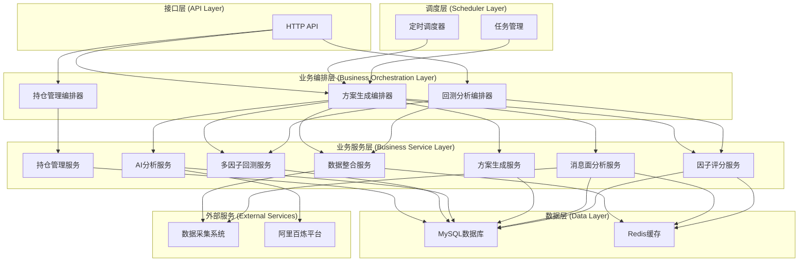
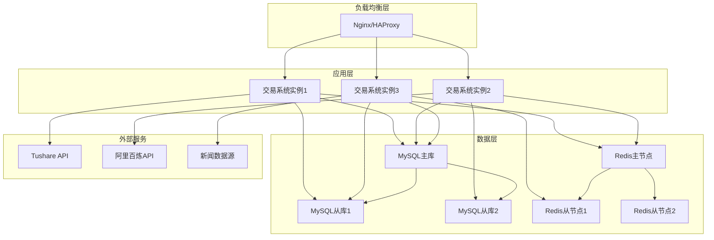
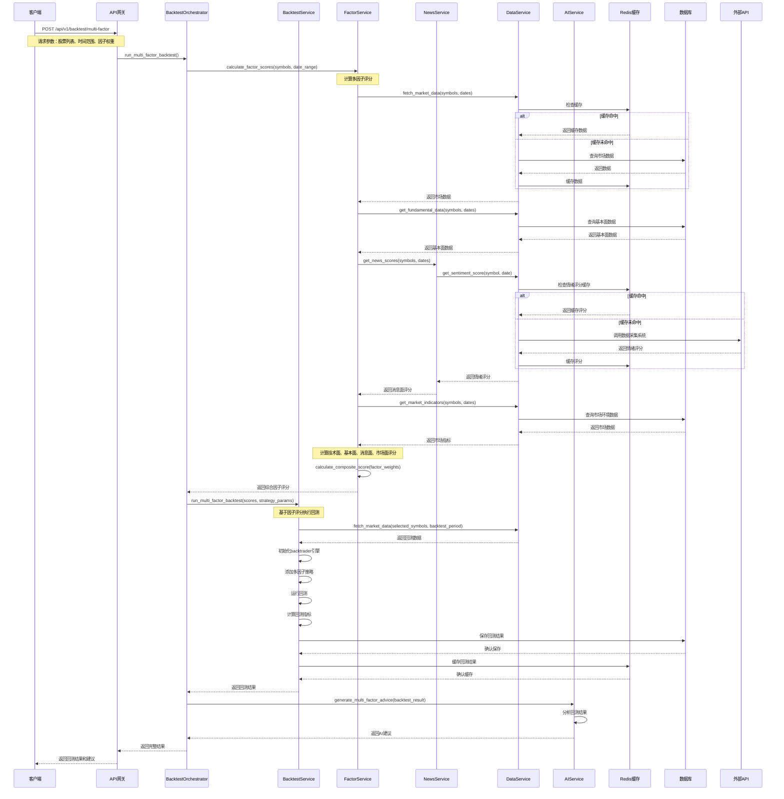
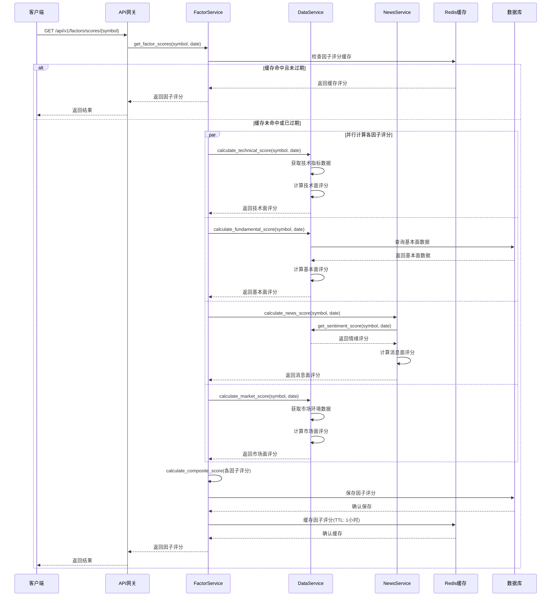
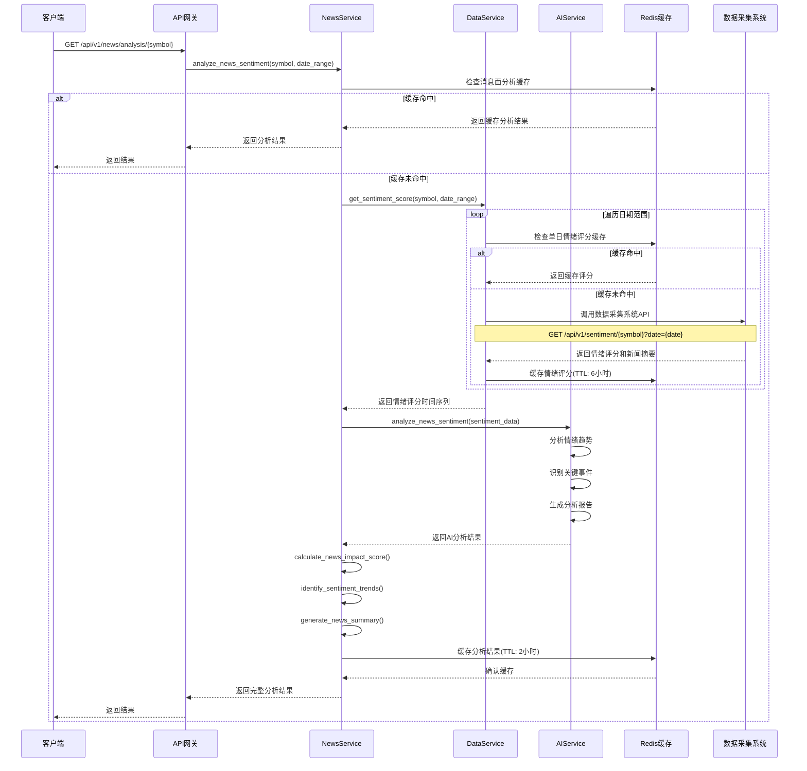
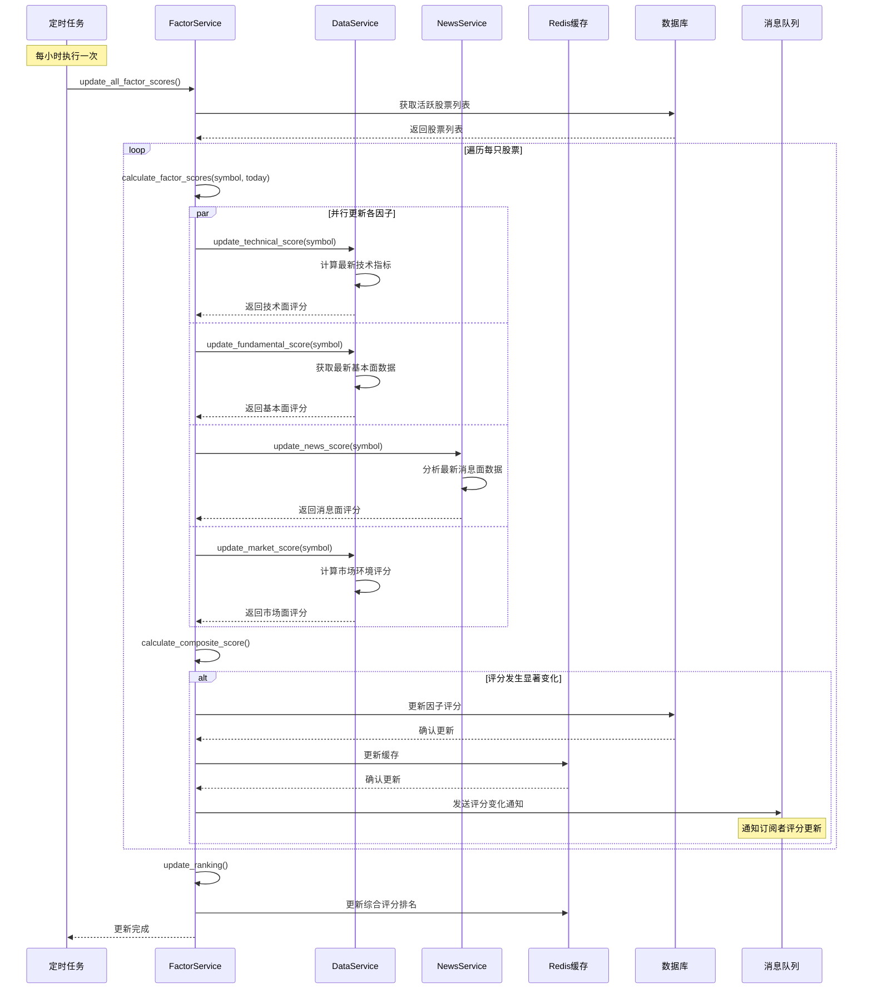

# 量化交易系统后端技术设计文档 (Design)

## 文档信息

| 项目    | 内容         |
| ----- | ---------- |
| 子系统名称 | 量化交易系统后端   |
| 文档版本  | v1.2       |
| 创建日期  | 2025-01-10 |
| 最后更新  | 2025-01-10 |
| 架构师   | [架构师姓名]   |
| 开发团队  | [开发团队]    |
| 文档状态  | 待评审        |
| 所属平台  | 量化交易平台     |
| 更新说明  | 重构为多因子量化综合评分模型，适配A股市场特性 |

## 1. 系统架构设计

### 1.1 整体架构

量化交易系统采用分层架构设计，确保系统的可维护性和可扩展性。系统分为五个核心层次：

- **接口层 (API Layer)**: 处理HTTP请求和响应
- **调度层 (Scheduler Layer)**: 管理定时任务和任务调度
- **业务编排层 (Business Orchestration Layer)**: 组合多个业务服务完成复杂业务流程
- **业务服务层 (Business Service Layer)**: 独立的业务服务，保持单一职责
- **数据层 (Data Layer)**: 数据存储和缓存




### 1.2 技术架构

**技术栈选择**

| 层级 | 技术选型 | 选择理由 |
| --- | --- | --- |
| 后端框架 | Python + FastAPI | 高性能异步框架，丰富的量化库生态 |
| 后端环境管理 | UV | 快速、简单的Python环境管理 |
| 数据库 | MySQL 8.0 | 成熟稳定，支持事务，与现有系统兼容 |
| 缓存 | Redis 6.0 | 高性能缓存，支持多种数据结构 |
| ORM | SQLAlchemy | 成熟的Python ORM框架 |
| 任务调度 | APScheduler | 轻量级Python任务调度器 |
| 回测框架 | backtrader | 专业的量化回测框架 |
| 量化库 | pandas, numpy, talib | 成熟的数据分析和技术指标库 |
| HTTP客户端 | httpx | 现代异步HTTP客户端 |
| 配置管理 | pydantic-settings | 类型安全的配置管理 |
| 日志 | loguru | 简单易用的日志库 |
| 容器化 | Docker | 标准化部署 |

### 1.2 模块划分

**核心模块设计**

```
quantitative-system/
├── main.py                    # 应用入口
├── config/                    # 配置管理
│   ├── __init__.py
│   ├── settings.py           # 应用配置
│   └── database.py           # 数据库配置
├── api/                       # API接口层
│   ├── __init__.py
│   ├── routes/               # 路由定义
│   │   ├── __init__.py
│   │   ├── positions.py      # 持仓管理接口
│   │   ├── plans.py          # 方案管理接口
│   │   └── system.py         # 系统状态接口
│   ├── dependencies.py       # 依赖注入
│   └── middleware.py         # 中间件
├── scheduler/                 # 调度层
│   ├── __init__.py
│   ├── jobs.py               # 任务定义
│   ├── scheduler.py          # 调度器
│   └── manager.py            # 任务管理器
├── biz/                       # 业务编排层
│   ├── __init__.py
│   ├── plan_orchestrator.py  # 方案生成编排器
│   ├── backtest_orchestrator.py # 回测分析编排器
│   ├── position_orchestrator.py # 持仓管理编排器
│   └── base_orchestrator.py  # 编排器基类
├── services/                  # 业务服务层
│   ├── __init__.py
│   ├── position_service.py   # 持仓管理服务
│   ├── backtest_service.py   # 多因子回测服务
│   ├── ai_service.py         # AI分析服务
│   ├── plan_service.py       # 方案生成服务
│   ├── data_service.py       # 数据整合服务
│   ├── news_service.py       # 消息面分析服务
│   └── factor_service.py     # 因子评分服务
├── models/                    # 数据模型
│   ├── __init__.py
│   ├── database.py           # 数据库模型
│   ├── schemas.py            # Pydantic模型
│   └── enums.py              # 枚举定义
├── repositories/              # 数据访问层
│   ├── __init__.py
│   ├── position_repo.py      # 持仓数据访问
│   ├── backtest_repo.py      # 回测数据访问
│   ├── plan_repo.py          # 方案数据访问
│   └── cache_repo.py         # 缓存数据访问
├── strategies/                # 多因子量化策略
│   ├── __init__.py
│   ├── base_strategy.py      # 策略基类
│   ├── multi_factor_strategy.py # 多因子综合策略
│   ├── factors/              # 因子模块
│   │   ├── __init__.py
│   │   ├── technical_factors.py  # 技术面因子
│   │   ├── fundamental_factors.py # 基本面因子
│   │   ├── news_factors.py       # 消息面因子
│   │   └── market_factors.py     # 市场面因子
│   └── legacy/               # 传统单一策略（保留用于对比）
│       ├── __init__.py
│       ├── ma_strategy.py    # 均线策略
│       ├── macd_strategy.py  # MACD策略
│       └── rsi_strategy.py   # RSI策略
├── utils/                     # 工具模块
│   ├── __init__.py
│   ├── logger.py             # 日志工具
│   ├── exceptions.py         # 异常定义
│   ├── validators.py         # 数据验证
│   └── helpers.py            # 辅助函数
└── tests/                     # 测试代码
    ├── __init__.py
    ├── test_biz/
    ├── test_services/
    ├── test_repositories/
    └── test_strategies/
```

## 2. 数据库设计

### 2.1 数据库架构

**数据库选型**
- **主数据库**: MySQL 8.0
- **缓存数据库**: Redis 6.0
- **连接池**: SQLAlchemy连接池

### 2.2 核心数据表设计

#### 2.2.1 持仓数据表 (positions)

```sql
CREATE TABLE positions (
    id BIGINT PRIMARY KEY AUTO_INCREMENT,
    symbol VARCHAR(20) NOT NULL COMMENT '股票代码',
    name VARCHAR(100) NOT NULL COMMENT '股票名称',
    quantity INT NOT NULL COMMENT '持仓数量',
    cost_price DECIMAL(10,3) NOT NULL COMMENT '成本价格',
    purchase_date DATE NOT NULL COMMENT '购买日期',
    current_price DECIMAL(10,3) COMMENT '当前价格',
    market_value DECIMAL(15,2) COMMENT '市值',
    profit_loss DECIMAL(15,2) COMMENT '盈亏金额',
    profit_loss_rate DECIMAL(8,4) COMMENT '盈亏比例',
    status TINYINT DEFAULT 1 COMMENT '状态: 1-持有, 0-已清仓',
    created_at TIMESTAMP DEFAULT CURRENT_TIMESTAMP,
    updated_at TIMESTAMP DEFAULT CURRENT_TIMESTAMP ON UPDATE CURRENT_TIMESTAMP,
    INDEX idx_symbol (symbol),
    INDEX idx_status (status),
    INDEX idx_purchase_date (purchase_date)
) ENGINE=InnoDB DEFAULT CHARSET=utf8mb4 COMMENT='持仓数据表';
```

#### 2.2.2 多因子回测结果表 (multi_factor_backtest_results)

```sql
CREATE TABLE multi_factor_backtest_results (
    id BIGINT PRIMARY KEY AUTO_INCREMENT,
    strategy_name VARCHAR(100) NOT NULL COMMENT '策略名称',
    symbol VARCHAR(20) NOT NULL COMMENT '股票代码',
    start_date DATE NOT NULL COMMENT '回测开始日期',
    end_date DATE NOT NULL COMMENT '回测结束日期',
    total_return DECIMAL(8,4) COMMENT '总收益率',
    annual_return DECIMAL(8,4) COMMENT '年化收益率',
    max_drawdown DECIMAL(8,4) COMMENT '最大回撤',
    sharpe_ratio DECIMAL(8,4) COMMENT '夏普比率',
    win_rate DECIMAL(8,4) COMMENT '胜率',
    profit_loss_ratio DECIMAL(8,4) COMMENT '盈亏比',
    volatility DECIMAL(8,4) COMMENT '波动率',
    trade_count INT COMMENT '交易次数',
    technical_score DECIMAL(5,2) COMMENT '技术面评分',
    fundamental_score DECIMAL(5,2) COMMENT '基本面评分',
    news_score DECIMAL(5,2) COMMENT '消息面评分',
    market_score DECIMAL(5,2) COMMENT '市场面评分',
    composite_score DECIMAL(5,2) COMMENT '综合评分',
    factor_weights JSON COMMENT '因子权重配置',
    result_data JSON COMMENT '详细回测数据',
    created_at TIMESTAMP DEFAULT CURRENT_TIMESTAMP,
    INDEX idx_strategy_symbol (strategy_name, symbol),
    INDEX idx_composite_score (composite_score),
    INDEX idx_created_at (created_at)
) ENGINE=InnoDB DEFAULT CHARSET=utf8mb4 COMMENT='多因子回测结果表';
```

#### 2.2.3 操作方案表 (trading_plans)

```sql
CREATE TABLE trading_plans (
    id BIGINT PRIMARY KEY AUTO_INCREMENT,
    plan_date DATE NOT NULL COMMENT '方案日期',
    content LONGTEXT NOT NULL COMMENT 'Markdown格式方案内容',
    confidence_score DECIMAL(5,2) COMMENT 'AI置信度评分',
    buy_recommendations JSON COMMENT '买入建议',
    sell_recommendations JSON COMMENT '卖出建议',
    hold_recommendations JSON COMMENT '持仓建议',
    market_analysis TEXT COMMENT '市场分析',
    risk_warnings TEXT COMMENT '风险提示',
    generated_at TIMESTAMP DEFAULT CURRENT_TIMESTAMP,
    status TINYINT DEFAULT 1 COMMENT '状态: 1-有效, 0-无效',
    UNIQUE KEY uk_plan_date (plan_date),
    INDEX idx_generated_at (generated_at)
) ENGINE=InnoDB DEFAULT CHARSET=utf8mb4 COMMENT='操作方案表';
```

#### 2.2.4 市场数据缓存表 (market_data_cache)

```sql
CREATE TABLE market_data_cache (
    id BIGINT PRIMARY KEY AUTO_INCREMENT,
    symbol VARCHAR(20) NOT NULL COMMENT '股票代码',
    data_date DATE NOT NULL COMMENT '数据日期',
    open_price DECIMAL(10,3) COMMENT '开盘价',
    high_price DECIMAL(10,3) COMMENT '最高价',
    low_price DECIMAL(10,3) COMMENT '最低价',
    close_price DECIMAL(10,3) COMMENT '收盘价',
    volume BIGINT COMMENT '成交量',
    turnover DECIMAL(15,2) COMMENT '成交额',
    change_rate DECIMAL(8,4) COMMENT '涨跌幅',
    technical_indicators JSON COMMENT '技术指标数据',
    created_at TIMESTAMP DEFAULT CURRENT_TIMESTAMP,
    updated_at TIMESTAMP DEFAULT CURRENT_TIMESTAMP ON UPDATE CURRENT_TIMESTAMP,
    UNIQUE KEY uk_symbol_date (symbol, data_date),
    INDEX idx_data_date (data_date)
) ENGINE=InnoDB DEFAULT CHARSET=utf8mb4 COMMENT='市场数据缓存表';
```

#### 2.2.5 消息面数据表 (news_data)

```sql
CREATE TABLE news_data (
    id BIGINT PRIMARY KEY AUTO_INCREMENT,
    symbol VARCHAR(20) NOT NULL COMMENT '股票代码',
    title VARCHAR(500) NOT NULL COMMENT '新闻标题',
    content TEXT COMMENT '新闻内容',
    source VARCHAR(100) COMMENT '新闻来源',
    publish_time TIMESTAMP NOT NULL COMMENT '发布时间',
    sentiment_score DECIMAL(5,2) COMMENT '情感分析评分(-100到100)',
    importance_level TINYINT COMMENT '重要性等级(1-5)',
    keywords JSON COMMENT '关键词提取',
    impact_analysis TEXT COMMENT '影响分析',
    processed_at TIMESTAMP DEFAULT CURRENT_TIMESTAMP,
    INDEX idx_symbol_time (symbol, publish_time),
    INDEX idx_sentiment_score (sentiment_score),
    INDEX idx_importance_level (importance_level)
) ENGINE=InnoDB DEFAULT CHARSET=utf8mb4 COMMENT='消息面数据表';
```

#### 2.2.6 因子评分表 (factor_scores)

```sql
CREATE TABLE factor_scores (
    id BIGINT PRIMARY KEY AUTO_INCREMENT,
    symbol VARCHAR(20) NOT NULL COMMENT '股票代码',
    score_date DATE NOT NULL COMMENT '评分日期',
    technical_score DECIMAL(5,2) NOT NULL COMMENT '技术面评分(0-100)',
    fundamental_score DECIMAL(5,2) NOT NULL COMMENT '基本面评分(0-100)',
    news_score DECIMAL(5,2) NOT NULL COMMENT '消息面评分(0-100)',
    market_score DECIMAL(5,2) NOT NULL COMMENT '市场面评分(0-100)',
    composite_score DECIMAL(5,2) NOT NULL COMMENT '综合评分(0-100)',
    technical_details JSON COMMENT '技术面详细指标',
    fundamental_details JSON COMMENT '基本面详细指标',
    news_details JSON COMMENT '消息面详细分析',
    market_details JSON COMMENT '市场面详细指标',
    weight_config JSON COMMENT '权重配置',
    created_at TIMESTAMP DEFAULT CURRENT_TIMESTAMP,
    UNIQUE KEY uk_symbol_date (symbol, score_date),
    INDEX idx_composite_score (composite_score),
    INDEX idx_score_date (score_date)
) ENGINE=InnoDB DEFAULT CHARSET=utf8mb4 COMMENT='因子评分表';
```

#### 2.2.7 系统日志表 (system_logs)

```sql
CREATE TABLE system_logs (
    id BIGINT PRIMARY KEY AUTO_INCREMENT,
    log_level VARCHAR(20) NOT NULL COMMENT '日志级别',
    module VARCHAR(100) NOT NULL COMMENT '模块名称',
    message TEXT NOT NULL COMMENT '日志消息',
    details JSON COMMENT '详细信息',
    created_at TIMESTAMP DEFAULT CURRENT_TIMESTAMP,
    INDEX idx_level_module (log_level, module),
    INDEX idx_created_at (created_at)
) ENGINE=InnoDB DEFAULT CHARSET=utf8mb4 COMMENT='系统日志表';
```

### 2.3 Redis缓存设计

**缓存策略**

| 缓存类型 | Key格式 | 过期时间 | 用途 |
| --- | --- | --- | --- |
| 市场数据 | `market:{symbol}:{date}` | 24小时 | 缓存日K线数据 |
| 技术指标 | `indicators:{symbol}:{date}` | 24小时 | 缓存技术指标 |
| 多因子回测结果 | `multi_factor_backtest:{strategy}:{symbol}` | 7天 | 缓存多因子回测结果 |
| 因子评分 | `factor_scores:{symbol}:{date}` | 6小时 | 缓存因子评分数据 |
| 消息面数据 | `news:{symbol}:{date}` | 12小时 | 缓存消息面分析数据 |
| 综合评分排名 | `ranking:composite:{date}` | 2小时 | 缓存股票综合评分排名 |
| 持仓信息 | `positions:current` | 1小时 | 缓存当前持仓 |
| 系统状态 | `system:status` | 5分钟 | 缓存系统状态 |

## 3. API接口设计

### 3.1 接口规范

**RESTful API设计原则**
- 使用标准HTTP方法 (GET, POST, PUT, DELETE)
- 统一的响应格式
- 合理的HTTP状态码
- 版本控制 (/api/v1/)

**统一响应格式**

```python
# 成功响应
{
    "code": 200,
    "message": "success",
    "data": {},
    "timestamp": "2025-01-10T10:00:00Z"
}

# 错误响应
{
    "code": 400,
    "message": "参数错误",
    "error": "详细错误信息",
    "timestamp": "2025-01-10T10:00:00Z"
}
```

### 3.2 核心接口定义

#### 3.2.1 持仓管理接口

```python
# 获取持仓列表
GET /api/v1/positions
Response: {
    "code": 200,
    "data": {
        "positions": [
            {
                "id": 1,
                "symbol": "000001",
                "name": "平安银行",
                "quantity": 1000,
                "cost_price": 12.00,
                "current_price": 12.50,
                "market_value": 12500.00,
                "profit_loss": 500.00,
                "profit_loss_rate": 0.0417,
                "purchase_date": "2024-01-10",
                "status": 1
            }
        ],
        "total_market_value": 12500.00,
        "total_profit_loss": 500.00
    }
}

# 添加持仓
POST /api/v1/positions
Request: {
    "symbol": "000001",
    "name": "平安银行",
    "quantity": 1000,
    "cost_price": 12.00,
    "purchase_date": "2024-01-10"
}

# 更新持仓
PUT /api/v1/positions/{position_id}
Request: {
    "quantity": 1200,
    "cost_price": 12.10
}

# 删除持仓
DELETE /api/v1/positions/{position_id}
```

#### 3.2.2 方案管理接口

```python
# 获取今日方案
GET /api/v1/plans/today
Response: {
    "code": 200,
    "data": {
        "plan_date": "2025-01-10",
        "content": "# 每日操作方案\n\n...",
        "confidence_score": 85.5,
        "buy_recommendations": [
            {
                "symbol": "000001",
                "name": "平安银行",
                "price_range": [12.40, 12.60],
                "quantity": 1000,
                "reason": "技术突破，基本面良好"
            }
        ],
        "sell_recommendations": [],
        "hold_recommendations": [],
        "generated_at": "2025-01-10T06:00:00Z"
    }
}

# 获取历史方案
GET /api/v1/plans/history?days=7

# 手动触发方案生成
POST /api/v1/plans/generate
```

#### 3.2.3 多因子回测接口

```python
# 执行多因子策略回测
POST /api/v1/backtest/multi-factor/run
Request: {
    "strategy_name": "multi_factor_strategy",
    "symbols": ["000001", "000002"],
    "start_date": "2024-01-01",
    "end_date": "2024-12-31",
    "factor_weights": {
        "technical": 0.35,
        "fundamental": 0.25,
        "news": 0.25,
        "market": 0.15
    },
    "parameters": {
        "rebalance_frequency": "weekly",
        "min_score_threshold": 60.0,
        "max_positions": 10
    }
}

# 获取多因子回测结果
GET /api/v1/backtest/multi-factor/results/{result_id}
Response: {
    "code": 200,
    "data": {
        "id": 1,
        "strategy_name": "multi_factor_strategy",
        "symbol": "000001",
        "start_date": "2024-01-01",
        "end_date": "2024-12-31",
        "total_return": 0.1250,
        "annual_return": 0.1250,
        "max_drawdown": -0.0850,
        "sharpe_ratio": 1.45,
        "technical_score": 72.5,
        "fundamental_score": 68.0,
        "news_score": 75.5,
        "market_score": 70.0,
        "composite_score": 71.2,
        "factor_weights": {
            "technical": 0.35,
            "fundamental": 0.25,
            "news": 0.25,
            "market": 0.15
        }
    }
}

# 获取策略列表
GET /api/v1/backtest/strategies
Response: {
    "code": 200,
    "data": {
        "strategies": [
            {
                "name": "ma_strategy",
                "display_name": "双均线策略",
                "category": "technical",
                "description": "基于短期和长期移动平均线交叉的趋势跟踪策略",
                "parameters": {
                    "short_window": {"type": "int", "range": [3, 10], "default": 5},
                    "long_window": {"type": "int", "range": [15, 30], "default": 20}
                }
            },
            {
                "name": "macd_strategy",
                "display_name": "MACD策略",
                "category": "technical",
                "description": "基于MACD指标的动量策略",
                "parameters": {
                    "fast_period": {"type": "int", "range": [8, 16], "default": 12},
                    "slow_period": {"type": "int", "range": [20, 32], "default": 26},
                    "signal_period": {"type": "int", "range": [6, 12], "default": 9}
                }
            },
            {
                "name": "rsi_strategy",
                "display_name": "RSI策略",
                "category": "technical",
                "description": "基于RSI指标的超买超卖策略",
                "parameters": {
                    "rsi_period": {"type": "int", "range": [10, 20], "default": 14},
                    "oversold": {"type": "int", "range": [20, 35], "default": 30},
                    "overbought": {"type": "int", "range": [65, 80], "default": 70}
                }
            },
            {
                "name": "news_sentiment_strategy",
                "display_name": "新闻情绪策略",
                "category": "news_based",
                "description": "基于新闻情绪分析的交易策略",
                "parameters": {
                    "sentiment_threshold": {"type": "float", "range": [0.4, 0.8], "default": 0.6},
                    "volume_threshold": {"type": "float", "range": [1.2, 2.0], "default": 1.5},
                    "price_change_threshold": {"type": "float", "range": [0.01, 0.05], "default": 0.03},
                    "volume_period": {"type": "int", "range": [10, 30], "default": 20}
                }
            },
            {
                "name": "policy_driven_strategy",
                "display_name": "政策导向策略",
                "category": "news_based",
                "description": "基于政策事件和行业影响的交易策略",
                "parameters": {
                    "policy_impact_threshold": {"type": "float", "range": [0.5, 0.9], "default": 0.7},
                    "sector_correlation": {"type": "float", "range": [0.6, 0.9], "default": 0.8},
                    "confirmation_period": {"type": "int", "range": [1, 5], "default": 3}
                }
            },
            {
                "name": "event_driven_strategy",
                "display_name": "事件驱动策略",
                "category": "news_based",
                "description": "基于重大事件和市场反应的交易策略",
                "parameters": {
                    "event_severity_threshold": {"type": "float", "range": [0.4, 0.8], "default": 0.6},
                    "market_reaction_threshold": {"type": "float", "range": [0.02, 0.08], "default": 0.05},
                    "volatility_period": {"type": "int", "range": [10, 20], "default": 14}
                }
            }
        ],
        "categories": [
            {"name": "technical", "display_name": "技术分析策略"},
            {"name": "news_based", "display_name": "消息面策略"}
        ]
    }
}
```

#### 3.2.4 系统状态接口

```python
# 系统健康检查
GET /api/v1/system/health
Response: {
    "code": 200,
    "data": {
        "status": "healthy",
        "database": "connected",
        "redis": "connected",
        "external_services": {
            "data_collection": "available",
            "ai_platform": "available"
        },
        "last_plan_generated": "2025-01-10T06:00:00Z",
        "next_scheduled_run": "2025-01-11T15:30:00Z"
    }
}

# 系统统计信息
GET /api/v1/system/stats
```

#### 3.2.5 因子评分接口

```python
# 获取股票因子评分
GET /api/v1/factors/scores/{symbol}
Response: {
    "code": 200,
    "data": {
        "symbol": "000001",
        "score_date": "2025-01-10",
        "technical_score": 72.5,
        "fundamental_score": 68.0,
        "news_score": 75.5,
        "market_score": 70.0,
        "composite_score": 71.2,
        "technical_details": {
            "ma_signal": 0.8,
            "rsi_signal": 0.6,
            "macd_signal": 0.9,
            "volume_signal": 0.7
        },
        "fundamental_details": {
            "pe_ratio": 15.2,
            "pb_ratio": 1.8,
            "roe": 0.12,
            "debt_ratio": 0.35
        },
        "news_details": {
            "sentiment_score": 75.5,
            "news_count": 8,
            "positive_ratio": 0.75
        },
        "market_details": {
            "market_cap_rank": 0.8,
            "liquidity_score": 0.9,
            "volatility_score": 0.6
        }
    }
}

# 获取综合评分排名
GET /api/v1/factors/ranking?limit=50&date=2025-01-10
Response: {
    "code": 200,
    "data": {
        "ranking_date": "2025-01-10",
        "stocks": [
            {
                "rank": 1,
                "symbol": "000001",
                "name": "平安银行",
                "composite_score": 85.2,
                "technical_score": 88.0,
                "fundamental_score": 82.0,
                "news_score": 86.0,
                "market_score": 85.0
            }
        ]
    }
}

# 批量计算因子评分
POST /api/v1/factors/calculate
Request: {
    "symbols": ["000001", "000002", "000858"],
    "date": "2025-01-10",
    "force_refresh": false,
    "factor_weights": {  // 可选，自定义因子权重
        "technical": 0.4,
        "fundamental": 0.3,
        "news": 0.2,
        "market": 0.1
    }
}

# 获取默认因子权重配置
GET /api/v1/factors/weights/default
Response: {
    "code": 200,
    "data": {
        "technical": 0.3,
        "fundamental": 0.25,
        "news": 0.25,
        "market": 0.2
    }
}

# 验证因子权重配置
POST /api/v1/factors/weights/validate
Request: {
    "weights": {
        "technical": 0.4,
        "fundamental": 0.3,
        "news": 0.2,
        "market": 0.1
    }
}
Response: {
    "code": 200,
    "data": {
        "valid": true,
        "normalized_weights": {
            "technical": 0.4,
            "fundamental": 0.3,
            "news": 0.2,
            "market": 0.1
        },
        "total_weight": 1.0
    }
}
```

#### 3.2.6 消息面分析接口

```python
# 获取股票消息面数据
GET /api/v1/news/analysis/{symbol}?days=7
Response: {
    "code": 200,
    "data": {
        "symbol": "000001",
        "analysis_period": {
            "start_date": "2025-01-04",
            "end_date": "2025-01-10"
        },
        "overall_sentiment": 75.5,
        "news_count": 15,
        "sentiment_distribution": {
            "positive": 9,
            "neutral": 4,
            "negative": 2
        },
        "key_topics": [
            {
                "topic": "业绩预告",
                "sentiment": 85.0,
                "importance": 5,
                "news_count": 3
            },
            {
                "topic": "行业政策",
                "sentiment": 70.0,
                "importance": 4,
                "news_count": 5
            }
        ],
        "recent_news": [
            {
                "id": 1,
                "title": "平安银行发布业绩预告",
                "sentiment_score": 85.0,
                "importance_level": 5,
                "publish_time": "2025-01-10T09:00:00Z",
                "source": "财经网"
            }
        ]
    }
}

# 获取市场热点消息
GET /api/v1/news/hotspots?limit=20
Response: {
    "code": 200,
    "data": {
        "hotspots": [
            {
                "topic": "人工智能",
                "sentiment": 82.0,
                "related_stocks": ["000001", "000002"],
                "news_count": 25,
                "trend": "rising"
            }
        ]
    }
}

# 消息面情感分析
POST /api/v1/news/sentiment/analyze
Request: {
    "title": "平安银行发布2024年业绩预告，净利润同比增长15%",
    "content": "详细新闻内容...",
    "symbol": "000001"
}
```

## 4. 业务编排层设计

### 4.1 设计原则

业务编排层（Business Orchestration Layer）的核心目标是解决业务服务层相互依赖的问题，通过编排器模式组合多个独立的业务服务来完成复杂的业务流程。

**设计原则**
- **服务独立性**: 业务服务层保持单一职责，服务之间不直接依赖
- **流程编排**: 编排器负责组合多个服务完成完整业务流程
- **事务管理**: 编排器处理跨服务的事务一致性
- **错误处理**: 统一的异常处理和回滚机制
- **可扩展性**: 支持新的业务流程编排

### 4.2 编排器基类设计

```python
from abc import ABC, abstractmethod
from typing import Any, Dict, List, Optional
from contextlib import asynccontextmanager

class BaseOrchestrator(ABC):
    """业务编排器基类"""
    
    def __init__(self):
        self.logger = get_logger(self.__class__.__name__)
        self.transaction_context = None
        
    @asynccontextmanager
    async def transaction(self):
        """事务上下文管理器"""
        try:
            # 开始事务
            self.transaction_context = await self._begin_transaction()
            yield self.transaction_context
            # 提交事务
            await self._commit_transaction()
        except Exception as e:
            # 回滚事务
            await self._rollback_transaction()
            self.logger.error(f"Transaction failed: {e}")
            raise
        finally:
            self.transaction_context = None
            
    @abstractmethod
    async def _begin_transaction(self) -> Any:
        """开始事务"""
        pass
        
    @abstractmethod
    async def _commit_transaction(self) -> None:
        """提交事务"""
        pass
        
    @abstractmethod
    async def _rollback_transaction(self) -> None:
        """回滚事务"""
        pass
        
    async def execute_with_retry(self, func, max_retries: int = 3, **kwargs):
        """带重试的执行"""
        for attempt in range(max_retries):
            try:
                return await func(**kwargs)
            except Exception as e:
                if attempt == max_retries - 1:
                    raise
                self.logger.warning(f"Attempt {attempt + 1} failed: {e}, retrying...")
                await asyncio.sleep(2 ** attempt)  # 指数退避
```

### 4.3 方案生成编排器

```python
class PlanOrchestrator(BaseOrchestrator):
    """方案生成编排器
    
    负责编排完整的方案生成流程：
    1. 数据获取和整合
    2. 策略回测执行
    3. AI分析和建议生成
    4. 方案格式化和保存
    """
    
    def __init__(self, data_service: DataService, backtest_service: BacktestService,
                 ai_service: AIService, plan_service: PlanService):
        super().__init__()
        self.data_service = data_service
        self.backtest_service = backtest_service
        self.ai_service = ai_service
        self.plan_service = plan_service
        
    async def generate_daily_plan(self, plan_date: date, 
                                 symbols: List[str]) -> TradingPlan:
        """生成每日操作方案"""
        async with self.transaction():
            try:
                # 1. 数据获取和整合
                self.logger.info(f"开始生成 {plan_date} 的操作方案")
                market_data = await self.data_service.fetch_market_data(
                    symbols, plan_date - timedelta(days=30), plan_date
                )
                
                # 2. 执行多因子策略回测
                backtest_results = []
                
                # 使用多因子综合策略
                for symbol in symbols:
                    result = await self.backtest_service.run_multi_factor_backtest(
                        symbol, 
                        plan_date - timedelta(days=30), plan_date,
                        factor_weights={
                            'technical': 0.35,
                            'fundamental': 0.25,
                            'news': 0.25,
                            'market': 0.15
                        }
                    )
                    backtest_results.append(result)
                
                # 3. AI分析
                analysis_result = await self.ai_service.analyze_market_data(
                    backtest_results, await self._get_current_positions()
                )
                
                recommendations = await self.ai_service.generate_trading_recommendations(
                    analysis_result
                )
                
                # 4. 生成和保存方案
                plan = await self.plan_service.generate_daily_plan(analysis_result)
                plan.buy_recommendations = recommendations.buy_list
                plan.sell_recommendations = recommendations.sell_list
                plan.hold_recommendations = recommendations.hold_list
                
                plan_id = await self.plan_service.save_plan(plan)
                plan.id = plan_id
                
                self.logger.info(f"方案生成完成，ID: {plan_id}")
                return plan
                
            except Exception as e:
                self.logger.error(f"方案生成失败: {e}")
                raise
                
    def _get_default_parameters(self, strategy: str) -> Dict:
        """获取策略默认参数"""
        defaults = {
            'ma_strategy': {'short_window': 5, 'long_window': 20},
            'macd_strategy': {'fast': 12, 'slow': 26, 'signal': 9},
            'rsi_strategy': {'period': 14, 'oversold': 30, 'overbought': 70}
        }
        return defaults.get(strategy, {})
        
    async def _get_current_positions(self) -> List[Position]:
        """获取当前持仓（通过依赖注入获取）"""
        # 这里可以通过依赖注入获取PositionService
        # 或者通过事件/消息机制获取
        pass
```

### 4.4 回测分析编排器

```python
class BacktestOrchestrator(BaseOrchestrator):
    """回测分析编排器
    
    负责编排策略回测和分析流程：
    1. 数据准备和验证
    2. 批量回测执行
    3. 结果分析和排名
    4. 报告生成
    """
    
    def __init__(self, data_service: DataService, backtest_service: BacktestService):
        super().__init__()
        self.data_service = data_service
        self.backtest_service = backtest_service
        
    async def run_batch_backtest(self, strategies: List[str], symbols: List[str],
                                start_date: date, end_date: date) -> BacktestReport:
        """批量回测执行"""
        async with self.transaction():
            results = []
            
            # 数据预加载
            await self.data_service.preload_market_data(symbols, start_date, end_date)
            
            # 并发执行回测
            tasks = []
            for strategy in strategies:
                for symbol in symbols:
                    task = self.backtest_service.run_backtest(
                        strategy, [symbol], start_date, end_date, {}
                    )
                    tasks.append(task)
                    
            results = await asyncio.gather(*tasks, return_exceptions=True)
            
            # 生成分析报告
            report = await self._generate_backtest_report(results)
            return report
```

### 4.5 持仓管理编排器

```python
class PositionOrchestrator(BaseOrchestrator):
    """持仓管理编排器
    
    负责编排持仓相关的复杂业务流程：
    1. 持仓数据同步和更新
    2. 风险分析和预警
    3. 收益计算和统计
    """
    
    def __init__(self, position_service: PositionService, data_service: DataService):
        super().__init__()
        self.position_service = position_service
        self.data_service = data_service
        
    async def sync_and_analyze_positions(self) -> PositionAnalysisResult:
        """同步并分析持仓"""
        async with self.transaction():
            # 1. 获取当前持仓
            positions = await self.position_service.get_positions()
            
            # 2. 更新市场价格
            symbols = [pos.symbol for pos in positions]
            current_prices = await self.data_service.get_current_prices(symbols)
            
            # 3. 更新持仓市值
            await self.position_service.update_market_values(current_prices)
            
            # 4. 计算投资组合指标
            portfolio_metrics = await self.position_service.calculate_portfolio_metrics()
            
            # 5. 风险分析
            risk_analysis = await self._analyze_portfolio_risk(positions, current_prices)
            
            return PositionAnalysisResult(
                positions=positions,
                portfolio_metrics=portfolio_metrics,
                risk_analysis=risk_analysis
            )
```

## 5. 核心服务设计

### 5.1 持仓管理服务 (PositionService)

**主要功能**
- 持仓信息的CRUD操作
- 持仓收益计算
- 持仓风险分析
- 持仓数据同步

**核心方法**

```python
class PositionService:
    async def get_positions(self) -> List[Position]:
        """获取所有持仓"""
        
    async def add_position(self, position_data: PositionCreate) -> Position:
        """添加新持仓"""
        
    async def update_position(self, position_id: int, update_data: PositionUpdate) -> Position:
        """更新持仓信息"""
        
    async def delete_position(self, position_id: int) -> bool:
        """删除持仓"""
        
    async def calculate_portfolio_metrics(self) -> PortfolioMetrics:
        """计算投资组合指标"""
        
    async def update_market_values(self) -> None:
        """更新持仓市值"""
```

### 5.2 多因子回测服务 (BacktestService)

**主要功能**
- 多因子策略回测执行
- 因子评分计算和整合
- 回测结果分析
- 策略性能评估
- 回测报告生成

**核心方法**

```python
import backtrader as bt
from typing import Dict, List, Optional
import pandas as pd

class BacktestService:
    def __init__(self, factor_service: 'FactorService', news_service: 'NewsService'):
        self.factor_service = factor_service
        self.news_service = news_service
        
    async def run_multi_factor_backtest(self, symbol: str, 
                                       start_date: date, end_date: date,
                                       factor_weights: Optional[Dict[str, float]] = None) -> MultiFactorBacktestResult:
        """执行多因子策略回测"""
        # 0. 设置权重配置（使用传入权重或FactorService默认权重）
        if factor_weights is not None:
            # 创建临时FactorService实例使用自定义权重
            temp_factor_service = FactorService(
                self.factor_service.data_service,
                self.factor_service.news_service,
                factor_weights
            )
            weights = temp_factor_service.get_factor_weights()
        else:
            # 使用当前FactorService的权重配置
            temp_factor_service = self.factor_service
            weights = self.factor_service.get_factor_weights()
        
        # 1. 获取历史数据
        market_data = await self._get_market_data(symbol, start_date, end_date)
        
        # 2. 计算各因子评分
        factor_scores = await self._calculate_factor_scores(
            symbol, market_data, start_date, end_date, temp_factor_service
        )
        
        # 3. 计算综合评分
        composite_scores = await self._calculate_composite_scores(
            factor_scores, weights
        )
        
        # 4. 执行回测
        backtest_result = await self._execute_multi_factor_backtest(
            symbol, market_data, composite_scores, weights
        )
        
        # 5. 保存结果
        result_id = await self._save_backtest_result(backtest_result)
        backtest_result.id = result_id
        
        return backtest_result
        
    async def _calculate_factor_scores(self, symbol: str, market_data: pd.DataFrame,
                                      start_date: date, end_date: date, 
                                      factor_service: 'FactorService') -> Dict[str, List[float]]:
        """计算各因子评分"""
        factor_scores = {
            'technical': [],
            'fundamental': [],
            'news': [],
            'market': []
        }
        
        # 按日期计算因子评分
        for date in pd.date_range(start_date, end_date):
            # 技术面因子
            technical_score = await factor_service.calculate_technical_score(
                symbol, date, market_data
            )
            factor_scores['technical'].append(technical_score)
            
            # 基本面因子
            fundamental_score = await factor_service.calculate_fundamental_score(
                symbol, date
            )
            factor_scores['fundamental'].append(fundamental_score)
            
            # 消息面因子
            news_score = await factor_service.calculate_news_score(
                symbol, date
            )
            factor_scores['news'].append(news_score)
            
            # 市场面因子
            market_score = await factor_service.calculate_market_score(
                symbol, date, market_data
            )
            factor_scores['market'].append(market_score)
            
        return factor_scores
        
    async def _calculate_composite_scores(self, factor_scores: Dict[str, List[float]],
                                        factor_weights: Dict[str, float]) -> List[float]:
        """计算综合评分"""
        composite_scores = []
        
        for i in range(len(factor_scores['technical'])):
            composite_score = (
                factor_scores['technical'][i] * factor_weights['technical'] +
                factor_scores['fundamental'][i] * factor_weights['fundamental'] +
                factor_scores['news'][i] * factor_weights['news'] +
                factor_scores['market'][i] * factor_weights['market']
            )
            composite_scores.append(composite_score)
            
        return composite_scores
        
    async def _execute_multi_factor_backtest(self, symbol: str, market_data: pd.DataFrame,
                                           composite_scores: List[float],
                                           factor_weights: Dict[str, float]) -> 'MultiFactorBacktestResult':
        """执行多因子回测"""
        # 初始化backtrader引擎
        cerebro = bt.Cerebro()
        
        # 添加多因子策略
        cerebro.addstrategy(MultiFactorStrategy, composite_scores=composite_scores)
        
        # 添加数据源
        data = self._convert_to_backtrader_data(market_data)
        cerebro.adddata(data)
        
        # 设置初始资金和手续费
        cerebro.broker.setcash(100000.0)
        cerebro.broker.setcommission(commission=0.001)
        
        # 添加分析器
        cerebro.addanalyzer(bt.analyzers.SharpeRatio, _name='sharpe')
        cerebro.addanalyzer(bt.analyzers.DrawDown, _name='drawdown')
        cerebro.addanalyzer(bt.analyzers.Returns, _name='returns')
        cerebro.addanalyzer(bt.analyzers.TradeAnalyzer, _name='trades')
        
        # 运行回测
        results = cerebro.run()
        
        # 解析结果
        return await self._parse_multi_factor_results(results[0], composite_scores, factor_weights)
        
    async def run_legacy_backtest(self, strategy_name: str, symbols: List[str], 
                                 start_date: date, end_date: date, 
                                 parameters: Dict) -> 'BacktestResult':
        """执行传统单一策略回测（保留用于对比）"""
        # 初始化backtrader引擎
        cerebro = bt.Cerebro()
        
        # 添加策略
        strategy_class = self._get_strategy_class(strategy_name)
        cerebro.addstrategy(strategy_class, **parameters)
        
        # 添加数据源
        for symbol in symbols:
            data = await self._get_market_data(symbol, start_date, end_date)
            cerebro.adddata(data)
        
        # 设置初始资金
        cerebro.broker.setcash(100000.0)
        
        # 设置手续费
        cerebro.broker.setcommission(commission=0.001)
        
        # 添加分析器
        cerebro.addanalyzer(bt.analyzers.SharpeRatio, _name='sharpe')
        cerebro.addanalyzer(bt.analyzers.DrawDown, _name='drawdown')
        cerebro.addanalyzer(bt.analyzers.Returns, _name='returns')
        cerebro.addanalyzer(bt.analyzers.TradeAnalyzer, _name='trades')
        
        # 运行回测
        results = cerebro.run()
        
        # 解析结果
        return await self._parse_backtest_results(results[0])
        
    async def get_backtest_result(self, result_id: int) -> BacktestResult:
        """获取回测结果"""
        
    async def _get_strategy_class(self, strategy_name: str):
        """获取策略类"""
        
    async def _get_market_data(self, symbol: str, start_date: date, end_date: date) -> bt.feeds.PandasData:
        """获取市场数据并转换为backtrader格式"""
        
    async def _parse_backtest_results(self, result) -> BacktestResult:
        """解析backtrader回测结果"""
        
    async def get_strategy_rankings(self) -> List[StrategyRanking]:
        """获取策略排名"""
```

### 5.3 多因子AI分析服务 (AIService)

**主要功能**
- 多因子数据整合和预处理
- 基于大模型的多因子分析
- 消息面情感分析
- 因子权重优化建议
- 投资建议生成
- 置信度评估

**核心方法**

```python
from openai import AsyncOpenAI
from typing import Dict, List, Optional
import pandas as pd

class AIService:
    def __init__(self, api_key: str):
        self.client = AsyncOpenAI(api_key=api_key)
        
    async def analyze_multi_factor_data(self, symbol: str, 
                                       factor_scores: Dict[str, float],
                                       market_data: Dict,
                                       news_data: List[Dict]) -> 'MultiFactorAnalysisResult':
        """多因子数据AI分析"""
        prompt = self._build_multi_factor_analysis_prompt(
            symbol, factor_scores, market_data, news_data
        )
        
        response = await self.client.chat.completions.create(
            model="gpt-4",
            messages=[
                {"role": "system", "content": "你是一个专业的量化投资分析师，精通多因子模型"},
                {"role": "user", "content": prompt}
            ],
            temperature=0.3
        )
        
        return await self._parse_multi_factor_analysis(response.choices[0].message.content)
        
    async def analyze_news_sentiment(self, news_content: str, symbol: str) -> Dict:
        """分析新闻情感"""
        prompt = f"""
        请分析以下关于股票{symbol}的新闻内容的情感倾向：
        
        新闻内容：{news_content}
        
        请从以下维度进行分析：
        1. 情感极性（正面/负面/中性）
        2. 情感强度（1-10分）
        3. 对股价的潜在影响（利好/利空/中性）
        4. 重要性等级（高/中/低）
        5. 关键信息提取
        
        请以JSON格式返回结果。
        """
        
        response = await self.client.chat.completions.create(
            model="gpt-4",
            messages=[
                {"role": "system", "content": "你是一个专业的金融新闻分析师"},
                {"role": "user", "content": prompt}
            ],
            temperature=0.3
        )
        
        return self._parse_sentiment_response(response.choices[0].message.content)
        
    async def generate_factor_weight_suggestions(self, 
                                               historical_performance: Dict,
                                               market_regime: str) -> Dict[str, float]:
        """生成因子权重建议"""
        prompt = f"""
        基于历史表现数据和当前市场环境，请建议最优的因子权重配置：
        
        历史表现：{historical_performance}
        市场环境：{market_regime}
        
        请为以下因子建议权重（总和为1.0）：
        - 技术面因子
        - 基本面因子
        - 消息面因子
        - 市场面因子
        
        请说明权重分配的理由。
        """
        
        response = await self.client.chat.completions.create(
            model="gpt-4",
            messages=[
                {"role": "system", "content": "你是一个专业的量化策略优化专家"},
                {"role": "user", "content": prompt}
            ],
            temperature=0.5
        )
        
        return self._parse_weight_suggestions(response.choices[0].message.content)
        
    async def generate_trading_recommendations(self, 
                                             multi_factor_result: 'MultiFactorAnalysisResult',
                                             positions: List['Position']) -> 'TradingRecommendations':
        """基于多因子分析生成交易建议"""
        prompt = self._build_trading_recommendation_prompt(multi_factor_result, positions)
        
        response = await self.client.chat.completions.create(
            model="gpt-4",
            messages=[
                {"role": "system", "content": "你是一个专业的投资顾问，精通多因子量化策略"},
                {"role": "user", "content": prompt}
            ],
            temperature=0.7
        )
        
        return await self._parse_trading_recommendations(response.choices[0].message.content)
        
    async def call_ai_platform(self, prompt: str) -> str:
        """调用AI平台（兼容性方法）"""
        response = await self.client.chat.completions.create(
            model="gpt-4",
            messages=[
                {"role": "user", "content": prompt}
            ],
            temperature=0.5
        )
        
        return response.choices[0].message.content
        
    async def parse_ai_response(self, response: str) -> 'ParsedRecommendations':
        """解析AI响应"""
        # 实现AI响应解析逻辑
        pass
```

### 5.4 因子评分服务 (FactorService)

**主要功能**
- 技术面因子计算
- 基本面因子计算
- 消息面因子计算
- 市场面因子计算
- 综合评分计算
- 因子权重管理

**核心方法**

```python
import pandas as pd
import numpy as np
from typing import Dict, List, Optional
from datetime import date

class FactorService:
    # 默认因子权重配置
    DEFAULT_FACTOR_WEIGHTS = {
        'technical': 0.3,    # 技术面权重30%
        'fundamental': 0.25, # 基本面权重25%
        'news': 0.25,        # 消息面权重25%
        'market': 0.2        # 市场面权重20%
    }
    
    def __init__(self, data_service: 'DataService', news_service: 'NewsService', 
                 factor_weights: Optional[Dict[str, float]] = None):
        self.data_service = data_service
        self.news_service = news_service
        
        # 设置因子权重配置
        if factor_weights is None:
            self.factor_weights = self.DEFAULT_FACTOR_WEIGHTS.copy()
        else:
            # 验证权重配置
            self.factor_weights = self._validate_and_normalize_weights(factor_weights)
            
    def _validate_and_normalize_weights(self, weights: Dict[str, float]) -> Dict[str, float]:
        """验证并标准化权重配置"""
        required_factors = {'technical', 'fundamental', 'news', 'market'}
        
        # 检查必需的因子是否存在
        if not required_factors.issubset(weights.keys()):
            missing_factors = required_factors - weights.keys()
            raise ValueError(f"缺少必需的因子权重: {missing_factors}")
            
        # 检查权重值是否有效
        for factor, weight in weights.items():
            if not isinstance(weight, (int, float)) or weight < 0:
                raise ValueError(f"因子 {factor} 的权重必须是非负数")
                
        # 标准化权重（确保总和为1）
        total_weight = sum(weights[factor] for factor in required_factors)
        if total_weight == 0:
            raise ValueError("所有因子权重不能都为0")
            
        normalized_weights = {}
        for factor in required_factors:
            normalized_weights[factor] = weights[factor] / total_weight
            
        return normalized_weights
        
    def update_factor_weights(self, new_weights: Dict[str, float]) -> None:
        """更新因子权重配置"""
        self.factor_weights = self._validate_and_normalize_weights(new_weights)
        
    def get_factor_weights(self) -> Dict[str, float]:
        """获取当前因子权重配置"""
        return self.factor_weights.copy()
        
    @classmethod
    def get_default_weights(cls) -> Dict[str, float]:
        """获取默认权重配置"""
        return cls.DEFAULT_FACTOR_WEIGHTS.copy()
        
    async def calculate_technical_score(self, symbol: str, date: date, 
                                       market_data: pd.DataFrame) -> float:
        """计算技术面因子评分"""
        # 获取技术指标
        indicators = await self._calculate_technical_indicators(symbol, date, market_data)
        
        # 计算各技术指标评分
        ma_score = self._calculate_ma_score(indicators)
        rsi_score = self._calculate_rsi_score(indicators)
        macd_score = self._calculate_macd_score(indicators)
        volume_score = self._calculate_volume_score(indicators)
        
        # 加权平均
        technical_score = (
            ma_score * 0.3 +
            rsi_score * 0.25 +
            macd_score * 0.25 +
            volume_score * 0.2
        )
        
        return min(max(technical_score, 0.0), 10.0)  # 限制在0-10范围
        
    async def calculate_fundamental_score(self, symbol: str, date: date) -> float:
        """计算基本面因子评分"""
        # 获取基本面数据
        fundamental_data = await self.data_service.get_fundamental_data(symbol, date)
        
        if not fundamental_data:
            return 5.0  # 默认中性评分
            
        # 计算各基本面指标评分
        pe_score = self._calculate_pe_score(fundamental_data.get('pe_ratio'))
        pb_score = self._calculate_pb_score(fundamental_data.get('pb_ratio'))
        roe_score = self._calculate_roe_score(fundamental_data.get('roe'))
        growth_score = self._calculate_growth_score(fundamental_data.get('revenue_growth'))
        
        # 加权平均
        fundamental_score = (
            pe_score * 0.25 +
            pb_score * 0.25 +
            roe_score * 0.25 +
            growth_score * 0.25
        )
        
        return min(max(fundamental_score, 0.0), 10.0)
        
    async def calculate_news_score(self, symbol: str, date: date) -> float:
        """计算消息面因子评分"""
        # 获取近期新闻数据
        news_data = await self.news_service.get_recent_news(symbol, date, days=7)
        
        if not news_data:
            return 5.0  # 默认中性评分
            
        # 计算新闻情感综合评分
        total_score = 0.0
        total_weight = 0.0
        
        for news in news_data:
            sentiment_score = news.get('sentiment_score', 0.0)
            importance = news.get('importance_level', 1.0)
            
            # 将情感评分从[-1,1]转换为[0,10]
            normalized_score = (sentiment_score + 1) * 5
            
            total_score += normalized_score * importance
            total_weight += importance
            
        if total_weight > 0:
            news_score = total_score / total_weight
        else:
            news_score = 5.0
            
        return min(max(news_score, 0.0), 10.0)
        
    async def calculate_market_score(self, symbol: str, date: date, 
                                   market_data: pd.DataFrame) -> float:
        """计算市场面因子评分"""
        # 获取市场环境数据
        market_indicators = await self._calculate_market_indicators(symbol, date, market_data)
        
        # 计算各市场指标评分
        trend_score = self._calculate_trend_score(market_indicators)
        volatility_score = self._calculate_volatility_score(market_indicators)
        correlation_score = self._calculate_correlation_score(market_indicators)
        
        # 加权平均
        market_score = (
            trend_score * 0.4 +
            volatility_score * 0.3 +
            correlation_score * 0.3
        )
        
        return min(max(market_score, 0.0), 10.0)
        
    async def calculate_composite_score(self, symbol: str, date: date,
                                      factor_weights: Optional[Dict[str, float]] = None) -> Dict[str, float]:
        """计算综合评分"""
        # 使用传入的权重或实例配置的权重
        weights = factor_weights if factor_weights is not None else self.factor_weights
        
        # 获取市场数据
        market_data = await self.data_service.fetch_market_data([symbol], date, date)
        
        # 计算各因子评分
        technical_score = await self.calculate_technical_score(symbol, date, market_data)
        fundamental_score = await self.calculate_fundamental_score(symbol, date)
        news_score = await self.calculate_news_score(symbol, date)
        market_score = await self.calculate_market_score(symbol, date, market_data)
        
        # 计算综合评分（使用配置的权重）
        composite_score = (
            technical_score * weights['technical'] +
            fundamental_score * weights['fundamental'] +
            news_score * weights['news'] +
            market_score * weights['market']
        )
        
        return {
            'technical_score': technical_score,
            'fundamental_score': fundamental_score,
            'news_score': news_score,
            'market_score': market_score,
            'composite_score': composite_score,
            'weights_used': weights.copy()  # 返回使用的权重配置
        }
```

### 5.5 消息面分析服务 (NewsService)

**主要功能**
- 新闻数据获取
- 新闻情感分析
- 热点事件识别
- 消息面评分计算
- 新闻数据缓存

**核心方法**

```python
from typing import Dict, List, Optional
from datetime import date, timedelta
import pandas as pd

class NewsService:
    def __init__(self, ai_service: 'AIService', data_service: 'DataService'):
        self.ai_service = ai_service
        self.data_service = data_service
        
    async def get_recent_news(self, symbol: str, date: date, days: int = 7) -> List[Dict]:
        """获取指定股票的近期新闻"""
        end_date = date
        start_date = date - timedelta(days=days)
        
        # 先从缓存获取
        cached_news = await self._get_cached_news(symbol, start_date, end_date)
        if cached_news:
            return cached_news
            
        # 从外部数据源获取
        news_data = await self._fetch_news_from_external(symbol, start_date, end_date)
        
        # 进行情感分析
        analyzed_news = []
        for news in news_data:
            sentiment_result = await self.ai_service.analyze_news_sentiment(
                news['content'], symbol
            )
            
            news.update({
                'sentiment_score': sentiment_result.get('sentiment_score', 0.0),
                'sentiment_polarity': sentiment_result.get('polarity', 'neutral'),
                'importance_level': sentiment_result.get('importance', 1.0),
                'impact_type': sentiment_result.get('impact_type', 'neutral')
            })
            
            analyzed_news.append(news)
            
        # 缓存结果
        await self._cache_news(symbol, analyzed_news)
        
        return analyzed_news
        
    async def get_market_hotspots(self, date: date, limit: int = 10) -> List[Dict]:
        """获取市场热点新闻"""
        # 获取全市场热点新闻
        hotspot_news = await self._fetch_market_hotspots(date)
        
        # 按重要性和影响力排序
        sorted_news = sorted(
            hotspot_news,
            key=lambda x: (x.get('importance_level', 0), x.get('view_count', 0)),
            reverse=True
        )
        
        return sorted_news[:limit]
        
    async def analyze_news_impact(self, symbol: str, news_content: str) -> Dict:
        """分析新闻对股票的影响"""
        # 使用AI分析新闻影响
        impact_analysis = await self.ai_service.analyze_news_sentiment(news_content, symbol)
        
        # 计算影响评分
        impact_score = self._calculate_impact_score(impact_analysis)
        
        return {
            'impact_score': impact_score,
            'impact_direction': impact_analysis.get('impact_type', 'neutral'),
            'confidence': impact_analysis.get('confidence', 0.5),
            'key_factors': impact_analysis.get('key_factors', []),
            'analysis_summary': impact_analysis.get('summary', '')
        }
        
    async def get_sentiment_trend(self, symbol: str, days: int = 30) -> Dict:
        """获取情感趋势"""
        end_date = date.today()
        start_date = end_date - timedelta(days=days)
        
        # 按日期聚合情感评分
        daily_sentiment = {}
        
        for single_date in pd.date_range(start_date, end_date):
            daily_news = await self.get_recent_news(symbol, single_date.date(), days=1)
            
            if daily_news:
                avg_sentiment = sum(news.get('sentiment_score', 0) for news in daily_news) / len(daily_news)
                daily_sentiment[single_date.strftime('%Y-%m-%d')] = avg_sentiment
            else:
                daily_sentiment[single_date.strftime('%Y-%m-%d')] = 0.0
                
        return {
            'daily_sentiment': daily_sentiment,
            'trend_direction': self._calculate_trend_direction(daily_sentiment),
            'volatility': self._calculate_sentiment_volatility(daily_sentiment)
        }
```

### 5.6 方案生成服务 (PlanService)

**主要功能**
- 基于多因子分析的方案生成
- Markdown方案格式化
- 方案模板管理
- 方案历史管理
- 方案质量评估
- 因子权重优化建议

**核心方法**

```python
from typing import Dict, List, Optional
from datetime import date
import pandas as pd

class PlanService:
    def __init__(self, factor_service: 'FactorService', ai_service: 'AIService'):
        self.factor_service = factor_service
        self.ai_service = ai_service
        
    async def generate_multi_factor_plan(self, symbols: List[str], 
                                        factor_weights: Dict[str, float],
                                        plan_date: date) -> 'MultiFactorTradingPlan':
        """生成基于多因子分析的操作方案"""
        plan_data = {
            'plan_date': plan_date,
            'factor_weights': factor_weights,
            'stock_analysis': [],
            'market_overview': {},
            'recommendations': []
        }
        
        # 1. 计算各股票的多因子评分
        for symbol in symbols:
            factor_scores = await self.factor_service.calculate_composite_score(
                symbol, plan_date, factor_weights
            )
            
            # 2. 生成AI分析
            ai_analysis = await self.ai_service.analyze_multi_factor_data(
                symbol, factor_scores, {}, []
            )
            
            stock_analysis = {
                'symbol': symbol,
                'factor_scores': factor_scores,
                'ai_analysis': ai_analysis,
                'recommendation': self._generate_stock_recommendation(factor_scores)
            }
            
            plan_data['stock_analysis'].append(stock_analysis)
            
        # 3. 生成市场概览
        plan_data['market_overview'] = await self._generate_market_overview(plan_date)
        
        # 4. 生成综合建议
        plan_data['recommendations'] = await self._generate_comprehensive_recommendations(
            plan_data['stock_analysis'], factor_weights
        )
        
        # 5. 格式化为Markdown
        markdown_content = await self.format_multi_factor_to_markdown(plan_data)
        
        # 6. 创建方案对象
        trading_plan = MultiFactorTradingPlan(
            plan_date=plan_date,
            factor_weights=factor_weights,
            content=markdown_content,
            stock_analysis=plan_data['stock_analysis'],
            recommendations=plan_data['recommendations']
        )
        
        return trading_plan
        
    async def format_multi_factor_to_markdown(self, plan_data: Dict) -> str:
        """将多因子分析结果格式化为Markdown"""
        markdown_content = f"""
# 多因子量化交易方案

**生成日期**: {plan_data['plan_date']}
**因子权重配置**: 
- 技术面: {plan_data['factor_weights'].get('technical', 0.25):.2%}
- 基本面: {plan_data['factor_weights'].get('fundamental', 0.25):.2%}
- 消息面: {plan_data['factor_weights'].get('news', 0.25):.2%}
- 市场面: {plan_data['factor_weights'].get('market', 0.25):.2%}

## 市场概览

{plan_data['market_overview'].get('summary', '暂无市场概览')}

## 个股分析

"""
        
        # 按综合评分排序
        sorted_stocks = sorted(
            plan_data['stock_analysis'],
            key=lambda x: x['factor_scores']['composite_score'],
            reverse=True
        )
        
        for stock in sorted_stocks:
            symbol = stock['symbol']
            scores = stock['factor_scores']
            
            markdown_content += f"""
### {symbol}

**综合评分**: {scores['composite_score']:.2f}/10

**因子评分明细**:
- 技术面: {scores['technical_score']:.2f}/10
- 基本面: {scores['fundamental_score']:.2f}/10
- 消息面: {scores['news_score']:.2f}/10
- 市场面: {scores['market_score']:.2f}/10

**投资建议**: {stock['recommendation']['action']}
**建议仓位**: {stock['recommendation']['position_size']:.1%}
**风险等级**: {stock['recommendation']['risk_level']}

**AI分析摘要**: {stock.get('ai_analysis', {}).get('summary', '暂无AI分析')}

---

"""
        
        # 添加综合建议
        markdown_content += """
## 综合建议

"""
        
        for rec in plan_data['recommendations']:
            markdown_content += f"- {rec}\n"
            
        return markdown_content
        
    async def generate_daily_plan(self, analysis_result: 'AIAnalysisResult') -> 'TradingPlan':
        """生成每日操作方案（传统方法，保留兼容性）"""
        # 保留原有逻辑
        pass
        
    async def format_to_markdown(self, recommendations: 'TradingRecommendations') -> str:
        """格式化为Markdown（传统方法）"""
        # 保留原有逻辑
        pass
        
    async def save_plan(self, plan: 'TradingPlan') -> int:
        """保存方案"""
        # 保存到数据库
        pass
        
    async def get_plan_by_date(self, plan_date: date) -> 'TradingPlan':
        """根据日期获取方案"""
        # 从数据库获取
        pass
        
    async def get_plan_history(self, days: int) -> List['TradingPlan']:
        """获取历史方案"""
        # 从数据库获取历史方案
        pass
        
    def _generate_stock_recommendation(self, factor_scores: Dict[str, float]) -> Dict:
        """根据因子评分生成股票建议"""
        composite_score = factor_scores['composite_score']
        
        if composite_score >= 8.0:
            return {
                'action': '强烈买入',
                'position_size': 0.15,  # 15%仓位
                'risk_level': '中等'
            }
        elif composite_score >= 6.5:
            return {
                'action': '买入',
                'position_size': 0.10,  # 10%仓位
                'risk_level': '中等'
            }
        elif composite_score >= 5.0:
            return {
                'action': '观望',
                'position_size': 0.05,  # 5%仓位
                'risk_level': '低'
            }
        elif composite_score >= 3.5:
            return {
                'action': '减仓',
                'position_size': 0.02,  # 2%仓位
                'risk_level': '高'
            }
        else:
            return {
                'action': '卖出',
                'position_size': 0.0,   # 0%仓位
                'risk_level': '高'
            }
```

### 5.7 数据整合服务 (DataService)

**主要功能**
- 外部数据获取
- 多因子数据整合
- 数据清洗和预处理
- 数据缓存管理
- 数据质量监控
- 基本面数据获取

**核心方法**

```python
import pandas as pd
import numpy as np
from typing import Dict, List, Optional
from datetime import date, timedelta

class DataService:
    def __init__(self):
        self.cache = {}  # 简单内存缓存
        
    async def fetch_market_data(self, symbols: List[str], start_date: date, end_date: date) -> pd.DataFrame:
        """获取市场数据"""
        # 从外部数据源获取OHLCV数据
        market_data = pd.DataFrame()
        
        for symbol in symbols:
            # 先检查缓存
            cached_data = await self.get_cached_data(symbol, start_date, end_date)
            if cached_data is not None:
                market_data = pd.concat([market_data, cached_data])
                continue
                
            # 从外部API获取数据
            symbol_data = await self._fetch_external_market_data(symbol, start_date, end_date)
            
            # 缓存数据
            await self.cache_market_data(symbol, symbol_data)
            
            market_data = pd.concat([market_data, symbol_data])
            
        return market_data
        
    async def get_fundamental_data(self, symbol: str, date: date) -> Optional[Dict]:
        """获取基本面数据"""
        cache_key = f"fundamental_{symbol}_{date}"
        
        # 先从缓存获取
        if cache_key in self.cache:
            return self.cache[cache_key]
            
        # 从外部数据源获取
        fundamental_data = await self._fetch_external_fundamental_data(symbol, date)
        
        if fundamental_data:
            # 缓存数据
            self.cache[cache_key] = fundamental_data
            
        return fundamental_data
        
    async def calculate_technical_indicators(self, data: pd.DataFrame) -> pd.DataFrame:
        """计算技术指标"""
        if data.empty:
            return data
            
        # 计算移动平均线
        data['MA5'] = data['close'].rolling(window=5).mean()
        data['MA10'] = data['close'].rolling(window=10).mean()
        data['MA20'] = data['close'].rolling(window=20).mean()
        
        # 计算RSI
        data['RSI'] = self._calculate_rsi(data['close'])
        
        # 计算MACD
        macd_data = self._calculate_macd(data['close'])
        data['MACD'] = macd_data['MACD']
        data['MACD_signal'] = macd_data['signal']
        data['MACD_histogram'] = macd_data['histogram']
        
        # 计算布林带
        bollinger_data = self._calculate_bollinger_bands(data['close'])
        data['BB_upper'] = bollinger_data['upper']
        data['BB_middle'] = bollinger_data['middle']
        data['BB_lower'] = bollinger_data['lower']
        
        # 计算成交量指标
        data['volume_ma'] = data['volume'].rolling(window=20).mean()
        data['volume_ratio'] = data['volume'] / data['volume_ma']
        
        return data
        
    async def cache_market_data(self, symbol: str, data: pd.DataFrame) -> None:
        """缓存市场数据"""
        cache_key = f"market_{symbol}"
        self.cache[cache_key] = data
        
    async def get_cached_data(self, symbol: str, start_date: date, end_date: date = None) -> Optional[pd.DataFrame]:
        """获取缓存数据"""
        cache_key = f"market_{symbol}"
        
        if cache_key in self.cache:
            cached_data = self.cache[cache_key]
            
            # 过滤日期范围
            if end_date is None:
                end_date = start_date
                
            filtered_data = cached_data[
                (cached_data.index >= pd.Timestamp(start_date)) &
                (cached_data.index <= pd.Timestamp(end_date))
            ]
            
            return filtered_data if not filtered_data.empty else None
            
        return None
        
    async def get_market_indicators(self, symbol: str, date: date) -> Dict:
        """获取市场环境指标"""
        # 获取大盘指数数据
        market_data = await self.fetch_market_data(['000001.SH'], date - timedelta(days=30), date)
        
        if market_data.empty:
            return {}
            
        # 计算市场指标
        latest_data = market_data.iloc[-1]
        
        return {
            'market_trend': self._calculate_market_trend(market_data),
            'market_volatility': self._calculate_market_volatility(market_data),
            'market_volume': latest_data.get('volume', 0),
            'market_turnover': self._calculate_market_turnover(market_data)
        }
        
    async def get_sentiment_score(self, symbol: str, date: date) -> Optional[float]:
        """从数据采集系统获取指定股票在指定日期的新闻情绪评分
        
        Args:
            symbol: 股票代码
            date: 日期
            
        Returns:
            float: 情绪评分，范围 -1.0 到 1.0，None表示无数据
        """
        try:
            # 先尝试从缓存获取
            cache_key = f"sentiment_{symbol}_{date}"
            if cache_key in self.cache:
                return self.cache[cache_key]
                
            # 从外部数据采集系统获取
            sentiment_score = await self._fetch_external_sentiment_data(symbol, date)
            
            if sentiment_score is not None:
                # 缓存结果
                self.cache[cache_key] = sentiment_score
                
            return sentiment_score
            
        except Exception as e:
            print(f"获取情绪评分失败: {e}")
            return None
            
    def _calculate_rsi(self, prices: pd.Series, period: int = 14) -> pd.Series:
        """计算RSI指标"""
        delta = prices.diff()
        gain = (delta.where(delta > 0, 0)).rolling(window=period).mean()
        loss = (-delta.where(delta < 0, 0)).rolling(window=period).mean()
        rs = gain / loss
        rsi = 100 - (100 / (1 + rs))
        return rsi
        
    def _calculate_macd(self, prices: pd.Series, fast: int = 12, slow: int = 26, signal: int = 9) -> Dict:
        """计算MACD指标"""
        ema_fast = prices.ewm(span=fast).mean()
        ema_slow = prices.ewm(span=slow).mean()
        macd = ema_fast - ema_slow
        signal_line = macd.ewm(span=signal).mean()
        histogram = macd - signal_line
        
        return {
            'MACD': macd,
            'signal': signal_line,
            'histogram': histogram
        }
        
    def _calculate_bollinger_bands(self, prices: pd.Series, period: int = 20, std_dev: int = 2) -> Dict:
        """计算布林带"""
        middle = prices.rolling(window=period).mean()
        std = prices.rolling(window=period).std()
        upper = middle + (std * std_dev)
        lower = middle - (std * std_dev)
        
        return {
            'upper': upper,
            'middle': middle,
            'lower': lower
        }
            sentiment_data = await self._get_cached_sentiment(symbol, date)
            
            if sentiment_data:
                return sentiment_data.get('weighted_sentiment_score')
            
            # 从数据采集系统API获取已分析的情绪评分
            # GET /api/v1/sentiment/{symbol}?date={date}
            sentiment_score = await self._fetch_sentiment_from_data_system(symbol, date)
            
            # 缓存结果
            if sentiment_score is not None:
                await self._cache_sentiment_score(symbol, date, sentiment_score)
                
            return sentiment_score
            
        except Exception as e:
            logger.error(f"获取情绪评分失败: {e}")
            return None
            
    async def _get_cached_sentiment(self, symbol: str, date: date) -> Optional[Dict]:
        """从缓存获取情绪数据"""
        cache_key = f"sentiment:{symbol}:{date.strftime('%Y-%m-%d')}"
        cached_data = await self.redis_client.get(cache_key)
        return json.loads(cached_data) if cached_data else None
        
    async def _fetch_sentiment_from_data_system(self, symbol: str, date: date) -> Optional[float]:
        """从数据采集系统获取情绪评分"""
        # 调用数据采集系统API获取已分析的情绪评分
        # 实际实现中需要调用HTTP API
        return None  # 占位符实现
        
    async def _cache_sentiment_score(self, symbol: str, date: date, score: float) -> None:
        """缓存情绪评分"""
        cache_key = f"sentiment:{symbol}:{date.strftime('%Y-%m-%d')}"
        cache_data = {'weighted_sentiment_score': score, 'cached_at': datetime.now().isoformat()}
        await self.redis_client.setex(cache_key, 3600, json.dumps(cache_data))  # 缓存1小时
        
    async def get_policy_impact_score(self, symbol: str, date: date) -> Optional[float]:
        """从数据采集系统获取政策影响评分"""
        try:
            # 调用数据采集系统API获取政策影响评分
            # GET /api/v1/policy-impact/{symbol}?date={date}
            return await self._fetch_policy_impact_from_data_system(symbol, date)
        except Exception as e:
            logger.error(f"获取政策影响评分失败: {e}")
            return None
            
    async def _fetch_policy_impact_from_data_system(self, symbol: str, date: date) -> Optional[float]:
        """从数据采集系统获取政策影响评分"""
        # 调用数据采集系统API
        return None  # 占位符实现
        
    async def get_event_severity_score(self, symbol: str, date: date) -> Optional[float]:
        """从数据采集系统获取事件严重性评分"""
        try:
            # 调用数据采集系统API获取事件严重性评分
            # GET /api/v1/event-severity/{symbol}?date={date}
            return await self._fetch_event_severity_from_data_system(symbol, date)
        except Exception as e:
            logger.error(f"获取事件严重性评分失败: {e}")
            return None
            
    async def _fetch_event_severity_from_data_system(self, symbol: str, date: date) -> Optional[float]:
        """从数据采集系统获取事件严重性评分"""
        # 调用数据采集系统API
        return None  # 占位符实现
```

## 6. 交易策略设计

### 6.1 策略基类设计

基于backtrader框架的策略基类设计：

```python
import backtrader as bt
from abc import abstractmethod
from typing import Dict, List, Optional

class BaseStrategy(bt.Strategy):
    """基于backtrader的交易策略基类"""
    
    # 策略参数定义
    params = ()
    
    def __init__(self):
        super().__init__()
        # 初始化技术指标
        self.setup_indicators()
        
        # 记录交易信号
        self.signals = []
        
        # 策略状态
        self.position_size = 0
        
    @abstractmethod
    def setup_indicators(self):
        """设置技术指标"""
        pass
        
    @abstractmethod
    def next(self):
        """策略主逻辑，每个数据点都会调用"""
        pass
        
    def log(self, txt, dt=None):
        """日志记录"""
        dt = dt or self.datas[0].datetime.date(0)
        print(f'{dt.isoformat()}: {txt}')
        
    def notify_order(self, order):
        """订单状态通知"""
        if order.status in [order.Submitted, order.Accepted]:
            return
            
        if order.status in [order.Completed]:
            if order.isbuy():
                self.log(f'买入执行: 价格={order.executed.price:.2f}, 数量={order.executed.size}')
            elif order.issell():
                self.log(f'卖出执行: 价格={order.executed.price:.2f}, 数量={order.executed.size}')
                
        elif order.status in [order.Canceled, order.Margin, order.Rejected]:
            self.log('订单取消/拒绝')
            
    def notify_trade(self, trade):
        """交易完成通知"""
        if not trade.isclosed:
            return
            
        self.log(f'交易盈亏: 毛利={trade.pnl:.2f}, 净利={trade.pnlcomm:.2f}')
        
    @classmethod
    def get_parameter_ranges(cls) -> Dict[str, tuple]:
        """获取参数范围，子类需要实现"""
        return {}
        
    def validate_parameters(self) -> bool:
        """验证参数有效性"""
        ranges = self.get_parameter_ranges()
        for param_name, (min_val, max_val) in ranges.items():
            if hasattr(self.params, param_name):
                value = getattr(self.params, param_name)
                if not (min_val <= value <= max_val):
                    return False
        return True
```

### 6.2 具体策略实现

#### 6.2.1 双均线策略

```python
import backtrader as bt

class MovingAverageStrategy(BaseStrategy):
    """基于backtrader的双均线策略"""
    
    # 策略参数
    params = (
        ('short_window', 5),   # 短期均线周期
        ('long_window', 20),   # 长期均线周期
        ('printlog', True),    # 是否打印日志
    )
    
    def setup_indicators(self):
        """设置技术指标"""
        # 计算移动平均线
        self.short_ma = bt.indicators.SimpleMovingAverage(
            self.datas[0], period=self.params.short_window
        )
        self.long_ma = bt.indicators.SimpleMovingAverage(
            self.datas[0], period=self.params.long_window
        )
        
        # 计算均线交叉信号
        self.crossover = bt.indicators.CrossOver(
            self.short_ma, self.long_ma
        )
        
    def next(self):
        """策略主逻辑"""
        # 如果没有持仓
        if not self.position:
            # 金叉买入信号
            if self.crossover > 0:
                self.log(f'买入信号: 短均线={self.short_ma[0]:.2f}, 长均线={self.long_ma[0]:.2f}')
                # 计算买入数量（使用95%的可用资金）
                size = int(self.broker.getcash() * 0.95 / self.data.close[0])
                self.buy(size=size)
                
        # 如果有持仓
        else:
            # 死叉卖出信号
            if self.crossover < 0:
                self.log(f'卖出信号: 短均线={self.short_ma[0]:.2f}, 长均线={self.long_ma[0]:.2f}')
                self.sell(size=self.position.size)
                
    def log(self, txt, dt=None):
        """日志记录"""
        if self.params.printlog:
            super().log(txt, dt)
            
    @classmethod
    def get_parameter_ranges(cls) -> Dict[str, tuple]:
        """获取参数范围"""
        return {
            'short_window': (3, 10),
            'long_window': (15, 30)
        }
```

#### 6.2.2 MACD策略

```python
import backtrader as bt

class MACDStrategy(BaseStrategy):
    """基于backtrader的MACD策略"""
    
    # 策略参数
    params = (
        ('fast_period', 12),   # 快线周期
        ('slow_period', 26),   # 慢线周期
        ('signal_period', 9),  # 信号线周期
        ('printlog', True),    # 是否打印日志
    )
    
    def setup_indicators(self):
        """设置技术指标"""
        # 计算MACD指标
        self.macd = bt.indicators.MACD(
            self.datas[0],
            period_me1=self.params.fast_period,
            period_me2=self.params.slow_period,
            period_signal=self.params.signal_period
        )
        
        # MACD交叉信号
        self.crossover = bt.indicators.CrossOver(
            self.macd.macd, self.macd.signal
        )
        
    def next(self):
        """策略主逻辑"""
        # 如果没有持仓
        if not self.position:
            # MACD金叉买入信号
            if self.crossover > 0:
                self.log(f'买入信号: MACD={self.macd.macd[0]:.4f}, Signal={self.macd.signal[0]:.4f} (金叉)')
                # 计算买入数量（使用95%的可用资金）
                size = int(self.broker.getcash() * 0.95 / self.data.close[0])
                self.buy(size=size)
                
        # 如果有持仓
        else:
            # MACD死叉卖出信号
            if self.crossover < 0:
                self.log(f'卖出信号: MACD={self.macd.macd[0]:.4f}, Signal={self.macd.signal[0]:.4f} (死叉)')
                self.sell(size=self.position.size)
                
    def log(self, txt, dt=None):
        """日志记录"""
        if self.params.printlog:
            super().log(txt, dt)
            
    @classmethod
    def get_parameter_ranges(cls) -> Dict[str, tuple]:
        """获取参数范围"""
        return {
            'fast_period': (8, 16),
            'slow_period': (20, 32),
            'signal_period': (6, 12)
        }
```

#### 6.2.3 RSI策略

```python
import backtrader as bt

class RSIStrategy(BaseStrategy):
    """基于backtrader的RSI策略"""
    
    # 策略参数
    params = (
        ('rsi_period', 14),    # RSI计算周期
        ('oversold', 30),      # 超卖阈值
        ('overbought', 70),    # 超买阈值
        ('printlog', True),    # 是否打印日志
    )
    
    def setup_indicators(self):
        """设置技术指标"""
        # 计算RSI指标
        self.rsi = bt.indicators.RelativeStrengthIndex(
            self.datas[0], period=self.params.rsi_period
        )
        
    def next(self):
        """策略主逻辑"""
        # 如果没有持仓
        if not self.position:
            # RSI超卖买入信号
            if self.rsi < self.params.oversold:
                self.log(f'买入信号: RSI={self.rsi[0]:.2f} < {self.params.oversold} (超卖)')
                # 计算买入数量（使用95%的可用资金）
                size = int(self.broker.getcash() * 0.95 / self.data.close[0])
                self.buy(size=size)
                
        # 如果有持仓
        else:
            # RSI超买卖出信号
            if self.rsi > self.params.overbought:
                self.log(f'卖出信号: RSI={self.rsi[0]:.2f} > {self.params.overbought} (超买)')
                self.sell(size=self.position.size)
                
    def log(self, txt, dt=None):
        """日志记录"""
        if self.params.printlog:
            super().log(txt, dt)
            
    @classmethod
    def get_parameter_ranges(cls) -> Dict[str, tuple]:
        """获取参数范围"""
        return {
            'rsi_period': (10, 20),
            'oversold': (20, 35),
            'overbought': (65, 80)
        }
```

#### 6.2.4 消息面策略

```python
import backtrader as bt
from typing import Dict, Any, Optional

class NewsSentimentStrategy(BaseStrategy):
    """新闻情绪策略 - 基于外部新闻情绪指标的交易策略"""
    
    # 策略参数
    params = (
        ('sentiment_threshold', 0.6),      # 情绪阈值
        ('volume_threshold', 1.5),         # 成交量阈值（相对于均值）
        ('price_change_threshold', 0.03),  # 价格变化阈值
        ('volume_period', 20),             # 成交量均值计算周期
        ('printlog', True),                # 是否打印日志
    )
    
    def setup_indicators(self):
        """设置技术指标"""
        # 成交量移动平均
        self.volume_sma = bt.indicators.SimpleMovingAverage(
            self.data.volume, period=self.params.volume_period
        )
        
    def next(self):
        """策略主逻辑"""
        # 获取外部消息面数据（需要通过数据服务获取）
        news_sentiment = self.get_news_sentiment_score()
        
        # 计算成交量比率
        volume_ratio = self.data.volume[0] / self.volume_sma[0] if self.volume_sma[0] > 0 else 1.0
        
        # 计算价格变化率
        price_change = (self.data.close[0] - self.data.close[-1]) / self.data.close[-1] if len(self.data.close) > 1 else 0.0
        
        # 如果没有持仓
        if not self.position:
            # 正面消息 + 成交量放大 + 价格上涨
            if (news_sentiment is not None and 
                news_sentiment > self.params.sentiment_threshold and 
                volume_ratio > self.params.volume_threshold and
                price_change > self.params.price_change_threshold):
                
                self.log(f'消息面买入信号: 情绪={news_sentiment:.2f}, 量比={volume_ratio:.2f}, 涨幅={price_change:.2%}')
                # 计算买入数量（使用80%的可用资金，消息面策略风险较高）
                size = int(self.broker.getcash() * 0.8 / self.data.close[0])
                self.buy(size=size)
                
        # 如果有持仓
        else:
            # 负面消息或情绪转弱时卖出
            if (news_sentiment is not None and 
                news_sentiment < -self.params.sentiment_threshold):
                
                self.log(f'消息面卖出信号: 情绪={news_sentiment:.2f} (负面)')
                self.sell(size=self.position.size)
                
    def get_news_sentiment_score(self) -> Optional[float]:
        """获取新闻情绪评分
        
        Returns:
            float: 情绪评分，范围 -1.0 到 1.0，None表示无数据
                  正值表示正面情绪，负值表示负面情绪
        
        Note:
            这里需要集成外部新闻情绪分析服务
            实际实现中应该调用数据服务获取当前股票的新闻情绪数据
        """
        # 占位符实现 - 实际应该从外部数据源获取
        # 可以通过以下方式获取：
        # 1. 调用新闻情绪分析API
        # 2. 从Redis缓存中读取预处理的情绪数据
        # 3. 从数据库中查询最新的情绪指标
        
        # 示例：从数据服务获取情绪数据
        # symbol = self.data._name  # 获取股票代码
        # return self.data_service.get_sentiment_score(symbol, self.data.datetime.date(0))
        
        return 0.0  # 占位符返回值
        
    def log(self, txt, dt=None):
        """日志记录"""
        if self.params.printlog:
            super().log(txt, dt)
            
    @classmethod
    def get_parameter_ranges(cls) -> Dict[str, tuple]:
        """获取参数范围"""
        return {
            'sentiment_threshold': (0.4, 0.8),
            'volume_threshold': (1.2, 2.0),
            'price_change_threshold': (0.01, 0.05),
            'volume_period': (10, 30)
        }
```

```python
class PolicyDrivenStrategy(BaseStrategy):
    """政策导向策略 - 基于政策事件和行业影响的交易策略"""
    
    # 策略参数
    params = (
        ('policy_impact_threshold', 0.7),  # 政策影响阈值
        ('sector_correlation', 0.8),       # 行业相关性阈值
        ('confirmation_period', 3),        # 确认周期（交易日）
        ('printlog', True),                # 是否打印日志
    )
    
    def setup_indicators(self):
        """设置技术指标"""
        # 价格移动平均（用于趋势确认）
        self.price_sma = bt.indicators.SimpleMovingAverage(
            self.data.close, period=10
        )
        
    def next(self):
        """策略主逻辑"""
        # 获取政策相关数据（需要通过数据服务获取）
        policy_impact = self.get_policy_impact_score()
        sector_benefit = self.get_sector_benefit_score()
        
        # 如果没有持仓
        if not self.position:
            # 利好政策 + 行业受益 + 价格趋势向上
            if (policy_impact is not None and sector_benefit is not None and
                policy_impact > self.params.policy_impact_threshold and 
                sector_benefit > self.params.sector_correlation and
                self.data.close[0] > self.price_sma[0]):
                
                self.log(f'政策买入信号: 政策影响={policy_impact:.2f}, 行业受益={sector_benefit:.2f}')
                # 计算买入数量（使用85%的可用资金）
                size = int(self.broker.getcash() * 0.85 / self.data.close[0])
                self.buy(size=size)
                
        # 如果有持仓
        else:
            # 政策利空或影响减弱
            if (policy_impact is not None and 
                policy_impact < -self.params.policy_impact_threshold):
                
                self.log(f'政策卖出信号: 政策影响={policy_impact:.2f} (利空)')
                self.sell(size=self.position.size)
                
    def get_policy_impact_score(self) -> Optional[float]:
        """获取政策影响评分
        
        Returns:
            float: 政策影响评分，范围 -1.0 到 1.0，None表示无数据
                  正值表示利好政策，负值表示利空政策
        """
        # 占位符实现 - 实际应该从外部数据源获取
        return 0.0
        
    def get_sector_benefit_score(self) -> Optional[float]:
        """获取行业受益程度评分
        
        Returns:
            float: 行业受益评分，范围 0.0 到 1.0，None表示无数据
                  数值越高表示行业受益程度越大
        """
        # 占位符实现 - 实际应该从外部数据源获取
        return 0.0
        
    def log(self, txt, dt=None):
        """日志记录"""
        if self.params.printlog:
            super().log(txt, dt)
            
    @classmethod
    def get_parameter_ranges(cls) -> Dict[str, tuple]:
        """获取参数范围"""
        return {
            'policy_impact_threshold': (0.5, 0.9),
            'sector_correlation': (0.6, 0.9),
            'confirmation_period': (1, 5)
        }
```

```python
class EventDrivenStrategy(BaseStrategy):
    """事件驱动策略 - 基于重大事件和市场反应的交易策略"""
    
    # 策略参数
    params = (
        ('event_severity_threshold', 0.6),   # 事件严重性阈值
        ('market_reaction_threshold', 0.05), # 市场反应阈值
        ('volatility_period', 14),           # 波动率计算周期
        ('printlog', True),                  # 是否打印日志
    )
    
    def setup_indicators(self):
        """设置技术指标"""
        # ATR指标（平均真实波动范围）
        self.atr = bt.indicators.AverageTrueRange(
            self.data, period=self.params.volatility_period
        )
        
    def next(self):
        """策略主逻辑"""
        # 获取事件数据（需要通过数据服务获取）
        event_severity = self.get_event_severity_score()
        
        # 计算市场反应强度
        if len(self.data.close) > 1:
            market_reaction = abs(self.data.close[0] - self.data.close[-1]) / self.data.close[-1]
        else:
            market_reaction = 0.0
            
        # 如果没有持仓
        if not self.position:
            # 重大事件 + 市场反应强烈 + 正面事件
            if (event_severity is not None and 
                event_severity > self.params.event_severity_threshold and 
                market_reaction > self.params.market_reaction_threshold and
                self.is_positive_event()):
                
                self.log(f'事件驱动买入信号: 事件严重性={event_severity:.2f}, 市场反应={market_reaction:.2%}')
                # 计算买入数量（使用75%的可用资金，事件驱动风险较高）
                size = int(self.broker.getcash() * 0.75 / self.data.close[0])
                self.buy(size=size)
                
        # 如果有持仓
        else:
            # 事件影响消退或转为负面
            if (event_severity is not None and 
                (event_severity < -self.params.event_severity_threshold or
                 not self.is_positive_event())):
                
                self.log(f'事件驱动卖出信号: 事件严重性={event_severity:.2f}')
                self.sell(size=self.position.size)
                
    def get_event_severity_score(self) -> Optional[float]:
        """获取事件严重性评分
        
        Returns:
            float: 事件严重性评分，范围 -1.0 到 1.0，None表示无数据
                  正值表示正面事件，负值表示负面事件
                  绝对值表示事件的重要程度
        """
        # 占位符实现 - 实际应该从外部数据源获取
        return 0.0
        
    def is_positive_event(self) -> bool:
        """判断是否为正面事件
        
        Returns:
            bool: True表示正面事件，False表示负面事件
        """
        # 占位符实现 - 实际应该基于事件分析结果
        return True
        
    def log(self, txt, dt=None):
        """日志记录"""
        if self.params.printlog:
            super().log(txt, dt)
            
    @classmethod
    def get_parameter_ranges(cls) -> Dict[str, tuple]:
        """获取参数范围"""
        return {
            'event_severity_threshold': (0.4, 0.8),
            'market_reaction_threshold': (0.02, 0.08),
            'volatility_period': (10, 20)
        }
```

### 6.3 策略管理器

```python
import backtrader as bt
from typing import Dict, List, Type, Any

class StrategyManager:
    """策略管理器 - 管理所有交易策略"""
    
    def __init__(self):
        self.strategies: Dict[str, Type[BaseStrategy]] = {}
        self.register_default_strategies()
        
    def register_default_strategies(self):
        """注册默认策略"""
        # 技术分析策略
        self.register_strategy('ma_strategy', MovingAverageStrategy)
        self.register_strategy('macd_strategy', MACDStrategy)
        self.register_strategy('rsi_strategy', RSIStrategy)
        
        # 消息面策略
        self.register_strategy('news_sentiment_strategy', NewsSentimentStrategy)
        self.register_strategy('policy_driven_strategy', PolicyDrivenStrategy)
        self.register_strategy('event_driven_strategy', EventDrivenStrategy)
        
    def register_strategy(self, name: str, strategy_class: Type[BaseStrategy]):
        """注册策略"""
        self.strategies[name] = strategy_class
        
    def get_strategy(self, name: str) -> Type[BaseStrategy]:
        """获取策略类"""
        if name not in self.strategies:
            raise ValueError(f"策略 {name} 未注册")
        return self.strategies[name]
        
    def list_strategies(self) -> List[str]:
        """列出所有已注册的策略"""
        return list(self.strategies.keys())
        
    def get_strategy_parameters(self, name: str) -> Dict[str, tuple]:
        """获取策略参数范围"""
        strategy_class = self.get_strategy(name)
        return strategy_class.get_parameter_ranges()
        
    def create_strategy_instance(self, name: str, **params) -> BaseStrategy:
        """创建策略实例"""
        strategy_class = self.get_strategy(name)
        
        # 创建动态策略类，设置参数
        class DynamicStrategy(strategy_class):
            params = tuple((k, v) for k, v in params.items())
            
        return DynamicStrategy
```

## 7. 定时任务设计

### 7.1 任务调度器

```python
import schedule
import time
from datetime import datetime
from typing import Dict, List, Callable
from concurrent.futures import ThreadPoolExecutor

class TaskScheduler:
    """任务调度器"""
    
    def __init__(self, max_workers: int = 5):
        self.executor = ThreadPoolExecutor(max_workers=max_workers)
        self.jobs: Dict[str, schedule.Job] = {}
        self.running = False
        
    def add_daily_job(self, job_id: str, func: Callable, time_str: str, *args, **kwargs):
        """添加每日定时任务"""
        job = schedule.every().day.at(time_str).do(
            self._run_job_async, func, *args, **kwargs
        )
        self.jobs[job_id] = job
        
    def add_interval_job(self, job_id: str, func: Callable, minutes: int, *args, **kwargs):
        """添加间隔任务"""
        job = schedule.every(minutes).minutes.do(
            self._run_job_async, func, *args, **kwargs
        )
        self.jobs[job_id] = job
        
    def _run_job_async(self, func: Callable, *args, **kwargs):
        """异步执行任务"""
        future = self.executor.submit(func, *args, **kwargs)
        return future
        
    def start(self):
        """启动调度器"""
        self.running = True
        while self.running:
            schedule.run_pending()
            time.sleep(1)
            
    def stop(self):
        """停止调度器"""
        self.running = False
        self.executor.shutdown(wait=True)
        
    def remove_job(self, job_id: str):
        """移除任务"""
        if job_id in self.jobs:
            schedule.cancel_job(self.jobs[job_id])
            del self.jobs[job_id]
```

### 6.2 数据采集任务

```python
class DataCollectionJobs:
    """数据采集定时任务"""
    
    def __init__(self, data_service, scheduler: TaskScheduler):
        self.data_service = data_service
        self.scheduler = scheduler
        self.setup_jobs()
        
    def setup_jobs(self):
        """设置定时任务"""
        # 每日股票数据采集 (交易日 09:30)
        self.scheduler.add_daily_job(
            'daily_stock_data', 
            self.collect_daily_stock_data, 
            '09:30'
        )
        
        # 实时数据采集 (每5分钟)
        self.scheduler.add_interval_job(
            'realtime_data', 
            self.collect_realtime_data, 
            5
        )
        
        # 移除新闻数据采集任务
        # 量化系统不需要主动采集新闻数据
        
    async def collect_daily_stock_data(self):
        """采集每日股票数据"""
        try:
            # 获取所有股票代码
            stock_codes = await self.data_service.get_all_stock_codes()
            
            # 批量采集数据
            for code in stock_codes:
                await self.data_service.collect_stock_data(code)
                
        except Exception as e:
            logger.error(f"每日股票数据采集失败: {e}")
            
    async def collect_realtime_data(self):
        """采集实时数据"""
        try:
            # 采集实时行情数据
            await self.data_service.collect_realtime_quotes()
            
        except Exception as e:
            logger.error(f"实时数据采集失败: {e}")
            
    # 移除新闻数据采集方法
    # 量化系统不需要主动采集新闻数据，需要时直接调用数据采集系统API
```

## 8. 配置管理

### 8.1 配置结构

```yaml
# config.yaml
server:
  host: "0.0.0.0"
  port: 8080
  debug: false

database:
  mysql:
    host: "localhost"
    port: 3306
    username: "trading"
    password: "password"
    database: "trading_system"
    charset: "utf8mb4"
    max_connections: 100
    
  redis:
    host: "localhost"
    port: 6379
    password: ""
    database: 0
    max_connections: 50

external_apis:
  tushare:
    token: "your_tushare_token"
    base_url: "http://api.tushare.pro"
    timeout: 30
    
  dashscope:
    api_key: "your_dashscope_key"
    base_url: "https://dashscope.aliyuncs.com/api/v1"
    model: "qwen-turbo"

backtest:
  initial_cash: 100000
  commission: 0.001
  slippage: 0.001
  
logging:
  level: "INFO"
  file: "logs/trading.log"
  max_size: "100MB"
  backup_count: 10
```

### 8.2 配置管理器

```python
import yaml
from typing import Any, Dict
from dataclasses import dataclass

@dataclass
class DatabaseConfig:
    host: str
    port: int
    username: str
    password: str
    database: str
    charset: str = "utf8mb4"
    max_connections: int = 100

@dataclass
class RedisConfig:
    host: str
    port: int
    password: str = ""
    database: int = 0
    max_connections: int = 50

@dataclass
class ExternalAPIConfig:
    token: str
    base_url: str
    timeout: int = 30

@dataclass
class BacktestConfig:
    initial_cash: float = 100000
    commission: float = 0.001
    slippage: float = 0.001

class ConfigManager:
    """配置管理器"""
    
    def __init__(self, config_file: str = "config.yaml"):
        self.config_file = config_file
        self.config = self.load_config()
        
    def load_config(self) -> Dict[str, Any]:
        """加载配置文件"""
        try:
            with open(self.config_file, 'r', encoding='utf-8') as f:
                return yaml.safe_load(f)
        except FileNotFoundError:
            raise FileNotFoundError(f"配置文件 {self.config_file} 不存在")
        except yaml.YAMLError as e:
            raise ValueError(f"配置文件格式错误: {e}")
            
    def get_database_config(self) -> DatabaseConfig:
        """获取数据库配置"""
        db_config = self.config.get('database', {}).get('mysql', {})
        return DatabaseConfig(**db_config)
        
    def get_redis_config(self) -> RedisConfig:
        """获取Redis配置"""
        redis_config = self.config.get('database', {}).get('redis', {})
        return RedisConfig(**redis_config)
        
    def get_tushare_config(self) -> ExternalAPIConfig:
        """获取Tushare配置"""
        tushare_config = self.config.get('external_apis', {}).get('tushare', {})
        return ExternalAPIConfig(**tushare_config)
        
    def get_backtest_config(self) -> BacktestConfig:
        """获取回测配置"""
        backtest_config = self.config.get('backtest', {})
        return BacktestConfig(**backtest_config)
        
    def get(self, key: str, default: Any = None) -> Any:
        """获取配置项"""
        keys = key.split('.')
        value = self.config
        
        for k in keys:
            if isinstance(value, dict) and k in value:
                value = value[k]
            else:
                return default
                
        return value
```

## 9. 错误处理与日志

### 8.1 错误定义

```python
class TradingSystemError(Exception):
    """交易系统基础异常"""
    pass

class DataCollectionError(TradingSystemError):
    """数据采集异常"""
    pass

class BacktestError(TradingSystemError):
    """回测异常"""
    pass

class StrategyError(TradingSystemError):
    """策略异常"""
    pass

class APIError(TradingSystemError):
    """API异常"""
    def __init__(self, message: str, status_code: int = None):
        super().__init__(message)
        self.status_code = status_code
```

### 8.2 日志配置

```python
import logging
import logging.handlers
from pathlib import Path

class LoggerManager:
    """日志管理器"""
    
    @staticmethod
    def setup_logger(name: str, log_file: str, level: str = "INFO") -> logging.Logger:
        """设置日志器"""
        logger = logging.getLogger(name)
        logger.setLevel(getattr(logging, level.upper()))
        
        # 创建日志目录
        log_path = Path(log_file)
        log_path.parent.mkdir(parents=True, exist_ok=True)
        
        # 文件处理器
        file_handler = logging.handlers.RotatingFileHandler(
            log_file, maxBytes=100*1024*1024, backupCount=10
        )
        file_handler.setLevel(logging.DEBUG)
        
        # 控制台处理器
        console_handler = logging.StreamHandler()
        console_handler.setLevel(logging.INFO)
        
        # 格式化器
        formatter = logging.Formatter(
            '%(asctime)s - %(name)s - %(levelname)s - %(message)s'
        )
        file_handler.setFormatter(formatter)
        console_handler.setFormatter(formatter)
        
        logger.addHandler(file_handler)
        logger.addHandler(console_handler)
        
        return logger
```

## 10. 部署方案

### 10.1 Docker配置

```dockerfile
# Dockerfile
FROM golang:1.21-alpine AS builder

WORKDIR /app
COPY go.mod go.sum ./
RUN go mod download

COPY . .
RUN CGO_ENABLED=0 GOOS=linux go build -o trading-system ./cmd/main.go

FROM alpine:latest
RUN apk --no-cache add ca-certificates tzdata
WORKDIR /root/

COPY --from=builder /app/trading-system .
COPY --from=builder /app/config.yaml .

EXPOSE 8080
CMD ["./trading-system"]
```

### 10.2 Docker Compose

```yaml
# docker-compose.yml
version: '3.8'

services:
  trading-system:
    build: .
    ports:
      - "8080:8080"
    environment:
      - ENV=production
    depends_on:
      - mysql
      - redis
    volumes:
      - ./logs:/root/logs
      - ./config.yaml:/root/config.yaml

  mysql:
    image: mysql:8.0
    environment:
      MYSQL_ROOT_PASSWORD: rootpassword
      MYSQL_DATABASE: trading_system
      MYSQL_USER: trading
      MYSQL_PASSWORD: password
    ports:
      - "3306:3306"
    volumes:
      - mysql_data:/var/lib/mysql
      - ./scripts/init.sql:/docker-entrypoint-initdb.d/init.sql

  redis:
    image: redis:7-alpine
    ports:
      - "6379:6379"
    volumes:
      - redis_data:/data

volumes:
  mysql_data:
  redis_data:
```

## 10. 性能优化

### 10.1 数据库优化

```sql
-- 索引优化
CREATE INDEX idx_stock_data_code_date ON stock_data(stock_code, trade_date);
CREATE INDEX idx_backtest_results_strategy ON backtest_results(strategy_name, created_at);
CREATE INDEX idx_news_publish_time ON news(publish_time);

-- 分区表（按月分区）
ALTER TABLE stock_data PARTITION BY RANGE (YEAR(trade_date)*100 + MONTH(trade_date)) (
    PARTITION p202401 VALUES LESS THAN (202402),
    PARTITION p202402 VALUES LESS THAN (202403),
    -- 更多分区...
);
```

### 10.2 缓存策略

```python
class CacheManager:
    """缓存管理器"""
    
    def __init__(self, redis_client):
        self.redis = redis_client
        
    async def get_stock_data(self, code: str, date: str) -> dict:
        """获取股票数据（带缓存）"""
        cache_key = f"stock:{code}:{date}"
        
        # 尝试从缓存获取
        cached_data = await self.redis.get(cache_key)
        if cached_data:
            return json.loads(cached_data)
            
        # 从数据库获取
        data = await self.db.get_stock_data(code, date)
        
        # 缓存数据（1小时过期）
        await self.redis.setex(
            cache_key, 3600, json.dumps(data)
        )
        
        return data
```

## 11. 监控运维

### 11.1 健康检查

```python
from fastapi import APIRouter

health_router = APIRouter()

@health_router.get("/health")
async def health_check():
    """健康检查接口"""
    checks = {
        "database": await check_database_connection(),
        "redis": await check_redis_connection(),
        "external_api": await check_external_apis()
    }
    
    all_healthy = all(checks.values())
    
    return {
        "status": "healthy" if all_healthy else "unhealthy",
        "checks": checks,
        "timestamp": datetime.now().isoformat()
    }
```

### 11.2 指标监控

```python
from prometheus_client import Counter, Histogram, Gauge

# 定义指标
api_requests_total = Counter('api_requests_total', 'Total API requests', ['method', 'endpoint'])
api_request_duration = Histogram('api_request_duration_seconds', 'API request duration')
backtest_jobs_active = Gauge('backtest_jobs_active', 'Active backtest jobs')

class MetricsMiddleware:
    """指标收集中间件"""
    
    async def __call__(self, request, call_next):
        start_time = time.time()
        
        response = await call_next(request)
        
        # 记录指标
        api_requests_total.labels(
            method=request.method,
            endpoint=request.url.path
        ).inc()
        
        api_request_duration.observe(time.time() - start_time)
        
        return response
```

## 12. 安全考虑

### 12.1 API安全

```python
from fastapi import Depends, HTTPException, status
from fastapi.security import HTTPBearer, HTTPAuthorizationCredentials
import jwt

security = HTTPBearer()

async def verify_token(credentials: HTTPAuthorizationCredentials = Depends(security)):
    """验证JWT令牌"""
    try:
        payload = jwt.decode(
            credentials.credentials,
            SECRET_KEY,
            algorithms=["HS256"]
        )
        return payload
    except jwt.PyJWTError:
        raise HTTPException(
            status_code=status.HTTP_401_UNAUTHORIZED,
            detail="Invalid token"
        )

@app.middleware("http")
async def rate_limit_middleware(request: Request, call_next):
    """限流中间件"""
    client_ip = request.client.host
    
    # 检查限流
    if await is_rate_limited(client_ip):
        raise HTTPException(
            status_code=status.HTTP_429_TOO_MANY_REQUESTS,
            detail="Rate limit exceeded"
        )
    
    return await call_next(request)
```

### 12.2 数据安全

```python
from cryptography.fernet import Fernet

class DataEncryption:
    """数据加密"""
    
    def __init__(self, key: bytes):
        self.cipher = Fernet(key)
        
    def encrypt(self, data: str) -> str:
        """加密数据"""
        return self.cipher.encrypt(data.encode()).decode()
        
    def decrypt(self, encrypted_data: str) -> str:
        """解密数据"""
        return self.cipher.decrypt(encrypted_data.encode()).decode()
```

## 13. 测试策略

### 13.1 单元测试

```python
import pytest
from unittest.mock import Mock, patch

class TestBacktestService:
    """回测服务测试"""
    
    @pytest.fixture
    def backtest_service(self):
        return BacktestService()
        
    @pytest.mark.asyncio
    async def test_run_backtest_success(self, backtest_service):
        """测试回测成功场景"""
        # 准备测试数据
        strategy_config = {
            "name": "ma_strategy",
            "parameters": {"short_window": 5, "long_window": 20}
        }
        
        # 模拟数据
        mock_data = pd.DataFrame({
            'date': pd.date_range('2023-01-01', periods=100),
            'open': [100] * 100,
            'high': [105] * 100,
            'low': [95] * 100,
            'close': [102] * 100,
            'volume': [1000] * 100
        })
        
        with patch.object(backtest_service, 'get_stock_data', return_value=mock_data):
            result = await backtest_service.run_backtest(
                stock_code="000001",
                start_date="2023-01-01",
                end_date="2023-12-31",
                strategy_config=strategy_config
            )
            
        assert result is not None
        assert 'total_return' in result
        assert 'sharpe_ratio' in result
```

### 13.2 集成测试

```python
import pytest
from httpx import AsyncClient

@pytest.mark.asyncio
async def test_backtest_api_integration():
    """测试回测API集成"""
    async with AsyncClient(app=app, base_url="http://test") as client:
        response = await client.post("/api/v1/backtest", json={
            "stock_code": "000001",
            "start_date": "2023-01-01",
            "end_date": "2023-12-31",
            "strategy": {
                "name": "ma_strategy",
                "parameters": {"short_window": 5, "long_window": 20}
            }
        })
        
    assert response.status_code == 200
    data = response.json()
    assert "task_id" in data
```

---

## 总结

本技术设计文档详细描述了量化交易系统后端的完整技术方案，包括：

1. **系统架构**：采用四层架构设计，职责清晰，易于维护
2. **数据库设计**：完整的数据模型，支持股票数据、回测结果、AI分析等
3. **API设计**：RESTful API，支持数据查询、策略回测、AI分析等核心功能
4. **核心服务**：数据采集、策略回测、AI分析等业务服务
5. **交易策略**：基于backtrader框架的策略实现
6. **技术组件**：定时任务、配置管理、错误处理、日志系统等
7. **部署运维**：Docker化部署、性能优化、监控告警
8. **安全测试**：API安全、数据加密、单元测试、集成测试

该设计方案为MVP版本，专注于核心功能实现，后续可根据业务需求进行扩展和优化。

## 14. 技术栈选型

### 14.1 后端技术栈

- **编程语言**: Go 1.21+
- **Web框架**: Gin/Echo
- **数据库**: MySQL 8.0 + Redis 7.0
- **ORM**: GORM
- **消息队列**: Redis Streams
- **定时任务**: Cron
- **日志**: Logrus/Zap
- **配置管理**: Viper
- **API文档**: Swagger
- **容器化**: Docker + Docker Compose

### 14.2 外部依赖

- **数据源**: Tushare Pro API
- **AI服务**: 阿里百炼平台 API
- **回测框架**: backtrader (Python)
- **新闻爬虫**: 自研爬虫 + 第三方新闻API

## 15. 开发规范

### 15.1 代码规范

```go
// 包命名：小写，简洁，有意义
package service

// 接口命名：以er结尾
type DataCollector interface {
    CollectStockData(ctx context.Context, code string) error
}

// 结构体命名：大驼峰
type BacktestService struct {
    repository BacktestRepository
    logger     *logrus.Logger
}

// 方法命名：大驼峰（公开）、小驼峰（私有）
func (s *BacktestService) RunBacktest(ctx context.Context, req *BacktestRequest) (*BacktestResult, error) {
    // 实现逻辑
}

// 常量命名：全大写，下划线分隔
const (
    DEFAULT_TIMEOUT = 30 * time.Second
    MAX_RETRY_COUNT = 3
)
```

### 15.2 错误处理规范

```go
// 自定义错误类型
type BusinessError struct {
    Code    int    `json:"code"`
    Message string `json:"message"`
    Details string `json:"details,omitempty"`
}

func (e *BusinessError) Error() string {
    return e.Message
}

// 错误包装
func (s *DataService) GetStockData(code string) (*StockData, error) {
    data, err := s.repository.FindByCode(code)
    if err != nil {
        return nil, fmt.Errorf("获取股票数据失败 [%s]: %w", code, err)
    }
    return data, nil
}
```

### 15.3 日志规范

```go
// 结构化日志
logger.WithFields(logrus.Fields{
    "stock_code": "000001",
    "task_id":    taskID,
    "duration":   time.Since(start),
}).Info("回测任务完成")

// 错误日志
logger.WithError(err).WithFields(logrus.Fields{
    "stock_code": code,
    "operation":  "data_collection",
}).Error("数据采集失败")
```

## 16. 部署架构

### 16.1 生产环境架构



### 16.2 容器编排

```yaml
# kubernetes deployment
apiVersion: apps/v1
kind: Deployment
metadata:
  name: trading-system
spec:
  replicas: 3
  selector:
    matchLabels:
      app: trading-system
  template:
    metadata:
      labels:
        app: trading-system
    spec:
      containers:
      - name: trading-system
        image: trading-system:latest
        ports:
        - containerPort: 8080
        env:
        - name: DB_HOST
          value: "mysql-service"
        - name: REDIS_HOST
          value: "redis-service"
        resources:
          requests:
            memory: "256Mi"
            cpu: "250m"
          limits:
            memory: "512Mi"
            cpu: "500m"
        livenessProbe:
          httpGet:
            path: /health
            port: 8080
          initialDelaySeconds: 30
          periodSeconds: 10
        readinessProbe:
          httpGet:
            path: /ready
            port: 8080
          initialDelaySeconds: 5
          periodSeconds: 5
```

## 17. 运维监控

### 17.1 监控指标

```go
// Prometheus指标定义
var (
    // HTTP请求指标
    httpRequestsTotal = prometheus.NewCounterVec(
        prometheus.CounterOpts{
            Name: "http_requests_total",
            Help: "Total number of HTTP requests",
        },
        []string{"method", "endpoint", "status"},
    )
    
    // 回测任务指标
    backtestJobsTotal = prometheus.NewCounterVec(
        prometheus.CounterOpts{
            Name: "backtest_jobs_total",
            Help: "Total number of backtest jobs",
        },
        []string{"strategy", "status"},
    )
    
    // 数据采集指标
    dataCollectionDuration = prometheus.NewHistogramVec(
        prometheus.HistogramOpts{
            Name: "data_collection_duration_seconds",
            Help: "Duration of data collection operations",
        },
        []string{"source", "type"},
    )
)
```

### 17.2 告警规则

```yaml
# Prometheus告警规则
groups:
- name: trading-system
  rules:
  - alert: HighErrorRate
    expr: rate(http_requests_total{status=~"5.."}[5m]) > 0.1
    for: 2m
    labels:
      severity: warning
    annotations:
      summary: "High error rate detected"
      description: "Error rate is {{ $value }} errors per second"
      
  - alert: DatabaseConnectionFailed
    expr: mysql_up == 0
    for: 1m
    labels:
      severity: critical
    annotations:
      summary: "Database connection failed"
      description: "MySQL database is not accessible"
      
  - alert: BacktestJobsFailed
    expr: increase(backtest_jobs_total{status="failed"}[10m]) > 5
    for: 5m
    labels:
      severity: warning
    annotations:
      summary: "Multiple backtest jobs failed"
      description: "{{ $value }} backtest jobs failed in the last 10 minutes"
```

## 18. 性能基准

### 18.1 性能目标

| 指标 | 目标值 | 说明 |
|------|--------|------|
| API响应时间 | < 200ms | 95%的请求 |
| 数据库查询 | < 100ms | 单表查询 |
| 回测任务 | < 30s | 1年数据，简单策略 |
| 数据采集 | < 5min | 全市场日线数据 |
| 并发用户 | 1000+ | 同时在线用户 |
| 系统可用性 | 99.9% | 年度可用性 |

### 18.2 压力测试

```bash
# API压力测试
wrk -t12 -c400 -d30s --script=test.lua http://localhost:8080/api/v1/stocks

# 数据库压力测试
sysbench oltp_read_write \
  --mysql-host=localhost \
  --mysql-user=test \
  --mysql-password=test \
  --mysql-db=trading \
  --tables=10 \
  --table-size=100000 \
  --threads=16 \
  --time=300 \
  run
```

## 19. 数据备份与恢复

### 19.1 备份策略

```bash
#!/bin/bash
# 数据库备份脚本

DATE=$(date +%Y%m%d_%H%M%S)
BACKUP_DIR="/backup/mysql"
DB_NAME="trading_system"

# 全量备份（每日）
mysqldump -h localhost -u backup_user -p${BACKUP_PASSWORD} \
  --single-transaction \
  --routines \
  --triggers \
  ${DB_NAME} > ${BACKUP_DIR}/full_backup_${DATE}.sql

# 压缩备份文件
gzip ${BACKUP_DIR}/full_backup_${DATE}.sql

# 删除7天前的备份
find ${BACKUP_DIR} -name "full_backup_*.sql.gz" -mtime +7 -delete

# 上传到云存储
aws s3 cp ${BACKUP_DIR}/full_backup_${DATE}.sql.gz \
  s3://trading-backup/mysql/
```

### 19.2 恢复流程

```bash
# 数据恢复脚本
#!/bin/bash

BACKUP_FILE=$1
DB_NAME="trading_system"

if [ -z "$BACKUP_FILE" ]; then
    echo "Usage: $0 <backup_file>"
    exit 1
fi

# 停止应用服务
sudo systemctl stop trading-system

# 创建恢复数据库
mysql -h localhost -u root -p${ROOT_PASSWORD} \
  -e "DROP DATABASE IF EXISTS ${DB_NAME}_recovery;"
mysql -h localhost -u root -p${ROOT_PASSWORD} \
  -e "CREATE DATABASE ${DB_NAME}_recovery;"

# 恢复数据
zcat $BACKUP_FILE | mysql -h localhost -u root -p${ROOT_PASSWORD} ${DB_NAME}_recovery

# 验证数据完整性
mysql -h localhost -u root -p${ROOT_PASSWORD} ${DB_NAME}_recovery \
  -e "SELECT COUNT(*) FROM stocks;"

# 切换数据库
mysql -h localhost -u root -p${ROOT_PASSWORD} \
  -e "RENAME TABLE ${DB_NAME}.stocks TO ${DB_NAME}_old.stocks;"
mysql -h localhost -u root -p${ROOT_PASSWORD} \
  -e "RENAME TABLE ${DB_NAME}_recovery.stocks TO ${DB_NAME}.stocks;"

# 启动应用服务
sudo systemctl start trading-system

echo "数据恢复完成"
```

## 20. 总结

本技术设计文档全面描述了量化交易系统后端的技术架构和实现方案，涵盖了以下核心内容：

### 20.1 架构设计
- 采用四层分层架构（接口层、调度层、业务层、数据层）
- 基于backtrader框架的策略回测系统
- 微服务化的模块设计，支持水平扩展

### 20.2 核心功能
- 多数据源的股票和新闻数据采集
- 基于AI的智能分析和投资建议
- 灵活的策略回测和参数优化
- 完整的定时任务调度系统

### 20.3 技术特色
- 高性能的Go语言实现
- 完善的错误处理和日志系统
- 容器化部署和微服务架构
- 全面的监控告警和运维支持

### 20.4 质量保证
- 完整的单元测试和集成测试
- 性能基准和压力测试
- 数据备份和灾难恢复
- 安全防护和访问控制

该设计方案为MVP版本，专注于核心功能实现，具备良好的扩展性和可维护性，可根据业务发展需求进行功能增强和性能优化。
        self.scheduler.add_job(
            self.daily_data_update,
            CronTrigger(hour=15, minute=30),
            id='daily_data_update',
            name='每日数据更新'
        )
        
        # 每日16:00执行策略回测
        self.scheduler.add_job(
            self.daily_backtest,
            CronTrigger(hour=16, minute=0),
            id='daily_backtest',
            name='每日策略回测'
        )
        
        # 每日18:00执行AI分析
        self.scheduler.add_job(
            self.daily_ai_analysis,
            CronTrigger(hour=18, minute=0),
            id='daily_ai_analysis',
            name='每日AI分析'
        )
        
    async def daily_data_update(self):
        """每日数据更新任务"""
        try:
            # 实现数据更新逻辑
            pass
        except Exception as e:
            # 错误处理和日志记录
            pass
            
    async def daily_backtest(self):
        """每日回测任务"""
        try:
            # 实现回测逻辑
            pass
        except Exception as e:
            # 错误处理和日志记录
            pass
            
    async def daily_ai_analysis(self):
        """每日AI分析任务"""
        try:
            # 实现AI分析逻辑
            pass
        except Exception as e:
            # 错误处理和日志记录
            pass
            
    def start(self):
        """启动调度器"""
        self.scheduler.start()
        
    def shutdown(self):
        """关闭调度器"""
        self.scheduler.shutdown()
```

## 7. 配置管理

### 7.1 配置文件设计

```python
from pydantic_settings import BaseSettings
from typing import List, Optional

class DatabaseSettings(BaseSettings):
    """数据库配置"""
    host: str = "localhost"
    port: int = 3306
    username: str = "root"
    password: str = ""
    database: str = "quantitative_system"
    
class RedisSettings(BaseSettings):
    """Redis配置"""
    host: str = "localhost"
    port: int = 6379
    password: Optional[str] = None
    db: int = 0
    
class AISettings(BaseSettings):
    """AI平台配置"""
    api_key: str
    api_url: str = "https://dashscope.aliyuncs.com/api/v1/services/aigc/text-generation/generation"
    model: str = "qwen-plus"
    timeout: int = 30
    
class DataCollectionSettings(BaseSettings):
    """数据采集系统配置"""
    base_url: str = "http://localhost:8080"
    timeout: int = 60
    
class AppSettings(BaseSettings):
    """应用配置"""
    app_name: str = "量化交易系统"
    version: str = "1.0.0"
    debug: bool = False
    log_level: str = "INFO"
    
    # 数据库配置
    database: DatabaseSettings = DatabaseSettings()
    
    # Redis配置
    redis: RedisSettings = RedisSettings()
    
    # AI配置
    ai: AISettings
    
    # 数据采集配置
    data_collection: DataCollectionSettings = DataCollectionSettings()
    
    # 策略配置
    default_strategies: List[str] = ["ma_strategy", "macd_strategy", "rsi_strategy"]
    
    # 回测配置
    backtest_period_days: int = 365
    
    class Config:
        env_file = ".env"
        env_nested_delimiter = "__"
```

## 8. 错误处理和日志

### 8.1 异常定义

```python
class QuantitativeSystemException(Exception):
    """系统基础异常"""
    pass

class DataFetchException(QuantitativeSystemException):
    """数据获取异常"""
    pass

class BacktestException(QuantitativeSystemException):
    """回测异常"""
    pass

class AIServiceException(QuantitativeSystemException):
    """AI服务异常"""
    pass

class ValidationException(QuantitativeSystemException):
    """数据验证异常"""
    pass
```

### 8.2 日志配置

```python
from loguru import logger
import sys

def setup_logging(log_level: str = "INFO"):
    """配置日志"""
    # 移除默认处理器
    logger.remove()
    
    # 控制台输出
    logger.add(
        sys.stdout,
        level=log_level,
        format="<green>{time:YYYY-MM-DD HH:mm:ss}</green> | <level>{level: <8}</level> | <cyan>{name}</cyan>:<cyan>{function}</cyan>:<cyan>{line}</cyan> - <level>{message}</level>"
    )
    
    # 文件输出
    logger.add(
        "logs/app_{time:YYYY-MM-DD}.log",
        level=log_level,
        format="{time:YYYY-MM-DD HH:mm:ss} | {level: <8} | {name}:{function}:{line} - {message}",
        rotation="1 day",
        retention="30 days",
        compression="zip"
    )
    
    # 错误日志单独记录
    logger.add(
        "logs/error_{time:YYYY-MM-DD}.log",
        level="ERROR",
        format="{time:YYYY-MM-DD HH:mm:ss} | {level: <8} | {name}:{function}:{line} - {message}",
        rotation="1 day",
        retention="30 days"
    )
```

## 9. 部署方案

### 9.1 Docker配置

**Dockerfile**

```dockerfile
FROM python:3.11-slim

WORKDIR /app

# 安装系统依赖
RUN apt-get update && apt-get install -y \
    gcc \
    g++ \
    && rm -rf /var/lib/apt/lists/*

# 复制依赖文件
COPY requirements.txt .

# 安装Python依赖
RUN pip install --no-cache-dir -r requirements.txt

# 复制应用代码
COPY . .

# 创建日志目录
RUN mkdir -p logs

# 暴露端口
EXPOSE 8000

# 启动命令
CMD ["python", "main.py"]
```

**docker-compose.yml**

```yaml
version: '3.8'

services:
  quantitative-system:
    build: .
    ports:
      - "8000:8000"
    environment:
      - DATABASE__HOST=mysql
      - REDIS__HOST=redis
    depends_on:
      - mysql
      - redis
    volumes:
      - ./logs:/app/logs
      - ./config:/app/config
    restart: unless-stopped

  mysql:
    image: mysql:8.0
    environment:
      MYSQL_ROOT_PASSWORD: password
      MYSQL_DATABASE: quantitative_system
    ports:
      - "3306:3306"
    volumes:
      - mysql_data:/var/lib/mysql
      - ./scripts/init.sql:/docker-entrypoint-initdb.d/init.sql
    restart: unless-stopped

  redis:
    image: redis:6.0-alpine
    ports:
      - "6379:6379"
    volumes:
      - redis_data:/data
    restart: unless-stopped

volumes:
  mysql_data:
  redis_data:
```

### 9.2 环境配置

**.env文件**

```env
# 应用配置
APP_NAME=量化交易系统
VERSION=1.0.0
DEBUG=false
LOG_LEVEL=INFO

# 数据库配置
DATABASE__HOST=localhost
DATABASE__PORT=3306
DATABASE__USERNAME=root
DATABASE__PASSWORD=password
DATABASE__DATABASE=quantitative_system

# Redis配置
REDIS__HOST=localhost
REDIS__PORT=6379
REDIS__DB=0

# AI配置
AI__API_KEY=your_api_key_here
AI__MODEL=qwen-plus
AI__TIMEOUT=30

# 数据采集系统配置
DATA_COLLECTION__BASE_URL=http://localhost:8080
DATA_COLLECTION__TIMEOUT=60

# 策略配置
DEFAULT_STRATEGIES=["ma_strategy", "macd_strategy", "rsi_strategy"]
BACKTEST_PERIOD_DAYS=365
```

## 10. 性能优化

### 10.1 数据库优化

**索引优化**
- 为常用查询字段添加索引
- 使用复合索引优化多字段查询
- 定期分析和优化慢查询

**连接池配置**
```python
from sqlalchemy import create_engine
from sqlalchemy.pool import QueuePool

engine = create_engine(
    database_url,
    poolclass=QueuePool,
    pool_size=10,
    max_overflow=20,
    pool_pre_ping=True,
    pool_recycle=3600
)
```

### 10.2 缓存优化

**Redis缓存策略**
- 热点数据缓存
- 查询结果缓存
- 分布式锁防止缓存击穿

**缓存实现**
```python
import redis.asyncio as redis
from typing import Optional
import json

class CacheManager:
    def __init__(self, redis_client: redis.Redis):
        self.redis = redis_client
        
    async def get(self, key: str) -> Optional[str]:
        return await self.redis.get(key)
        
    async def set(self, key: str, value: str, expire: int = 3600):
        await self.redis.setex(key, expire, value)
        
    async def get_json(self, key: str) -> Optional[dict]:
        data = await self.get(key)
        return json.loads(data) if data else None
        
    async def set_json(self, key: str, value: dict, expire: int = 3600):
        await self.set(key, json.dumps(value), expire)
```

### 10.3 异步处理

**异步任务队列**
- 使用Celery处理耗时任务
- 回测任务异步执行
- 数据获取任务并行处理

## 11. 监控和运维

### 11.1 健康检查

```python
from fastapi import APIRouter, HTTPException

router = APIRouter()

@router.get("/health")
async def health_check():
    """系统健康检查"""
    try:
        # 检查数据库连接
        db_status = await check_database_connection()
        
        # 检查Redis连接
        redis_status = await check_redis_connection()
        
        # 检查外部服务
        external_status = await check_external_services()
        
        return {
            "status": "healthy" if all([db_status, redis_status, external_status]) else "unhealthy",
            "database": "connected" if db_status else "disconnected",
            "redis": "connected" if redis_status else "disconnected",
            "external_services": external_status
        }
    except Exception as e:
        raise HTTPException(status_code=500, detail=str(e))
```

### 11.2 性能监控

**关键指标监控**
- API响应时间
- 数据库查询性能
- 内存和CPU使用率
- 任务执行成功率

**监控实现**
```python
import time
from functools import wraps
from loguru import logger

def monitor_performance(func):
    """性能监控装饰器"""
    @wraps(func)
    async def wrapper(*args, **kwargs):
        start_time = time.time()
        try:
            result = await func(*args, **kwargs)
            execution_time = time.time() - start_time
            logger.info(f"{func.__name__} executed in {execution_time:.2f}s")
            return result
        except Exception as e:
            execution_time = time.time() - start_time
            logger.error(f"{func.__name__} failed after {execution_time:.2f}s: {str(e)}")
            raise
    return wrapper
```

## 12. 安全考虑

### 12.1 数据安全

**敏感数据加密**
```python
from cryptography.fernet import Fernet

class DataEncryption:
    def __init__(self, key: bytes):
        self.cipher = Fernet(key)
        
    def encrypt(self, data: str) -> str:
        return self.cipher.encrypt(data.encode()).decode()
        
    def decrypt(self, encrypted_data: str) -> str:
        return self.cipher.decrypt(encrypted_data.encode()).decode()
```

**API安全**
- API密钥认证
- 请求频率限制
- 输入参数验证

### 12.2 系统安全

**访问控制**
- 基础的用户认证
- 操作权限控制
- 审计日志记录

## 13. 测试策略

### 13.1 单元测试

```python
import pytest
from unittest.mock import AsyncMock, patch

class TestPositionService:
    @pytest.fixture
    def position_service(self):
        return PositionService()
        
    @pytest.mark.asyncio
    async def test_add_position(self, position_service):
        # 测试添加持仓
        position_data = {
            "symbol": "000001",
            "name": "平安银行",
            "quantity": 1000,
            "cost_price": 12.00
        }
        
        with patch.object(position_service.repo, 'create') as mock_create:
            mock_create.return_value = Position(**position_data)
            result = await position_service.add_position(position_data)
            assert result.symbol == "000001"
            assert result.quantity == 1000
```

### 13.2 集成测试

```python
import pytest
from httpx import AsyncClient

@pytest.mark.asyncio
async def test_get_positions_api():
    async with AsyncClient(app=app, base_url="http://test") as client:
        response = await client.get("/api/v1/positions")
        assert response.status_code == 200
        data = response.json()
        assert "positions" in data["data"]
```

## 14. 部署和运维

### 14.1 部署流程

1. **环境准备**
   - 安装Docker和Docker Compose
   - 配置环境变量
   - 准备SSL证书（如需要）

2. **数据库初始化**
   - 执行数据库迁移脚本
   - 创建初始数据
   - 配置数据库用户权限

3. **应用部署**
   - 构建Docker镜像
   - 启动服务容器
   - 验证服务状态

4. **监控配置**
   - 配置日志收集
   - 设置告警规则
   - 配置性能监控

### 14.2 运维指南

**日常维护**
- 定期备份数据库
- 监控系统资源使用
- 检查日志异常
- 更新安全补丁

**故障处理**
- 建立故障响应流程
- 准备回滚方案
- 维护故障处理文档

## 15. 时序图设计

### 15.1 多因子回测时序图



### 15.2 因子评分计算时序图



### 15.3 消息面分析时序图



### 15.4 实时因子更新时序图



## 16. 总结

本技术设计文档详细描述了量化交易系统的技术架构、数据库设计、API接口、核心服务、交易策略、时序图等关键技术实现方案。系统采用现代化的技术栈，具备良好的可扩展性和可维护性，能够满足MVP阶段的功能需求。

**关键技术特点：**
- 分层架构设计，职责清晰
- 多因子量化分析，科学决策
- 消息面情感分析，全面评估
- 异步编程，提升性能
- 缓存优化，减少延迟
- 容器化部署，便于运维
- 完善的监控和日志
- 灵活的策略框架

**多因子系统优势：**
- 技术面、基本面、消息面、市场面四维度评估
- 动态权重调整，适应市场变化
- AI辅助分析，提升决策质量
- 实时因子更新，把握市场脉搏
- 风险分散，提高策略稳定性

**后续优化方向：**
- 引入更多因子维度（如宏观经济因子）
- 优化因子权重算法
- 增强AI模型性能
- 完善风险控制机制
- 增加更多交易策略
- 优化系统性能和稳定性

该设计为后续的开发实现提供了详细的技术指导，确保系统能够按照预期目标顺利交付，并为多因子量化交易提供强有力的技术支撑。