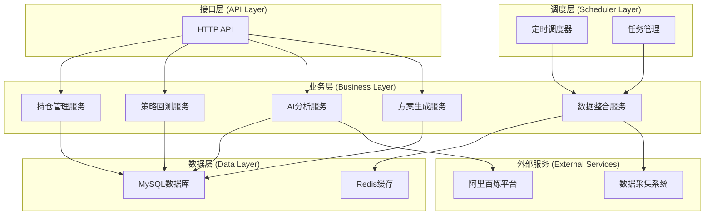
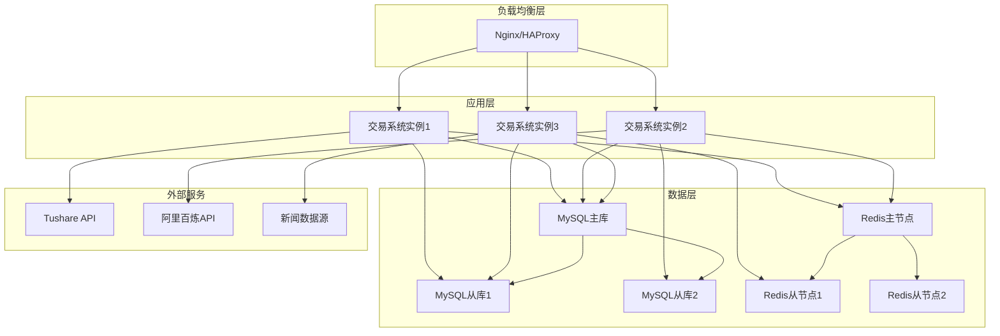

# 量化交易系统后端技术设计文档 (Design)

## 文档信息

| 项目    | 内容         |
| ----- | ---------- |
| 子系统名称 | 量化交易系统后端   |
| 文档版本  | v1.0       |
| 创建日期  | 2025-01-10 |
| 最后更新  | 2025-01-10 |
| 架构师   | [架构师姓名]   |
| 开发团队  | [开发团队]    |
| 文档状态  | 待评审        |
| 所属平台  | 量化交易平台     |

## 1. 系统架构设计

### 1.1 整体架构

量化交易系统采用分层架构设计，确保系统的可维护性和可扩展性。系统分为四个核心层次：

- **接口层 (API Layer)**: 处理HTTP请求和响应
- **调度层 (Scheduler Layer)**: 管理定时任务和任务调度
- **业务层 (Business Layer)**: 核心业务逻辑处理
- **数据层 (Data Layer)**: 数据存储和缓存




### 1.2 技术架构

**技术栈选择**

| 层级 | 技术选型 | 选择理由 |
| --- | --- | --- |
| 后端框架 | Python + FastAPI | 高性能异步框架，丰富的量化库生态 |
| 数据库 | MySQL 8.0 | 成熟稳定，支持事务，与现有系统兼容 |
| 缓存 | Redis 6.0 | 高性能缓存，支持多种数据结构 |
| ORM | SQLAlchemy | 成熟的Python ORM框架 |
| 任务调度 | APScheduler | 轻量级Python任务调度器 |
| 回测框架 | backtrader | 专业的量化回测框架 |
| 量化库 | pandas, numpy, talib | 成熟的数据分析和技术指标库 |
| HTTP客户端 | httpx | 现代异步HTTP客户端 |
| 配置管理 | pydantic-settings | 类型安全的配置管理 |
| 日志 | loguru | 简单易用的日志库 |
| 容器化 | Docker | 标准化部署 |

### 1.2 模块划分

**核心模块设计**

```
quantitative-system/
├── main.py                    # 应用入口
├── config/                    # 配置管理
│   ├── __init__.py
│   ├── settings.py           # 应用配置
│   └── database.py           # 数据库配置
├── api/                       # API接口层
│   ├── __init__.py
│   ├── routes/               # 路由定义
│   │   ├── __init__.py
│   │   ├── positions.py      # 持仓管理接口
│   │   ├── plans.py          # 方案管理接口
│   │   └── system.py         # 系统状态接口
│   ├── dependencies.py       # 依赖注入
│   └── middleware.py         # 中间件
├── scheduler/                 # 调度层
│   ├── __init__.py
│   ├── jobs.py               # 任务定义
│   ├── scheduler.py          # 调度器
│   └── manager.py            # 任务管理器
├── services/                  # 业务服务层
│   ├── __init__.py
│   ├── position_service.py   # 持仓管理服务
│   ├── backtest_service.py   # 回测服务
│   ├── ai_service.py         # AI分析服务
│   ├── plan_service.py       # 方案生成服务
│   └── data_service.py       # 数据整合服务
├── models/                    # 数据模型
│   ├── __init__.py
│   ├── database.py           # 数据库模型
│   ├── schemas.py            # Pydantic模型
│   └── enums.py              # 枚举定义
├── repositories/              # 数据访问层
│   ├── __init__.py
│   ├── position_repo.py      # 持仓数据访问
│   ├── backtest_repo.py      # 回测数据访问
│   ├── plan_repo.py          # 方案数据访问
│   └── cache_repo.py         # 缓存数据访问
├── strategies/                # 交易策略
│   ├── __init__.py
│   ├── base_strategy.py      # 策略基类
│   ├── ma_strategy.py        # 均线策略
│   ├── macd_strategy.py      # MACD策略
│   └── rsi_strategy.py       # RSI策略
├── utils/                     # 工具模块
│   ├── __init__.py
│   ├── logger.py             # 日志工具
│   ├── exceptions.py         # 异常定义
│   ├── validators.py         # 数据验证
│   └── helpers.py            # 辅助函数
└── tests/                     # 测试代码
    ├── __init__.py
    ├── test_services/
    ├── test_repositories/
    └── test_strategies/
```

## 2. 数据库设计

### 2.1 数据库架构

**数据库选型**
- **主数据库**: MySQL 8.0
- **缓存数据库**: Redis 6.0
- **连接池**: SQLAlchemy连接池

### 2.2 核心数据表设计

#### 2.2.1 持仓数据表 (positions)

```sql
CREATE TABLE positions (
    id BIGINT PRIMARY KEY AUTO_INCREMENT,
    symbol VARCHAR(20) NOT NULL COMMENT '股票代码',
    name VARCHAR(100) NOT NULL COMMENT '股票名称',
    quantity INT NOT NULL COMMENT '持仓数量',
    cost_price DECIMAL(10,3) NOT NULL COMMENT '成本价格',
    purchase_date DATE NOT NULL COMMENT '购买日期',
    current_price DECIMAL(10,3) COMMENT '当前价格',
    market_value DECIMAL(15,2) COMMENT '市值',
    profit_loss DECIMAL(15,2) COMMENT '盈亏金额',
    profit_loss_rate DECIMAL(8,4) COMMENT '盈亏比例',
    status TINYINT DEFAULT 1 COMMENT '状态: 1-持有, 0-已清仓',
    created_at TIMESTAMP DEFAULT CURRENT_TIMESTAMP,
    updated_at TIMESTAMP DEFAULT CURRENT_TIMESTAMP ON UPDATE CURRENT_TIMESTAMP,
    INDEX idx_symbol (symbol),
    INDEX idx_status (status),
    INDEX idx_purchase_date (purchase_date)
) ENGINE=InnoDB DEFAULT CHARSET=utf8mb4 COMMENT='持仓数据表';
```

#### 2.2.2 策略回测结果表 (backtest_results)

```sql
CREATE TABLE backtest_results (
    id BIGINT PRIMARY KEY AUTO_INCREMENT,
    strategy_name VARCHAR(100) NOT NULL COMMENT '策略名称',
    symbol VARCHAR(20) NOT NULL COMMENT '股票代码',
    start_date DATE NOT NULL COMMENT '回测开始日期',
    end_date DATE NOT NULL COMMENT '回测结束日期',
    total_return DECIMAL(8,4) COMMENT '总收益率',
    annual_return DECIMAL(8,4) COMMENT '年化收益率',
    max_drawdown DECIMAL(8,4) COMMENT '最大回撤',
    sharpe_ratio DECIMAL(8,4) COMMENT '夏普比率',
    win_rate DECIMAL(8,4) COMMENT '胜率',
    profit_loss_ratio DECIMAL(8,4) COMMENT '盈亏比',
    volatility DECIMAL(8,4) COMMENT '波动率',
    trade_count INT COMMENT '交易次数',
    result_data JSON COMMENT '详细回测数据',
    created_at TIMESTAMP DEFAULT CURRENT_TIMESTAMP,
    INDEX idx_strategy_symbol (strategy_name, symbol),
    INDEX idx_created_at (created_at)
) ENGINE=InnoDB DEFAULT CHARSET=utf8mb4 COMMENT='策略回测结果表';
```

#### 2.2.3 操作方案表 (trading_plans)

```sql
CREATE TABLE trading_plans (
    id BIGINT PRIMARY KEY AUTO_INCREMENT,
    plan_date DATE NOT NULL COMMENT '方案日期',
    content LONGTEXT NOT NULL COMMENT 'Markdown格式方案内容',
    confidence_score DECIMAL(5,2) COMMENT 'AI置信度评分',
    buy_recommendations JSON COMMENT '买入建议',
    sell_recommendations JSON COMMENT '卖出建议',
    hold_recommendations JSON COMMENT '持仓建议',
    market_analysis TEXT COMMENT '市场分析',
    risk_warnings TEXT COMMENT '风险提示',
    generated_at TIMESTAMP DEFAULT CURRENT_TIMESTAMP,
    status TINYINT DEFAULT 1 COMMENT '状态: 1-有效, 0-无效',
    UNIQUE KEY uk_plan_date (plan_date),
    INDEX idx_generated_at (generated_at)
) ENGINE=InnoDB DEFAULT CHARSET=utf8mb4 COMMENT='操作方案表';
```

#### 2.2.4 市场数据缓存表 (market_data_cache)

```sql
CREATE TABLE market_data_cache (
    id BIGINT PRIMARY KEY AUTO_INCREMENT,
    symbol VARCHAR(20) NOT NULL COMMENT '股票代码',
    data_date DATE NOT NULL COMMENT '数据日期',
    open_price DECIMAL(10,3) COMMENT '开盘价',
    high_price DECIMAL(10,3) COMMENT '最高价',
    low_price DECIMAL(10,3) COMMENT '最低价',
    close_price DECIMAL(10,3) COMMENT '收盘价',
    volume BIGINT COMMENT '成交量',
    turnover DECIMAL(15,2) COMMENT '成交额',
    change_rate DECIMAL(8,4) COMMENT '涨跌幅',
    technical_indicators JSON COMMENT '技术指标数据',
    created_at TIMESTAMP DEFAULT CURRENT_TIMESTAMP,
    updated_at TIMESTAMP DEFAULT CURRENT_TIMESTAMP ON UPDATE CURRENT_TIMESTAMP,
    UNIQUE KEY uk_symbol_date (symbol, data_date),
    INDEX idx_data_date (data_date)
) ENGINE=InnoDB DEFAULT CHARSET=utf8mb4 COMMENT='市场数据缓存表';
```

#### 2.2.5 系统日志表 (system_logs)

```sql
CREATE TABLE system_logs (
    id BIGINT PRIMARY KEY AUTO_INCREMENT,
    log_level VARCHAR(20) NOT NULL COMMENT '日志级别',
    module VARCHAR(100) NOT NULL COMMENT '模块名称',
    message TEXT NOT NULL COMMENT '日志消息',
    details JSON COMMENT '详细信息',
    created_at TIMESTAMP DEFAULT CURRENT_TIMESTAMP,
    INDEX idx_level_module (log_level, module),
    INDEX idx_created_at (created_at)
) ENGINE=InnoDB DEFAULT CHARSET=utf8mb4 COMMENT='系统日志表';
```

### 2.3 Redis缓存设计

**缓存策略**

| 缓存类型 | Key格式 | 过期时间 | 用途 |
| --- | --- | --- | --- |
| 市场数据 | `market:{symbol}:{date}` | 24小时 | 缓存日K线数据 |
| 技术指标 | `indicators:{symbol}:{date}` | 24小时 | 缓存技术指标 |
| 回测结果 | `backtest:{strategy}:{symbol}` | 7天 | 缓存回测结果 |
| 持仓信息 | `positions:current` | 1小时 | 缓存当前持仓 |
| 系统状态 | `system:status` | 5分钟 | 缓存系统状态 |

## 3. API接口设计

### 3.1 接口规范

**RESTful API设计原则**
- 使用标准HTTP方法 (GET, POST, PUT, DELETE)
- 统一的响应格式
- 合理的HTTP状态码
- 版本控制 (/api/v1/)

**统一响应格式**

```python
# 成功响应
{
    "code": 200,
    "message": "success",
    "data": {},
    "timestamp": "2025-01-10T10:00:00Z"
}

# 错误响应
{
    "code": 400,
    "message": "参数错误",
    "error": "详细错误信息",
    "timestamp": "2025-01-10T10:00:00Z"
}
```

### 3.2 核心接口定义

#### 3.2.1 持仓管理接口

```python
# 获取持仓列表
GET /api/v1/positions
Response: {
    "code": 200,
    "data": {
        "positions": [
            {
                "id": 1,
                "symbol": "000001",
                "name": "平安银行",
                "quantity": 1000,
                "cost_price": 12.00,
                "current_price": 12.50,
                "market_value": 12500.00,
                "profit_loss": 500.00,
                "profit_loss_rate": 0.0417,
                "purchase_date": "2024-01-10",
                "status": 1
            }
        ],
        "total_market_value": 12500.00,
        "total_profit_loss": 500.00
    }
}

# 添加持仓
POST /api/v1/positions
Request: {
    "symbol": "000001",
    "name": "平安银行",
    "quantity": 1000,
    "cost_price": 12.00,
    "purchase_date": "2024-01-10"
}

# 更新持仓
PUT /api/v1/positions/{position_id}
Request: {
    "quantity": 1200,
    "cost_price": 12.10
}

# 删除持仓
DELETE /api/v1/positions/{position_id}
```

#### 3.2.2 方案管理接口

```python
# 获取今日方案
GET /api/v1/plans/today
Response: {
    "code": 200,
    "data": {
        "plan_date": "2025-01-10",
        "content": "# 每日操作方案\n\n...",
        "confidence_score": 85.5,
        "buy_recommendations": [
            {
                "symbol": "000001",
                "name": "平安银行",
                "price_range": [12.40, 12.60],
                "quantity": 1000,
                "reason": "技术突破，基本面良好"
            }
        ],
        "sell_recommendations": [],
        "hold_recommendations": [],
        "generated_at": "2025-01-10T06:00:00Z"
    }
}

# 获取历史方案
GET /api/v1/plans/history?days=7

# 手动触发方案生成
POST /api/v1/plans/generate
```

#### 3.2.3 回测接口

```python
# 执行策略回测
POST /api/v1/backtest/run
Request: {
    "strategy_name": "ma_strategy",
    "symbols": ["000001", "000002"],
    "start_date": "2024-01-01",
    "end_date": "2024-12-31",
    "parameters": {
        "short_window": 5,
        "long_window": 20
    }
}

# 获取回测结果
GET /api/v1/backtest/results/{result_id}

# 获取策略列表
GET /api/v1/backtest/strategies
```

#### 3.2.4 系统状态接口

```python
# 系统健康检查
GET /api/v1/system/health
Response: {
    "code": 200,
    "data": {
        "status": "healthy",
        "database": "connected",
        "redis": "connected",
        "external_services": {
            "data_collection": "available",
            "ai_platform": "available"
        },
        "last_plan_generated": "2025-01-10T06:00:00Z",
        "next_scheduled_run": "2025-01-11T15:30:00Z"
    }
}

# 系统统计信息
GET /api/v1/system/stats
```

## 4. 核心服务设计

### 4.1 持仓管理服务 (PositionService)

**主要功能**
- 持仓信息的CRUD操作
- 持仓收益计算
- 持仓风险分析
- 持仓数据同步

**核心方法**

```python
class PositionService:
    async def get_positions(self) -> List[Position]:
        """获取所有持仓"""
        
    async def add_position(self, position_data: PositionCreate) -> Position:
        """添加新持仓"""
        
    async def update_position(self, position_id: int, update_data: PositionUpdate) -> Position:
        """更新持仓信息"""
        
    async def delete_position(self, position_id: int) -> bool:
        """删除持仓"""
        
    async def calculate_portfolio_metrics(self) -> PortfolioMetrics:
        """计算投资组合指标"""
        
    async def update_market_values(self) -> None:
        """更新持仓市值"""
```

### 4.2 回测服务 (BacktestService)

**主要功能**
- 基于backtrader框架的策略回测执行
- 回测结果计算和分析
- 性能指标统计
- 回测数据管理

**核心方法**

```python
import backtrader as bt
from typing import Dict, List, Optional

class BacktestService:
    def __init__(self):
        self.cerebro = None
        
    async def run_backtest(self, strategy_name: str, symbols: List[str], 
                          start_date: date, end_date: date, 
                          parameters: Dict) -> BacktestResult:
        """执行策略回测"""
        # 初始化backtrader引擎
        cerebro = bt.Cerebro()
        
        # 添加策略
        strategy_class = self._get_strategy_class(strategy_name)
        cerebro.addstrategy(strategy_class, **parameters)
        
        # 添加数据源
        for symbol in symbols:
            data = await self._get_market_data(symbol, start_date, end_date)
            cerebro.adddata(data)
        
        # 设置初始资金
        cerebro.broker.setcash(100000.0)
        
        # 设置手续费
        cerebro.broker.setcommission(commission=0.001)
        
        # 添加分析器
        cerebro.addanalyzer(bt.analyzers.SharpeRatio, _name='sharpe')
        cerebro.addanalyzer(bt.analyzers.DrawDown, _name='drawdown')
        cerebro.addanalyzer(bt.analyzers.Returns, _name='returns')
        cerebro.addanalyzer(bt.analyzers.TradeAnalyzer, _name='trades')
        
        # 运行回测
        results = cerebro.run()
        
        # 解析结果
        return await self._parse_backtest_results(results[0])
        
    async def get_backtest_result(self, result_id: int) -> BacktestResult:
        """获取回测结果"""
        
    async def _get_strategy_class(self, strategy_name: str):
        """获取策略类"""
        
    async def _get_market_data(self, symbol: str, start_date: date, end_date: date) -> bt.feeds.PandasData:
        """获取市场数据并转换为backtrader格式"""
        
    async def _parse_backtest_results(self, result) -> BacktestResult:
        """解析backtrader回测结果"""
        
    async def get_strategy_rankings(self) -> List[StrategyRanking]:
        """获取策略排名"""
```

### 4.3 AI分析服务 (AIService)

**主要功能**
- 数据整合和预处理
- AI模型调用
- 结果解析和处理
- 置信度评估

**核心方法**

```python
class AIService:
    async def analyze_market_data(self, backtest_results: List[BacktestResult], 
                                 positions: List[Position]) -> AIAnalysisResult:
        """AI市场分析"""
        
    async def generate_trading_recommendations(self, analysis_result: AIAnalysisResult) -> TradingRecommendations:
        """生成交易建议"""
        
    async def call_ai_platform(self, prompt: str) -> str:
        """调用阿里百炼平台"""
        
    async def parse_ai_response(self, response: str) -> ParsedRecommendations:
        """解析AI响应"""
```

### 4.4 方案生成服务 (PlanService)

**主要功能**
- Markdown方案生成
- 方案模板管理
- 方案历史管理
- 方案质量评估

**核心方法**

```python
class PlanService:
    async def generate_daily_plan(self, analysis_result: AIAnalysisResult) -> TradingPlan:
        """生成每日操作方案"""
        
    async def format_to_markdown(self, recommendations: TradingRecommendations) -> str:
        """格式化为Markdown"""
        
    async def save_plan(self, plan: TradingPlan) -> int:
        """保存方案"""
        
    async def get_plan_by_date(self, plan_date: date) -> TradingPlan:
        """根据日期获取方案"""
        
    async def get_plan_history(self, days: int) -> List[TradingPlan]:
        """获取历史方案"""
```

### 4.5 数据整合服务 (DataService)

**主要功能**
- 外部数据获取
- 数据清洗和预处理
- 数据缓存管理
- 数据质量监控

**核心方法**

```python
class DataService:
    async def fetch_market_data(self, symbols: List[str], start_date: date, end_date: date) -> DataFrame:
        """获取市场数据"""
        
    async def calculate_technical_indicators(self, data: DataFrame) -> DataFrame:
        """计算技术指标"""
        
    async def cache_market_data(self, symbol: str, data: DataFrame) -> None:
        """缓存市场数据"""
        
    async def get_cached_data(self, symbol: str, date: date) -> Optional[DataFrame]:
        """获取缓存数据"""
```

## 5. 交易策略设计

### 5.1 策略基类设计

基于backtrader框架的策略基类设计：

```python
import backtrader as bt
from abc import abstractmethod
from typing import Dict, List, Optional

class BaseStrategy(bt.Strategy):
    """基于backtrader的交易策略基类"""
    
    # 策略参数定义
    params = ()
    
    def __init__(self):
        super().__init__()
        # 初始化技术指标
        self.setup_indicators()
        
        # 记录交易信号
        self.signals = []
        
        # 策略状态
        self.position_size = 0
        
    @abstractmethod
    def setup_indicators(self):
        """设置技术指标"""
        pass
        
    @abstractmethod
    def next(self):
        """策略主逻辑，每个数据点都会调用"""
        pass
        
    def log(self, txt, dt=None):
        """日志记录"""
        dt = dt or self.datas[0].datetime.date(0)
        print(f'{dt.isoformat()}: {txt}')
        
    def notify_order(self, order):
        """订单状态通知"""
        if order.status in [order.Submitted, order.Accepted]:
            return
            
        if order.status in [order.Completed]:
            if order.isbuy():
                self.log(f'买入执行: 价格={order.executed.price:.2f}, 数量={order.executed.size}')
            elif order.issell():
                self.log(f'卖出执行: 价格={order.executed.price:.2f}, 数量={order.executed.size}')
                
        elif order.status in [order.Canceled, order.Margin, order.Rejected]:
            self.log('订单取消/拒绝')
            
    def notify_trade(self, trade):
        """交易完成通知"""
        if not trade.isclosed:
            return
            
        self.log(f'交易盈亏: 毛利={trade.pnl:.2f}, 净利={trade.pnlcomm:.2f}')
        
    @classmethod
    def get_parameter_ranges(cls) -> Dict[str, tuple]:
        """获取参数范围，子类需要实现"""
        return {}
        
    def validate_parameters(self) -> bool:
        """验证参数有效性"""
        ranges = self.get_parameter_ranges()
        for param_name, (min_val, max_val) in ranges.items():
            if hasattr(self.params, param_name):
                value = getattr(self.params, param_name)
                if not (min_val <= value <= max_val):
                    return False
        return True
```

### 5.2 具体策略实现

#### 5.2.1 双均线策略

```python
import backtrader as bt

class MovingAverageStrategy(BaseStrategy):
    """基于backtrader的双均线策略"""
    
    # 策略参数
    params = (
        ('short_window', 5),   # 短期均线周期
        ('long_window', 20),   # 长期均线周期
        ('printlog', True),    # 是否打印日志
    )
    
    def setup_indicators(self):
        """设置技术指标"""
        # 计算移动平均线
        self.short_ma = bt.indicators.SimpleMovingAverage(
            self.datas[0], period=self.params.short_window
        )
        self.long_ma = bt.indicators.SimpleMovingAverage(
            self.datas[0], period=self.params.long_window
        )
        
        # 计算均线交叉信号
        self.crossover = bt.indicators.CrossOver(
            self.short_ma, self.long_ma
        )
        
    def next(self):
        """策略主逻辑"""
        # 如果没有持仓
        if not self.position:
            # 金叉买入信号
            if self.crossover > 0:
                self.log(f'买入信号: 短均线={self.short_ma[0]:.2f}, 长均线={self.long_ma[0]:.2f}')
                # 计算买入数量（使用95%的可用资金）
                size = int(self.broker.getcash() * 0.95 / self.data.close[0])
                self.buy(size=size)
                
        # 如果有持仓
        else:
            # 死叉卖出信号
            if self.crossover < 0:
                self.log(f'卖出信号: 短均线={self.short_ma[0]:.2f}, 长均线={self.long_ma[0]:.2f}')
                self.sell(size=self.position.size)
                
    def log(self, txt, dt=None):
        """日志记录"""
        if self.params.printlog:
            super().log(txt, dt)
            
    @classmethod
    def get_parameter_ranges(cls) -> Dict[str, tuple]:
        """获取参数范围"""
        return {
            'short_window': (3, 10),
            'long_window': (15, 30)
        }
```

#### 5.2.2 MACD策略

```python
import backtrader as bt

class MACDStrategy(BaseStrategy):
    """基于backtrader的MACD策略"""
    
    # 策略参数
    params = (
        ('fast_period', 12),   # 快线周期
        ('slow_period', 26),   # 慢线周期
        ('signal_period', 9),  # 信号线周期
        ('printlog', True),    # 是否打印日志
    )
    
    def setup_indicators(self):
        """设置技术指标"""
        # 计算MACD指标
        self.macd = bt.indicators.MACD(
            self.datas[0],
            period_me1=self.params.fast_period,
            period_me2=self.params.slow_period,
            period_signal=self.params.signal_period
        )
        
        # MACD交叉信号
        self.crossover = bt.indicators.CrossOver(
            self.macd.macd, self.macd.signal
        )
        
    def next(self):
        """策略主逻辑"""
        # 如果没有持仓
        if not self.position:
            # MACD金叉买入信号
            if self.crossover > 0:
                self.log(f'买入信号: MACD={self.macd.macd[0]:.4f}, Signal={self.macd.signal[0]:.4f} (金叉)')
                # 计算买入数量（使用95%的可用资金）
                size = int(self.broker.getcash() * 0.95 / self.data.close[0])
                self.buy(size=size)
                
        # 如果有持仓
        else:
            # MACD死叉卖出信号
            if self.crossover < 0:
                self.log(f'卖出信号: MACD={self.macd.macd[0]:.4f}, Signal={self.macd.signal[0]:.4f} (死叉)')
                self.sell(size=self.position.size)
                
    def log(self, txt, dt=None):
        """日志记录"""
        if self.params.printlog:
            super().log(txt, dt)
            
    @classmethod
    def get_parameter_ranges(cls) -> Dict[str, tuple]:
        """获取参数范围"""
        return {
            'fast_period': (8, 16),
            'slow_period': (20, 32),
            'signal_period': (6, 12)
        }
```

#### 5.2.3 RSI策略

```python
import backtrader as bt

class RSIStrategy(BaseStrategy):
    """基于backtrader的RSI策略"""
    
    # 策略参数
    params = (
        ('rsi_period', 14),    # RSI计算周期
        ('oversold', 30),      # 超卖阈值
        ('overbought', 70),    # 超买阈值
        ('printlog', True),    # 是否打印日志
    )
    
    def setup_indicators(self):
        """设置技术指标"""
        # 计算RSI指标
        self.rsi = bt.indicators.RelativeStrengthIndex(
            self.datas[0], period=self.params.rsi_period
        )
        
    def next(self):
        """策略主逻辑"""
        # 如果没有持仓
        if not self.position:
            # RSI超卖买入信号
            if self.rsi < self.params.oversold:
                self.log(f'买入信号: RSI={self.rsi[0]:.2f} < {self.params.oversold} (超卖)')
                # 计算买入数量（使用95%的可用资金）
                size = int(self.broker.getcash() * 0.95 / self.data.close[0])
                self.buy(size=size)
                
        # 如果有持仓
        else:
            # RSI超买卖出信号
            if self.rsi > self.params.overbought:
                self.log(f'卖出信号: RSI={self.rsi[0]:.2f} > {self.params.overbought} (超买)')
                self.sell(size=self.position.size)
                
    def log(self, txt, dt=None):
        """日志记录"""
        if self.params.printlog:
            super().log(txt, dt)
            
    @classmethod
    def get_parameter_ranges(cls) -> Dict[str, tuple]:
        """获取参数范围"""
        return {
            'rsi_period': (10, 20),
            'oversold': (20, 35),
            'overbought': (65, 80)
        }
```

### 5.3 策略管理器

```python
import backtrader as bt
from typing import Dict, List, Type, Any

class StrategyManager:
    """策略管理器 - 管理所有交易策略"""
    
    def __init__(self):
        self.strategies: Dict[str, Type[BaseStrategy]] = {}
        self.register_default_strategies()
        
    def register_default_strategies(self):
        """注册默认策略"""
        self.register_strategy('ma_strategy', MovingAverageStrategy)
        self.register_strategy('macd_strategy', MACDStrategy)
        self.register_strategy('rsi_strategy', RSIStrategy)
        
    def register_strategy(self, name: str, strategy_class: Type[BaseStrategy]):
        """注册策略"""
        self.strategies[name] = strategy_class
        
    def get_strategy(self, name: str) -> Type[BaseStrategy]:
        """获取策略类"""
        if name not in self.strategies:
            raise ValueError(f"策略 {name} 未注册")
        return self.strategies[name]
        
    def list_strategies(self) -> List[str]:
        """列出所有已注册的策略"""
        return list(self.strategies.keys())
        
    def get_strategy_parameters(self, name: str) -> Dict[str, tuple]:
        """获取策略参数范围"""
        strategy_class = self.get_strategy(name)
        return strategy_class.get_parameter_ranges()
        
    def create_strategy_instance(self, name: str, **params) -> BaseStrategy:
        """创建策略实例"""
        strategy_class = self.get_strategy(name)
        
        # 创建动态策略类，设置参数
        class DynamicStrategy(strategy_class):
            params = tuple((k, v) for k, v in params.items())
            
        return DynamicStrategy
```

## 6. 定时任务设计

### 6.1 任务调度器

```python
import schedule
import time
from datetime import datetime
from typing import Dict, List, Callable
from concurrent.futures import ThreadPoolExecutor

class TaskScheduler:
    """任务调度器"""
    
    def __init__(self, max_workers: int = 5):
        self.executor = ThreadPoolExecutor(max_workers=max_workers)
        self.jobs: Dict[str, schedule.Job] = {}
        self.running = False
        
    def add_daily_job(self, job_id: str, func: Callable, time_str: str, *args, **kwargs):
        """添加每日定时任务"""
        job = schedule.every().day.at(time_str).do(
            self._run_job_async, func, *args, **kwargs
        )
        self.jobs[job_id] = job
        
    def add_interval_job(self, job_id: str, func: Callable, minutes: int, *args, **kwargs):
        """添加间隔任务"""
        job = schedule.every(minutes).minutes.do(
            self._run_job_async, func, *args, **kwargs
        )
        self.jobs[job_id] = job
        
    def _run_job_async(self, func: Callable, *args, **kwargs):
        """异步执行任务"""
        future = self.executor.submit(func, *args, **kwargs)
        return future
        
    def start(self):
        """启动调度器"""
        self.running = True
        while self.running:
            schedule.run_pending()
            time.sleep(1)
            
    def stop(self):
        """停止调度器"""
        self.running = False
        self.executor.shutdown(wait=True)
        
    def remove_job(self, job_id: str):
        """移除任务"""
        if job_id in self.jobs:
            schedule.cancel_job(self.jobs[job_id])
            del self.jobs[job_id]
```

### 6.2 数据采集任务

```python
class DataCollectionJobs:
    """数据采集定时任务"""
    
    def __init__(self, data_service, scheduler: TaskScheduler):
        self.data_service = data_service
        self.scheduler = scheduler
        self.setup_jobs()
        
    def setup_jobs(self):
        """设置定时任务"""
        # 每日股票数据采集 (交易日 09:30)
        self.scheduler.add_daily_job(
            'daily_stock_data', 
            self.collect_daily_stock_data, 
            '09:30'
        )
        
        # 实时数据采集 (每5分钟)
        self.scheduler.add_interval_job(
            'realtime_data', 
            self.collect_realtime_data, 
            5
        )
        
        # 新闻数据采集 (每30分钟)
        self.scheduler.add_interval_job(
            'news_data', 
            self.collect_news_data, 
            30
        )
        
    async def collect_daily_stock_data(self):
        """采集每日股票数据"""
        try:
            # 获取所有股票代码
            stock_codes = await self.data_service.get_all_stock_codes()
            
            # 批量采集数据
            for code in stock_codes:
                await self.data_service.collect_stock_data(code)
                
        except Exception as e:
            logger.error(f"每日股票数据采集失败: {e}")
            
    async def collect_realtime_data(self):
        """采集实时数据"""
        try:
            # 采集实时行情数据
            await self.data_service.collect_realtime_quotes()
            
        except Exception as e:
            logger.error(f"实时数据采集失败: {e}")
            
    async def collect_news_data(self):
        """采集新闻数据"""
        try:
            # 采集财经新闻
            await self.data_service.collect_financial_news()
            
        except Exception as e:
            logger.error(f"新闻数据采集失败: {e}")
```

## 7. 配置管理

### 7.1 配置结构

```yaml
# config.yaml
server:
  host: "0.0.0.0"
  port: 8080
  debug: false

database:
  mysql:
    host: "localhost"
    port: 3306
    username: "trading"
    password: "password"
    database: "trading_system"
    charset: "utf8mb4"
    max_connections: 100
    
  redis:
    host: "localhost"
    port: 6379
    password: ""
    database: 0
    max_connections: 50

external_apis:
  tushare:
    token: "your_tushare_token"
    base_url: "http://api.tushare.pro"
    timeout: 30
    
  dashscope:
    api_key: "your_dashscope_key"
    base_url: "https://dashscope.aliyuncs.com/api/v1"
    model: "qwen-turbo"

backtest:
  initial_cash: 100000
  commission: 0.001
  slippage: 0.001
  
logging:
  level: "INFO"
  file: "logs/trading.log"
  max_size: "100MB"
  backup_count: 10
```

### 7.2 配置管理器

```python
import yaml
from typing import Any, Dict
from dataclasses import dataclass

@dataclass
class DatabaseConfig:
    host: str
    port: int
    username: str
    password: str
    database: str
    charset: str = "utf8mb4"
    max_connections: int = 100

@dataclass
class RedisConfig:
    host: str
    port: int
    password: str = ""
    database: int = 0
    max_connections: int = 50

@dataclass
class ExternalAPIConfig:
    token: str
    base_url: str
    timeout: int = 30

@dataclass
class BacktestConfig:
    initial_cash: float = 100000
    commission: float = 0.001
    slippage: float = 0.001

class ConfigManager:
    """配置管理器"""
    
    def __init__(self, config_file: str = "config.yaml"):
        self.config_file = config_file
        self.config = self.load_config()
        
    def load_config(self) -> Dict[str, Any]:
        """加载配置文件"""
        try:
            with open(self.config_file, 'r', encoding='utf-8') as f:
                return yaml.safe_load(f)
        except FileNotFoundError:
            raise FileNotFoundError(f"配置文件 {self.config_file} 不存在")
        except yaml.YAMLError as e:
            raise ValueError(f"配置文件格式错误: {e}")
            
    def get_database_config(self) -> DatabaseConfig:
        """获取数据库配置"""
        db_config = self.config.get('database', {}).get('mysql', {})
        return DatabaseConfig(**db_config)
        
    def get_redis_config(self) -> RedisConfig:
        """获取Redis配置"""
        redis_config = self.config.get('database', {}).get('redis', {})
        return RedisConfig(**redis_config)
        
    def get_tushare_config(self) -> ExternalAPIConfig:
        """获取Tushare配置"""
        tushare_config = self.config.get('external_apis', {}).get('tushare', {})
        return ExternalAPIConfig(**tushare_config)
        
    def get_backtest_config(self) -> BacktestConfig:
        """获取回测配置"""
        backtest_config = self.config.get('backtest', {})
        return BacktestConfig(**backtest_config)
        
    def get(self, key: str, default: Any = None) -> Any:
        """获取配置项"""
        keys = key.split('.')
        value = self.config
        
        for k in keys:
            if isinstance(value, dict) and k in value:
                value = value[k]
            else:
                return default
                
        return value
```

## 8. 错误处理与日志

### 8.1 错误定义

```python
class TradingSystemError(Exception):
    """交易系统基础异常"""
    pass

class DataCollectionError(TradingSystemError):
    """数据采集异常"""
    pass

class BacktestError(TradingSystemError):
    """回测异常"""
    pass

class StrategyError(TradingSystemError):
    """策略异常"""
    pass

class APIError(TradingSystemError):
    """API异常"""
    def __init__(self, message: str, status_code: int = None):
        super().__init__(message)
        self.status_code = status_code
```

### 8.2 日志配置

```python
import logging
import logging.handlers
from pathlib import Path

class LoggerManager:
    """日志管理器"""
    
    @staticmethod
    def setup_logger(name: str, log_file: str, level: str = "INFO") -> logging.Logger:
        """设置日志器"""
        logger = logging.getLogger(name)
        logger.setLevel(getattr(logging, level.upper()))
        
        # 创建日志目录
        log_path = Path(log_file)
        log_path.parent.mkdir(parents=True, exist_ok=True)
        
        # 文件处理器
        file_handler = logging.handlers.RotatingFileHandler(
            log_file, maxBytes=100*1024*1024, backupCount=10
        )
        file_handler.setLevel(logging.DEBUG)
        
        # 控制台处理器
        console_handler = logging.StreamHandler()
        console_handler.setLevel(logging.INFO)
        
        # 格式化器
        formatter = logging.Formatter(
            '%(asctime)s - %(name)s - %(levelname)s - %(message)s'
        )
        file_handler.setFormatter(formatter)
        console_handler.setFormatter(formatter)
        
        logger.addHandler(file_handler)
        logger.addHandler(console_handler)
        
        return logger
```

## 9. 部署方案

### 9.1 Docker配置

```dockerfile
# Dockerfile
FROM golang:1.21-alpine AS builder

WORKDIR /app
COPY go.mod go.sum ./
RUN go mod download

COPY . .
RUN CGO_ENABLED=0 GOOS=linux go build -o trading-system ./cmd/main.go

FROM alpine:latest
RUN apk --no-cache add ca-certificates tzdata
WORKDIR /root/

COPY --from=builder /app/trading-system .
COPY --from=builder /app/config.yaml .

EXPOSE 8080
CMD ["./trading-system"]
```

### 9.2 Docker Compose

```yaml
# docker-compose.yml
version: '3.8'

services:
  trading-system:
    build: .
    ports:
      - "8080:8080"
    environment:
      - ENV=production
    depends_on:
      - mysql
      - redis
    volumes:
      - ./logs:/root/logs
      - ./config.yaml:/root/config.yaml

  mysql:
    image: mysql:8.0
    environment:
      MYSQL_ROOT_PASSWORD: rootpassword
      MYSQL_DATABASE: trading_system
      MYSQL_USER: trading
      MYSQL_PASSWORD: password
    ports:
      - "3306:3306"
    volumes:
      - mysql_data:/var/lib/mysql
      - ./scripts/init.sql:/docker-entrypoint-initdb.d/init.sql

  redis:
    image: redis:7-alpine
    ports:
      - "6379:6379"
    volumes:
      - redis_data:/data

volumes:
  mysql_data:
  redis_data:
```

## 10. 性能优化

### 10.1 数据库优化

```sql
-- 索引优化
CREATE INDEX idx_stock_data_code_date ON stock_data(stock_code, trade_date);
CREATE INDEX idx_backtest_results_strategy ON backtest_results(strategy_name, created_at);
CREATE INDEX idx_news_publish_time ON news(publish_time);

-- 分区表（按月分区）
ALTER TABLE stock_data PARTITION BY RANGE (YEAR(trade_date)*100 + MONTH(trade_date)) (
    PARTITION p202401 VALUES LESS THAN (202402),
    PARTITION p202402 VALUES LESS THAN (202403),
    -- 更多分区...
);
```

### 10.2 缓存策略

```python
class CacheManager:
    """缓存管理器"""
    
    def __init__(self, redis_client):
        self.redis = redis_client
        
    async def get_stock_data(self, code: str, date: str) -> dict:
        """获取股票数据（带缓存）"""
        cache_key = f"stock:{code}:{date}"
        
        # 尝试从缓存获取
        cached_data = await self.redis.get(cache_key)
        if cached_data:
            return json.loads(cached_data)
            
        # 从数据库获取
        data = await self.db.get_stock_data(code, date)
        
        # 缓存数据（1小时过期）
        await self.redis.setex(
            cache_key, 3600, json.dumps(data)
        )
        
        return data
```

## 11. 监控运维

### 11.1 健康检查

```python
from fastapi import APIRouter

health_router = APIRouter()

@health_router.get("/health")
async def health_check():
    """健康检查接口"""
    checks = {
        "database": await check_database_connection(),
        "redis": await check_redis_connection(),
        "external_api": await check_external_apis()
    }
    
    all_healthy = all(checks.values())
    
    return {
        "status": "healthy" if all_healthy else "unhealthy",
        "checks": checks,
        "timestamp": datetime.now().isoformat()
    }
```

### 11.2 指标监控

```python
from prometheus_client import Counter, Histogram, Gauge

# 定义指标
api_requests_total = Counter('api_requests_total', 'Total API requests', ['method', 'endpoint'])
api_request_duration = Histogram('api_request_duration_seconds', 'API request duration')
backtest_jobs_active = Gauge('backtest_jobs_active', 'Active backtest jobs')

class MetricsMiddleware:
    """指标收集中间件"""
    
    async def __call__(self, request, call_next):
        start_time = time.time()
        
        response = await call_next(request)
        
        # 记录指标
        api_requests_total.labels(
            method=request.method,
            endpoint=request.url.path
        ).inc()
        
        api_request_duration.observe(time.time() - start_time)
        
        return response
```

## 12. 安全考虑

### 12.1 API安全

```python
from fastapi import Depends, HTTPException, status
from fastapi.security import HTTPBearer, HTTPAuthorizationCredentials
import jwt

security = HTTPBearer()

async def verify_token(credentials: HTTPAuthorizationCredentials = Depends(security)):
    """验证JWT令牌"""
    try:
        payload = jwt.decode(
            credentials.credentials,
            SECRET_KEY,
            algorithms=["HS256"]
        )
        return payload
    except jwt.PyJWTError:
        raise HTTPException(
            status_code=status.HTTP_401_UNAUTHORIZED,
            detail="Invalid token"
        )

@app.middleware("http")
async def rate_limit_middleware(request: Request, call_next):
    """限流中间件"""
    client_ip = request.client.host
    
    # 检查限流
    if await is_rate_limited(client_ip):
        raise HTTPException(
            status_code=status.HTTP_429_TOO_MANY_REQUESTS,
            detail="Rate limit exceeded"
        )
    
    return await call_next(request)
```

### 12.2 数据安全

```python
from cryptography.fernet import Fernet

class DataEncryption:
    """数据加密"""
    
    def __init__(self, key: bytes):
        self.cipher = Fernet(key)
        
    def encrypt(self, data: str) -> str:
        """加密数据"""
        return self.cipher.encrypt(data.encode()).decode()
        
    def decrypt(self, encrypted_data: str) -> str:
        """解密数据"""
        return self.cipher.decrypt(encrypted_data.encode()).decode()
```

## 13. 测试策略

### 13.1 单元测试

```python
import pytest
from unittest.mock import Mock, patch

class TestBacktestService:
    """回测服务测试"""
    
    @pytest.fixture
    def backtest_service(self):
        return BacktestService()
        
    @pytest.mark.asyncio
    async def test_run_backtest_success(self, backtest_service):
        """测试回测成功场景"""
        # 准备测试数据
        strategy_config = {
            "name": "ma_strategy",
            "parameters": {"short_window": 5, "long_window": 20}
        }
        
        # 模拟数据
        mock_data = pd.DataFrame({
            'date': pd.date_range('2023-01-01', periods=100),
            'open': [100] * 100,
            'high': [105] * 100,
            'low': [95] * 100,
            'close': [102] * 100,
            'volume': [1000] * 100
        })
        
        with patch.object(backtest_service, 'get_stock_data', return_value=mock_data):
            result = await backtest_service.run_backtest(
                stock_code="000001",
                start_date="2023-01-01",
                end_date="2023-12-31",
                strategy_config=strategy_config
            )
            
        assert result is not None
        assert 'total_return' in result
        assert 'sharpe_ratio' in result
```

### 13.2 集成测试

```python
import pytest
from httpx import AsyncClient

@pytest.mark.asyncio
async def test_backtest_api_integration():
    """测试回测API集成"""
    async with AsyncClient(app=app, base_url="http://test") as client:
        response = await client.post("/api/v1/backtest", json={
            "stock_code": "000001",
            "start_date": "2023-01-01",
            "end_date": "2023-12-31",
            "strategy": {
                "name": "ma_strategy",
                "parameters": {"short_window": 5, "long_window": 20}
            }
        })
        
    assert response.status_code == 200
    data = response.json()
    assert "task_id" in data
```

---

## 总结

本技术设计文档详细描述了量化交易系统后端的完整技术方案，包括：

1. **系统架构**：采用四层架构设计，职责清晰，易于维护
2. **数据库设计**：完整的数据模型，支持股票数据、回测结果、AI分析等
3. **API设计**：RESTful API，支持数据查询、策略回测、AI分析等核心功能
4. **核心服务**：数据采集、策略回测、AI分析等业务服务
5. **交易策略**：基于backtrader框架的策略实现
6. **技术组件**：定时任务、配置管理、错误处理、日志系统等
7. **部署运维**：Docker化部署、性能优化、监控告警
8. **安全测试**：API安全、数据加密、单元测试、集成测试

该设计方案为MVP版本，专注于核心功能实现，后续可根据业务需求进行扩展和优化。

## 14. 技术栈选型

### 14.1 后端技术栈

- **编程语言**: Go 1.21+
- **Web框架**: Gin/Echo
- **数据库**: MySQL 8.0 + Redis 7.0
- **ORM**: GORM
- **消息队列**: Redis Streams
- **定时任务**: Cron
- **日志**: Logrus/Zap
- **配置管理**: Viper
- **API文档**: Swagger
- **容器化**: Docker + Docker Compose

### 14.2 外部依赖

- **数据源**: Tushare Pro API
- **AI服务**: 阿里百炼平台 API
- **回测框架**: backtrader (Python)
- **新闻爬虫**: 自研爬虫 + 第三方新闻API

## 15. 开发规范

### 15.1 代码规范

```go
// 包命名：小写，简洁，有意义
package service

// 接口命名：以er结尾
type DataCollector interface {
    CollectStockData(ctx context.Context, code string) error
}

// 结构体命名：大驼峰
type BacktestService struct {
    repository BacktestRepository
    logger     *logrus.Logger
}

// 方法命名：大驼峰（公开）、小驼峰（私有）
func (s *BacktestService) RunBacktest(ctx context.Context, req *BacktestRequest) (*BacktestResult, error) {
    // 实现逻辑
}

// 常量命名：全大写，下划线分隔
const (
    DEFAULT_TIMEOUT = 30 * time.Second
    MAX_RETRY_COUNT = 3
)
```

### 15.2 错误处理规范

```go
// 自定义错误类型
type BusinessError struct {
    Code    int    `json:"code"`
    Message string `json:"message"`
    Details string `json:"details,omitempty"`
}

func (e *BusinessError) Error() string {
    return e.Message
}

// 错误包装
func (s *DataService) GetStockData(code string) (*StockData, error) {
    data, err := s.repository.FindByCode(code)
    if err != nil {
        return nil, fmt.Errorf("获取股票数据失败 [%s]: %w", code, err)
    }
    return data, nil
}
```

### 15.3 日志规范

```go
// 结构化日志
logger.WithFields(logrus.Fields{
    "stock_code": "000001",
    "task_id":    taskID,
    "duration":   time.Since(start),
}).Info("回测任务完成")

// 错误日志
logger.WithError(err).WithFields(logrus.Fields{
    "stock_code": code,
    "operation":  "data_collection",
}).Error("数据采集失败")
```

## 16. 部署架构

### 16.1 生产环境架构



### 16.2 容器编排

```yaml
# kubernetes deployment
apiVersion: apps/v1
kind: Deployment
metadata:
  name: trading-system
spec:
  replicas: 3
  selector:
    matchLabels:
      app: trading-system
  template:
    metadata:
      labels:
        app: trading-system
    spec:
      containers:
      - name: trading-system
        image: trading-system:latest
        ports:
        - containerPort: 8080
        env:
        - name: DB_HOST
          value: "mysql-service"
        - name: REDIS_HOST
          value: "redis-service"
        resources:
          requests:
            memory: "256Mi"
            cpu: "250m"
          limits:
            memory: "512Mi"
            cpu: "500m"
        livenessProbe:
          httpGet:
            path: /health
            port: 8080
          initialDelaySeconds: 30
          periodSeconds: 10
        readinessProbe:
          httpGet:
            path: /ready
            port: 8080
          initialDelaySeconds: 5
          periodSeconds: 5
```

## 17. 运维监控

### 17.1 监控指标

```go
// Prometheus指标定义
var (
    // HTTP请求指标
    httpRequestsTotal = prometheus.NewCounterVec(
        prometheus.CounterOpts{
            Name: "http_requests_total",
            Help: "Total number of HTTP requests",
        },
        []string{"method", "endpoint", "status"},
    )
    
    // 回测任务指标
    backtestJobsTotal = prometheus.NewCounterVec(
        prometheus.CounterOpts{
            Name: "backtest_jobs_total",
            Help: "Total number of backtest jobs",
        },
        []string{"strategy", "status"},
    )
    
    // 数据采集指标
    dataCollectionDuration = prometheus.NewHistogramVec(
        prometheus.HistogramOpts{
            Name: "data_collection_duration_seconds",
            Help: "Duration of data collection operations",
        },
        []string{"source", "type"},
    )
)
```

### 17.2 告警规则

```yaml
# Prometheus告警规则
groups:
- name: trading-system
  rules:
  - alert: HighErrorRate
    expr: rate(http_requests_total{status=~"5.."}[5m]) > 0.1
    for: 2m
    labels:
      severity: warning
    annotations:
      summary: "High error rate detected"
      description: "Error rate is {{ $value }} errors per second"
      
  - alert: DatabaseConnectionFailed
    expr: mysql_up == 0
    for: 1m
    labels:
      severity: critical
    annotations:
      summary: "Database connection failed"
      description: "MySQL database is not accessible"
      
  - alert: BacktestJobsFailed
    expr: increase(backtest_jobs_total{status="failed"}[10m]) > 5
    for: 5m
    labels:
      severity: warning
    annotations:
      summary: "Multiple backtest jobs failed"
      description: "{{ $value }} backtest jobs failed in the last 10 minutes"
```

## 18. 性能基准

### 18.1 性能目标

| 指标 | 目标值 | 说明 |
|------|--------|------|
| API响应时间 | < 200ms | 95%的请求 |
| 数据库查询 | < 100ms | 单表查询 |
| 回测任务 | < 30s | 1年数据，简单策略 |
| 数据采集 | < 5min | 全市场日线数据 |
| 并发用户 | 1000+ | 同时在线用户 |
| 系统可用性 | 99.9% | 年度可用性 |

### 18.2 压力测试

```bash
# API压力测试
wrk -t12 -c400 -d30s --script=test.lua http://localhost:8080/api/v1/stocks

# 数据库压力测试
sysbench oltp_read_write \
  --mysql-host=localhost \
  --mysql-user=test \
  --mysql-password=test \
  --mysql-db=trading \
  --tables=10 \
  --table-size=100000 \
  --threads=16 \
  --time=300 \
  run
```

## 19. 数据备份与恢复

### 19.1 备份策略

```bash
#!/bin/bash
# 数据库备份脚本

DATE=$(date +%Y%m%d_%H%M%S)
BACKUP_DIR="/backup/mysql"
DB_NAME="trading_system"

# 全量备份（每日）
mysqldump -h localhost -u backup_user -p${BACKUP_PASSWORD} \
  --single-transaction \
  --routines \
  --triggers \
  ${DB_NAME} > ${BACKUP_DIR}/full_backup_${DATE}.sql

# 压缩备份文件
gzip ${BACKUP_DIR}/full_backup_${DATE}.sql

# 删除7天前的备份
find ${BACKUP_DIR} -name "full_backup_*.sql.gz" -mtime +7 -delete

# 上传到云存储
aws s3 cp ${BACKUP_DIR}/full_backup_${DATE}.sql.gz \
  s3://trading-backup/mysql/
```

### 19.2 恢复流程

```bash
# 数据恢复脚本
#!/bin/bash

BACKUP_FILE=$1
DB_NAME="trading_system"

if [ -z "$BACKUP_FILE" ]; then
    echo "Usage: $0 <backup_file>"
    exit 1
fi

# 停止应用服务
sudo systemctl stop trading-system

# 创建恢复数据库
mysql -h localhost -u root -p${ROOT_PASSWORD} \
  -e "DROP DATABASE IF EXISTS ${DB_NAME}_recovery;"
mysql -h localhost -u root -p${ROOT_PASSWORD} \
  -e "CREATE DATABASE ${DB_NAME}_recovery;"

# 恢复数据
zcat $BACKUP_FILE | mysql -h localhost -u root -p${ROOT_PASSWORD} ${DB_NAME}_recovery

# 验证数据完整性
mysql -h localhost -u root -p${ROOT_PASSWORD} ${DB_NAME}_recovery \
  -e "SELECT COUNT(*) FROM stocks;"

# 切换数据库
mysql -h localhost -u root -p${ROOT_PASSWORD} \
  -e "RENAME TABLE ${DB_NAME}.stocks TO ${DB_NAME}_old.stocks;"
mysql -h localhost -u root -p${ROOT_PASSWORD} \
  -e "RENAME TABLE ${DB_NAME}_recovery.stocks TO ${DB_NAME}.stocks;"

# 启动应用服务
sudo systemctl start trading-system

echo "数据恢复完成"
```

## 20. 总结

本技术设计文档全面描述了量化交易系统后端的技术架构和实现方案，涵盖了以下核心内容：

### 20.1 架构设计
- 采用四层分层架构（接口层、调度层、业务层、数据层）
- 基于backtrader框架的策略回测系统
- 微服务化的模块设计，支持水平扩展

### 20.2 核心功能
- 多数据源的股票和新闻数据采集
- 基于AI的智能分析和投资建议
- 灵活的策略回测和参数优化
- 完整的定时任务调度系统

### 20.3 技术特色
- 高性能的Go语言实现
- 完善的错误处理和日志系统
- 容器化部署和微服务架构
- 全面的监控告警和运维支持

### 20.4 质量保证
- 完整的单元测试和集成测试
- 性能基准和压力测试
- 数据备份和灾难恢复
- 安全防护和访问控制

该设计方案为MVP版本，专注于核心功能实现，具备良好的扩展性和可维护性，可根据业务发展需求进行功能增强和性能优化。
        self.scheduler.add_job(
            self.daily_data_update,
            CronTrigger(hour=15, minute=30),
            id='daily_data_update',
            name='每日数据更新'
        )
        
        # 每日16:00执行策略回测
        self.scheduler.add_job(
            self.daily_backtest,
            CronTrigger(hour=16, minute=0),
            id='daily_backtest',
            name='每日策略回测'
        )
        
        # 每日18:00执行AI分析
        self.scheduler.add_job(
            self.daily_ai_analysis,
            CronTrigger(hour=18, minute=0),
            id='daily_ai_analysis',
            name='每日AI分析'
        )
        
    async def daily_data_update(self):
        """每日数据更新任务"""
        try:
            # 实现数据更新逻辑
            pass
        except Exception as e:
            # 错误处理和日志记录
            pass
            
    async def daily_backtest(self):
        """每日回测任务"""
        try:
            # 实现回测逻辑
            pass
        except Exception as e:
            # 错误处理和日志记录
            pass
            
    async def daily_ai_analysis(self):
        """每日AI分析任务"""
        try:
            # 实现AI分析逻辑
            pass
        except Exception as e:
            # 错误处理和日志记录
            pass
            
    def start(self):
        """启动调度器"""
        self.scheduler.start()
        
    def shutdown(self):
        """关闭调度器"""
        self.scheduler.shutdown()
```

## 7. 配置管理

### 7.1 配置文件设计

```python
from pydantic_settings import BaseSettings
from typing import List, Optional

class DatabaseSettings(BaseSettings):
    """数据库配置"""
    host: str = "localhost"
    port: int = 3306
    username: str = "root"
    password: str = ""
    database: str = "quantitative_system"
    
class RedisSettings(BaseSettings):
    """Redis配置"""
    host: str = "localhost"
    port: int = 6379
    password: Optional[str] = None
    db: int = 0
    
class AISettings(BaseSettings):
    """AI平台配置"""
    api_key: str
    api_url: str = "https://dashscope.aliyuncs.com/api/v1/services/aigc/text-generation/generation"
    model: str = "qwen-plus"
    timeout: int = 30
    
class DataCollectionSettings(BaseSettings):
    """数据采集系统配置"""
    base_url: str = "http://localhost:8080"
    timeout: int = 60
    
class AppSettings(BaseSettings):
    """应用配置"""
    app_name: str = "量化交易系统"
    version: str = "1.0.0"
    debug: bool = False
    log_level: str = "INFO"
    
    # 数据库配置
    database: DatabaseSettings = DatabaseSettings()
    
    # Redis配置
    redis: RedisSettings = RedisSettings()
    
    # AI配置
    ai: AISettings
    
    # 数据采集配置
    data_collection: DataCollectionSettings = DataCollectionSettings()
    
    # 策略配置
    default_strategies: List[str] = ["ma_strategy", "macd_strategy", "rsi_strategy"]
    
    # 回测配置
    backtest_period_days: int = 365
    
    class Config:
        env_file = ".env"
        env_nested_delimiter = "__"
```

## 8. 错误处理和日志

### 8.1 异常定义

```python
class QuantitativeSystemException(Exception):
    """系统基础异常"""
    pass

class DataFetchException(QuantitativeSystemException):
    """数据获取异常"""
    pass

class BacktestException(QuantitativeSystemException):
    """回测异常"""
    pass

class AIServiceException(QuantitativeSystemException):
    """AI服务异常"""
    pass

class ValidationException(QuantitativeSystemException):
    """数据验证异常"""
    pass
```

### 8.2 日志配置

```python
from loguru import logger
import sys

def setup_logging(log_level: str = "INFO"):
    """配置日志"""
    # 移除默认处理器
    logger.remove()
    
    # 控制台输出
    logger.add(
        sys.stdout,
        level=log_level,
        format="<green>{time:YYYY-MM-DD HH:mm:ss}</green> | <level>{level: <8}</level> | <cyan>{name}</cyan>:<cyan>{function}</cyan>:<cyan>{line}</cyan> - <level>{message}</level>"
    )
    
    # 文件输出
    logger.add(
        "logs/app_{time:YYYY-MM-DD}.log",
        level=log_level,
        format="{time:YYYY-MM-DD HH:mm:ss} | {level: <8} | {name}:{function}:{line} - {message}",
        rotation="1 day",
        retention="30 days",
        compression="zip"
    )
    
    # 错误日志单独记录
    logger.add(
        "logs/error_{time:YYYY-MM-DD}.log",
        level="ERROR",
        format="{time:YYYY-MM-DD HH:mm:ss} | {level: <8} | {name}:{function}:{line} - {message}",
        rotation="1 day",
        retention="30 days"
    )
```

## 9. 部署方案

### 9.1 Docker配置

**Dockerfile**

```dockerfile
FROM python:3.11-slim

WORKDIR /app

# 安装系统依赖
RUN apt-get update && apt-get install -y \
    gcc \
    g++ \
    && rm -rf /var/lib/apt/lists/*

# 复制依赖文件
COPY requirements.txt .

# 安装Python依赖
RUN pip install --no-cache-dir -r requirements.txt

# 复制应用代码
COPY . .

# 创建日志目录
RUN mkdir -p logs

# 暴露端口
EXPOSE 8000

# 启动命令
CMD ["python", "main.py"]
```

**docker-compose.yml**

```yaml
version: '3.8'

services:
  quantitative-system:
    build: .
    ports:
      - "8000:8000"
    environment:
      - DATABASE__HOST=mysql
      - REDIS__HOST=redis
    depends_on:
      - mysql
      - redis
    volumes:
      - ./logs:/app/logs
      - ./config:/app/config
    restart: unless-stopped

  mysql:
    image: mysql:8.0
    environment:
      MYSQL_ROOT_PASSWORD: password
      MYSQL_DATABASE: quantitative_system
    ports:
      - "3306:3306"
    volumes:
      - mysql_data:/var/lib/mysql
      - ./scripts/init.sql:/docker-entrypoint-initdb.d/init.sql
    restart: unless-stopped

  redis:
    image: redis:6.0-alpine
    ports:
      - "6379:6379"
    volumes:
      - redis_data:/data
    restart: unless-stopped

volumes:
  mysql_data:
  redis_data:
```

### 9.2 环境配置

**.env文件**

```env
# 应用配置
APP_NAME=量化交易系统
VERSION=1.0.0
DEBUG=false
LOG_LEVEL=INFO

# 数据库配置
DATABASE__HOST=localhost
DATABASE__PORT=3306
DATABASE__USERNAME=root
DATABASE__PASSWORD=password
DATABASE__DATABASE=quantitative_system

# Redis配置
REDIS__HOST=localhost
REDIS__PORT=6379
REDIS__DB=0

# AI配置
AI__API_KEY=your_api_key_here
AI__MODEL=qwen-plus
AI__TIMEOUT=30

# 数据采集系统配置
DATA_COLLECTION__BASE_URL=http://localhost:8080
DATA_COLLECTION__TIMEOUT=60

# 策略配置
DEFAULT_STRATEGIES=["ma_strategy", "macd_strategy", "rsi_strategy"]
BACKTEST_PERIOD_DAYS=365
```

## 10. 性能优化

### 10.1 数据库优化

**索引优化**
- 为常用查询字段添加索引
- 使用复合索引优化多字段查询
- 定期分析和优化慢查询

**连接池配置**
```python
from sqlalchemy import create_engine
from sqlalchemy.pool import QueuePool

engine = create_engine(
    database_url,
    poolclass=QueuePool,
    pool_size=10,
    max_overflow=20,
    pool_pre_ping=True,
    pool_recycle=3600
)
```

### 10.2 缓存优化

**Redis缓存策略**
- 热点数据缓存
- 查询结果缓存
- 分布式锁防止缓存击穿

**缓存实现**
```python
import redis.asyncio as redis
from typing import Optional
import json

class CacheManager:
    def __init__(self, redis_client: redis.Redis):
        self.redis = redis_client
        
    async def get(self, key: str) -> Optional[str]:
        return await self.redis.get(key)
        
    async def set(self, key: str, value: str, expire: int = 3600):
        await self.redis.setex(key, expire, value)
        
    async def get_json(self, key: str) -> Optional[dict]:
        data = await self.get(key)
        return json.loads(data) if data else None
        
    async def set_json(self, key: str, value: dict, expire: int = 3600):
        await self.set(key, json.dumps(value), expire)
```

### 10.3 异步处理

**异步任务队列**
- 使用Celery处理耗时任务
- 回测任务异步执行
- 数据获取任务并行处理

## 11. 监控和运维

### 11.1 健康检查

```python
from fastapi import APIRouter, HTTPException

router = APIRouter()

@router.get("/health")
async def health_check():
    """系统健康检查"""
    try:
        # 检查数据库连接
        db_status = await check_database_connection()
        
        # 检查Redis连接
        redis_status = await check_redis_connection()
        
        # 检查外部服务
        external_status = await check_external_services()
        
        return {
            "status": "healthy" if all([db_status, redis_status, external_status]) else "unhealthy",
            "database": "connected" if db_status else "disconnected",
            "redis": "connected" if redis_status else "disconnected",
            "external_services": external_status
        }
    except Exception as e:
        raise HTTPException(status_code=500, detail=str(e))
```

### 11.2 性能监控

**关键指标监控**
- API响应时间
- 数据库查询性能
- 内存和CPU使用率
- 任务执行成功率

**监控实现**
```python
import time
from functools import wraps
from loguru import logger

def monitor_performance(func):
    """性能监控装饰器"""
    @wraps(func)
    async def wrapper(*args, **kwargs):
        start_time = time.time()
        try:
            result = await func(*args, **kwargs)
            execution_time = time.time() - start_time
            logger.info(f"{func.__name__} executed in {execution_time:.2f}s")
            return result
        except Exception as e:
            execution_time = time.time() - start_time
            logger.error(f"{func.__name__} failed after {execution_time:.2f}s: {str(e)}")
            raise
    return wrapper
```

## 12. 安全考虑

### 12.1 数据安全

**敏感数据加密**
```python
from cryptography.fernet import Fernet

class DataEncryption:
    def __init__(self, key: bytes):
        self.cipher = Fernet(key)
        
    def encrypt(self, data: str) -> str:
        return self.cipher.encrypt(data.encode()).decode()
        
    def decrypt(self, encrypted_data: str) -> str:
        return self.cipher.decrypt(encrypted_data.encode()).decode()
```

**API安全**
- API密钥认证
- 请求频率限制
- 输入参数验证

### 12.2 系统安全

**访问控制**
- 基础的用户认证
- 操作权限控制
- 审计日志记录

## 13. 测试策略

### 13.1 单元测试

```python
import pytest
from unittest.mock import AsyncMock, patch

class TestPositionService:
    @pytest.fixture
    def position_service(self):
        return PositionService()
        
    @pytest.mark.asyncio
    async def test_add_position(self, position_service):
        # 测试添加持仓
        position_data = {
            "symbol": "000001",
            "name": "平安银行",
            "quantity": 1000,
            "cost_price": 12.00
        }
        
        with patch.object(position_service.repo, 'create') as mock_create:
            mock_create.return_value = Position(**position_data)
            result = await position_service.add_position(position_data)
            assert result.symbol == "000001"
            assert result.quantity == 1000
```

### 13.2 集成测试

```python
import pytest
from httpx import AsyncClient

@pytest.mark.asyncio
async def test_get_positions_api():
    async with AsyncClient(app=app, base_url="http://test") as client:
        response = await client.get("/api/v1/positions")
        assert response.status_code == 200
        data = response.json()
        assert "positions" in data["data"]
```

## 14. 部署和运维

### 14.1 部署流程

1. **环境准备**
   - 安装Docker和Docker Compose
   - 配置环境变量
   - 准备SSL证书（如需要）

2. **数据库初始化**
   - 执行数据库迁移脚本
   - 创建初始数据
   - 配置数据库用户权限

3. **应用部署**
   - 构建Docker镜像
   - 启动服务容器
   - 验证服务状态

4. **监控配置**
   - 配置日志收集
   - 设置告警规则
   - 配置性能监控

### 14.2 运维指南

**日常维护**
- 定期备份数据库
- 监控系统资源使用
- 检查日志异常
- 更新安全补丁

**故障处理**
- 建立故障响应流程
- 准备回滚方案
- 维护故障处理文档

## 15. 总结

本技术设计文档详细描述了量化交易系统的技术架构、数据库设计、API接口、核心服务、交易策略等关键技术实现方案。系统采用现代化的技术栈，具备良好的可扩展性和可维护性，能够满足MVP阶段的功能需求。

**关键技术特点：**
- 分层架构设计，职责清晰
- 异步编程，提升性能
- 缓存优化，减少延迟
- 容器化部署，便于运维
- 完善的监控和日志
- 灵活的策略框架

**后续优化方向：**
- 引入微服务架构
- 增加更多交易策略
- 优化AI模型性能
- 增强安全防护
- 完善监控告警

该设计为后续的开发实现提供了详细的技术指导，确保系统能够按照预期目标顺利交付。