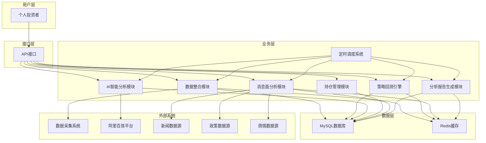
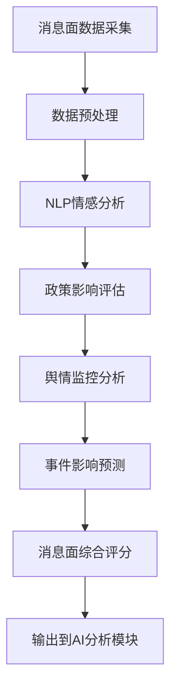

# 量化交易系统产品需求文档 (PRD)

## 文档信息

| 项目    | 内容          |
| ----- | ----------- |
| 子系统名称 | 量化交易系统 |
| 文档版本  | v2.0        |
| 创建日期  | 2025-01-10  |
| 最后更新  | 2025-01-10  |
| 产品经理  | [产品经理姓名]   |
| 开发团队  | [开发团队]     |
| 文档状态  | 待评审         |
| 所属平台  | 量化交易平台      |

## 1. 产品概述

### 1.1 产品背景

**业务背景**

量化交易系统是一个简化的智能交易决策系统，基于现有的数据采集系统，实现每日自动化的策略回测和交易决策。系统需要解决以下核心问题：

1. **每日数据更新**：获取最新的市场数据和持仓信息
2. **策略回测执行**：对预定义的交易策略进行回测分析
3. **AI智能决策**：基于回测结果生成交易建议
4. **操作方案输出**：提供明确的买入、卖出、持仓建议

**产品定位**

作为量化交易平台的决策支持系统，本系统承担以下职责：

* **数据整合**：整合市场数据和持仓信息
* **策略回测**：执行多种交易策略的历史回测
* **AI决策**：基于回测结果进行智能分析和决策
* **方案生成**：输出具体的交易操作建议

### 1.2 产品定位

**目标用户**

* **个人投资者**：需要量化分析和交易决策支持的投资者

**使用场景**

| 用户角色 | 主要场景 | 使用频率 | 核心需求 |
| ---- | ---- | ---- | ---- |
| 个人投资者 | 每日交易决策 | 每日 | 策略回测、AI建议 |

**产品边界**

* **核心功能**：数据获取、策略回测、AI决策、方案生成
* **上游依赖**：数据采集系统
* **下游服务**：交易决策输出
* **横向协作**：与现有数据采集系统集成

### 1.3 产品目标

**业务目标**

1. **回测准确性**：提供准确的策略回测结果，支持多种交易策略
2. **决策有效性**：AI决策建议具有实用价值，提升投资决策质量
3. **系统稳定性**：每日稳定运行，确保数据获取和分析的可靠性
4. **操作简便性**：自动化运行，减少人工干预

**用户目标**

1. **简化决策流程**：每日自动生成交易建议，减少分析时间
2. **提升决策质量**：基于数据驱动的量化分析提供决策支持
3. **降低操作复杂度**：系统自动运行，用户只需查看结果
4. **增强投资信心**：通过回测验证增强策略信心

**技术目标**

1. **性能指标**：
   - 回测计算时间：<30分钟
   - 数据获取延迟：<5分钟
   - 系统可用性：99%
   - AI决策响应：<10秒

2. **功能指标**：
   - 支持策略数量：10+
   - 历史数据回测：支持1年以上
   - 持仓分析：支持多只股票

## 2. 需求分析

### 2.1 功能需求

#### 2.1.1 核心功能列表

| 功能模块 | 功能描述 | 优先级 | 复杂度 | 预估工期 |
| ------- | ------- | ----- | ----- | ------- |
| 数据获取模块 | 获取最新市场数据和持仓信息 | P0 | 中 | 2周 |
| 策略回测引擎 | 执行多种交易策略回测 | P0 | 高 | 4周 |
| AI智能分析模块 | 基于回测结果进行智能决策和方案生成 | P0 | 高 | 3周 |
| 定时调度系统 | 每日自动执行整个流程 | P1 | 低 | 1周 |
| 结果展示界面 | 展示回测结果和操作建议 | P1 | 低 | 2周 |

#### 2.1.2 数据获取模块

**市场数据获取**

1. **实时行情数据**
   - 股票价格、成交量、涨跌幅
   - 技术指标数据（MA、MACD、RSI、布林带等）
   - 市场情绪指标

2. **基本面数据**
   - 财务报表数据
   - 估值指标（PE、PB、PEG等）
   - 行业和宏观经济数据

3. **消息面数据**（新增）
   - 新闻数据（财经新闻、公司公告、行业资讯等）
   - 政策数据（政府政策文件、监管公告、会议纪要等）
   - 舆情数据（社交媒体情绪、搜索热度、投资者情绪等）
   - 事件数据（重大事件、突发新闻、市场异动等）

**持仓信息获取**

1. **当前持仓**
   - 持仓股票代码和数量
   - 持仓成本和市值
   - 持仓收益率

2. **资金状况**
   - 可用资金余额
   - 总资产和净资产
   - 资金使用率

#### 2.1.3 策略回测引擎

**支持的交易策略**（基于trading_strategies.md文档）

**多因子量化综合评分策略**

本系统采用统一的多因子量化综合评分模型，通过四个维度的综合评估实现智能投资决策。**针对A股市场特性，消息面因子权重相对较高**：

- **技术面因子（权重35%）**
  - 动量因子：收益率、移动平均线、MACD指标
  - 反转因子：RSI、威廉指标(WR)
  - 波动率因子：历史波动率、ATR平均真实波幅
  - 成交量因子：成交量变化、OBV能量潮指标

- **基本面因子（权重25%）**
  - 盈利能力：ROE净资产收益率、ROA总资产收益率、毛利率
  - 估值水平：PE市盈率、PB市净率、PEG指标
  - 财务质量：偿债能力、现金流质量、成长性指标

- **消息面因子（权重25%）**
  - 新闻情绪：基于NLP技术的新闻情绪量化分析
  - 政策影响：政策情绪指数、监管态度评估（A股政策敏感性高）
  - 市场情绪：投资者情绪、专业机构观点
  - 热点题材：概念炒作、主题投资情绪分析
  - 监管动态：证监会、交易所公告影响评估

- **市场面因子（权重15%）**
  - 市场表现：相对强度指标、市场情绪因子
  - 资金流向：主力资金流向、北向资金、融资融券

**综合评分计算**：
```
综合评分 = 技术面评分 × 0.35 + 基本面评分 × 0.25 + 消息面评分 × 0.25 + 市场面评分 × 0.15
```

**评分等级划分**：
- 优秀(80-100分)：强烈推荐买入
- 良好(60-79分)：推荐买入
- 一般(40-59分)：持有观望
- 较差(20-39分)：建议减仓
- 很差(0-19分)：建议卖出

5. **风险管理策略**
   - 波动率控制策略（历史波动率、隐含波动率）
   - 相关性分析策略（股票间相关性监控）
   - 回撤控制策略（最大回撤限制）
   - 集中度风险策略（持仓集中度管理）

**回测功能**

1. **历史回测**
   - 支持1年以上历史数据回测
   - 计算策略收益率、最大回撤、夏普比率
   - 分析策略在不同市场环境下的表现

2. **滚动回测**
   - 近期表现分析（1个月、3个月、6个月）
   - 策略稳定性评估
   - 参数敏感性分析

#### 2.1.4 AI智能分析模块

**输入数据**

1. **回测结果分析**
   - 各策略的历史表现
   - 策略收益率和风险指标
   - 策略适用的市场环境
   - 策略参数敏感性

2. **当前市场状态**
   - 市场趋势判断
   - 波动率水平
   - 市场情绪指标
   - 宏观经济环境

3. **持仓分析**
   - 当前持仓结构
   - 持仓收益情况
   - 风险暴露分析
   - 资金使用效率

4. **消息面数据分析**（新增）
   - 新闻情绪评分和影响评估
   - 政策解读和影响量化
   - 舆情监控和情绪指标
   - 重大事件识别和影响预测
   - 消息面综合评分

**AI分析处理**

1. **量化指标体系计算**
   - **技术面因子**：计算MA、MACD、RSI、KDJ、布林带、VPT、WR等技术指标
   - **基本面因子**：分析PE、PB、PEG、ROE、ROA、营收增长率、净利润增长率等
   - **市场面因子**：评估换手率、成交量、资金流向、板块相对强度等
   - **风险管理指标**：计算波动率、相关性、最大回撤、集中度风险等
   - **消息面指标**：NLP情感分析、政策影响评估、舆情监控、事件影响预测

2. **综合评分模型**
   - **评分权重体系**：
     * 技术面因子权重：30%
     * 基本面因子权重：25%
     * 市场面因子权重：20%
     * 消息面因子权重：15%
     * 风险管理指标权重：10%
   - **评分计算方法**：
     * 各因子标准化处理（0-100分制）
     * 加权平均计算综合得分
     * 置信度评估（基于数据质量和模型稳定性）

3. **多时间尺度预测**
   - **短期预测**（1-3天）：基于技术面和消息面因子
   - **中期预测**（1-4周）：综合技术面、基本面和市场面因子
   - **长期预测**（1-3个月）：重点关注基本面和风险管理指标

4. **策略权重分配**
   - 基于回测表现和当前市场环境动态分配权重
   - 考虑策略适应性和稳定性
   - 实时调整策略组合

5. **风险控制考量**
   - 最大回撤控制和止损机制
   - 集中度风险和相关性管理
   - 流动性风险和波动率控制

6. **时机判断**
   - 基于综合评分的入场时机选择
   - 风险指标驱动的出场时机判断
   - 动态仓位调整机制

**方案生成输出**

1. **买入建议**
   - 推荐买入的股票代码和名称
   - 建议买入价格区间（基于技术分析支撑位）
   - 建议买入数量或金额（基于仓位管理策略）
   - 买入理由和策略依据（综合评分和因子分析）
   - 预期收益率和风险评估
   - 止损止盈价位设置

2. **卖出建议**
   - 推荐卖出的持仓股票代码和名称
   - 建议卖出价格区间（基于技术分析阻力位）
   - 建议卖出数量或比例（全部/部分卖出策略）
   - 卖出理由和风险考量（风险指标预警）
   - 预期避险效果评估

3. **持仓建议**
   - 继续持有的股票列表
   - 持仓调整建议（加仓/减仓/换股）
   - 动态止盈止损价位设置
   - 持仓监控要点和关键指标
   - 仓位配置优化建议

4. **综合分析报告**
   - **市场环境分析**：当前市场趋势、波动率水平、流动性状况
   - **投资组合分析**：持仓结构、风险暴露、收益贡献分析
   - **因子表现分析**：各类因子当前表现和历史对比
   - **风险预警**：潜在风险点识别和应对建议
   - **策略表现回顾**：近期策略表现和调整建议

**Markdown方案输出**

1. **报告结构设计**
   - **执行摘要**：核心操作建议和关键风险点
   - **市场概况**：当日市场环境和趋势分析
   - **操作清单**：详细的买入、卖出、持仓建议表格
   - **因子分析**：各类因子得分和权重分析
   - **风险评估**：投资组合风险指标和预警信息
   - **策略表现**：近期策略回测结果和表现分析
   - **执行指导**：具体操作时机和注意事项

2. **可视化图表**
   - **综合评分雷达图**：展示各股票在不同因子维度的得分
   - **风险收益散点图**：展示推荐股票的风险收益特征
   - **因子贡献柱状图**：展示各因子对最终决策的贡献度
   - **持仓结构饼图**：展示当前和建议的持仓结构分布
   - **策略表现趋势图**：展示各策略近期表现趋势

3. **操作清单**
   - 明日操作汇总表（包含优先级、操作类型、股票信息、数量、价格、理由）
   - 按优先级和紧急程度排序的操作建议
   - 预期收益率和风险评估指标
   - 操作置信度和成功概率评估

4. **详细分析**
   - 每个操作的详细分析（技术面、基本面、消息面综合分析）
   - 策略回测支撑数据和历史表现
   - 市场环境分析和宏观因素影响
   - 风险提示和应对措施
   - 替代方案和备选操作

5. **执行指导**
   - 操作时间建议（开盘、盘中、收盘时段）
   - 分批执行策略和仓位管理
   - 异常情况处理和应急预案
   - 监控指标和调整触发条件

6. **报告输出格式**
   - **PDF格式**：适合打印和存档的完整报告
   - **HTML格式**：支持交互式图表和链接跳转
   - **Markdown格式**：便于编辑和版本控制
   - **JSON格式**：支持程序化处理和API调用

#### 2.1.6 定时调度系统

**自动执行流程**

1. **每日执行时间**
   - 收盘后数据更新（15:30-16:00）
   - 策略回测执行（16:00-18:00）
   - AI决策分析（18:00-19:00）
   - 方案生成输出（19:00-19:30）

2. **异常处理**
   - 数据获取失败重试机制
   - 回测计算异常处理
   - AI决策超时处理
   - 结果通知机制

### 2.2 非功能需求

#### 2.2.1 性能需求

**响应时间要求**

| 功能模块 | 响应时间要求 | 备注 |
| ------- | ----------- | ---- |
| 数据获取 | <5分钟 | 每日数据更新 |
| 策略回测 | <30分钟 | 多策略并行回测 |
| AI决策 | <10秒 | 智能分析决策 |
| 方案生成 | <5秒 | 操作建议输出 |

**处理能力要求**

| 功能模块 | 处理能力要求 | 备注 |
| ------- | ----------- | ---- |
| 历史数据 | 1年以上数据 | 回测数据支持 |
| 策略数量 | 10+策略 | 多策略并行 |
| 股票数量 | 100+股票 | 持仓和候选股票 |
| 消息面数据 | 每日1万+新闻 | 新闻情绪分析支持 |

#### 2.2.2 可用性需求

**系统可用性**

- 系统可用性：99%（每月停机时间<7.2小时）
- 每日执行成功率：95%以上
- 故障恢复时间：<1小时
- 数据备份：每日备份

**容错机制**

- 重试机制：数据获取失败自动重试3次
- 降级机制：部分策略失败不影响整体流程
- 通知机制：异常情况及时通知用户

#### 2.2.3 安全性需求

**数据安全**

- 持仓数据加密存储
- 操作日志完整记录
- 敏感信息脱敏处理

**系统安全**

- 基础的用户认证
- 操作权限控制
- 系统访问日志

### 2.3 约束条件

#### 2.3.1 技术约束

**技术栈限制**

- 后端语言：Python（丰富的量化分析库生态）
- 数据库：MySQL + Redis（与现有系统兼容）
- 部署方式：Docker容器化部署
- AI模型：支持本地部署的开源模型

**资源约束**

- 服务器资源：单机部署，内存<16GB
- 存储空间：数据增长<50GB/月
- 网络要求：稳定的互联网连接

#### 2.3.2 业务约束

**功能范围**

- 仅提供决策建议，不直接执行交易
- 专注于A股市场
- 个人投资者使用场景

**数据约束**

- 依赖现有数据采集系统
- 历史数据回测深度：1-2年
- 支持的股票数量：主流股票池

#### 2.3.3 时间约束

**项目里程碑**

| 里程碑 | 时间节点 | 主要交付物 |
| ----- | ------- | --------- |
| 需求确认 | 第1周 | 需求文档、设计文档 |
| 核心开发 | 第6周 | 回测引擎、AI智能分析 |
| 功能完善 | 第6周 | 数据整合、持仓管理 |
| 消息面模块 | 第7周 | 新闻情绪分析、政策影响评估、消息面策略 |
| 测试上线 | 第8周 | 系统测试、部署上线 |

**运行时间**

- 每日执行时间：收盘后15:30-19:30
- 系统维护：周末进行
- 数据更新：每日收盘后

### 2.4 需求变更记录

| 版本 | 变更日期 | 变更内容 | 变更原因 | 影响评估 |
| --- | ------- | ------- | ------- | ------- |
| v1.0 | 2025-01-10 | 初始版本 | 项目启动 | 无 |

## 3. 产品功能设计

### 3.1 功能架构图



### 3.2 核心功能详述

#### 3.2.1 数据整合模块设计

**数据整合流程**


**数据整合功能**

1. **数据聚合**
   - 整合持仓信息和市场数据
   - 为回测引擎准备完整的数据集
   - 确保数据的一致性和完整性

2. **数据预处理**
   - 数据格式标准化
   - 缺失数据处理
   - 异常数据过滤

3. **缓存管理**
   - Redis缓存热点数据
   - 减少重复的外部接口调用
   - 提高系统响应速度

#### 3.2.2 策略回测引擎设计

**回测执行流程**


**回测引擎功能**

1. **策略回测执行**
   - 历史数据加载和预处理
   - 策略逻辑模拟执行
   - 交易信号生成和验证
   - 模拟交易成本计算
   - 持仓状态实时更新

2. **性能指标计算**
   - 总收益率和年化收益率
   - 最大回撤和回撤持续期
   - 夏普比率和信息比率
   - 胜率和盈亏比
   - 波动率和相关性分析

3. **回测结果分析**
   - 策略表现时间序列
   - 分年度/分季度表现
   - 不同市场环境下表现
   - 参数敏感性分析

#### 3.2.3 消息面分析模块设计

**消息面数据处理流程**



**消息面分析功能**

1. **新闻数据分析**
   - 财经新闻情感分析（正面/负面/中性）
   - 公司公告重要性评估
   - 行业资讯影响度分析
   - 新闻热度和传播度评估
   - 新闻时效性和可信度评估

2. **政策数据分析**
   - 政府政策文件解读和影响评估
   - 监管公告影响度量化
   - 会议纪要关键信息提取
   - 政策变化趋势预测
   - 行业政策影响评估

3. **舆情数据分析**
   - 社交媒体情绪监控（微博、股吧、论坛）
   - 搜索热度趋势分析
   - 投资者情绪指标计算
   - 舆情传播路径分析
   - 异常舆情预警机制

4. **事件数据分析**
   - 重大事件识别和分类
   - 突发新闻影响评估
   - 市场异动事件关联分析
   - 事件影响持续时间预测
   - 历史相似事件对比分析

5. **消息面综合评分**
   - 各类消息面数据权重分配
   - 消息面综合影响评分（0-100分）
   - 影响时间维度评估（短期/中期/长期）
   - 影响方向判断（利好/利空/中性）
   - 置信度评估和不确定性量化

#### 3.2.4 AI智能分析模块设计

**AI分析流程**


**AI智能分析功能**

1. **多策略融合决策**
   - 各策略回测结果权重分配
   - 策略表现历史分析
   - 策略适用性评估
   - 策略组合优化
   - 动态权重调整

2. **市场环境判断**
   - 市场趋势识别（牛市/熊市/震荡）
   - 波动率水平评估
   - 流动性状况分析
   - 市场情绪指标
   - 宏观环境因素

3. **风险控制决策**
   - 仓位大小建议
   - 止损止盈设置
   - 分散投资建议
   - 风险敞口控制
   - 应急处置建议

4. **Markdown方案生成**
   - 生成结构化的Markdown文档
   - 包含买入、卖出、持仓建议的详细表格
   - 支持图表和数据可视化
   - 便于阅读和打印的格式

5. **操作建议内容**
   - 买入建议：股票代码、买入价格、买入数量、买入理由
   - 卖出建议：股票代码、卖出价格、卖出数量、卖出理由
   - 持仓建议：继续持有理由、风险提示、关注要点
   - 操作优先级：按重要性和紧急性排序

6. **详细分析报告**
   - 策略分析：各策略表现和权重说明
   - 市场分析：当前市场环境和趋势判断
   - 风险分析：主要风险点和应对措施
   - 收益预期：预期收益率和风险水平

7. **执行指导**
   - 操作时机：建议执行时间和条件
   - 分批执行：大额交易的分批建议
   - 止损止盈：具体的止损止盈点位
   - 监控要点：需要重点关注的指标

### 3.3 用户流程图

#### 3.3.1 每日决策流程


#### 3.3.2 系统运行流程


#### 3.3.3 异常处理流程


### 3.4 API接口设计

#### 3.4.1 核心接口

**主要接口**

```python
# 获取今日操作方案（核心接口）
GET /api/v1/plan/today

# 响应示例
{
  "date": "2024-01-15",
  "generated_at": "2024-01-15T06:00:00Z",
  "confidence": 85,
  "format": "markdown",
  "content": "# 每日操作方案\n\n## 基本信息\n\n- **日期**: 2024-01-15\n- **生成时间**: 06:00:00\n- **AI置信度**: 85%\n\n## 操作建议\n\n### 买入建议\n\n| 股票代码 | 股票名称 | 建议价格 | 建议数量 | 操作理由 |\n|---------|---------|---------|---------|---------|\n| 000001 | 平安银行 | 12.50 | 1000 | 技术突破，基本面良好 |\n\n### 卖出建议\n\n| 股票代码 | 股票名称 | 建议价格 | 建议数量 | 操作理由 |\n|---------|---------|---------|---------|---------|\n| 600519 | 贵州茅台 | 1680.00 | 100 | 获利了结，风险控制 |\n\n### 持仓建议\n\n| 股票代码 | 股票名称 | 当前数量 | 操作建议 |\n|---------|---------|---------|---------|\n| 000858 | 五粮液 | 500 | 继续持有，基本面稳健 |\n\n## 市场分析\n\n市场震荡上行，成交量放大\n\n## 风险提示\n\n关注政策变化，控制仓位"
}
```

#### 3.4.2 辅助接口

**持仓管理接口**

```python
# 获取持仓列表
GET /api/v1/positions

# 添加持仓
POST /api/v1/positions
{
  "symbol": "000001",
  "name": "平安银行",
  "quantity": 1000,
  "cost_price": 12.00,
  "purchase_date": "2024-01-10"
}

# 更新持仓
PUT /api/v1/positions/{position_id}

# 删除持仓
DELETE /api/v1/positions/{position_id}
```

**其他接口**

```python
# 获取历史方案
GET /api/v1/plan/history?days=7

# 手动触发方案生成
POST /api/v1/plan/generate

# 系统状态检查
GET /api/v1/status

# 调用数据采集系统接口
GET /api/v1/data/market/{symbol}
```

## 4. 技术实现方案

### 4.1 系统架构设计

#### 4.1.1 整体架构图

```
                    简化量化系统架构

┌─────────────────────────────────────────────────────────────┐
│                        用户接口层                            │
│  ┌─────────────┐ ┌─────────────┐ ┌─────────────┐            │
│  │   API接口   │ │  持仓管理   │ │ Markdown方案│            │
│  └─────────────┘ └─────────────┘ └─────────────┘            │
└─────────────────────────────────────────────────────────────┘
                              │
┌─────────────────────────────────────────────────────────────┐
│                        业务逻辑层                            │
│  ┌─────────────┐ ┌─────────────┐ ┌─────────────────────────┐ │
│  │  数据整合   │ │  策略回测   │ │    AI智能分析模块       │ │
│  └─────────────┘ └─────────────┘ │  (决策+方案生成)        │ │
│  ┌─────────────┐ ┌─────────────┐ └─────────────────────────┘ │
│  │  定时调度   │ │  持仓管理   │                            │
│  └─────────────┘ └─────────────┘                            │
└─────────────────────────────────────────────────────────────┘
                              │
┌─────────────────────────────────────────────────────────────┐
│                        数据存储层                            │
│  ┌─────────────┐ ┌─────────────┐ ┌─────────────┐ ┌─────────┐ │
│  │  市场数据   │ │  持仓数据   │ │  回测结果   │ │ 操作方案│ │
│  └─────────────┘ └─────────────┘ └─────────────┘ └─────────┘ │
└─────────────────────────────────────────────────────────────┘
                              │
┌─────────────────────────────────────────────────────────────┐
│                        基础设施层                            │
│  ┌─────────────┐ ┌─────────────┐ ┌─────────────┐            │
│  │   MySQL     │ │    Redis    │ │ 阿里百炼平台│            │
│  └─────────────┘ └─────────────┘ └─────────────┘            │
└─────────────────────────────────────────────────────────────┘
```

### 4.2 技术选型

#### 4.2.1 后端技术栈

**编程语言**
- **Python**: 主要开发语言，丰富的量化分析库生态

**框架和库**
- **FastAPI**: Web框架，高性能、自动文档生成
- **SQLAlchemy**: ORM框架，数据库操作
- **Redis-py**: Redis客户端
- **APScheduler**: 定时任务调度
- **pandas**: 数据分析和处理
- **numpy**: 数值计算
- **TA-Lib**: 技术指标计算
- **backtrader**: 策略回测框架

**数据库**
- **MySQL**: 主数据库，存储持仓、回测结果、操作方案
- **Redis**: 缓存数据库，缓存市场数据和计算结果

**AI模型**
- **阿里百炼平台**: 使用阿里云百炼平台提供的大语言模型服务
- **API调用**: 通过HTTP API调用模型进行决策分析

#### 4.2.2 部署方式

**容器化**
- **Docker**: 容器化部署
- **Docker Compose**: 本地开发和生产环境

### 4.3 数据库设计

#### 4.3.1 核心数据表

**持仓数据表**
```sql
CREATE TABLE positions (
    id BIGINT PRIMARY KEY AUTO_INCREMENT,
    symbol VARCHAR(20) NOT NULL,
    name VARCHAR(100) NOT NULL,
    quantity DECIMAL(15,6) NOT NULL,
    avg_cost DECIMAL(10,4) NOT NULL,
    current_price DECIMAL(10,4),
    market_value DECIMAL(15,2),
    unrealized_pnl DECIMAL(15,2),
    purchase_date DATE NOT NULL,
    created_at TIMESTAMP DEFAULT CURRENT_TIMESTAMP,
    updated_at TIMESTAMP DEFAULT CURRENT_TIMESTAMP ON UPDATE CURRENT_TIMESTAMP,
    UNIQUE KEY uk_symbol (symbol)
);```

**策略回测结果表**
```sql
CREATE TABLE backtest_results (
    id BIGINT PRIMARY KEY AUTO_INCREMENT,
    strategy_name VARCHAR(100) NOT NULL,
    symbol VARCHAR(20) NOT NULL,
    test_date DATE NOT NULL,
    annual_return DECIMAL(8,4),
    max_drawdown DECIMAL(8,4),
    sharpe_ratio DECIMAL(8,4),
    win_rate DECIMAL(8,4),
    signal_type ENUM('buy', 'sell', 'hold') NOT NULL,
    signal_strength DECIMAL(5,4),
    created_at TIMESTAMP DEFAULT CURRENT_TIMESTAMP,
    INDEX idx_date_strategy (test_date, strategy_name)
);
```

**操作方案表**
```sql
CREATE TABLE operation_plans (
    id BIGINT PRIMARY KEY AUTO_INCREMENT,
    plan_date DATE NOT NULL,
    symbol VARCHAR(20) NOT NULL,
    operation_type ENUM('buy', 'sell', 'hold') NOT NULL,
    quantity DECIMAL(15,6),
    target_price DECIMAL(10,4),
    reason TEXT,
    ai_confidence DECIMAL(5,4),
    status ENUM('pending', 'executed', 'cancelled') DEFAULT 'pending',
    created_at TIMESTAMP DEFAULT CURRENT_TIMESTAMP,
    INDEX idx_plan_date (plan_date)
);
```

**市场数据缓存表**
```sql
CREATE TABLE market_data_cache (
    id BIGINT PRIMARY KEY AUTO_INCREMENT,
    symbol VARCHAR(20) NOT NULL,
    price DECIMAL(10,4) NOT NULL,
    volume BIGINT,
    timestamp TIMESTAMP NOT NULL,
    indicators_json JSON,
    created_at TIMESTAMP DEFAULT CURRENT_TIMESTAMP,
    INDEX idx_symbol_timestamp (symbol, timestamp)
);
```

**策略配置表**
```sql
CREATE TABLE strategy_configs (
    id BIGINT PRIMARY KEY AUTO_INCREMENT,
    strategy_name VARCHAR(100) NOT NULL,
    parameters_json JSON,
    enabled BOOLEAN DEFAULT TRUE,
    weight DECIMAL(5,4) DEFAULT 1.0000,
    created_at TIMESTAMP DEFAULT CURRENT_TIMESTAMP,
    updated_at TIMESTAMP DEFAULT CURRENT_TIMESTAMP ON UPDATE CURRENT_TIMESTAMP,
    UNIQUE KEY uk_strategy_name (strategy_name)
);
```

**消息面数据表**
```sql
CREATE TABLE news_data (
    id BIGINT PRIMARY KEY AUTO_INCREMENT,
    title VARCHAR(500) NOT NULL,
    content TEXT,
    source VARCHAR(100),
    publish_time TIMESTAMP,
    news_type ENUM('financial', 'company', 'industry', 'policy') NOT NULL,
    sentiment_score DECIMAL(5,4),
    importance_score DECIMAL(5,4),
    related_symbols JSON,
    created_at TIMESTAMP DEFAULT CURRENT_TIMESTAMP,
    INDEX idx_publish_time (publish_time),
    INDEX idx_news_type (news_type)
);
```

**消息面评分表**
```sql
CREATE TABLE sentiment_scores (
    id BIGINT PRIMARY KEY AUTO_INCREMENT,
    symbol VARCHAR(20) NOT NULL,
    score_date DATE NOT NULL,
    news_sentiment DECIMAL(5,4),
    policy_impact DECIMAL(5,4),
    social_sentiment DECIMAL(5,4),
    event_impact DECIMAL(5,4),
    comprehensive_score DECIMAL(5,4),
    confidence_level DECIMAL(5,4),
    created_at TIMESTAMP DEFAULT CURRENT_TIMESTAMP,
    INDEX idx_symbol_date (symbol, score_date)
);
```

**因子评分表**
```sql
CREATE TABLE factor_scores (
    id BIGINT PRIMARY KEY AUTO_INCREMENT,
    symbol VARCHAR(20) NOT NULL,
    score_date DATE NOT NULL,
    technical_score DECIMAL(5,4),
    fundamental_score DECIMAL(5,4),
    market_score DECIMAL(5,4),
    sentiment_score DECIMAL(5,4),
    risk_score DECIMAL(5,4),
    comprehensive_score DECIMAL(5,4),
    prediction_short DECIMAL(5,4),
    prediction_medium DECIMAL(5,4),
    prediction_long DECIMAL(5,4),
    confidence_level DECIMAL(5,4),
    created_at TIMESTAMP DEFAULT CURRENT_TIMESTAMP,
    INDEX idx_symbol_date (symbol, score_date)
);
```

### 4.4 API设计

#### 4.4.1 核心API接口

**数据获取API**
```http
# 获取持仓信息
GET /api/v1/positions

# 获取市场数据
GET /api/v1/market/data
Query Parameters:
  - symbols: 股票代码列表
  - date: 数据日期
```

**策略回测API**
```http
# 执行策略回测
POST /api/v1/backtest/run
Request Body:
{
  "strategies": ["双均线", "RSI", "MACD"],
  "symbols": ["000001", "000002"],
  "start_date": "2024-01-01",
  "end_date": "2024-12-31"
}

# 获取回测结果
GET /api/v1/backtest/results
Query Parameters:
  - date: 回测日期
  - strategy: 策略名称
```

**操作方案API**
```http
# 获取今日操作方案
GET /api/v1/plans/today

# 生成操作方案
POST /api/v1/plans/generate

# 更新方案状态
PUT /api/v1/plans/{id}/status
```

**消息面分析API**
```http
# 获取消息面数据
GET /api/v1/sentiment/news
Query Parameters:
  - symbols: 股票代码列表
  - date_from: 开始日期
  - date_to: 结束日期
  - news_type: 新闻类型

# 获取消息面评分
GET /api/v1/sentiment/scores
Query Parameters:
  - symbols: 股票代码列表
  - date: 评分日期

# 执行消息面分析
POST /api/v1/sentiment/analyze
Request Body:
{
  "symbols": ["000001", "000002"],
  "date": "2024-01-15"
}
```

**因子分析API**
```http
# 获取因子评分
GET /api/v1/factors/scores
Query Parameters:
  - symbols: 股票代码列表
  - date: 评分日期
  - factor_type: 因子类型

# 计算综合评分
POST /api/v1/factors/calculate
Request Body:
{
  "symbols": ["000001", "000002"],
  "date": "2024-01-15",
  "weights": {
    "technical": 0.3,
    "fundamental": 0.25,
    "market": 0.2,
    "sentiment": 0.15,
    "risk": 0.1
  }
}

# 获取预测结果
GET /api/v1/factors/predictions
Query Parameters:
  - symbols: 股票代码列表
  - prediction_type: 预测类型（short/medium/long）
```

## 5. 项目计划

### 5.1 开发阶段

#### 5.1.1 第一阶段：基础框架搭建（1周）

**目标**：完成系统基础架构和数据库设计

**主要任务**：
- 项目结构搭建
- 数据库设计和初始化
- 基础API框架
- Docker环境配置

**交付物**：
- 基础代码框架
- 数据库表结构
- Docker配置文件

#### 5.1.2 第二阶段：持仓管理和数据整合模块（1周）

**目标**：完成持仓管理和数据整合功能

**主要任务**：
- 持仓数据管理
- 数据采集系统接口集成
- 数据整合和缓存机制
- 数据更新调度

**交付物**：
- 持仓管理接口
- 数据整合服务
- 数据缓存系统

#### 5.1.3 第三阶段：策略回测引擎（2周）

**目标**：完成策略回测和性能评估功能

**主要任务**：
- 策略回测引擎开发
- 技术指标计算
- 回测结果分析
- 策略性能评估

**交付物**：
- 回测引擎
- 技术指标库
- 性能评估模块

#### 5.1.4 第四阶段：消息面分析模块（1周）

**目标**：完成消息面数据分析和评分功能

**主要任务**：
- 新闻数据采集和预处理
- NLP情感分析引擎
- 政策影响评估算法
- 舆情监控和分析
- 事件影响预测模型
- 消息面综合评分计算

**交付物**：
- 消息面数据采集器
- NLP情感分析引擎
- 政策影响评估模块
- 舆情监控系统
- 消息面评分算法

#### 5.1.5 第五阶段：因子评分和AI智能分析模块（1.5周）

**目标**：完成量化因子评分体系和AI智能分析功能

**主要任务**：
- 量化指标体系实现（技术面、基本面、市场面、风险管理指标）
- 综合评分模型开发
- 多时间尺度预测模型
- 阿里百炼平台集成
- AI决策逻辑开发
- 多策略融合算法
- Markdown方案生成和可视化图表
- 置信度计算和风险评估

**交付物**：
- 量化因子计算引擎
- 综合评分模型
- 预测模型系统
- AI智能分析引擎
- 策略融合算法
- 报告生成系统
- 置信度评估模块

#### 5.1.6 第六阶段：系统集成测试（1周）

**目标**：完成系统集成和功能测试

**主要任务**：
- 端到端功能测试
- 定时任务测试
- 数据流程验证
- 性能基准测试

**交付物**：
- 测试报告
- 性能基准
- 问题修复

### 5.2 资源配置

#### 5.2.1 人员配置

**开发团队（2人）**
- 后端开发：2人，负责Python服务端开发

**技能要求**
- 后端：Python、FastAPI、SQLAlchemy、MySQL、Redis、pandas、TA-Lib、AI模型集成

#### 5.2.2 硬件资源

**开发环境**
- 开发机器：8核16GB内存，500GB SSD
- 测试服务器：4核8GB内存，200GB SSD

**生产环境**
- 单机部署：16核32GB内存，1TB SSD
- 网络：稳定的互联网连接

### 5.3 风险管理

#### 5.3.1 主要风险

1. **数据质量风险**
   - 风险：外部数据源不稳定
   - 应对：数据校验、异常处理

2. **AI服务风险**
   - 风险：第三方AI服务不稳定
   - 应对：服务监控、降级策略

3. **进度风险**
   - 风险：开发进度延期
   - 应对：功能优先级、MVP策略

#### 5.3.2 质量保证

**代码质量**
- 代码审查制度
- 单元测试覆盖
- 集成测试验证

**系统质量**
- 功能测试完整
- 性能基准达标
- 稳定性验证

## 6. 成功标准

### 6.1 功能验收标准

#### 6.1.1 核心功能验收

**数据获取模块**
- 市场数据获取正常，延迟≤5分钟
- 持仓数据同步准确
- 数据缓存机制有效
- 数据更新调度正常

**策略回测引擎**
- 技术指标计算准确
- 回测结果计算正确
- 策略性能评估完整
- 回测执行时间≤30分钟

**AI智能分析模块**
- 第三方AI服务调用正常
- 多策略融合逻辑正确
- 决策置信度计算准确
- AI分析响应时间≤10秒
- 操作建议生成正确
- Markdown方案格式化输出规范
- 执行指导清晰明确
- 方案存储管理正常

#### 6.1.2 系统功能验收

**定时调度系统**
- 每日定时任务执行正常
- 异常情况处理有效
- 任务执行日志完整
- 系统状态监控正常

**API接口**
- 所有API接口响应正常
- 接口文档自动生成
- 接口参数验证有效
- 错误处理机制完善

### 6.2 性能验收标准

#### 6.2.1 响应时间要求

- 数据获取：≤5分钟
- 策略回测：≤30分钟
- AI决策：≤10秒
- 方案生成：≤5秒
- 页面加载：≤3秒
- API响应：≤1秒

#### 6.2.2 系统资源要求

- 内存使用：≤16GB
- CPU使用率：≤80%
- 磁盘空间：≤50GB/月
- 系统可用性：≥99%

### 6.3 质量验收标准

#### 6.3.1 数据质量

- 数据准确性：≥99.9%
- 数据完整性：100%
- 数据及时性：延迟≤5分钟
- 数据一致性：100%

#### 6.3.2 系统稳定性

- 系统无崩溃运行
- 内存无泄漏问题
- 定时任务稳定执行
- 异常情况正常处理

### 6.4 用户体验标准

#### 6.4.1 易用性要求

- 操作流程简单直观
- 界面布局清晰合理
- 功能说明完整准确
- 错误提示友好明确

#### 6.4.2 功能完整性

- 100%需求功能实现
- 核心业务流程完整
- 异常场景处理完善
- 用户操作指导清晰

### 6.5 部署验收标准

#### 6.5.1 环境要求

- 支持Docker容器化部署
- 支持单机本地部署
- 数据库初始化正常
- 配置文件管理规范

#### 6.5.2 运维要求

- 系统启动停止正常
- 日志记录完整清晰
- 配置修改生效及时
- 数据备份恢复正常

---

## 附录

### A. 术语表

| 术语 | 英文 | 定义 |
| --- | ---- | ---- |
| 量化交易 | Quantitative Trading | 使用数学模型和算法进行交易决策 |
| 策略引擎 | Strategy Engine | 执行交易策略的核心组件 |
| 风险价值 | Value at Risk (VaR) | 在一定置信水平下的最大可能损失 |
| 最大回撤 | Maximum Drawdown | 投资组合从峰值到谷值的最大跌幅 |
| 夏普比率 | Sharpe Ratio | 风险调整后的收益率指标 |
| 滑点 | Slippage | 预期价格与实际成交价格的差异 |
| 算法交易 | Algorithmic Trading | 使用预设算法自动执行交易 |
| 高频交易 | High-Frequency Trading | 毫秒级的高速交易策略 |

### B. 参考文档

1. 《量化交易策略设计体系》- 内部文档
2. 《数据采集系统PRD》- 内部文档
3. 《证券交易系统技术规范》- 行业标准
4. 《金融风险管理指引》- 监管文件
5. 《微服务架构设计模式》- 技术参考

### C. 变更记录

| 版本 | 日期 | 变更内容 | 变更人 |
| --- | ---- | ------- | ------ |
| v1.0 | 2025-01-10 | 初始版本创建 | 产品团队 |

---

**文档状态**：待评审  
**下次评审时间**：2025-01-15  
**评审参与人**：产品经理、技术负责人、风控负责人、业务负责人