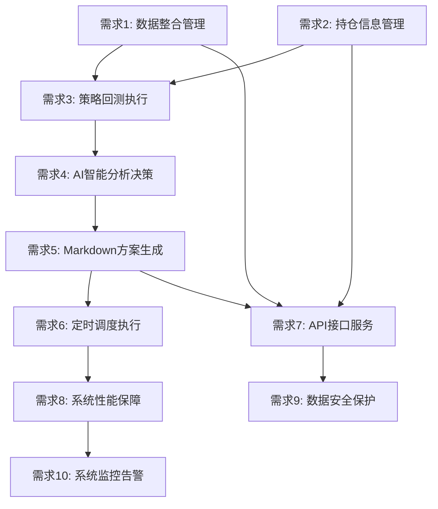

# 量化交易系统需求文档 (Requirements)

## 文档信息

| 项目    | 内容         |
| ----- | ---------- |
| 子系统名称 | 量化交易系统     |
| 文档版本  | v1.0       |
| 创建日期  | 2025-01-10 |
| 最后更新  | 2025-01-10 |
| 需求分析师 | \[需求分析师姓名] |
| 开发团队  | \[开发团队]    |
| 文档状态  | 待评审        |
| 所属平台  | 量化交易平台     |

## 项目介绍

量化交易系统是一个基于Python的智能交易决策支持系统，旨在为个人投资者提供每日自动化的策略回测和交易决策建议。系统通过整合市场数据和持仓信息，执行多种交易策略回测，并利用阿里百炼平台的AI能力生成Markdown格式的操作方案。

## 需求列表

### 需求1：数据整合管理

**用户故事：** 作为个人投资者，我希望系统能够自动整合最新的市场数据和我的持仓信息，以便为策略回测提供完整准确的数据基础。

#### 验收标准

1. WHEN 系统启动数据整合流程 THEN 系统 SHALL 从数据采集系统获取最新市场数据
2. WHEN 获取市场数据 THEN 系统 SHALL 在5分钟内完成数据获取
3. WHEN 数据获取失败 THEN 系统 SHALL 自动重试最多3次
4. WHEN 数据整合完成 THEN 系统 SHALL 将数据缓存到Redis中以提高访问速度
5. WHEN 持仓信息更新 THEN 系统 SHALL 实时同步到MySQL数据库
6. IF 数据存在异常值 THEN 系统 SHALL 进行数据清洗和过滤
7. WHEN 数据预处理完成 THEN 系统 SHALL 为回测引擎提供标准化的数据格式

### 需求2：持仓信息管理

**用户故事：** 作为个人投资者，我希望能够管理我的持仓信息，包括添加、修改、删除持仓记录，以便系统能够基于我的实际持仓情况提供个性化的交易建议。

#### 验收标准

1. WHEN 用户添加新持仓 THEN 系统 SHALL 记录股票代码、名称、数量、成本价格和购买日期
2. WHEN 用户更新持仓信息 THEN 系统 SHALL 更新相应字段并记录修改时间
3. WHEN 用户删除持仓 THEN 系统 SHALL 从数据库中移除该持仓记录
4. WHEN 查询持仓列表 THEN 系统 SHALL 返回所有有效持仓及其当前市值和盈亏情况
5. WHEN 持仓数据变更 THEN 系统 SHALL 自动计算持仓收益率和风险指标
6. IF 持仓数量为0 THEN 系统 SHALL 自动标记该持仓为已清仓状态
7. WHEN 系统计算持仓市值 THEN 系统 SHALL 使用最新的市场价格数据

### 需求3：策略回测执行

**用户故事：** 作为个人投资者，我希望系统能够对多种交易策略进行历史回测，以便了解不同策略的历史表现和适用性。

#### 验收标准

1. WHEN 系统执行策略回测 THEN 系统 SHALL 支持至少10种不同的交易策略
2. WHEN 回测开始 THEN 系统 SHALL 使用至少1年的历史数据进行回测
3. WHEN 回测执行 THEN 系统 SHALL 在30分钟内完成所有策略的回测计算
4. WHEN 回测完成 THEN 系统 SHALL 计算年化收益率、最大回撤、夏普比率等关键指标
5. WHEN 计算技术指标 THEN 系统 SHALL 支持MA、MACD、RSI、布林带等常用技术指标
6. WHEN 生成交易信号 THEN 系统 SHALL 为每个信号分配强度评分（0-1）
7. IF 回测过程中出现异常 THEN 系统 SHALL 记录错误日志并继续执行其他策略
8. WHEN 回测结果生成 THEN 系统 SHALL 将结果存储到数据库中供后续分析使用

### 需求4：AI智能分析决策

**用户故事：** 作为个人投资者，我希望系统能够基于回测结果和当前市场状况，利用AI技术生成智能的交易决策建议。

#### 验收标准

1. WHEN AI分析开始 THEN 系统 SHALL 整合回测结果、持仓信息和市场数据
2. WHEN 构建分析提示词 THEN 系统 SHALL 包含策略分析、风险评估和操作建议三个维度
3. WHEN 调用阿里百炼平台 THEN 系统 SHALL 在10秒内获得AI分析结果
4. WHEN 解析AI回答 THEN 系统 SHALL 提取买入建议、卖出建议和持仓建议
5. WHEN 生成操作建议 THEN 系统 SHALL 为每个建议提供具体的股票代码、价格区间和操作理由
6. WHEN 评估风险 THEN 系统 SHALL 考虑最大回撤控制、集中度风险和流动性风险
7. IF AI服务调用失败 THEN 系统 SHALL 使用备用决策逻辑或历史方案
8. WHEN AI分析完成 THEN 系统 SHALL 为决策结果分配置信度评分

### 需求5：Markdown方案生成

**用户故事：** 作为个人投资者，我希望系统能够生成格式化的Markdown操作方案，以便我能够清晰地查看和理解每日的交易建议。

#### 验收标准

1. WHEN 生成操作方案 THEN 系统 SHALL 输出结构化的Markdown格式文档
2. WHEN 方案包含买入建议 THEN 系统 SHALL 以表格形式展示股票代码、名称、建议价格、数量和理由
3. WHEN 方案包含卖出建议 THEN 系统 SHALL 以表格形式展示股票代码、名称、建议价格、数量和理由
4. WHEN 方案包含持仓建议 THEN 系统 SHALL 以表格形式展示股票代码、名称、当前数量和操作建议
5. WHEN 生成市场分析 THEN 系统 SHALL 包含当前市场趋势和环境判断
6. WHEN 生成风险提示 THEN 系统 SHALL 列出主要风险点和注意事项
7. WHEN 方案生成完成 THEN 系统 SHALL 在5秒内完成Markdown文档的格式化
8. WHEN 保存方案 THEN 系统 SHALL 将方案内容存储到数据库并记录生成时间

### 需求6：定时调度执行

**用户故事：** 作为个人投资者，我希望系统能够每日自动执行整个分析流程，无需人工干预即可获得最新的交易建议。

#### 验收标准

1. WHEN 每日收盘后 THEN 系统 SHALL 在15:30自动启动数据更新流程
2. WHEN 数据更新完成 THEN 系统 SHALL 在16:00启动策略回测流程
3. WHEN 回测完成 THEN 系统 SHALL 在18:00启动AI智能分析流程
4. WHEN AI分析完成 THEN 系统 SHALL 在19:00启动方案生成流程
5. WHEN 整个流程完成 THEN 系统 SHALL 在19:30前完成所有任务
6. IF 任何步骤执行失败 THEN 系统 SHALL 记录错误日志并发送异常通知
7. WHEN 系统异常恢复 THEN 系统 SHALL 自动从失败点继续执行
8. WHEN 周末或节假日 THEN 系统 SHALL 跳过定时执行任务

### 需求7：API接口服务

**用户故事：** 作为个人投资者，我希望通过API接口获取操作方案和管理持仓信息，以便集成到我的其他投资工具中。

#### 验收标准

1. WHEN 调用获取今日方案接口 THEN 系统 SHALL 返回最新的Markdown格式操作方案
2. WHEN 调用持仓管理接口 THEN 系统 SHALL 支持增删改查操作
3. WHEN 调用历史方案接口 THEN 系统 SHALL 返回指定天数的历史方案记录
4. WHEN 调用系统状态接口 THEN 系统 SHALL 返回系统运行状态和健康检查信息
5. WHEN API请求失败 THEN 系统 SHALL 返回标准的错误码和错误信息
6. WHEN 接口响应 THEN 系统 SHALL 在3秒内返回结果
7. IF 请求参数无效 THEN 系统 SHALL 返回400错误和详细的参数验证信息
8. WHEN 手动触发方案生成 THEN 系统 SHALL 立即执行完整的分析流程

### 需求8：系统性能保障

**用户故事：** 作为个人投资者，我希望系统能够稳定高效地运行，确保每日都能及时获得可靠的交易建议。

#### 验收标准

1. WHEN 系统运行 THEN 系统 SHALL 保持99%的可用性
2. WHEN 数据获取 THEN 系统 SHALL 在5分钟内完成
3. WHEN 策略回测 THEN 系统 SHALL 在30分钟内完成
4. WHEN AI决策分析 THEN 系统 SHALL 在10秒内完成
5. WHEN 方案生成 THEN 系统 SHALL 在5秒内完成
6. WHEN 处理历史数据 THEN 系统 SHALL 支持1年以上的数据量
7. WHEN 并行处理策略 THEN 系统 SHALL 支持10个以上策略同时回测
8. WHEN 系统故障 THEN 系统 SHALL 在1小时内恢复正常运行

### 需求9：数据安全保护

**用户故事：** 作为个人投资者，我希望我的持仓信息和交易数据能够得到安全保护，防止数据泄露和非法访问。

#### 验收标准

1. WHEN 存储持仓数据 THEN 系统 SHALL 对敏感信息进行加密存储
2. WHEN 记录操作日志 THEN 系统 SHALL 完整记录所有用户操作和系统行为
3. WHEN 处理敏感信息 THEN 系统 SHALL 对敏感数据进行脱敏处理
4. WHEN 用户访问系统 THEN 系统 SHALL 进行基础的身份认证
5. WHEN 执行操作 THEN 系统 SHALL 检查用户权限
6. WHEN 访问系统 THEN 系统 SHALL 记录访问日志
7. WHEN 数据备份 THEN 系统 SHALL 每日自动备份重要数据
8. IF 检测到异常访问 THEN 系统 SHALL 记录安全事件并发送告警

### 需求10：系统监控告警

**用户故事：** 作为个人投资者，我希望在系统出现异常时能够及时收到通知，确保不会错过重要的交易机会。

#### 验收标准

1. WHEN 数据获取失败 THEN 系统 SHALL 发送异常通知
2. WHEN 回测计算异常 THEN 系统 SHALL 记录错误并尝试恢复
3. WHEN AI决策超时 THEN 系统 SHALL 使用备用方案并发送告警
4. WHEN 系统资源不足 THEN 系统 SHALL 发送资源告警
5. WHEN 每日执行失败 THEN 系统 SHALL 发送执行失败通知
6. WHEN 系统恢复正常 THEN 系统 SHALL 发送恢复通知
7. IF 连续多日执行失败 THEN 系统 SHALL 发送严重告警
8. WHEN 系统维护 THEN 系统 SHALL 提前发送维护通知

## 需求优先级

### P0 (核心需求)

* 需求1：数据整合管理

* 需求2：持仓信息管理

* 需求3：策略回测执行

* 需求4：AI智能分析决策

* 需求5：Markdown方案生成

### P1 (重要需求)

* 需求6：定时调度执行

* 需求7：API接口服务

* 需求8：系统性能保障

### P2 (可选需求)

* 需求9：数据安全保护

* 需求10：系统监控告警

## 需求依赖关系

## 验收标准总结

### 功能验收

* 系统能够自动整合数据并执行策略回测

* AI能够基于回测结果生成智能决策建议

* 系统能够输出格式化的Markdown操作方案

* 定时调度系统能够每日自动执行完整流程

* API接口能够提供完整的数据访问和管理功能

### 性能验收

* 数据获取时间 < 5分钟

* 策略回测时间 < 30分钟

* AI决策响应时间 < 10秒

* 方案生成时间 < 5秒

* 系统可用性 ≥ 99%

### 质量验收

* 支持10+种交易策略

* 支持1年以上历史数据回测

* 支持100+股票的持仓管理

* 每日执行成功率 ≥ 95%

* 故障恢复时间 < 1小时

## 风险和约束

### 技术风险

* 依赖阿里百炼平台的服务稳定性

* 数据采集系统的可用性影响

* Python量化库的性能限制

### 业务约束

* 仅提供决策建议，不执行实际交易

* 专注于A股市场

* 个人投资者使用场景

### 资源约束

* 单机部署，内存限制16GB

* 存储增长限制50GB/月

* 网络依赖稳定的互联网连接

## 变更记录

| 版本   | 变更日期       | 变更内容 | 变更原因 | 影响评估 |
| ---- | ---------- | ---- | ---- | ---- |
| v1.0 | 2025-01-10 | 初始版本 | 项目启动 | 无    |

