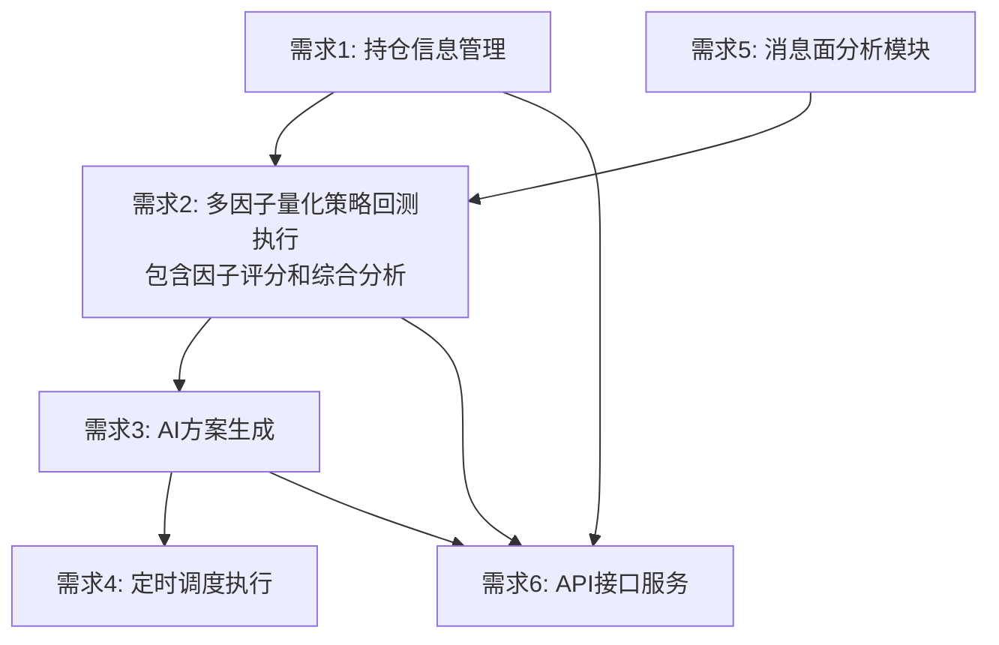

# 量化交易系统需求文档 (Requirements)

## 文档信息

| 项目    | 内容         |
| ----- | ---------- |
| 子系统名称 | 量化交易系统     |
| 文档版本  | v1.2       |
| 创建日期  | 2025-01-10 |
| 最后更新  | 2025-01-11 |
| 需求分析师 | \[需求分析师姓名] |
| 开发团队  | \[开发团队]    |
| 文档状态  | 待评审        |
| 所属平台  | 量化交易平台     |

## 项目介绍

量化交易系统是一个基于Python的智能交易决策支持系统，旨在为个人投资者提供每日自动化的策略回测和交易决策建议。系统通过整合市场数据和持仓信息，执行多种交易策略回测，并利用阿里百炼平台的AI能力生成Markdown格式的操作方案。

## 需求列表

### 需求1：持仓信息管理

**用户故事：** 作为个人投资者，我希望能够管理我的持仓信息，包括添加、修改、删除持仓记录，以便系统能够基于我的实际持仓情况提供个性化的交易建议。

#### 验收标准

1. WHEN 用户添加新持仓 THEN 系统 SHALL 记录股票代码、名称、数量、成本价格和购买日期
2. WHEN 用户更新持仓信息 THEN 系统 SHALL 更新相应字段并记录修改时间
3. WHEN 用户删除持仓 THEN 系统 SHALL 从数据库中移除该持仓记录
4. WHEN 查询持仓列表 THEN 系统 SHALL 返回所有有效持仓及其当前市值和盈亏情况
5. WHEN 持仓数据变更 THEN 系统 SHALL 自动计算持仓收益率和风险指标
6. IF 持仓数量为0 THEN 系统 SHALL 自动标记该持仓为已清仓状态
7. WHEN 系统计算持仓市值 THEN 系统 SHALL 使用最新的市场价格数据

### 需求2：多因子量化策略回测执行

**用户故事：** 作为个人投资者，我希望系统能够基于多因子量化综合评分模型进行历史回测，整合技术面、基本面、市场面和消息面因子，以便了解综合策略的历史表现和适用性。

#### 验收标准

1. WHEN 系统执行策略回测 THEN 系统 SHALL 从数据采集系统获取最新市场数据
2. WHEN 获取市场数据 THEN 系统 SHALL 在5分钟内完成数据获取
3. WHEN 数据获取失败 THEN 系统 SHALL 自动重试最多3次
4. WHEN 数据整合完成 THEN 系统 SHALL 将数据缓存到Redis中以提高访问速度
5. IF 数据存在异常值 THEN 系统 SHALL 进行数据清洗和过滤
6. WHEN 数据预处理完成 THEN 系统 SHALL 为回测引擎提供标准化的数据格式
7. WHEN 系统执行多因子策略回测 THEN 系统 SHALL 基于多因子量化综合评分模型进行回测
8. WHEN 计算技术面因子 THEN 系统 SHALL 支持MA、MACD、RSI、布林带等技术指标，权重占35%
9. WHEN 计算基本面因子 THEN 系统 SHALL 支持PE、PB、ROE、营收增长等财务指标，权重占25%
10. WHEN 计算消息面因子 THEN 系统 SHALL 支持新闻情绪、政策影响、热点题材、监管动态等指标，权重占25%
11. WHEN 计算市场面因子 THEN 系统 SHALL 支持成交量、资金流向、市场情绪等指标，权重占15%
12. WHEN 回测开始 THEN 系统 SHALL 使用至少1年的历史数据进行回测
13. WHEN 回测执行 THEN 系统 SHALL 在30分钟内完成多因子策略的回测计算
14. WHEN 回测完成 THEN 系统 SHALL 计算年化收益率、最大回撤、夏普比率等关键指标
15. WHEN 生成综合评分 THEN 系统 SHALL 为每只股票计算0-100分的综合评分
16. WHEN 生成交易信号 THEN 系统 SHALL 基于综合评分生成买入、卖出、持有信号
17. WHEN 因子评分计算完成 THEN 系统 SHALL 将技术面、基本面、消息面、市场面各因子评分存储供AI分析使用
18. WHEN 综合评分生成 THEN 系统 SHALL 基于评分区间生成投资建议等级（强烈推荐、推荐、中性、不推荐、强烈不推荐）
19. IF 回测过程中出现异常 THEN 系统 SHALL 记录错误日志并继续执行
20. WHEN 回测结果生成 THEN 系统 SHALL 将回测结果和因子评分存储到数据库中供AI方案生成使用

### 需求3：AI方案生成

**用户故事：** 作为个人投资者，我希望系统能够基于回测结果和当前市场状况，利用AI技术生成格式化的Markdown操作方案，以便我能够清晰地查看和理解每日的交易建议。

#### 验收标准

1. WHEN AI分析开始 THEN 系统 SHALL 整合回测结果、持仓信息和市场数据
2. WHEN 构建分析提示词 THEN 系统 SHALL 包含策略分析、风险评估和操作建议三个维度
3. WHEN 调用阿里百炼平台 THEN 系统 SHALL 在10秒内获得AI分析结果
4. WHEN 解析AI回答 THEN 系统 SHALL 提取买入建议、卖出建议和持仓建议
5. WHEN 生成操作建议 THEN 系统 SHALL 为每个建议提供具体的股票代码、价格区间和操作理由
6. WHEN 评估风险 THEN 系统 SHALL 考虑最大回撤控制、集中度风险和流动性风险
7. WHEN 生成操作方案 THEN 系统 SHALL 输出结构化的Markdown格式文档
8. WHEN 方案包含买入建议 THEN 系统 SHALL 以表格形式展示股票代码、名称、建议价格、数量和理由
9. WHEN 方案包含卖出建议 THEN 系统 SHALL 以表格形式展示股票代码、名称、建议价格、数量和理由
10. WHEN 方案包含持仓建议 THEN 系统 SHALL 以表格形式展示股票代码、名称、当前数量和操作建议
11. WHEN 生成市场分析 THEN 系统 SHALL 包含当前市场趋势和环境判断
12. WHEN 生成风险提示 THEN 系统 SHALL 列出主要风险点和注意事项
13. WHEN 方案生成完成 THEN 系统 SHALL 在5秒内完成Markdown文档的格式化
14. WHEN 保存方案 THEN 系统 SHALL 将方案内容存储到数据库并记录生成时间
15. WHEN AI分析完成 THEN 系统 SHALL 为决策结果分配置信度评分
16. IF AI服务调用失败 THEN 系统 SHALL 使用备用决策逻辑或历史方案

### 需求4：定时调度执行

**用户故事：** 作为个人投资者，我希望系统能够每日自动执行整个分析流程，无需人工干预即可获得最新的交易建议。

#### 验收标准

1. WHEN 每日收盘后 THEN 系统 SHALL 在15:30自动启动数据更新流程
2. WHEN 数据更新完成 THEN 系统 SHALL 在16:00启动策略回测流程
3. WHEN 回测完成 THEN 系统 SHALL 在18:00启动AI智能分析流程
4. WHEN AI分析完成 THEN 系统 SHALL 在19:00启动方案生成流程
5. WHEN 整个流程完成 THEN 系统 SHALL 在19:30前完成所有任务
6. IF 任何步骤执行失败 THEN 系统 SHALL 记录错误日志并发送异常通知
7. WHEN 系统异常恢复 THEN 系统 SHALL 自动从失败点继续执行
8. WHEN 周末或节假日 THEN 系统 SHALL 跳过定时执行任务

### 需求5：消息面分析模块

**用户故事：** 作为个人投资者，我希望系统能够分析消息面数据，包括新闻情绪、政策影响、热点题材和监管动态，以便为多因子评分模型提供消息面因子评分。

#### 验收标准

1. WHEN 系统获取消息面数据 THEN 系统 SHALL 从数据采集系统获取新闻、政策、舆情等数据
2. WHEN 进行新闻情绪分析 THEN 系统 SHALL 使用NLP技术分析新闻情绪倾向
3. WHEN 分析政策影响 THEN 系统 SHALL 评估政策对股票和行业的影响程度
4. WHEN 识别热点题材 THEN 系统 SHALL 识别当前市场热点和概念题材
5. WHEN 监控监管动态 THEN 系统 SHALL 分析监管政策对市场的影响
6. WHEN 计算消息面评分 THEN 系统 SHALL 为每只股票生成0-100分的消息面评分
7. WHEN 消息面分析完成 THEN 系统 SHALL 将评分结果存储到数据库
8. IF 消息面数据缺失 THEN 系统 SHALL 使用历史平均值或默认评分

### 需求6：API接口服务

**用户故事：** 作为个人投资者，我希望通过API接口获取操作方案和管理持仓信息，以便集成到我的其他投资工具中。

#### 验收标准

1. WHEN 调用获取今日方案接口 THEN 系统 SHALL 返回最新的Markdown格式操作方案
2. WHEN 调用持仓管理接口 THEN 系统 SHALL 支持增删改查操作
3. WHEN 调用历史方案接口 THEN 系统 SHALL 返回指定天数的历史方案记录
4. WHEN 调用系统状态接口 THEN 系统 SHALL 返回系统运行状态和健康检查信息
5. WHEN 调用因子评分接口 THEN 系统 SHALL 返回指定股票的各因子评分和综合评分
6. WHEN 调用消息面分析接口 THEN 系统 SHALL 返回消息面分析结果和评分
7. WHEN API请求失败 THEN 系统 SHALL 返回标准的错误码和错误信息
8. WHEN 接口响应 THEN 系统 SHALL 在3秒内返回结果
9. IF 请求参数无效 THEN 系统 SHALL 返回400错误和详细的参数验证信息
10. WHEN 手动触发方案生成 THEN 系统 SHALL 立即执行完整的分析流程

## 需求优先级

### P0 (MVP核心需求)

* 需求1：持仓信息管理

* 需求2：多因子量化策略回测执行（包含因子评分和综合分析）

* 需求5：消息面分析模块

* 需求3：AI方案生成

* 需求4：定时调度执行

* 需求6：API接口服务

## 需求依赖关系

## MVP验收标准总结

### 核心功能验收

* 系统能够管理持仓信息（增删改查）

* 系统能够基于多因子量化综合评分模型执行策略回测（包含因子评分和综合分析）

* 消息面分析模块能够分析新闻情绪、政策影响、热点题材和监管动态

* AI能够基于综合评分结果生成Markdown格式的操作方案

* 定时调度系统能够每日自动执行完整流程

* API接口能够提供基础的数据访问和管理功能

### 基础性能要求

* 数据获取时间 < 5分钟

* 多因子策略回测时间 < 30分钟（包含消息面分析）

* AI方案生成时间 < 15秒（包含AI调用和格式化）

* API接口响应时间 < 3秒

### MVP质量标准

* 支持多因子量化综合评分模型（技术面、基本面、消息面、市场面）

* 支持至少1年历史数据回测

* 支持基础的持仓管理功能

* 能够生成结构化的Markdown操作方案

* 定时调度能够稳定执行

## MVP风险和约束

### 技术风险

* 依赖阿里百炼平台的服务稳定性

* 依赖数据采集系统的可用性

* Python量化库的基础性能限制

### MVP业务约束

* 仅提供决策建议，不执行实际交易

* 专注于A股市场基础功能

* 个人投资者单用户场景

* 不包含高级安全和监控功能

### MVP资源约束

* 单机部署，基础硬件配置

* 存储需求相对较小

* 网络依赖稳定的互联网连接

* 不考虑高并发和高可用性

## 变更记录

| 版本   | 变更日期       | 变更内容 | 变更原因 | 影响评估 |
| ---- | ---------- | ---- | ---- | ---- |
| v1.0 | 2025-01-10 | 初始版本 | 项目启动 | 无    |
| v1.1 | 2025-01-10 | 新增需求6：消息面数据分析 | 同步trading_strategies.md中的消息面策略 | 增加消息面数据处理模块，扩展系统功能范围 |
| v1.2 | 2025-01-11 | 重构策略模型为多因子量化综合评分模型，新增消息面分析模块和因子评分模块 | 同步PRD文档中的多因子策略调整，适配A股市场特性 | 重大架构调整，将独立策略统一为多因子模型，增强系统分析能力 |

