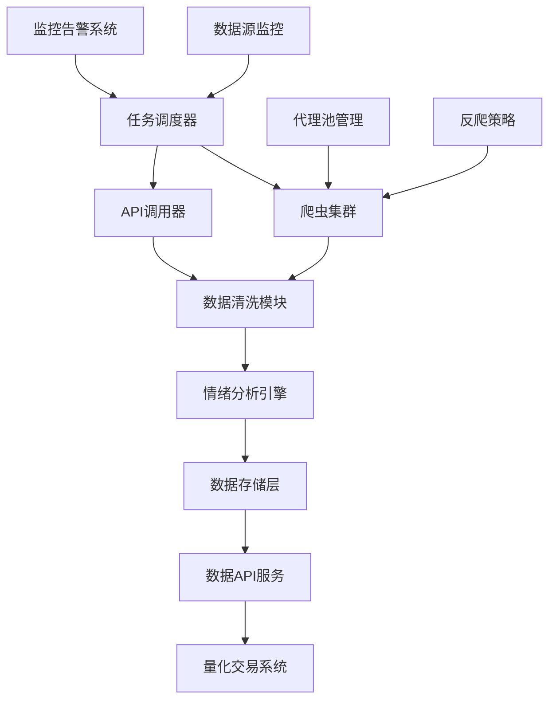
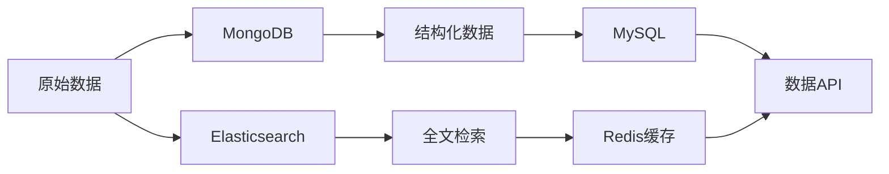

# 消息面数据获取技术方案

## 项目概述

本文档详细阐述了量化交易系统中消息面指标所需的原始数据获取方案，包括数据源分析、技术实现路径、成本评估和风险控制措施，为项目可行性评估提供技术依据。

## 1. 数据需求分析

### 1.1 数据类型需求

| 数据类型 | 数据内容 | 更新频率 | 重要程度 |
|---------|---------|---------|----------|
| 新闻资讯 | 财经新闻、公司公告、行业动态 | 实时 | 高 |
| 政策信息 | 政府政策、监管文件、会议纪要 | 日度 | 高 |
| 社交媒体 | 微博、股吧、雪球讨论 | 实时 | 中 |
| 搜索热度 | 百度指数、微信指数 | 日度 | 中 |
| 机构观点 | 研报、评级、调研 | 周度 | 高 |

### 1.2 数据质量要求

- **准确性**：数据来源可靠，内容真实有效
- **时效性**：关键信息需在30分钟内获取
- **完整性**：覆盖A股市场主要信息源
- **结构化**：支持自动化处理和分析

## 2. 数据源详细分析

### 2.1 新闻数据源

#### 2.1.1 免费数据源

**财经媒体官网**
- **财联社** (https://www.cls.cn/)
  - 优势：更新及时，内容权威
  - 获取方式：RSS订阅 + 网页爬虫
  - 技术难度：中等（有反爬机制）
  - 预估成本：免费

- **证券时报** (http://www.stcn.com/)
  - 优势：官方媒体，政策解读专业
  - 获取方式：RSS + API（需申请）
  - 技术难度：低
  - 预估成本：免费

- **上海证券报** (https://www.cnstock.com/)
  - 优势：权威性高，深度报道多
  - 获取方式：网页爬虫
  - 技术难度：中等
  - 预估成本：免费

**门户网站财经频道**
- **新浪财经** (https://finance.sina.com.cn/)
  - 优势：数据量大，更新快速
  - 获取方式：API + 爬虫
  - 技术难度：中等
  - 预估成本：免费（API有限制）

#### 2.1.2 付费数据源

**专业数据服务商**
- **Wind资讯**
  - 数据质量：★★★★★
  - 覆盖范围：全面
  - 年费：50-100万元
  - 技术接入：标准API

- **同花顺iFinD**
  - 数据质量：★★★★☆
  - 覆盖范围：较全面
  - 年费：30-80万元
  - 技术接入：API + 插件

- **东方财富Choice**
  - 数据质量：★★★★☆
  - 覆盖范围：全面
  - 年费：20-60万元
  - 技术接入：API接口

### 2.2 政策数据源

#### 2.2.1 官方政府网站

| 机构 | 网站 | 主要内容 | 获取方式 | 技术难度 |
|------|------|----------|----------|----------|
| 国务院 | www.gov.cn | 国家政策、重要会议 | 网页爬虫 | 低 |
| 证监会 | www.csrc.gov.cn | 证券监管政策 | RSS + 爬虫 | 低 |
| 央行 | www.pbc.gov.cn | 货币政策、金融监管 | 网页爬虫 | 低 |
| 发改委 | www.ndrc.gov.cn | 产业政策、投资政策 | 网页爬虫 | 低 |
| 工信部 | www.miit.gov.cn | 工业政策、科技政策 | 网页爬虫 | 低 |

#### 2.2.2 交易所公告

- **上海证券交易所** (www.sse.com.cn)
- **深圳证券交易所** (www.szse.cn)
- **北京证券交易所** (www.bse.cn)

### 2.3 社交媒体数据源

#### 2.3.1 主要平台分析

**新浪微博**
- 数据价值：散户情绪、热点话题
- 获取方式：官方API（需申请）
- 技术难度：中等
- 成本：API调用费用约10-50万/年
- 限制：API调用次数限制

**东方财富股吧**
- 数据价值：股票讨论、投资观点
- 获取方式：网页爬虫
- 技术难度：高（反爬严格）
- 成本：技术开发成本
- 风险：法律合规风险

**雪球**
- 数据价值：专业投资者观点
- 获取方式：API + 爬虫
- 技术难度：中等
- 成本：较低
- 特点：用户质量相对较高

### 2.4 搜索热度数据源

**百度指数**
- 获取方式：官方API（需申请）+ 爬虫
- 成本：API费用约5-20万/年
- 数据内容：搜索量、媒体关注度、人群画像
- 技术难度：中等

**微信指数**
- 获取方式：小程序接口
- 成本：较低
- 数据内容：微信生态内搜索热度
- 技术难度：低

### 2.5 专业机构数据源

**券商研报**
- 数据来源：各大券商官网、慧博投研
- 获取方式：API + 爬虫
- 成本：慧博投研约10-30万/年
- 数据价值：专业分析、评级变化

## 3. 技术实现方案

### 3.1 系统架构设计

### 3.2 核心技术组件

#### 3.2.1 分布式爬虫系统

**技术栈**
- **框架**：Scrapy + Scrapy-Redis
- **代理管理**：ProxyPool
- **反爬对抗**：Selenium + undetected-chromedriver
- **任务调度**：Celery + Redis

**关键特性**
- 支持分布式部署
- 自动代理轮换
- 智能反爬检测
- 断点续爬功能

#### 3.2.2 数据处理流水线

**实时流处理**
- **消息队列**：Apache Kafka
- **流处理引擎**：Apache Flink
- **数据清洗**：自定义规则引擎

**批处理系统**
- **任务调度**：Apache Airflow
- **数据处理**：Apache Spark
- **存储系统**：MongoDB + Elasticsearch

#### 3.2.3 情绪分析引擎

**技术方案**
- **预训练模型**：BERT-base-chinese
- **微调数据**：金融领域标注数据
- **部署方案**：TensorFlow Serving
- **性能优化**：模型量化、批处理

### 3.3 数据存储方案

#### 3.3.1 存储架构

#### 3.3.2 存储策略

- **原始数据**：MongoDB（文档存储）
- **结构化数据**：MySQL（关系存储）
- **搜索索引**：Elasticsearch（全文检索）
- **缓存层**：Redis（高频访问数据）

## 4. 实施计划

### 4.1 分阶段实施策略

#### 第一阶段：基础数据获取（1-2个月）
- 搭建基础爬虫框架
- 接入主要免费新闻源
- 实现政策数据采集
- 建立基础数据存储

#### 第二阶段：数据处理优化（2-3个月）
- 部署情绪分析引擎
- 优化数据清洗流程
- 接入社交媒体数据
- 建立监控告警系统

#### 第三阶段：系统完善（3-4个月）
- 接入付费数据源
- 优化系统性能
- 完善API服务
- 进行压力测试

### 4.2 人力资源需求

| 角色 | 人数 | 技能要求 | 工作内容 |
|------|------|----------|----------|
| 项目经理 | 1 | 项目管理、技术背景 | 整体协调、进度管控 |
| 后端工程师 | 2-3 | Python、分布式系统 | 爬虫开发、API开发 |
| 算法工程师 | 1-2 | NLP、机器学习 | 情绪分析、数据挖掘 |
| 运维工程师 | 1 | Linux、Docker、K8s | 系统部署、监控维护 |
| 测试工程师 | 1 | 自动化测试 | 功能测试、性能测试 |

## 5. 成本分析

### 5.1 硬件成本

| 资源类型 | 配置 | 数量 | 月费用 | 年费用 |
|----------|------|------|--------|--------|
| 爬虫服务器 | 8核16G | 5台 | 2,500元 | 30,000元 |
| 数据库服务器 | 16核32G | 2台 | 2,000元 | 24,000元 |
| 存储服务器 | 10TB SSD | 1台 | 1,500元 | 18,000元 |
| 代理服务 | 高匿代理池 | - | 3,000元 | 36,000元 |
| **小计** | | | **9,000元** | **108,000元** |

### 5.2 软件成本

| 项目 | 年费用 | 说明 |
|------|--------|------|
| 数据库许可 | 50,000元 | MongoDB企业版 |
| 监控工具 | 30,000元 | 专业监控平台 |
| 开发工具 | 20,000元 | IDE、版本控制等 |
| **小计** | **100,000元** | |

### 5.3 数据采购成本

| 数据源 | 年费用 | 必要性 |
|--------|--------|--------|
| Wind资讯 | 500,000元 | 可选 |
| 同花顺iFinD | 300,000元 | 可选 |
| 微博API | 200,000元 | 推荐 |
| 百度指数API | 100,000元 | 推荐 |
| **小计** | **1,100,000元** | 根据预算选择 |

### 5.4 人力成本

| 角色 | 月薪 | 人数 | 年费用 |
|------|------|------|--------|
| 项目经理 | 25,000元 | 1 | 300,000元 |
| 后端工程师 | 20,000元 | 3 | 720,000元 |
| 算法工程师 | 22,000元 | 2 | 528,000元 |
| 运维工程师 | 18,000元 | 1 | 216,000元 |
| 测试工程师 | 15,000元 | 1 | 180,000元 |
| **小计** | | | **1,944,000元** |

### 5.5 总成本估算

| 成本类型 | 年费用 | 占比 |
|----------|--------|------|
| 人力成本 | 1,944,000元 | 61.8% |
| 数据采购 | 600,000元 | 19.1% |
| 硬件成本 | 108,000元 | 3.4% |
| 软件成本 | 100,000元 | 3.2% |
| 其他费用 | 400,000元 | 12.7% |
| **总计** | **3,152,000元** | **100%** |

## 6. 风险评估与控制

### 6.1 技术风险

#### 6.1.1 反爬虫风险
**风险描述**：目标网站加强反爬虫机制
**影响程度**：高
**应对措施**：
- 建立多层代理池
- 使用浏览器自动化工具
- 开发智能反爬检测系统
- 与数据源建立合作关系

#### 6.1.2 数据质量风险
**风险描述**：获取数据存在噪音、错误
**影响程度**：中
**应对措施**：
- 多源数据交叉验证
- 建立数据质量评估体系
- 人工抽样检查
- 异常数据自动过滤

### 6.2 合规风险

#### 6.2.1 法律合规风险
**风险描述**：数据获取可能涉及法律问题
**影响程度**：高
**应对措施**：
- 严格遵守robots.txt协议
- 控制访问频率
- 优先使用官方API
- 咨询法律专家意见

#### 6.2.2 隐私保护风险
**风险描述**：处理用户数据涉及隐私问题
**影响程度**：中
**应对措施**：
- 数据脱敏处理
- 遵循数据保护法规
- 建立数据使用规范
- 定期安全审计

### 6.3 运营风险

#### 6.3.1 系统稳定性风险
**风险描述**：系统故障影响数据获取
**影响程度**：中
**应对措施**：
- 建立高可用架构
- 实施自动故障恢复
- 建立完善监控体系
- 制定应急预案

#### 6.3.2 成本控制风险
**风险描述**：项目成本超出预算
**影响程度**：中
**应对措施**：
- 分阶段投入
- 严格成本监控
- 优化资源配置
- 建立成本预警机制

## 7. 可行性评估

### 7.1 技术可行性

**评估结果**：★★★★☆（高度可行）

**支撑因素**：
- 技术方案成熟，有大量开源工具支持
- 团队具备相关技术经验
- 数据源相对开放，获取难度适中
- 有成功案例可以参考

**风险因素**：
- 反爬虫技术不断升级
- 部分数据源访问限制较严
- 数据质量控制需要持续优化

### 7.2 经济可行性

**评估结果**：★★★☆☆（中等可行）

**支撑因素**：
- 消息面数据对量化交易价值较高
- 可以分阶段投入，控制风险
- 后期可以对外提供数据服务

**风险因素**：
- 初期投入较大，回报周期较长
- 数据采购成本较高
- 人力成本占比较大

### 7.3 运营可行性

**评估结果**：★★★★☆（高度可行）

**支撑因素**：
- 有明确的业务需求
- 技术团队配置合理
- 项目计划详细可执行

**风险因素**：
- 需要持续的运维投入
- 数据源变化需要及时应对
- 合规要求需要持续关注

## 8. 建议与结论

### 8.1 实施建议

1. **分阶段实施**：建议采用分阶段实施策略，先从免费数据源开始，逐步扩展到付费数据源

2. **技术选型**：优先选择成熟稳定的开源技术，降低技术风险

3. **团队建设**：重点招聘有爬虫和NLP经验的工程师

4. **合规优先**：在项目初期就要考虑合规问题，避免后期法律风险

5. **成本控制**：严格控制项目成本，建立成本监控机制

### 8.2 关键成功因素

1. **技术团队能力**：需要有经验丰富的技术团队
2. **数据源稳定性**：确保关键数据源的稳定获取
3. **系统架构设计**：需要设计高可用、可扩展的系统架构
4. **合规风险控制**：严格遵守相关法律法规
5. **持续优化能力**：需要持续优化数据质量和系统性能

### 8.3 总体结论

消息面数据获取项目在技术上是可行的，但需要较大的投入和专业的团队。建议：

1. **短期方案**：先实施基于免费数据源的方案，投入约100万元
2. **中期方案**：根据效果评估，逐步接入付费数据源
3. **长期方案**：建设完整的消息面数据平台，对外提供服务

项目预期能够为量化交易系统提供有价值的消息面数据支持，但需要做好充分的风险控制和成本管理。

---

**文档版本**：v1.0  
**编制日期**：2024年  
**审核状态**：待评估  
**联系人**：项目负责人