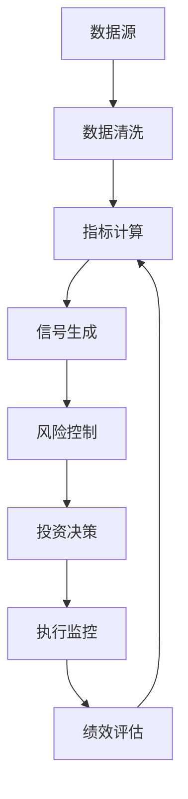

# 持仓股票量化分析指标体系

## 概述

本文档基于持仓股票量化分析与决策策略体系的需求，系统性地梳理用于持仓股票分析的各类金融指标。指标体系专门服务于持仓股票的未来走势预测和操作建议生成，涵盖技术面、基本面、市场面和风险管理四个维度。

## 1. 技术分析指标 (Technical Analysis Indicators)

### 1.1 动量因子指标 (Momentum Indicators)

#### 收益率指标
- **短期收益率**：1日、3日、5日收益率
- **中期收益率**：10日、20日、60日收益率  
- **长期收益率**：120日、250日收益率
- **相对强弱**：个股vs行业、个股vs市场的相对表现
- 计算数据：收盘价（Close Price）
- 计算公式：收益率 = (P_t - P_{t-n}) / P_{t-n}
- 数据粒度：日级
- Tushare获取：daily接口获取日线数据

#### 移动平均线 (Moving Averages)
- **简单移动平均线 (SMA)**：5日、10日、20日、60日、120日、250日
- **指数移动平均线 (EMA)**：12日、26日、50日、200日
- 计算数据：收盘价（Close Price）
- 计算公式：SMA(n) = (P1 + P2 + ... + Pn) / n
- 数据粒度：日级
- Tushare获取：daily接口获取日线数据，自行计算均线

### 1.2 反转因子指标 (Reversal Indicators)

#### 相对强弱指数 (RSI)
- 作用：识别超买超卖状态，预测价格反转
- 计算数据：收盘价（Close Price）
- 计算公式：RSI = 100 - 100/(1 + RS)，其中RS = 平均上涨幅度/平均下跌幅度
- 常用周期：14日、21日、9日
- 判断标准：RSI > 70超买，RSI < 30超卖
- Tushare获取：daily接口获取日线数据，自行计算RSI

#### 威廉指标 (%R)
- 作用：识别超买超卖状态
- 计算数据：最高价（High）、最低价（Low）、收盘价（Close）
- 计算公式：%R = (Hn - C) / (Hn - Ln) × (-100)
- 常用周期：14日、21日
- 判断标准：%R > -20超买，%R < -80超卖
- Tushare获取：daily接口获取日线数据，自行计算

#### MACD (Moving Average Convergence Divergence)
- 作用：识别趋势变化和买卖信号
- 计算数据：收盘价（Close Price）
- 计算公式：MACD = EMA(12) - EMA(26)，Signal = EMA(MACD, 9)，Histogram = MACD - Signal
- 常用参数：快线12日、慢线26日、信号线9日
- 信号判断：MACD上穿Signal线买入，下穿卖出
- Tushare获取：daily接口获取日线数据，自行计算MACD

#### 威廉指标 (%R)
- 说明：衡量收盘价在最近N期最高最低价区间中的位置
- 作用：识别超买超卖状态
- 应用：短期反转交易
- 计算数据：最高价（High）、最低价（Low）、收盘价（Close）
- 计算公式：%R = (Hn - C) / (Hn - Ln) × (-100)
- 数据粒度：分钟级、小时级、日级
- 常用周期：14日、21日
- 判断标准：%R > -20超买，%R < -80超卖

### 1.3 波动率因子指标 (Volatility Indicators)

#### 历史波动率
- 作用：衡量价格波动程度
- 计算数据：收盘价（Close Price）
- 计算公式：σ = √(Σ(ln(P_t/P_{t-1}) - μ)² / (n-1))
- 常用周期：20日、60日、120日波动率
- Tushare获取：daily接口获取日线数据，自行计算波动率

#### 平均真实波幅 (ATR)
- 作用：量化市场波动性，用于止损设置
- 计算数据：最高价（High）、最低价（Low）、收盘价（Close）
- 计算公式：TR = MAX(H-L, |H-C_prev|, |L-C_prev|)，ATR = SMA(TR, n)
- 常用周期：14日、21日
- Tushare获取：daily接口获取日线数据，自行计算ATR

#### 布林带宽度
- 作用：衡量价格通道宽度，反映波动率水平
- 计算数据：收盘价（Close Price）
- 计算公式：带宽 = (上轨 - 下轨) / 中轨
- 参数设置：周期20日，标准差倍数2
- Tushare获取：daily接口获取日线数据，自行计算布林带

### 1.4 成交量因子指标 (Volume Indicators)

#### 成交量相关指标
- **成交量**：日成交量、成交量移动平均
- **成交额**：日成交额、成交额移动平均
- **换手率**：成交量/流通股本
- **量价关系**：价涨量增、价跌量缩等模式识别
- 计算数据：成交量（Volume）、成交额（Amount）、流通股本
- 常用周期：5日、10日、20日、60日均量
- Tushare获取：daily接口获取成交量、成交额数据

#### 能量潮 (OBV)
- 作用：通过成交量变化预测价格趋势
- 计算数据：收盘价（Close）、成交量（Volume）
- 计算公式：
  - 若收盘价上涨：OBV = 前日OBV + 当日成交量
  - 若收盘价下跌：OBV = 前日OBV - 当日成交量
- 分析要点：OBV与价格同向运动确认趋势，背离预示反转
- Tushare获取：daily接口获取价格和成交量数据，自行计算OBV

#### 资金流量指标 (MFI)
- 作用：衡量资金流入流出强度
- 计算数据：最高价、最低价、收盘价、成交量
- 计算公式：MFI = 100 - 100/(1 + 资金流量比率)
- 常用周期：14日
- 判断标准：MFI > 80超买，MFI < 20超卖
- Tushare获取：daily接口获取OHLCV数据，自行计算MFI

## 2. 基本面因子指标 (Fundamental Analysis Indicators)

### 2.1 估值因子指标 (Valuation Factor Metrics)

#### 市盈率 (P/E Ratio)
- 说明：股价与每股收益的比率
- 作用：衡量股票估值水平
- 应用：价值投资、相对估值分析
- 计算数据：股价（Stock Price）、每股收益（EPS）
- 计算公式：P/E = 股价 / 每股收益
- 数据来源：财务报表（年报、季报）、实时股价
- 数据频率：季度更新（财务数据）、实时更新（股价）
- 分类：静态P/E（TTM）、动态P/E（预测）
- Tushare获取：daily_basic接口获取PE数据，或通过daily和fina_indicator接口计算

#### 市净率 (P/B Ratio)
- 说明：股价与每股净资产的比率
- 作用：衡量股票相对于账面价值的估值
- 应用：价值投资、破净股筛选
- 计算数据：股价（Stock Price）、每股净资产（BVPS）
- 计算公式：P/B = 股价 / 每股净资产
- 数据来源：财务报表（资产负债表）、实时股价
- 数据频率：季度更新（净资产）、实时更新（股价）
- 判断标准：P/B < 1为破净股
- Tushare获取：daily_basic接口获取PB数据

#### 市销率 (P/S Ratio)
- 说明：市值与销售收入的比率
- 作用：适用于亏损企业的估值
- 应用：成长股估值、行业比较
- 计算数据：市值（Market Cap）、营业收入（Revenue）
- 计算公式：P/S = 市值 / 年营业收入
- 数据来源：财务报表（利润表）、股价×总股本
- 数据频率：季度更新（收入）、实时更新（市值）
- 适用场景：亏损公司、高成长企业
- Tushare获取：daily_basic接口获取市值，income接口获取营业收入

#### 企业价值倍数 (EV/EBITDA)
- 说明：企业价值与息税折旧摊销前利润的比率
- 作用：消除资本结构差异的估值指标
- 应用：并购估值、跨国比较
- 计算数据：企业价值（EV）、EBITDA
- 计算公式：EV/EBITDA = (市值 + 净债务) / EBITDA
- 数据来源：财务报表（利润表、资产负债表）、市值
- 数据频率：季度更新（EBITDA、债务）、实时更新（市值）
- 企业价值：市值 + 总债务 - 现金及等价物
- Tushare获取：balancesheet接口获取债务数据，income接口获取EBITDA相关数据

### 2.2 盈利质量因子指标 (Profitability Quality Metrics)

#### 盈利能力指标
- **净资产收益率 (ROE)**：净利润/股东权益
- **总资产收益率 (ROA)**：净利润/总资产
- **毛利率**：毛利润/营业收入
- **净利率**：净利润/营业收入
- **EBITDA利润率**：EBITDA/营业收入
- 数据频率：季度、年度
- Tushare获取：fina_indicator接口获取财务指标数据
- 杜邦分析：ROE = 净利率 × 资产周转率 × 权益乘数

#### 盈利稳定性指标
- **ROE稳定性**：ROE的标准差和变异系数
- **净利润增长稳定性**：净利润增长率的波动性
- **收入确认质量**：经营性现金流/净利润
- **盈利持续性**：核心业务利润占比
- 计算方法：基于多期财务数据计算稳定性指标
- Tushare获取：income接口获取利润表数据，cashflow接口获取现金流数据

#### 盈利增长质量
- **净利润增长率**：同比和环比增长率
- **营收增长率**：营业收入增长的可持续性
- **盈利增长匹配度**：净利润增长与营收增长的匹配程度
- **非经常性损益占比**：剔除一次性收益后的盈利质量
- 计算公式：增长率 = (当期值 - 上期值) / 上期值 × 100%
- Tushare获取：income接口获取多期利润表数据进行计算

### 2.3 成长因子指标 (Growth Factor Metrics)

#### 营收增长因子
- **营收增长率**：同比、环比、复合增长率（CAGR）
- **营收增长稳定性**：营收增长率的标准差
- **营收增长趋势**：营收增长率的趋势斜率
- **营收增长加速度**：营收增长率的二阶导数
- 计算公式：增长率 = (当期收入 - 上期收入) / 上期收入 × 100%
- Tushare获取：income接口获取多期营业收入数据

#### 盈利增长因子
- **净利润增长率**：剔除非经常性损益的净利润增长
- **EPS增长率**：每股收益的增长速度
- **经营性利润增长率**：经营性利润的增长质量
- **盈利增长持续性**：连续增长的季度数
- 计算方法：基于多期财务数据计算增长指标
- Tushare获取：income接口和fina_indicator接口

#### 成长质量评估
- **PEG比率**：P/E / 盈利增长率
- **成长效率**：增长投入与产出的比率
- **市场份额增长**：相对于行业的增长速度
- **研发投入增长**：研发费用的增长趋势
- 判断标准：PEG < 1被认为估值合理或低估
- Tushare获取：结合市场数据和财务数据计算

### 2.4 财务质量因子指标 (Financial Quality Factor Metrics)

#### 偿债能力因子
- **流动比率**：流动资产/流动负债
- **速动比率**：(流动资产-存货-预付费用)/流动负债
- **现金比率**：货币资金/流动负债
- **资产负债率**：总负债/总资产
- **利息保障倍数**：息税前利润/利息费用
- 判断标准：流动比率>2较安全，资产负债率<70%
- Tushare获取：balancesheet接口获取资产负债表数据

#### 营运能力因子
- **总资产周转率**：营业收入/平均总资产
- **应收账款周转率**：营业收入/平均应收账款
- **存货周转率**：营业成本/平均存货
- **现金周转周期**：存货周转天数+应收账款周转天数-应付账款周转天数
- 计算方法：基于资产负债表和利润表数据计算
- Tushare获取：balancesheet和income接口

#### 现金流质量因子
- **经营现金流/净利润**：经营性现金流量净额/净利润
- **自由现金流**：经营性现金流-资本支出
- **现金流稳定性**：经营性现金流的变异系数
- **现金创造能力**：经营性现金流/营业收入
- 质量标准：经营现金流/净利润 > 1为优质
- Tushare获取：cashflow接口获取现金流量表数据

#### 资本结构因子
- **权益乘数**：总资产/股东权益
- **长期债务比率**：长期负债/总资产
- **债务股权比**：总负债/股东权益
- **财务杠杆稳定性**：杠杆比率的时间序列稳定性
- 风险评估：高杠杆需关注偿债能力和盈利稳定性
- Tushare获取：balancesheet接口获取相关数据

## 3. 市场面因子指标 (Market Factor Indicators)

### 3.1 市场表现因子 (Market Performance Factors)

#### 相对强度指标
- **相对强度 (RS)**：个股表现/基准指数表现
- **行业相对强度**：个股表现/所属行业表现
- **市场Beta系数**：个股收益率对市场收益率的敏感性
- **Alpha系数**：超越市场基准的超额收益
- 计算数据：个股收益率、市场指数收益率、行业指数收益率
- 计算公式：β = Cov(股票收益率, 市场收益率) / Var(市场收益率)
- Tushare获取：daily接口获取个股数据，index_daily接口获取指数数据

#### 市场情绪因子
- **换手率相对水平**：当前换手率/历史平均换手率
- **成交量相对水平**：当前成交量/历史平均成交量
- **价格位置**：(当前价格-近期最低价)/(近期最高价-近期最低价)
- **涨跌停频率**：近期涨跌停次数统计
- 计算方法：基于历史交易数据计算相对指标
- Tushare获取：daily接口获取交易数据，limit_list接口获取涨跌停数据

### 3.2 市场流动性因子 (Market Liquidity Factors)

#### 流动性指标
- **日均成交额**：近期日均成交金额
- **成交额占比**：个股成交额/市场总成交额
- **流通市值**：可交易股份的市场价值
- **自由流通比例**：自由流通股本/总股本
- 计算方法：基于成交数据和股本结构计算
- Tushare获取：daily接口获取成交数据，share_float接口获取流通股本

#### 市场深度指标
- **买卖价差**：买一价与卖一价的差额
- **订单簿深度**：各价位的挂单量
- **冲击成本**：大额交易对价格的影响
- **流动性比率**：成交量/价格波动的比值
- 数据来源：Level-2行情数据、逐笔成交数据
- 应用：评估交易执行难度和成本

## 4. 风险管理指标 (Risk Management Indicators)

### 4.1 持仓风险控制指标 (Position Risk Control Metrics)

#### 止损指标
- **技术止损位**：基于支撑位、移动平均线的止损点
- **百分比止损**：固定百分比的止损幅度（如-10%）
- **ATR止损**：基于平均真实波幅的动态止损
- **时间止损**：持仓时间超过预设期限的止损
- 计算方法：结合技术分析和风险承受能力设定
- 应用：控制单笔交易最大损失

#### 仓位管理指标
- **单股仓位比例**：单只股票占总资金的比例
- **行业集中度**：同行业股票仓位占比
- **仓位风险度**：当前仓位的风险暴露程度
- **资金使用率**：已用资金/总可用资金
- 风险控制：单股仓位不超过10%，单行业不超过30%
- 动态调整：根据市场环境和个股表现调整仓位

#### 回撤控制指标
- **最大回撤**：从峰值到谷值的最大跌幅
- **连续亏损天数**：连续下跌的交易日数量
- **回撤恢复时间**：从最大回撤恢复到前期高点的时间
- **风险价值(VaR)**：在一定置信水平下的最大可能损失
- 计算公式：VaR = 投资组合价值 × 收益率分位数
- 监控频率：日度计算，实时监控

### 4.2 市场风险指标 (Market Risk Metrics)

#### 系统性风险指标
- **Beta系数**：个股相对市场的敏感性
- **相关系数**：个股与市场指数的相关程度
- **下行Beta**：下跌市场中的Beta系数
- **市场暴露度**：投资组合对市场风险的暴露程度
- 计算公式：β = Cov(Ri, Rm) / Var(Rm)
- 数据周期：通常使用过去1-2年的日度数据
- Tushare获取：daily接口获取个股和指数数据

#### 波动率风险指标
- **历史波动率**：基于历史价格的波动率
- **隐含波动率**：基于期权价格的预期波动率
- **波动率分位数**：当前波动率在历史分布中的位置
- **GARCH波动率**：基于GARCH模型的条件波动率
- 计算方法：滚动窗口计算，通常使用20-60日数据
- 风险评估：高波动率需要降低仓位或加强止损

### 4.3 流动性风险指标 (Liquidity Risk Metrics)

#### 交易流动性指标
- **日均成交额**：评估股票的交易活跃度
- **换手率**：成交量相对流通股本的比例
- **买卖价差**：衡量交易成本和流动性
- **市场深度**：各价位的挂单量分布
- 流动性标准：日均成交额>1000万，换手率>0.5%
- 风险控制：低流动性股票限制仓位规模

#### 冲击成本指标
- **价格冲击**：大额交易对价格的影响
- **执行成本**：实际成交价与决策价的偏差
- **滑点成本**：预期价格与实际成交价的差异
- **时间成本**：完成交易所需的时间成本
- 计算方法：基于历史交易数据和订单簿深度
- 应用：优化交易执行策略，降低交易成本

## 5. 市场微观结构指标 (Market Microstructure Indicators)

### 4.1 订单流指标 (Order Flow Metrics)

#### 订单失衡 (Order Imbalance)
- 说明：买单与卖单数量或金额的差异
- 作用：预测短期价格方向
- 应用：高频交易、市场做市
- 计算数据：买单量、卖单量（数量或金额）
- 计算公式：失衡度 = (买单量 - 卖单量) / (买单量 + 卖单量)
- 数据来源：Level 2行情数据、逐笔成交数据
- 数据频率：实时计算，通常按秒级或分钟级聚合
- 判断标准：正值表示买盘占优，负值表示卖盘占优

#### 大单净流入 (Large Order Net Flow)
- 说明：大额买单与卖单的净差额
- 作用：识别机构资金动向
- 应用：跟庄策略、资金流向分析
- 计算数据：大单买入金额、大单卖出金额
- 计算公式：大单净流入 = 大单买入金额 - 大单卖出金额
- 数据来源：逐笔成交数据、大宗交易数据
- 数据频率：实时计算，通常按日、周统计
- 大单标准：通常以单笔成交金额超过一定阈值（如50万元）定义

#### 主动买卖比 (Buy/Sell Ratio)
- 说明：主动买入与主动卖出的比例
- 作用：衡量市场情绪倾向
- 应用：短期趋势判断、情绪指标
- 计算数据：主动买入量、主动卖出量
- 计算公式：买卖比 = 主动买入量 / 主动卖出量
- 数据来源：逐笔成交数据（区分主动买卖）
- 数据频率：实时计算，通常按分钟、小时、日统计
- 判断方法：通过成交价与买卖价的关系判断主动性

### 4.2 价格发现指标 (Price Discovery Metrics)

#### 价格效率指标 (Price Efficiency)
- 说明：价格对新信息的反应速度和准确性
- 作用：评估市场有效性
- 应用：套利机会识别、市场质量评估

#### 信息比率 (Information Ratio)
- 说明：主动收益与跟踪误差的比值
- 作用：衡量主动管理的信息价值
- 应用：基金经理评估、策略优化

### 4.3 交易成本指标 (Transaction Cost Metrics)

#### 实施差额 (Implementation Shortfall)
- 说明：实际执行价格与决策时点价格的差异
- 作用：全面衡量交易执行质量
- 应用：执行算法评估、交易成本控制

#### TWAP偏差 (TWAP Deviation)
- 说明：实际成交价格与时间加权平均价格的偏差
- 作用：评估交易执行效果
- 应用：算法交易评估、执行策略优化

## 6. 宏观经济指标 (Macroeconomic Indicators)

### 5.1 经济增长指标 (Economic Growth Metrics)

#### GDP增长率
- 说明：国内生产总值的增长速度
- 作用：衡量经济整体发展水平
- 应用：宏观策略配置、周期性行业分析
- 计算数据：当期GDP、上期GDP（名义或实际GDP）
- 计算公式：GDP增长率 = (当期GDP - 上期GDP) / 上期GDP × 100%
- 数据来源：国家统计局、央行、国际组织
- 数据频率：季度发布，年度汇总
- 分析维度：同比增长率、环比增长率、年化增长率

#### 工业增加值
- 说明：工业部门的产出增长
- 作用：反映实体经济活跃度
- 应用：周期股投资、经济周期判断
- 计算数据：工业总产值、中间投入
- 计算公式：工业增加值 = 工业总产值 - 中间投入
- 数据来源：国家统计局、工信部
- 数据频率：月度发布
- 行业分类：按行业、地区、企业规模分类统计

#### PMI指数
- 说明：采购经理人指数，反映制造业景气度
- 作用：领先经济指标，预测经济走势
- 应用：经济周期判断、行业轮动策略
- 计算数据：新订单、生产、就业、供应商配送、库存等分项指数
- 计算公式：PMI = 各分项指数加权平均
- 数据来源：中国物流与采购联合会、国家统计局
- 数据频率：月度发布
- 判断标准：PMI > 50表示扩张，< 50表示收缩

### 5.2 通胀指标 (Inflation Metrics)

#### CPI (消费者价格指数)
- 说明：衡量消费品和服务价格变化
- 作用：反映通胀水平和货币购买力
- 应用：货币政策预测、实际收益率计算
- 计算数据：代表性商品和服务的价格、权重
- 计算公式：CPI = Σ(商品价格 × 权重) / 基期CPI × 100
- 数据来源：国家统计局价格调查
- 数据频率：月度发布
- 分类：食品、居住、交通、医疗、教育文化娱乐等八大类

#### PPI (生产者价格指数)
- 说明：衡量生产环节价格变化
- 作用：预测未来通胀趋势
- 应用：成本传导分析、上游行业投资
- 计算数据：工业产品出厂价格
- 计算公式：PPI = Σ(产品价格 × 权重) / 基期PPI × 100
- 数据来源：国家统计局工业价格调查
- 数据频率：月度发布
- 传导机制：PPI变化通常领先CPI 3-6个月

#### 核心通胀率
- 说明：剔除食品和能源的通胀率
- 作用：反映潜在通胀趋势
- 应用：货币政策分析、长期投资决策
- 计算数据：剔除食品和能源后的CPI分项
- 计算公式：核心CPI增长率 = (当期核心CPI - 上期核心CPI) / 上期核心CPI × 100%
- 数据来源：基于CPI数据计算
- 数据频率：月度计算
- 优势：排除短期波动因素，更好反映通胀趋势

### 5.3 货币政策指标 (Monetary Policy Metrics)

#### 基准利率
- 说明：央行设定的政策利率
- 作用：影响整体利率水平和流动性
- 应用：利率敏感性分析、债券投资策略
- 计算数据：央行公布的政策利率（如LPR、MLF利率）
- 数据来源：中国人民银行、全国银行间同业拆借中心
- 数据频率：不定期调整，通常在货币政策会议后公布
- 传导机制：政策利率→市场利率→实体经济
- 影响范围：银行放贷利率、债券收益率、汇率、股市估值

#### 货币供应量 (M1, M2)
- 说明：不同层次的货币供应量指标
- 作用：反映货币政策松紧程度
- 应用：流动性分析、通胀预测
- 计算数据：现金、活期存款、定期存款等
- 计算公式：M1 = M0 + 企业活期存款，M2 = M1 + 准货币
- 数据来源：中国人民银行货币当局资产负债表
- 数据频率：月度发布
- 分析指标：M1、M2增速，M1-M2剪刀差

#### 收益率曲线
- 说明：不同期限债券收益率的组合
- 作用：反映市场对未来利率和经济的预期
- 应用：经济周期判断、债券配置策略
- 计算数据：不同期限国债收益率（1月、3月、6月、1年、3年、5年、10年等）
- 数据来源：银行间债券市场、交易所债券市场
- 数据频率：实时更新（交易时间内）
- 形态分析：正常型、平坦型、倒挂型曲线的经济含义

## 7. 情绪指标 (Sentiment Indicators)

### 6.1 市场情绪指标 (Market Sentiment Metrics)

#### VIX恐慌指数
- 说明：基于期权价格计算的隐含波动率
- 作用：衡量市场恐慌程度
- 应用：逆向投资、风险管理
- 计算数据：标的指数期权的隐含波动率
- 计算公式：基于Black-Scholes模型的隐含波动率加权平均
- 数据来源：期权交易数据（如上证50ETF期权）
- 数据频率：实时计算（期权交易时间内）
- 判断标准：VIX > 30高恐慌，20-30中等，< 20低恐慌

#### 投资者情绪指数
- 说明：基于调查或行为数据的情绪量化
- 作用：识别市场极端情绪
- 应用：反向投资策略、市场时机选择
- 计算数据：新增开户数、换手率、涨跌停比例、融资买入占比等
- 计算公式：各分项指标标准化后加权合成
- 数据来源：交易所、券商、调研机构
- 数据频率：日度、周度计算
- 应用原理：极端乐观或悲观情绪往往预示反转

#### 融资融券余额
- 说明：市场杠杆资金的规模
- 作用：反映投资者风险偏好
- 应用：市场情绪监控、风险预警
- 计算数据：融资余额、融券余额
- 计算公式：融资融券余额 = 融资余额 + 融券余额
- 数据来源：交易所融资融券交易数据
- 数据频率：日度更新
- 分析维度：余额变化、占流通市值比例、融资买入占成交比例

### 6.2 资金流向指标 (Fund Flow Metrics)

#### 北向资金净流入
- 说明：外资通过沪深港通的净买入金额
- 作用：反映外资对A股的态度
- 应用：外资动向跟踪、市场情绪判断
- 计算数据：沪股通买入金额、卖出金额，深股通买入金额、卖出金额
- 计算公式：北向资金净流入 = (沪股通买入 - 沪股通卖出) + (深股通买入 - 深股通卖出)
- 数据来源：上海证券交易所、深圳证券交易所
- 数据频率：实时更新（交易时间内），日度汇总
- 分析维度：单日流入、累计流入、持股市值变化

#### ETF申赎数据
- 说明：交易型开放式基金的申购赎回情况
- 作用：反映机构投资者的配置意向
- 应用：资金流向分析、行业轮动判断
- 计算数据：ETF申购份额、赎回份额、净申购份额
- 计算公式：净申购 = 申购份额 - 赎回份额
- 数据来源：基金公司、交易所ETF交易数据
- 数据频率：日度更新
- 分析重点：宽基ETF、行业ETF、主题ETF的资金流向差异

#### 新增开户数
- 说明：新开立证券账户的数量
- 作用：反映散户参与热情
- 应用：市场情绪监控、散户行为分析
- 计算数据：新开A股账户数量
- 数据来源：中国证券登记结算有限责任公司
- 数据频率：周度发布
- 历史规律：牛市期间新增开户数显著增加，熊市期间大幅减少

## 8. 消息面指标 (News & Policy Sentiment Indicators)

### 7.1 新闻情绪指标 (News Sentiment Metrics)

#### 新闻情绪得分
- **说明**：基于自然语言处理技术量化新闻情绪
- **作用**：捕捉市场对公司或行业的情绪变化
- **应用**：事件驱动策略、风险预警、择时交易
- **计算数据**：新闻标题、新闻正文、发布时间、媒体权重
- **计算公式**：情绪得分 = Σ(单条新闻情绪值 × 媒体权重 × 时间衰减因子) / 新闻总数
- **数据来源**：财经媒体、官方公告、社交媒体、研报
- **数据频率**：实时更新，通常按小时或日度聚合
- **技术实现**：
  - 情绪词典：构建金融领域专用情绪词典
  - 机器学习：使用BERT、GPT等预训练模型
  - 权重设计：核心媒体权重更高，时效性衰减
- **判断标准**：得分 > 0.6积极，-0.6到0.6中性，< -0.6消极

#### 新闻热度指数
- **说明**：衡量特定股票或主题的新闻关注度
- **作用**：识别市场关注焦点和热点轮动
- **应用**：主题投资、热点追踪、风险监控
- **计算数据**：新闻数量、阅读量、转发量、评论数
- **计算公式**：热度指数 = Σ(新闻数量 × 媒体影响力 × 互动系数)
- **数据来源**：新闻网站、财经APP、社交平台
- **数据频率**：实时监控，日度统计
- **关键指标**：
  - 新闻密度：单位时间内新闻发布频率
  - 传播广度：新闻在不同平台的覆盖面
  - 互动强度：用户参与度（点赞、评论、分享）

#### 负面新闻预警指标
- **说明**：专门识别和量化负面新闻的影响
- **作用**：提前预警潜在风险事件
- **应用**：风险管理、止损策略、危机公关
- **计算数据**：负面关键词频率、新闻严重程度、影响范围
- **计算公式**：风险等级 = 负面程度 × 传播范围 × 可信度权重
- **数据来源**：监管公告、媒体报道、举报平台
- **数据频率**：实时监控，紧急事件即时推送
- **风险分类**：
  - 财务风险：业绩造假、资金链断裂、审计问题
  - 合规风险：违法违规、监管处罚、诉讼纠纷
  - 经营风险：产品质量、安全事故、管理层变动
  - 市场风险：行业政策、竞争加剧、技术替代

### 7.2 政策影响指标 (Policy Impact Metrics)

#### 政策情绪指数
- **说明**：量化政府政策对特定行业或市场的影响
- **作用**：评估政策利好或利空程度
- **应用**：政策驱动投资、行业配置、主题轮动
- **计算数据**：政策文件内容、发布层级、执行力度、历史影响
- **计算公式**：政策影响度 = 政策力度 × 执行概率 × 行业相关性 × 时间衰减
- **数据来源**：政府官网、政策数据库、官方媒体
- **数据频率**：政策发布后实时更新，定期回顾评估
- **分析维度**：
  - 政策层级：国家级、部委级、地方级
  - 政策类型：产业政策、财税政策、货币政策、监管政策
  - 影响程度：重大利好、一般利好、中性、一般利空、重大利空
  - 执行时间：立即生效、短期执行、中长期规划

#### 监管态度指标
- **说明**：跟踪监管层对特定行业或现象的态度变化
- **作用**：预测监管政策走向和强度
- **应用**：合规风险管理、投资策略调整
- **计算数据**：监管发声频率、措辞严厉程度、处罚案例
- **计算公式**：监管严厉度 = 发声频率 × 措辞强度 × 处罚力度
- **数据来源**：证监会、银保监会、央行等监管机构公告
- **数据频率**：实时跟踪，周度总结
- **监测重点**：
  - 窗口指导：监管层非正式沟通和指导
  - 政策信号：监管表态和政策预期
  - 执法行动：处罚案例和执法力度
  - 制度变化：法规修订和新规出台

#### 会议纪要情绪分析
- **说明**：分析重要会议纪要中的政策信号
- **作用**：捕捉政策方向的微妙变化
- **应用**：宏观策略、政策预期交易
- **计算数据**：会议纪要文本、关键词变化、表述差异
- **计算公式**：政策倾向度 = Σ(关键词权重 × 出现频率 × 语境情绪)
- **数据来源**：央行货币政策委员会、国务院常务会议等
- **数据频率**：会议后及时分析，季度对比
- **分析方法**：
  - 词频分析：关键政策词汇的使用频率变化
  - 语义分析：表述方式的微妙变化
  - 对比分析：与历史会议纪要的差异

### 7.3 舆论监控指标 (Public Opinion Metrics)

#### 社交媒体情绪指标
- **说明**：基于社交媒体内容的市场情绪分析
- **作用**：捕捉散户投资者的情绪变化
- **应用**：反向投资策略、情绪择时
- **计算数据**：微博、股吧、雪球等平台的讨论内容
- **计算公式**：社交情绪 = Σ(帖子情绪值 × 用户影响力 × 互动热度) / 总帖子数
- **数据来源**：新浪微博、东方财富股吧、雪球、知乎等
- **数据频率**：实时抓取，小时级聚合
- **技术要点**：
  - 数据清洗：过滤广告、水军、重复内容
  - 用户画像：区分专业投资者和普通散户
  - 情绪识别：识别恐慌、贪婪、观望等情绪状态
  - 影响力权重：根据用户粉丝数、历史准确率等加权

#### 搜索热度指标
- **说明**：基于搜索引擎数据的关注度分析
- **作用**：衡量投资者对特定股票或概念的关注程度
- **应用**：热点发现、趋势预测、情绪监控
- **计算数据**：百度指数、微信指数、谷歌趋势等
- **计算公式**：关注度变化率 = (当期搜索量 - 基期搜索量) / 基期搜索量
- **数据来源**：百度、微信、谷歌等搜索平台
- **数据频率**：日度更新，实时监控热点事件
- **应用策略**：
  - 热点挖掘：搜索量急剧上升的股票或概念
  - 情绪反转：搜索热度达到极值时的反向操作
  - 趋势确认：搜索热度与股价走势的相关性分析

#### 专业机构观点指标
- **说明**：汇总分析师、基金经理等专业机构的观点
- **作用**：了解专业投资者的主流观点
- **应用**：投资决策参考、市场共识度分析
- **计算数据**：研报评级、目标价、推荐强度
- **计算公式**：机构共识度 = 一致预期比例 × 预测准确度权重
- **数据来源**：券商研报、基金季报、机构调研
- **数据频率**：研报发布后实时更新，季度汇总分析
- **关键指标**：
  - 评级分布：买入、持有、卖出评级的比例
  - 目标价一致性：机构目标价的分散程度
  - 预测修正：机构预测的调整方向和幅度
  - 调研热度：机构实地调研的频率和规模

### 7.4 事件驱动指标 (Event-Driven Metrics)

#### 重大事件影响评估
- **说明**：量化重大事件对市场的影响程度
- **作用**：评估黑天鹅事件的市场冲击
- **应用**：危机管理、事件套利、风险对冲
- **计算数据**：事件类型、影响范围、历史先例、市场反应
- **计算公式**：事件冲击度 = 事件严重性 × 影响范围 × 市场敏感度
- **数据来源**：新闻媒体、官方公告、历史数据库
- **数据频率**：事件发生后实时评估
- **事件分类**：
  - 宏观事件：经济危机、政策变化、国际关系
  - 行业事件：技术突破、监管变化、竞争格局
  - 公司事件：业绩变化、管理层变动、重大合作
  - 突发事件：自然灾害、安全事故、疫情等

#### 公告解读指标
- **说明**：自动解读和评估上市公司公告的影响
- **作用**：快速识别重要公告的投资价值
- **应用**：公告驱动策略、信息优势获取
- **计算数据**：公告类型、关键数据、历史影响、市场预期
- **计算公式**：公告重要性 = 信息含量 × 超预期程度 × 市场关注度
- **数据来源**：交易所公告、公司官网、监管披露
- **数据频率**：公告发布后立即分析
- **分析框架**：
  - 业绩公告：营收、利润、现金流等关键指标
  - 重组公告：并购重组、资产注入、股权变动
  - 经营公告：合同签署、产品发布、产能扩张
  - 风险公告：诉讼、处罚、风险提示

### 7.5 技术实现框架

#### 数据采集系统
```python
# 消息面数据采集架构示例
class NewsDataCollector:
    def __init__(self):
        self.news_sources = ['财联社', '证券时报', '上证报', '中证报']
        self.social_platforms = ['微博', '股吧', '雪球']
        self.official_sources = ['证监会', '交易所', '央行']
    
    def collect_news_sentiment(self, stock_code, time_range):
        # 采集新闻数据并进行情绪分析
        pass
    
    def monitor_policy_changes(self, industry):
        # 监控政策变化
        pass
```

#### 情绪分析模型
- **文本预处理**：分词、去停用词、实体识别
- **特征提取**：TF-IDF、Word2Vec、BERT嵌入
- **情绪分类**：支持向量机、深度学习、预训练模型
- **结果校准**：人工标注、模型融合、置信度评估

#### 实时监控系统
- **数据流处理**：Kafka、Storm等流处理框架
- **实时计算**：Spark Streaming、Flink等
- **预警机制**：阈值监控、异常检测、自动推送
- **可视化展示**：实时仪表板、趋势图表、热力图

### 7.6 应用策略建议

#### 消息面择时策略
1. **利好消息确认**：结合技术面确认买入时机
2. **负面消息规避**：提前识别风险，及时止损
3. **政策驱动轮动**：跟踪政策热点，把握主题机会
4. **情绪反转交易**：在极端情绪时进行反向操作

#### 风险控制要点
1. **信息真实性验证**：多源交叉验证，避免虚假信息
2. **时效性管理**：快速响应，避免信息滞后
3. **过度反应防范**：区分短期噪音和长期趋势
4. **模型定期更新**：适应市场环境和语言变化

## 9. 另类数据指标 (Alternative Data Indicators)

### 8.1 卫星数据指标
- **停车场卫星图像**：零售企业客流量分析
- **工厂活动监测**：制造业产能利用率评估
- **农作物长势**：农业相关投资决策

### 8.2 社交媒体指标
- **社交媒体情绪**：基于文本分析的市场情绪
- **搜索热度**：投资者关注度变化
- **新闻情绪分析**：基于新闻内容的情绪量化

### 8.3 高频数据指标
- **信用卡消费数据**：实时消费趋势监控
- **物流数据**：经济活动实时监测
- **能源消耗数据**：工业活动强度评估

## 10. 指标体系构建原则

### 9.1 指标选择原则
1. **相关性**：指标与投资目标的相关程度
2. **及时性**：数据更新频率和获取时效
3. **可靠性**：数据来源的权威性和准确性
4. **独立性**：避免指标间的高度相关性
5. **可操作性**：指标能够转化为具体的投资决策

### 9.2 指标权重设计
1. **历史回测验证**：基于历史数据的有效性检验
2. **动态权重调整**：根据市场环境变化调整权重
3. **多因子模型**：构建综合评分体系
4. **机器学习优化**：利用算法优化权重配置

### 8.3 风险控制机制
1. **指标失效监控**：实时监控指标有效性
2. **异常值处理**：建立异常数据识别和处理机制
3. **模型稳定性**：确保指标体系的稳定性
4. **回撤控制**：设置合理的风险控制阈值

## 11. Tushare数据可获取性评估

### 11.1 完全支持的指标类别

#### 技术分析指标 (100%支持)
- **数据来源**：daily接口提供OHLCV完整数据
- **支持指标**：
  - 动量因子：收益率、移动平均线、RSI、MACD
  - 反转因子：威廉指标、布林带
  - 波动率因子：历史波动率、ATR
  - 成交量因子：成交量、成交额、换手率、OBV、MFI
- **计算方式**：基于原始数据自行计算技术指标
- **数据质量**：高质量，实时更新

#### 基本面指标 (95%支持)
- **财务数据接口**：
  - income：利润表数据，支持盈利能力分析
  - balancesheet：资产负债表，支持偿债能力分析
  - cashflow：现金流量表，支持现金流质量分析
  - fina_indicator：财务指标，直接提供ROE、ROA等
- **市场数据接口**：
  - daily_basic：提供PE、PB、PS等估值指标
  - share_float：流通股本数据
- **支持程度**：核心财务指标完全支持，部分细分指标需计算

#### 市场面指标 (90%支持)
- **市场数据**：daily接口提供个股交易数据
- **指数数据**：index_daily接口提供各类指数数据
- **特殊数据**：
  - limit_list：涨跌停数据
  - top10_holders：股东数据
  - margin：融资融券数据
- **计算支持**：Beta、Alpha、相对强度等可通过数据计算获得

### 11.2 部分支持的指标类别

#### 风险管理指标 (80%支持)
- **完全支持**：
  - 历史波动率、最大回撤、Beta系数
  - 基于历史数据的VaR计算
- **部分支持**：
  - 隐含波动率：需要期权数据，Tushare提供opt_basic接口
  - 实时风险监控：需要实时数据流
- **不支持**：
  - Level-2行情数据（买卖价差、订单簿深度）
  - 高频交易数据

#### 市场微观结构指标 (30%支持)
- **有限支持**：
  - 基础成交数据：成交量、成交额
  - 大宗交易数据：block_trade接口
- **不支持**：
  - 订单流数据、逐笔成交数据
  - Level-2行情数据
  - 高频交易指标

### 11.3 不支持的指标类别

#### 消息面指标 (0%支持)
- **原因**：Tushare主要提供量化数据，不包含新闻文本
- **替代方案**：
  - 使用第三方新闻API（如聚合数据、百度新闻API）
  - 爬取财经网站新闻数据
  - 使用专业的新闻情绪分析服务

#### 另类数据指标 (0%支持)
- **不支持类型**：
  - 卫星数据、社交媒体数据
  - 搜索指数、电商数据
- **获取方式**：需要专门的另类数据提供商

### 11.4 数据获取成本评估

#### Tushare积分消耗
- **基础数据**：daily、basic等接口，积分消耗较低
- **财务数据**：income、balancesheet等，中等积分消耗
- **特殊数据**：期权、融资融券等，积分消耗较高
- **建议**：
  - 购买Tushare Pro会员，获得更多积分
  - 合理安排数据获取频率，避免重复请求
  - 本地缓存历史数据，减少API调用

#### 数据更新频率
- **日线数据**：每日收盘后更新
- **财务数据**：季报发布后更新
- **实时数据**：部分接口支持实时或准实时数据

### 11.5 实施建议

#### 优先实施的指标体系
1. **技术分析指标**：完全基于Tushare数据，可立即实施
2. **基本面指标**：核心财务指标优先，逐步完善细分指标
3. **市场面指标**：基于现有数据计算相对强度等指标
4. **风险管理指标**：实施基础风险控制指标

#### 数据架构建议
1. **数据采集层**：
   - 建立Tushare数据采集模块
   - 实现数据缓存和增量更新
   - 设置数据质量检查机制

2. **指标计算层**：
   - 基于原始数据计算技术指标
   - 实现财务指标的标准化计算
   - 建立指标计算的调度机制

3. **数据存储层**：
   - 设计合理的数据库结构
   - 实现历史数据的高效存储
   - 建立数据备份和恢复机制

#### 成本控制策略
1. **积分优化**：
   - 批量获取数据，减少API调用次数
   - 合理设置数据更新频率
   - 优先获取核心指标数据

2. **存储优化**：
   - 本地存储历史数据，减少重复获取
   - 压缩存储非关键数据
   - 定期清理过期数据

### 11.6 总体评估结论

**Tushare平台支持度：85%**
- **完全支持**：技术分析指标、基本面指标、基础市场指标
- **部分支持**：风险管理指标、部分市场微观结构指标
- **不支持**：消息面指标、另类数据指标

**实施可行性：高**
- 核心量化分析指标完全支持
- 数据质量高，更新及时
- 成本可控，适合个人和中小机构

**建议**：
1. 基于Tushare构建核心指标体系（技术面+基本面+市场面）
2. 消息面分析通过第三方数据源补充
3. 另类数据根据实际需求选择性接入
4. 建立完善的数据管理和风险控制体系

## 12. 实施建议

### 12.1 系统架构设计


### 10.2 技术实现要点
1. **实时数据处理**：构建高效的数据处理管道
2. **分布式计算**：支持大规模并行计算
3. **缓存机制**：优化指标计算效率
4. **监控告警**：建立完善的系统监控体系

### 10.3 持续优化策略
1. **定期回测**：持续验证指标有效性
2. **新指标研发**：不断探索新的有效指标
3. **模型迭代**：基于市场变化优化模型
4. **风险管理升级**：持续完善风险控制机制

---

*本文档为量化系统金融指标设计的综合指南，实际应用中应根据具体业务需求和市场环境进行调整优化。*