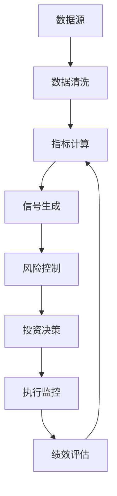

# 量化系统金融指标设计体系

## 概述

本文档对标专业金融机构，系统性地梳理量化交易系统中需要考虑的各类金融指标，为构建完整的量化分析框架提供参考。

## 1. 技术分析指标 (Technical Analysis Indicators)

### 1.1 趋势指标 (Trend Indicators)

#### 移动平均线 (Moving Averages)

- **简单移动平均线 (SMA)**
  - 说明：计算指定周期内价格的算术平均值
  - 作用：识别价格趋势方向，平滑价格波动
  - 应用：趋势确认、支撑阻力位判断
  - 计算数据：收盘价（Close Price）
  - 计算公式：SMA(n) = (P1 + P2 + ... + Pn) / n
  - 数据粒度：分钟级、小时级、日级、周级、月级
  - 常用周期：5日、10日、20日、60日、120日、250日

- **指数移动平均线 (EMA)**
  - 说明：对近期价格赋予更高权重的移动平均线
  - 作用：更快响应价格变化，减少滞后性
  - 应用：短期趋势跟踪、信号生成
  - 计算数据：收盘价（Close Price）
  - 计算公式：EMA(t) = α × P(t) + (1-α) × EMA(t-1)，其中α = 2/(n+1)
  - 数据粒度：分钟级、小时级、日级、周级
  - 常用周期：12日、26日、50日、200日

- **加权移动平均线 (WMA)**
  - 说明：线性递减权重的移动平均线
  - 作用：平衡响应速度和平滑性
  - 应用：中期趋势分析
  - 计算数据：收盘价（Close Price）
  - 计算公式：WMA(n) = (n×P1 + (n-1)×P2 + ... + 1×Pn) / (n + (n-1) + ... + 1)
  - 数据粒度：分钟级、小时级、日级
  - 常用周期：10日、20日、30日

#### 趋势强度指标
- **平均方向性指数 (ADX)**
  - 说明：衡量趋势强度的指标，不考虑方向
  - 作用：判断市场是否处于趋势状态
  - 应用：趋势交易策略的过滤器
  - 计算数据：最高价（High）、最低价（Low）、收盘价（Close）
  - 计算公式：ADX = 100 × EMA(|DI+ - DI-|) / (DI+ + DI-)的n日移动平均
  - 数据粒度：日级、小时级、分钟级
  - 常用周期：14日、21日
  - 判断标准：ADX > 25表示强趋势，ADX < 20表示震荡市

- **抛物线转向 (Parabolic SAR)**
  - 说明：基于价格和时间的趋势跟踪指标
  - 作用：提供动态止损位和趋势反转信号
  - 应用：趋势跟踪、止损设置
  - 计算数据：最高价（High）、最低价（Low）
  - 计算公式：SAR(t+1) = SAR(t) + AF × (EP - SAR(t))
  - 数据粒度：日级、小时级、分钟级
  - 参数设置：初始AF=0.02，最大AF=0.20，步长=0.02

### 1.2 动量指标 (Momentum Indicators)

#### 相对强弱指数 (RSI)
- 说明：衡量价格变化速度和幅度的振荡器
- 作用：识别超买超卖状态，预测价格反转
- 应用：逆势交易、入场时机选择
- 计算数据：收盘价（Close Price）
- 计算公式：RSI = 100 - 100/(1 + RS)，其中RS = 平均上涨幅度/平均下跌幅度
- 数据粒度：分钟级、小时级、日级
- 常用周期：14日、21日、9日
- 判断标准：RSI > 70超买，RSI < 30超卖

#### 随机指标 (Stochastic)
- 说明：比较收盘价与一定周期内价格区间的相对位置
- 作用：识别价格动量变化和反转信号
- 应用：短期交易信号生成
- 计算数据：最高价（High）、最低价（Low）、收盘价（Close）
- 计算公式：%K = 100 × (C - Ln) / (Hn - Ln)，%D = %K的3日SMA
- 数据粒度：分钟级、小时级、日级
- 常用周期：9日、14日、21日
- 判断标准：%K > 80超买，%K < 20超卖

#### MACD (Moving Average Convergence Divergence)
- 说明：基于两条不同周期EMA差值的指标
- 作用：识别趋势变化和动量转换
- 应用：趋势确认、买卖信号生成
- 计算数据：收盘价（Close Price）
- 计算公式：MACD = EMA(12) - EMA(26)，Signal = EMA(MACD, 9)，Histogram = MACD - Signal
- 数据粒度：分钟级、小时级、日级、周级
- 常用参数：快线12日、慢线26日、信号线9日
- 信号判断：MACD上穿Signal线买入，下穿卖出

#### 威廉指标 (%R)
- 说明：衡量收盘价在最近N期最高最低价区间中的位置
- 作用：识别超买超卖状态
- 应用：短期反转交易
- 计算数据：最高价（High）、最低价（Low）、收盘价（Close）
- 计算公式：%R = (Hn - C) / (Hn - Ln) × (-100)
- 数据粒度：分钟级、小时级、日级
- 常用周期：14日、21日
- 判断标准：%R > -20超买，%R < -80超卖

### 1.3 波动率指标 (Volatility Indicators)

#### 布林带 (Bollinger Bands)
- 说明：基于移动平均线和标准差构建的价格通道
- 作用：衡量价格波动率和识别异常价格
- 应用：均值回归策略、突破交易
- 计算数据：收盘价（Close Price）
- 计算公式：中轨 = SMA(n)，上轨 = SMA(n) + k×STD(n)，下轨 = SMA(n) - k×STD(n)
- 数据粒度：分钟级、小时级、日级
- 常用参数：周期20日，标准差倍数2
- 信号判断：价格触及上轨超买，触及下轨超卖

#### 平均真实波幅 (ATR)
- 说明：衡量价格波动幅度的指标
- 作用：量化市场波动性
- 应用：止损设置、仓位管理
- 计算数据：最高价（High）、最低价（Low）、收盘价（Close）
- 计算公式：TR = MAX(H-L, |H-C_prev|, |L-C_prev|)，ATR = SMA(TR, n)
- 数据粒度：分钟级、小时级、日级
- 常用周期：14日、21日
- 应用标准：ATR值越大波动性越高

#### 历史波动率 (Historical Volatility)
- 说明：基于历史价格计算的年化波动率
- 作用：衡量资产价格的历史波动程度
- 应用：风险管理、期权定价
- 计算数据：收盘价（Close Price）
- 计算公式：HV = STD(ln(Pt/Pt-1)) × √252
- 数据粒度：日级数据计算
- 常用周期：20日、60日、252日
- 单位：年化百分比

### 1.4 成交量指标 (Volume Indicators)

#### 成交量加权平均价格 (VWAP)
- 说明：按成交量加权的平均成交价格
- 作用：反映真实的市场平均成本
- 应用：大额交易执行基准、价格公允性判断
- 计算数据：价格（通常用典型价格）、成交量（Volume）
- 计算公式：VWAP = Σ(典型价格 × 成交量) / Σ成交量
- 数据粒度：分钟级、小时级、日级
- 典型价格：(High + Low + Close) / 3
- 重置周期：通常按交易日重置

#### 资金流量指标 (MFI)
- 说明：结合价格和成交量的动量指标
- 作用：衡量资金流入流出强度
- 应用：确认价格趋势、识别背离
- 计算数据：最高价、最低价、收盘价、成交量
- 计算公式：MFI = 100 - 100/(1 + 资金流量比率)
- 数据粒度：分钟级、小时级、日级
- 常用周期：14日
- 判断标准：MFI > 80超买，MFI < 20超卖

#### 能量潮 (OBV)
- 说明：基于成交量变化的累积指标
- 作用：确认价格趋势的可持续性
- 应用：趋势确认、背离分析
- 计算数据：收盘价（Close）、成交量（Volume）
- 计算公式：若C > C_prev则OBV += V，若C < C_prev则OBV -= V，若C = C_prev则OBV不变
- 数据粒度：分钟级、小时级、日级
- 分析方法：观察OBV与价格的背离关系

#### 平衡成交量 (BVP)
- 说明：基于收盘价变化方向的成交量累积
- 作用：衡量买卖力量对比
- 应用：趋势强度确认
- 计算数据：收盘价（Close）、成交量（Volume）
- 计算公式：BVP = Σ(成交量 × 价格变化方向)
- 数据粒度：分钟级、小时级、日级
- 价格变化方向：上涨为+1，下跌为-1，平盘为0

## 2. 基本面分析指标 (Fundamental Analysis Indicators)

### 2.1 估值指标 (Valuation Metrics)

#### 市盈率 (P/E Ratio)
- 说明：股价与每股收益的比率
- 作用：衡量股票估值水平
- 应用：价值投资、相对估值分析
- 计算数据：股价（Stock Price）、每股收益（EPS）
- 计算公式：P/E = 股价 / 每股收益
- 数据来源：财务报表（年报、季报）、实时股价
- 数据频率：季度更新（财务数据）、实时更新（股价）
- 分类：静态P/E（TTM）、动态P/E（预测）

#### 市净率 (P/B Ratio)
- 说明：股价与每股净资产的比率
- 作用：衡量股票相对于账面价值的估值
- 应用：价值投资、破净股筛选
- 计算数据：股价（Stock Price）、每股净资产（BVPS）
- 计算公式：P/B = 股价 / 每股净资产
- 数据来源：财务报表（资产负债表）、实时股价
- 数据频率：季度更新（净资产）、实时更新（股价）
- 判断标准：P/B < 1为破净股

#### 市销率 (P/S Ratio)
- 说明：市值与销售收入的比率
- 作用：适用于亏损企业的估值
- 应用：成长股估值、行业比较
- 计算数据：市值（Market Cap）、营业收入（Revenue）
- 计算公式：P/S = 市值 / 年营业收入
- 数据来源：财务报表（利润表）、股价×总股本
- 数据频率：季度更新（收入）、实时更新（市值）
- 适用场景：亏损公司、高成长企业

#### 企业价值倍数 (EV/EBITDA)
- 说明：企业价值与息税折旧摊销前利润的比率
- 作用：消除资本结构差异的估值指标
- 应用：并购估值、跨国比较
- 计算数据：企业价值（EV）、EBITDA
- 计算公式：EV/EBITDA = (市值 + 净债务) / EBITDA
- 数据来源：财务报表（利润表、资产负债表）、市值
- 数据频率：季度更新（EBITDA、债务）、实时更新（市值）
- 企业价值：市值 + 总债务 - 现金及等价物

### 2.2 盈利能力指标 (Profitability Metrics)

#### 净资产收益率 (ROE)
- 说明：净利润与股东权益的比率
- 作用：衡量股东投资回报率
- 应用：公司盈利能力评估、杜邦分析
- 计算数据：净利润（Net Income）、股东权益（Shareholders' Equity）
- 计算公式：ROE = 净利润 / 平均股东权益 × 100%
- 数据来源：财务报表（利润表、资产负债表）
- 数据频率：季度、年度
- 杜邦分析：ROE = 净利率 × 资产周转率 × 权益乘数

#### 总资产收益率 (ROA)
- 说明：净利润与总资产的比率
- 作用：衡量资产使用效率
- 应用：经营效率分析、行业比较
- 计算数据：净利润（Net Income）、总资产（Total Assets）
- 计算公式：ROA = 净利润 / 平均总资产 × 100%
- 数据来源：财务报表（利润表、资产负债表）
- 数据频率：季度、年度
- 关系：ROA = ROE × (股东权益 / 总资产)

#### 毛利率 (Gross Margin)
- 说明：毛利润与营业收入的比率
- 作用：衡量产品盈利能力
- 应用：竞争力分析、成本控制评估
- 计算数据：营业收入（Revenue）、营业成本（COGS）
- 计算公式：毛利率 = (营业收入 - 营业成本) / 营业收入 × 100%
- 数据来源：财务报表（利润表）
- 数据频率：季度、年度
- 行业特征：不同行业毛利率差异较大

#### 净利率 (Net Margin)
- 说明：净利润与营业收入的比率
- 作用：衡量整体盈利效率
- 应用：经营管理水平评估
- 计算数据：净利润（Net Income）、营业收入（Revenue）
- 计算公式：净利率 = 净利润 / 营业收入 × 100%
- 数据来源：财务报表（利润表）
- 数据频率：季度、年度
- 影响因素：成本控制、费用管理、税务筹划

### 2.3 成长性指标 (Growth Metrics)

#### 营收增长率 (Revenue Growth)
- 说明：营业收入的同比或环比增长率
- 作用：衡量公司业务扩张速度
- 应用：成长股筛选、业绩预测
- 计算数据：当期营业收入、上期营业收入
- 计算公式：增长率 = (当期收入 - 上期收入) / 上期收入 × 100%
- 数据来源：财务报表（利润表）
- 数据频率：季度、年度
- 分析维度：同比增长率、环比增长率、复合增长率（CAGR）

#### 净利润增长率 (Earnings Growth)
- 说明：净利润的增长率
- 作用：衡量盈利增长可持续性
- 应用：成长性评估、估值调整
- 计算数据：当期净利润、上期净利润
- 计算公式：增长率 = (当期净利润 - 上期净利润) / 上期净利润 × 100%
- 数据来源：财务报表（利润表）
- 数据频率：季度、年度
- 注意事项：需剔除非经常性损益影响

#### PEG比率 (Price/Earnings to Growth)
- 说明：市盈率与盈利增长率的比值
- 作用：综合考虑估值和成长性
- 应用：成长股估值、投资决策
- 计算数据：市盈率（P/E）、盈利增长率（G）
- 计算公式：PEG = P/E / 盈利增长率
- 数据来源：股价、财务报表、盈利预测
- 数据频率：实时更新（股价）、季度更新（盈利）
- 判断标准：PEG < 1被认为估值合理或低估

### 2.4 财务健康指标 (Financial Health Metrics)

#### 流动比率 (Current Ratio)
- 说明：流动资产与流动负债的比率
- 作用：衡量短期偿债能力
- 应用：财务风险评估、信用分析
- 计算数据：流动资产（Current Assets）、流动负债（Current Liabilities）
- 计算公式：流动比率 = 流动资产 / 流动负债
- 数据来源：财务报表（资产负债表）
- 数据频率：季度、年度
- 判断标准：比率 > 2较安全，1-2之间正常，< 1存在风险

#### 速动比率 (Quick Ratio)
- 说明：速动资产与流动负债的比率
- 作用：衡量即时偿债能力
- 应用：流动性风险评估
- 计算数据：速动资产、流动负债
- 计算公式：速动比率 = (流动资产 - 存货 - 预付费用) / 流动负债
- 数据来源：财务报表（资产负债表）
- 数据频率：季度、年度
- 判断标准：比率 > 1较安全，0.5-1之间需关注

#### 资产负债率 (Debt-to-Asset Ratio)
- 说明：总负债与总资产的比率
- 作用：衡量财务杠杆水平
- 应用：财务风险控制、杠杆分析
- 计算数据：总负债（Total Liabilities）、总资产（Total Assets）
- 计算公式：资产负债率 = 总负债 / 总资产 × 100%
- 数据来源：财务报表（资产负债表）
- 数据频率：季度、年度
- 判断标准：一般不超过70%，不同行业标准不同

#### 利息保障倍数 (Interest Coverage Ratio)
- 说明：息税前利润与利息费用的比率
- 作用：衡量偿付利息的能力
- 应用：债务风险评估、信用评级
- 计算数据：息税前利润（EBIT）、利息费用（Interest Expense）
- 计算公式：利息保障倍数 = EBIT / 利息费用
- 数据来源：财务报表（利润表）
- 数据频率：季度、年度
- 判断标准：倍数 > 5较安全，2-5之间正常，< 2存在风险

## 3. 风险管理指标 (Risk Management Indicators)

### 3.1 市场风险指标 (Market Risk Metrics)

#### Beta系数
- 说明：衡量个股相对于市场的系统性风险
- 作用：量化股票的市场敏感度
- 应用：投资组合风险管理、资产配置
- 计算数据：个股收益率、市场收益率（如沪深300指数）
- 计算公式：β = Cov(Ri, Rm) / Var(Rm)
- 数据来源：历史价格数据、市场指数数据
- 数据频率：日级数据计算，通常使用1-3年历史数据
- 判断标准：β > 1高风险高收益，β < 1低风险低收益，β = 1与市场同步

#### 夏普比率 (Sharpe Ratio)
- 说明：超额收益与波动率的比值
- 作用：衡量风险调整后的收益
- 应用：策略评估、基金经理绩效评价
- 计算数据：投资组合收益率、无风险收益率、收益率标准差
- 计算公式：Sharpe = (Rp - Rf) / σp
- 数据来源：投资组合历史收益、国债收益率
- 数据频率：通常年化计算，可用日、周、月数据
- 判断标准：比率越高越好，> 1为优秀，> 2为卓越

#### 索提诺比率 (Sortino Ratio)
- 说明：超额收益与下行波动率的比值
- 作用：关注下行风险的收益评估
- 应用：风险厌恶型投资者的策略评估
- 计算数据：投资组合收益率、目标收益率、下行标准差
- 计算公式：Sortino = (Rp - MAR) / DD
- 数据来源：投资组合历史收益数据
- 数据频率：通常年化计算
- 优势：只考虑负向波动，更符合投资者风险认知

#### 最大回撤 (Maximum Drawdown)
- 说明：从峰值到谷值的最大跌幅
- 作用：衡量投资组合的最大损失
- 应用：风险控制、策略优化
- 计算数据：投资组合净值序列
- 计算公式：MDD = MAX((Peak - Trough) / Peak)
- 数据来源：投资组合历史净值
- 数据频率：实时计算，通常关注历史最大值
- 风险控制：通常设置回撤阈值进行风险管理

### 3.2 流动性风险指标 (Liquidity Risk Metrics)

#### 买卖价差 (Bid-Ask Spread)
- 说明：买一价与卖一价的差额
- 作用：衡量市场流动性成本
- 应用：交易成本估算、流动性评估
- 计算数据：买一价（Bid Price）、卖一价（Ask Price）
- 计算公式：价差 = 卖一价 - 买一价，相对价差 = 价差 / 中间价 × 100%
- 数据来源：实时行情数据（Level 1或Level 2）
- 数据频率：实时更新，通常按秒级或毫秒级
- 判断标准：价差越小流动性越好，大盘股通常价差较小

#### 成交量比率 (Volume Ratio)
- 说明：当前成交量与历史平均成交量的比值
- 作用：衡量市场活跃度变化
- 应用：流动性监控、异常交易识别
- 计算数据：当前成交量、历史平均成交量
- 计算公式：成交量比率 = 当前成交量 / 历史平均成交量
- 数据来源：实时成交数据、历史成交统计
- 数据频率：实时计算，通常使用20日或60日平均
- 判断标准：比率 > 2表示异常活跃，< 0.5表示成交清淡

#### 市场冲击成本 (Market Impact)
- 说明：大额交易对价格的影响程度
- 作用：估算交易执行成本
- 应用：大额交易策略、执行算法优化
- 计算数据：交易前价格、交易后价格、交易量、市场深度
- 计算公式：冲击成本 = |执行价格 - 基准价格| / 基准价格
- 数据来源：交易执行数据、订单簿数据
- 数据频率：每笔交易后计算
- 影响因素：交易规模、市场流动性、交易时间、执行方式

### 3.3 信用风险指标 (Credit Risk Metrics)

#### 违约概率 (Probability of Default)
- 说明：基于财务指标预测的违约可能性
- 作用：量化信用风险水平
- 应用：信用评级、债券投资决策
- 计算数据：财务比率、宏观经济指标、历史违约数据
- 计算公式：通常使用Logistic回归或机器学习模型
- 数据来源：财务报表、信用评级机构、央行征信数据
- 数据频率：季度更新（财务数据）、实时更新（市场数据）
- 模型类型：KMV模型、CreditMetrics、内部评级模型

#### 信用利差 (Credit Spread)
- 说明：企业债券与同期限国债的收益率差
- 作用：反映市场对信用风险的定价
- 应用：信用风险监控、相对价值分析
- 计算数据：企业债券收益率、同期限国债收益率
- 计算公式：信用利差 = 企业债收益率 - 国债收益率
- 数据来源：债券交易数据、收益率曲线
- 数据频率：实时更新（交易时间内）
- 影响因素：信用评级、行业风险、市场流动性、宏观环境

#### Z-Score模型
- 说明：基于多个财务比率的破产预测模型
- 作用：综合评估企业财务健康状况
- 应用：信用风险筛选、投资组合管理
- 计算数据：营运资本、留存收益、息税前利润、股权市值、销售收入、总资产
- 计算公式：Z = 1.2×X1 + 1.4×X2 + 3.3×X3 + 0.6×X4 + 1.0×X5
- 数据来源：财务报表、股价数据
- 数据频率：季度更新
- 判断标准：Z > 2.99安全区，1.81 < Z < 2.99灰色区，Z < 1.81危险区

## 4. 市场微观结构指标 (Market Microstructure Indicators)

### 4.1 订单流指标 (Order Flow Metrics)

#### 订单失衡 (Order Imbalance)
- 说明：买单与卖单数量或金额的差异
- 作用：预测短期价格方向
- 应用：高频交易、市场做市
- 计算数据：买单量、卖单量（数量或金额）
- 计算公式：失衡度 = (买单量 - 卖单量) / (买单量 + 卖单量)
- 数据来源：Level 2行情数据、逐笔成交数据
- 数据频率：实时计算，通常按秒级或分钟级聚合
- 判断标准：正值表示买盘占优，负值表示卖盘占优

#### 大单净流入 (Large Order Net Flow)
- 说明：大额买单与卖单的净差额
- 作用：识别机构资金动向
- 应用：跟庄策略、资金流向分析
- 计算数据：大单买入金额、大单卖出金额
- 计算公式：大单净流入 = 大单买入金额 - 大单卖出金额
- 数据来源：逐笔成交数据、大宗交易数据
- 数据频率：实时计算，通常按日、周统计
- 大单标准：通常以单笔成交金额超过一定阈值（如50万元）定义

#### 主动买卖比 (Buy/Sell Ratio)
- 说明：主动买入与主动卖出的比例
- 作用：衡量市场情绪倾向
- 应用：短期趋势判断、情绪指标
- 计算数据：主动买入量、主动卖出量
- 计算公式：买卖比 = 主动买入量 / 主动卖出量
- 数据来源：逐笔成交数据（区分主动买卖）
- 数据频率：实时计算，通常按分钟、小时、日统计
- 判断方法：通过成交价与买卖价的关系判断主动性

### 4.2 价格发现指标 (Price Discovery Metrics)

#### 价格效率指标 (Price Efficiency)
- 说明：价格对新信息的反应速度和准确性
- 作用：评估市场有效性
- 应用：套利机会识别、市场质量评估

#### 信息比率 (Information Ratio)
- 说明：主动收益与跟踪误差的比值
- 作用：衡量主动管理的信息价值
- 应用：基金经理评估、策略优化

### 4.3 交易成本指标 (Transaction Cost Metrics)

#### 实施差额 (Implementation Shortfall)
- 说明：实际执行价格与决策时点价格的差异
- 作用：全面衡量交易执行质量
- 应用：执行算法评估、交易成本控制

#### TWAP偏差 (TWAP Deviation)
- 说明：实际成交价格与时间加权平均价格的偏差
- 作用：评估交易执行效果
- 应用：算法交易评估、执行策略优化

## 5. 宏观经济指标 (Macroeconomic Indicators)

### 5.1 经济增长指标 (Economic Growth Metrics)

#### GDP增长率
- 说明：国内生产总值的增长速度
- 作用：衡量经济整体发展水平
- 应用：宏观策略配置、周期性行业分析
- 计算数据：当期GDP、上期GDP（名义或实际GDP）
- 计算公式：GDP增长率 = (当期GDP - 上期GDP) / 上期GDP × 100%
- 数据来源：国家统计局、央行、国际组织
- 数据频率：季度发布，年度汇总
- 分析维度：同比增长率、环比增长率、年化增长率

#### 工业增加值
- 说明：工业部门的产出增长
- 作用：反映实体经济活跃度
- 应用：周期股投资、经济周期判断
- 计算数据：工业总产值、中间投入
- 计算公式：工业增加值 = 工业总产值 - 中间投入
- 数据来源：国家统计局、工信部
- 数据频率：月度发布
- 行业分类：按行业、地区、企业规模分类统计

#### PMI指数
- 说明：采购经理人指数，反映制造业景气度
- 作用：领先经济指标，预测经济走势
- 应用：经济周期判断、行业轮动策略
- 计算数据：新订单、生产、就业、供应商配送、库存等分项指数
- 计算公式：PMI = 各分项指数加权平均
- 数据来源：中国物流与采购联合会、国家统计局
- 数据频率：月度发布
- 判断标准：PMI > 50表示扩张，< 50表示收缩

### 5.2 通胀指标 (Inflation Metrics)

#### CPI (消费者价格指数)
- 说明：衡量消费品和服务价格变化
- 作用：反映通胀水平和货币购买力
- 应用：货币政策预测、实际收益率计算
- 计算数据：代表性商品和服务的价格、权重
- 计算公式：CPI = Σ(商品价格 × 权重) / 基期CPI × 100
- 数据来源：国家统计局价格调查
- 数据频率：月度发布
- 分类：食品、居住、交通、医疗、教育文化娱乐等八大类

#### PPI (生产者价格指数)
- 说明：衡量生产环节价格变化
- 作用：预测未来通胀趋势
- 应用：成本传导分析、上游行业投资
- 计算数据：工业产品出厂价格
- 计算公式：PPI = Σ(产品价格 × 权重) / 基期PPI × 100
- 数据来源：国家统计局工业价格调查
- 数据频率：月度发布
- 传导机制：PPI变化通常领先CPI 3-6个月

#### 核心通胀率
- 说明：剔除食品和能源的通胀率
- 作用：反映潜在通胀趋势
- 应用：货币政策分析、长期投资决策
- 计算数据：剔除食品和能源后的CPI分项
- 计算公式：核心CPI增长率 = (当期核心CPI - 上期核心CPI) / 上期核心CPI × 100%
- 数据来源：基于CPI数据计算
- 数据频率：月度计算
- 优势：排除短期波动因素，更好反映通胀趋势

### 5.3 货币政策指标 (Monetary Policy Metrics)

#### 基准利率
- 说明：央行设定的政策利率
- 作用：影响整体利率水平和流动性
- 应用：利率敏感性分析、债券投资策略
- 计算数据：央行公布的政策利率（如LPR、MLF利率）
- 数据来源：中国人民银行、全国银行间同业拆借中心
- 数据频率：不定期调整，通常在货币政策会议后公布
- 传导机制：政策利率→市场利率→实体经济
- 影响范围：银行放贷利率、债券收益率、汇率、股市估值

#### 货币供应量 (M1, M2)
- 说明：不同层次的货币供应量指标
- 作用：反映货币政策松紧程度
- 应用：流动性分析、通胀预测
- 计算数据：现金、活期存款、定期存款等
- 计算公式：M1 = M0 + 企业活期存款，M2 = M1 + 准货币
- 数据来源：中国人民银行货币当局资产负债表
- 数据频率：月度发布
- 分析指标：M1、M2增速，M1-M2剪刀差

#### 收益率曲线
- 说明：不同期限债券收益率的组合
- 作用：反映市场对未来利率和经济的预期
- 应用：经济周期判断、债券配置策略
- 计算数据：不同期限国债收益率（1月、3月、6月、1年、3年、5年、10年等）
- 数据来源：银行间债券市场、交易所债券市场
- 数据频率：实时更新（交易时间内）
- 形态分析：正常型、平坦型、倒挂型曲线的经济含义

## 6. 情绪指标 (Sentiment Indicators)

### 6.1 市场情绪指标 (Market Sentiment Metrics)

#### VIX恐慌指数
- 说明：基于期权价格计算的隐含波动率
- 作用：衡量市场恐慌程度
- 应用：逆向投资、风险管理
- 计算数据：标的指数期权的隐含波动率
- 计算公式：基于Black-Scholes模型的隐含波动率加权平均
- 数据来源：期权交易数据（如上证50ETF期权）
- 数据频率：实时计算（期权交易时间内）
- 判断标准：VIX > 30高恐慌，20-30中等，< 20低恐慌

#### 投资者情绪指数
- 说明：基于调查或行为数据的情绪量化
- 作用：识别市场极端情绪
- 应用：反向投资策略、市场时机选择
- 计算数据：新增开户数、换手率、涨跌停比例、融资买入占比等
- 计算公式：各分项指标标准化后加权合成
- 数据来源：交易所、券商、调研机构
- 数据频率：日度、周度计算
- 应用原理：极端乐观或悲观情绪往往预示反转

#### 融资融券余额
- 说明：市场杠杆资金的规模
- 作用：反映投资者风险偏好
- 应用：市场情绪监控、风险预警
- 计算数据：融资余额、融券余额
- 计算公式：融资融券余额 = 融资余额 + 融券余额
- 数据来源：交易所融资融券交易数据
- 数据频率：日度更新
- 分析维度：余额变化、占流通市值比例、融资买入占成交比例

### 6.2 资金流向指标 (Fund Flow Metrics)

#### 北向资金净流入
- 说明：外资通过沪深港通的净买入金额
- 作用：反映外资对A股的态度
- 应用：外资动向跟踪、市场情绪判断
- 计算数据：沪股通买入金额、卖出金额，深股通买入金额、卖出金额
- 计算公式：北向资金净流入 = (沪股通买入 - 沪股通卖出) + (深股通买入 - 深股通卖出)
- 数据来源：上海证券交易所、深圳证券交易所
- 数据频率：实时更新（交易时间内），日度汇总
- 分析维度：单日流入、累计流入、持股市值变化

#### ETF申赎数据
- 说明：交易型开放式基金的申购赎回情况
- 作用：反映机构投资者的配置意向
- 应用：资金流向分析、行业轮动判断
- 计算数据：ETF申购份额、赎回份额、净申购份额
- 计算公式：净申购 = 申购份额 - 赎回份额
- 数据来源：基金公司、交易所ETF交易数据
- 数据频率：日度更新
- 分析重点：宽基ETF、行业ETF、主题ETF的资金流向差异

#### 新增开户数
- 说明：新开立证券账户的数量
- 作用：反映散户参与热情
- 应用：市场情绪监控、散户行为分析
- 计算数据：新开A股账户数量
- 数据来源：中国证券登记结算有限责任公司
- 数据频率：周度发布
- 历史规律：牛市期间新增开户数显著增加，熊市期间大幅减少

## 7. 消息面指标 (News & Policy Sentiment Indicators)

### 7.1 新闻情绪指标 (News Sentiment Metrics)

#### 新闻情绪得分
- **说明**：基于自然语言处理技术量化新闻情绪
- **作用**：捕捉市场对公司或行业的情绪变化
- **应用**：事件驱动策略、风险预警、择时交易
- **计算数据**：新闻标题、新闻正文、发布时间、媒体权重
- **计算公式**：情绪得分 = Σ(单条新闻情绪值 × 媒体权重 × 时间衰减因子) / 新闻总数
- **数据来源**：财经媒体、官方公告、社交媒体、研报
- **数据频率**：实时更新，通常按小时或日度聚合
- **技术实现**：
  - 情绪词典：构建金融领域专用情绪词典
  - 机器学习：使用BERT、GPT等预训练模型
  - 权重设计：核心媒体权重更高，时效性衰减
- **判断标准**：得分 > 0.6积极，-0.6到0.6中性，< -0.6消极

#### 新闻热度指数
- **说明**：衡量特定股票或主题的新闻关注度
- **作用**：识别市场关注焦点和热点轮动
- **应用**：主题投资、热点追踪、风险监控
- **计算数据**：新闻数量、阅读量、转发量、评论数
- **计算公式**：热度指数 = Σ(新闻数量 × 媒体影响力 × 互动系数)
- **数据来源**：新闻网站、财经APP、社交平台
- **数据频率**：实时监控，日度统计
- **关键指标**：
  - 新闻密度：单位时间内新闻发布频率
  - 传播广度：新闻在不同平台的覆盖面
  - 互动强度：用户参与度（点赞、评论、分享）

#### 负面新闻预警指标
- **说明**：专门识别和量化负面新闻的影响
- **作用**：提前预警潜在风险事件
- **应用**：风险管理、止损策略、危机公关
- **计算数据**：负面关键词频率、新闻严重程度、影响范围
- **计算公式**：风险等级 = 负面程度 × 传播范围 × 可信度权重
- **数据来源**：监管公告、媒体报道、举报平台
- **数据频率**：实时监控，紧急事件即时推送
- **风险分类**：
  - 财务风险：业绩造假、资金链断裂、审计问题
  - 合规风险：违法违规、监管处罚、诉讼纠纷
  - 经营风险：产品质量、安全事故、管理层变动
  - 市场风险：行业政策、竞争加剧、技术替代

### 7.2 政策影响指标 (Policy Impact Metrics)

#### 政策情绪指数
- **说明**：量化政府政策对特定行业或市场的影响
- **作用**：评估政策利好或利空程度
- **应用**：政策驱动投资、行业配置、主题轮动
- **计算数据**：政策文件内容、发布层级、执行力度、历史影响
- **计算公式**：政策影响度 = 政策力度 × 执行概率 × 行业相关性 × 时间衰减
- **数据来源**：政府官网、政策数据库、官方媒体
- **数据频率**：政策发布后实时更新，定期回顾评估
- **分析维度**：
  - 政策层级：国家级、部委级、地方级
  - 政策类型：产业政策、财税政策、货币政策、监管政策
  - 影响程度：重大利好、一般利好、中性、一般利空、重大利空
  - 执行时间：立即生效、短期执行、中长期规划

#### 监管态度指标
- **说明**：跟踪监管层对特定行业或现象的态度变化
- **作用**：预测监管政策走向和强度
- **应用**：合规风险管理、投资策略调整
- **计算数据**：监管发声频率、措辞严厉程度、处罚案例
- **计算公式**：监管严厉度 = 发声频率 × 措辞强度 × 处罚力度
- **数据来源**：证监会、银保监会、央行等监管机构公告
- **数据频率**：实时跟踪，周度总结
- **监测重点**：
  - 窗口指导：监管层非正式沟通和指导
  - 政策信号：监管表态和政策预期
  - 执法行动：处罚案例和执法力度
  - 制度变化：法规修订和新规出台

#### 会议纪要情绪分析
- **说明**：分析重要会议纪要中的政策信号
- **作用**：捕捉政策方向的微妙变化
- **应用**：宏观策略、政策预期交易
- **计算数据**：会议纪要文本、关键词变化、表述差异
- **计算公式**：政策倾向度 = Σ(关键词权重 × 出现频率 × 语境情绪)
- **数据来源**：央行货币政策委员会、国务院常务会议等
- **数据频率**：会议后及时分析，季度对比
- **分析方法**：
  - 词频分析：关键政策词汇的使用频率变化
  - 语义分析：表述方式的微妙变化
  - 对比分析：与历史会议纪要的差异

### 7.3 舆论监控指标 (Public Opinion Metrics)

#### 社交媒体情绪指标
- **说明**：基于社交媒体内容的市场情绪分析
- **作用**：捕捉散户投资者的情绪变化
- **应用**：反向投资策略、情绪择时
- **计算数据**：微博、股吧、雪球等平台的讨论内容
- **计算公式**：社交情绪 = Σ(帖子情绪值 × 用户影响力 × 互动热度) / 总帖子数
- **数据来源**：新浪微博、东方财富股吧、雪球、知乎等
- **数据频率**：实时抓取，小时级聚合
- **技术要点**：
  - 数据清洗：过滤广告、水军、重复内容
  - 用户画像：区分专业投资者和普通散户
  - 情绪识别：识别恐慌、贪婪、观望等情绪状态
  - 影响力权重：根据用户粉丝数、历史准确率等加权

#### 搜索热度指标
- **说明**：基于搜索引擎数据的关注度分析
- **作用**：衡量投资者对特定股票或概念的关注程度
- **应用**：热点发现、趋势预测、情绪监控
- **计算数据**：百度指数、微信指数、谷歌趋势等
- **计算公式**：关注度变化率 = (当期搜索量 - 基期搜索量) / 基期搜索量
- **数据来源**：百度、微信、谷歌等搜索平台
- **数据频率**：日度更新，实时监控热点事件
- **应用策略**：
  - 热点挖掘：搜索量急剧上升的股票或概念
  - 情绪反转：搜索热度达到极值时的反向操作
  - 趋势确认：搜索热度与股价走势的相关性分析

#### 专业机构观点指标
- **说明**：汇总分析师、基金经理等专业机构的观点
- **作用**：了解专业投资者的主流观点
- **应用**：投资决策参考、市场共识度分析
- **计算数据**：研报评级、目标价、推荐强度
- **计算公式**：机构共识度 = 一致预期比例 × 预测准确度权重
- **数据来源**：券商研报、基金季报、机构调研
- **数据频率**：研报发布后实时更新，季度汇总分析
- **关键指标**：
  - 评级分布：买入、持有、卖出评级的比例
  - 目标价一致性：机构目标价的分散程度
  - 预测修正：机构预测的调整方向和幅度
  - 调研热度：机构实地调研的频率和规模

### 7.4 事件驱动指标 (Event-Driven Metrics)

#### 重大事件影响评估
- **说明**：量化重大事件对市场的影响程度
- **作用**：评估黑天鹅事件的市场冲击
- **应用**：危机管理、事件套利、风险对冲
- **计算数据**：事件类型、影响范围、历史先例、市场反应
- **计算公式**：事件冲击度 = 事件严重性 × 影响范围 × 市场敏感度
- **数据来源**：新闻媒体、官方公告、历史数据库
- **数据频率**：事件发生后实时评估
- **事件分类**：
  - 宏观事件：经济危机、政策变化、国际关系
  - 行业事件：技术突破、监管变化、竞争格局
  - 公司事件：业绩变化、管理层变动、重大合作
  - 突发事件：自然灾害、安全事故、疫情等

#### 公告解读指标
- **说明**：自动解读和评估上市公司公告的影响
- **作用**：快速识别重要公告的投资价值
- **应用**：公告驱动策略、信息优势获取
- **计算数据**：公告类型、关键数据、历史影响、市场预期
- **计算公式**：公告重要性 = 信息含量 × 超预期程度 × 市场关注度
- **数据来源**：交易所公告、公司官网、监管披露
- **数据频率**：公告发布后立即分析
- **分析框架**：
  - 业绩公告：营收、利润、现金流等关键指标
  - 重组公告：并购重组、资产注入、股权变动
  - 经营公告：合同签署、产品发布、产能扩张
  - 风险公告：诉讼、处罚、风险提示

### 7.5 技术实现框架

#### 数据采集系统
```python
# 消息面数据采集架构示例
class NewsDataCollector:
    def __init__(self):
        self.news_sources = ['财联社', '证券时报', '上证报', '中证报']
        self.social_platforms = ['微博', '股吧', '雪球']
        self.official_sources = ['证监会', '交易所', '央行']
    
    def collect_news_sentiment(self, stock_code, time_range):
        # 采集新闻数据并进行情绪分析
        pass
    
    def monitor_policy_changes(self, industry):
        # 监控政策变化
        pass
```

#### 情绪分析模型
- **文本预处理**：分词、去停用词、实体识别
- **特征提取**：TF-IDF、Word2Vec、BERT嵌入
- **情绪分类**：支持向量机、深度学习、预训练模型
- **结果校准**：人工标注、模型融合、置信度评估

#### 实时监控系统
- **数据流处理**：Kafka、Storm等流处理框架
- **实时计算**：Spark Streaming、Flink等
- **预警机制**：阈值监控、异常检测、自动推送
- **可视化展示**：实时仪表板、趋势图表、热力图

### 7.6 应用策略建议

#### 消息面择时策略
1. **利好消息确认**：结合技术面确认买入时机
2. **负面消息规避**：提前识别风险，及时止损
3. **政策驱动轮动**：跟踪政策热点，把握主题机会
4. **情绪反转交易**：在极端情绪时进行反向操作

#### 风险控制要点
1. **信息真实性验证**：多源交叉验证，避免虚假信息
2. **时效性管理**：快速响应，避免信息滞后
3. **过度反应防范**：区分短期噪音和长期趋势
4. **模型定期更新**：适应市场环境和语言变化

## 8. 另类数据指标 (Alternative Data Indicators)

### 8.1 卫星数据指标
- **停车场卫星图像**：零售企业客流量分析
- **工厂活动监测**：制造业产能利用率评估
- **农作物长势**：农业相关投资决策

### 8.2 社交媒体指标
- **社交媒体情绪**：基于文本分析的市场情绪
- **搜索热度**：投资者关注度变化
- **新闻情绪分析**：基于新闻内容的情绪量化

### 8.3 高频数据指标
- **信用卡消费数据**：实时消费趋势监控
- **物流数据**：经济活动实时监测
- **能源消耗数据**：工业活动强度评估

## 9. 指标体系构建原则

### 9.1 指标选择原则
1. **相关性**：指标与投资目标的相关程度
2. **及时性**：数据更新频率和获取时效
3. **可靠性**：数据来源的权威性和准确性
4. **独立性**：避免指标间的高度相关性
5. **可操作性**：指标能够转化为具体的投资决策

### 9.2 指标权重设计
1. **历史回测验证**：基于历史数据的有效性检验
2. **动态权重调整**：根据市场环境变化调整权重
3. **多因子模型**：构建综合评分体系
4. **机器学习优化**：利用算法优化权重配置

### 8.3 风险控制机制
1. **指标失效监控**：实时监控指标有效性
2. **异常值处理**：建立异常数据识别和处理机制
3. **模型稳定性**：确保指标体系的稳定性
4. **回撤控制**：设置合理的风险控制阈值

## 10. 实施建议

### 10.1 系统架构设计


### 10.2 技术实现要点
1. **实时数据处理**：构建高效的数据处理管道
2. **分布式计算**：支持大规模并行计算
3. **缓存机制**：优化指标计算效率
4. **监控告警**：建立完善的系统监控体系

### 10.3 持续优化策略
1. **定期回测**：持续验证指标有效性
2. **新指标研发**：不断探索新的有效指标
3. **模型迭代**：基于市场变化优化模型
4. **风险管理升级**：持续完善风险控制机制

---

*本文档为量化系统金融指标设计的综合指南，实际应用中应根据具体业务需求和市场环境进行调整优化。*