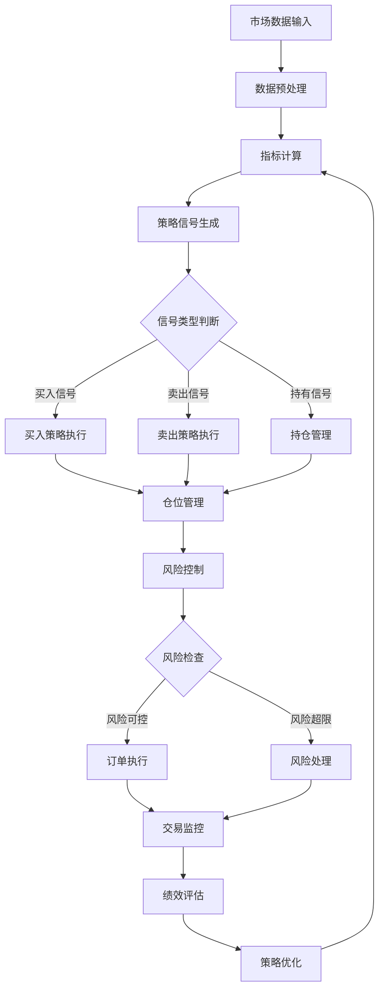
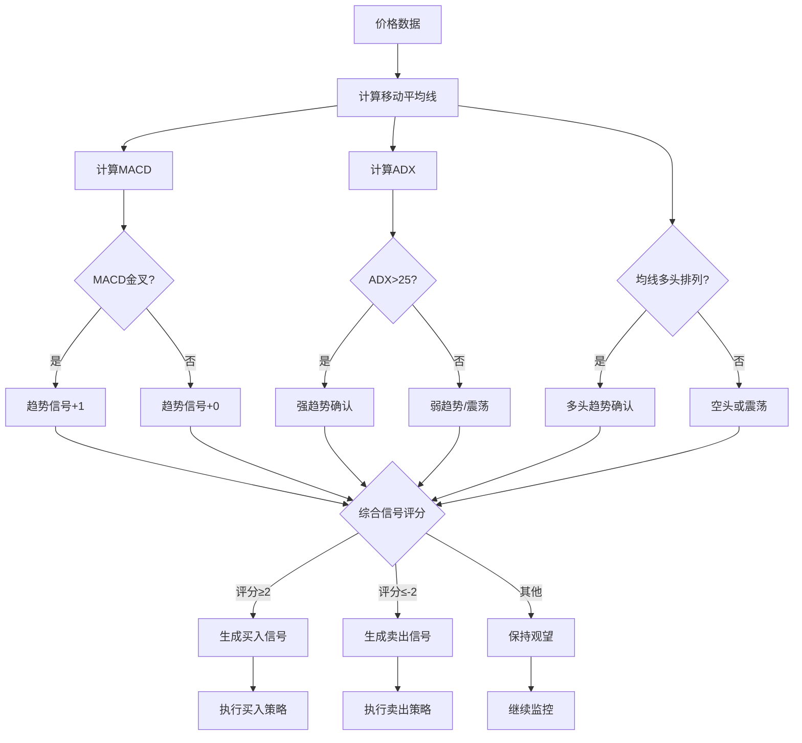
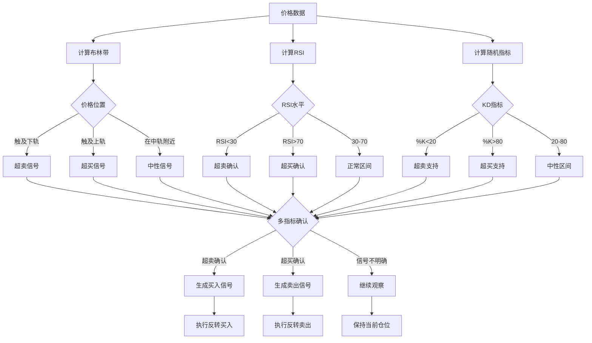
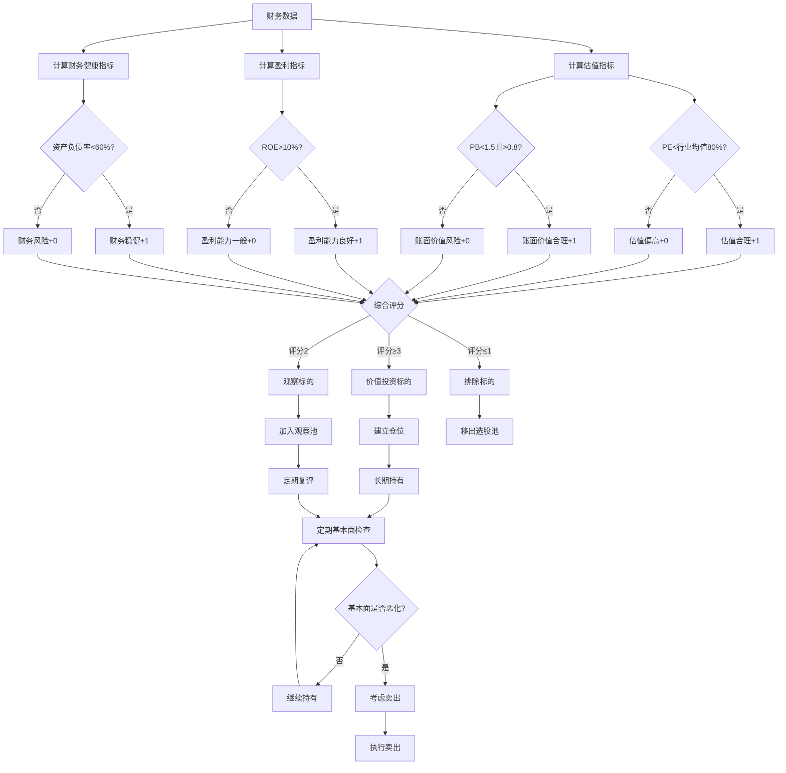
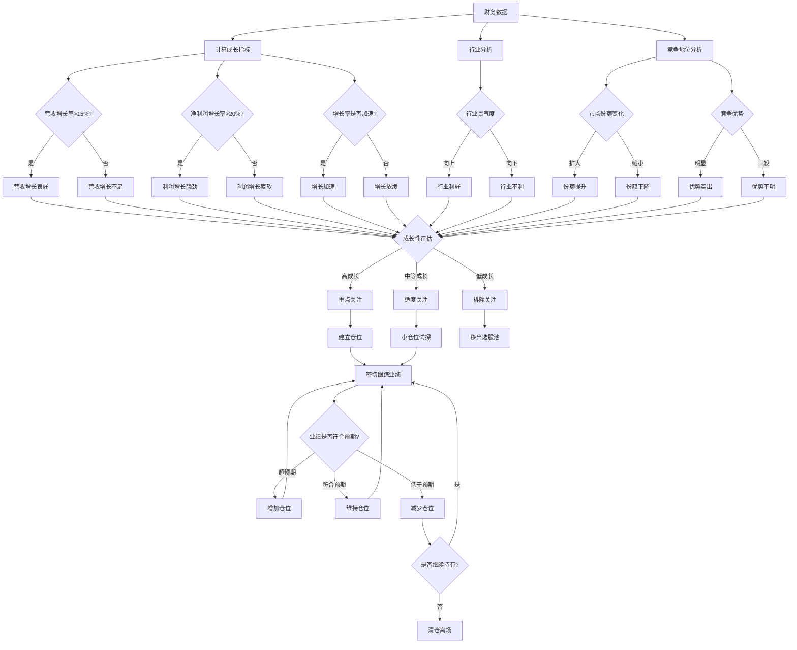
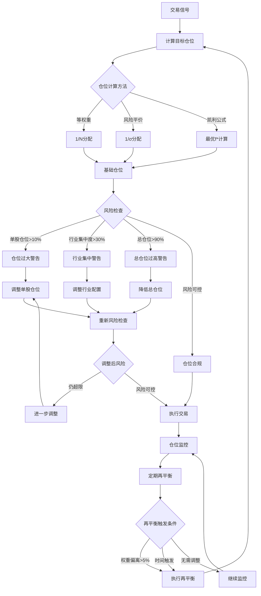
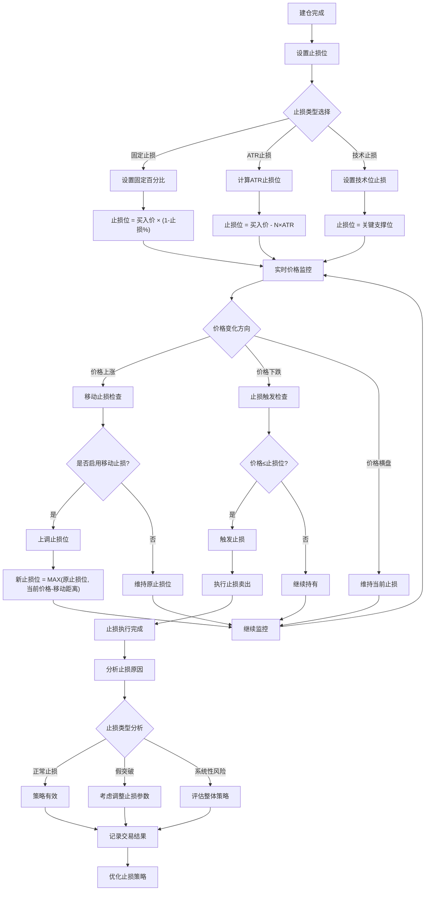
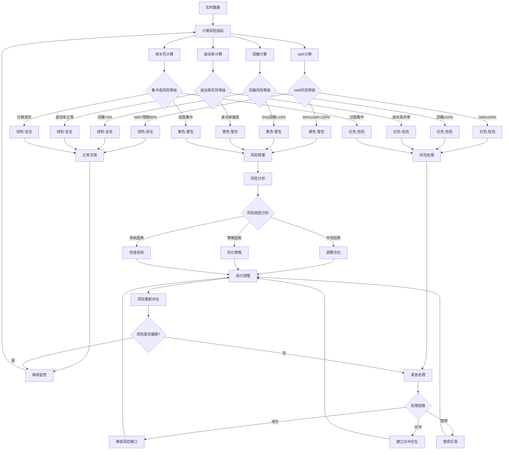
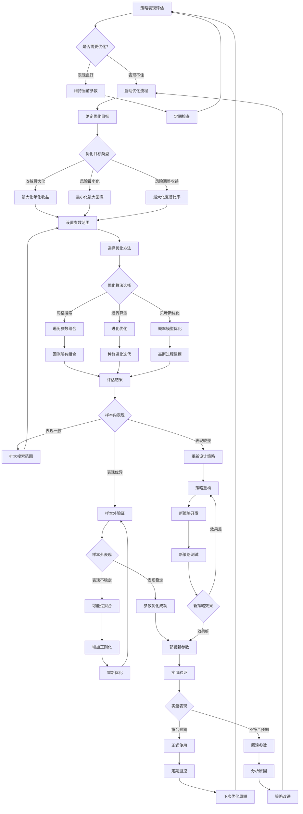
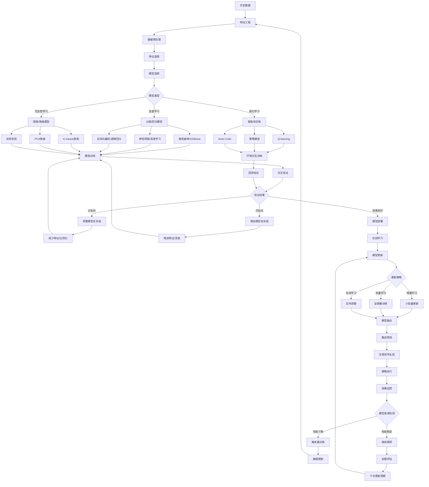

# 量化交易策略流程图

## 策略决策流程总览

## 技术分析策略流程

### 趋势跟踪策略流程

### 均值回归策略流程

## 基本面策略流程

### 价值投资策略流程

### 成长投资策略流程

## 风险管理流程

### 仓位管理流程

### 止损策略流程

### 风险监控流程

## 策略优化流程

### 参数优化流程

### 机器学习优化流程

---

*以上流程图展示了量化交易策略的完整决策和执行流程，为策略的系统化实施提供了清晰的指导框架。*