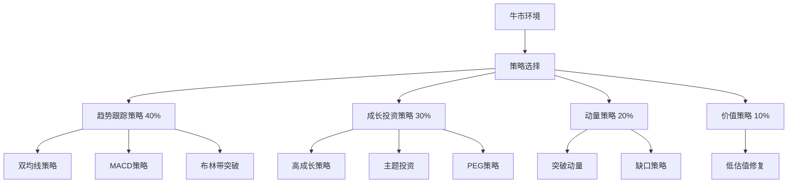
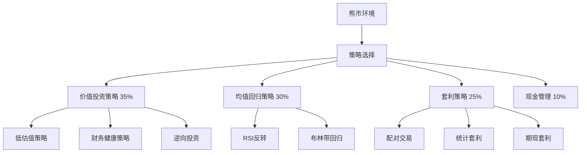
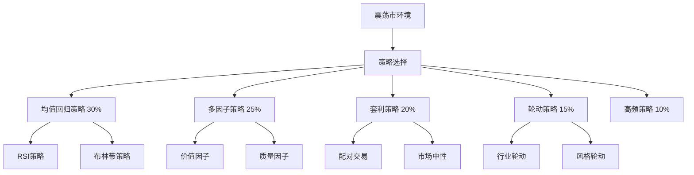
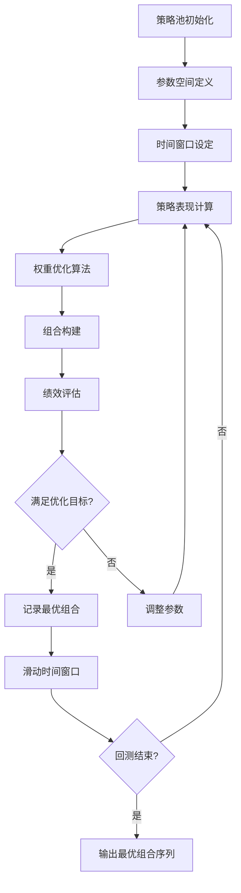

# 量化交易策略设计体系

## 概述

本文档基于前期建立的金融指标体系，系统性地设计量化交易的买入卖出策略。策略设计遵循专业金融机构的标准，涵盖多种交易风格和市场环境。

## 1. 技术分析策略 (Technical Analysis Strategies)

### 1.1 趋势跟踪策略 (Trend Following Strategies)

#### 移动平均线策略

**双均线策略 (Dual Moving Average)**
- **策略逻辑**：基于快慢两条移动平均线的交叉信号
- **买入信号**：
  - 快线（如EMA12）上穿慢线（如EMA26）
  - 价格站上两条均线
  - 成交量放大确认
- **卖出信号**：
  - 快线下穿慢线
  - 价格跌破两条均线
  - 或触及止损位
- **参数设置**：
  - 快线周期：5-20日
  - 慢线周期：20-60日
  - 止损幅度：3-8%
- **适用市场**：趋势明显的单边市场
- **风险控制**：设置ATR动态止损

**三重均线策略 (Triple Moving Average)**
- **策略逻辑**：短、中、长三条均线的排列组合
- **买入信号**：
  - 短线 > 中线 > 长线（多头排列）
  - 价格回调至中线获得支撑
  - RSI > 50确认动量
- **卖出信号**：
  - 均线排列转为空头
  - 价格跌破长期均线
  - RSI < 50动量转弱
- **参数设置**：
  - 短线：5日EMA
  - 中线：20日EMA  
  - 长线：60日SMA
- **优化要点**：结合ADX判断趋势强度

#### MACD策略

**MACD金叉策略**
- **策略逻辑**：基于MACD指标的交叉和背离
- **买入信号**：
  - MACD线上穿Signal线（金叉）
  - MACD柱状图由负转正
  - 价格创新高而MACD未创新低（底背离）
- **卖出信号**：
  - MACD线下穿Signal线（死叉）
  - MACD柱状图由正转负
  - 价格创新高而MACD未创新高（顶背离）
- **参数设置**：
  - 快线：12日EMA
  - 慢线：26日EMA
  - 信号线：9日EMA
- **过滤条件**：结合成交量确认信号有效性

#### 布林带突破策略

**布林带挤压突破**
- **策略逻辑**：利用布林带收窄后的突破
- **买入信号**：
  - 布林带宽度处于历史低位（挤压状态）
  - 价格突破上轨且成交量放大
  - RSI > 60确认突破有效
- **卖出信号**：
  - 价格跌破中轨
  - 或达到目标位（上轨+1倍ATR）
- **参数设置**：
  - 周期：20日
  - 标准差倍数：2
  - 挤压阈值：20日均值的80%
- **风险管理**：突破失败时快速止损

### 1.2 均值回归策略 (Mean Reversion Strategies)

#### RSI超买超卖策略

**RSI反转策略**
- **策略逻辑**：基于RSI的超买超卖区域交易
- **买入信号**：
  - RSI < 30（超卖）
  - RSI开始回升且突破35
  - 价格获得支撑位支撑
- **卖出信号**：
  - RSI > 70（超买）
  - RSI开始回落且跌破65
  - 或价格触及阻力位
- **参数设置**：
  - RSI周期：14日
  - 超买线：70
  - 超卖线：30
- **优化策略**：结合布林带位置确认反转信号

#### 布林带均值回归

**布林带反弹策略**
- **策略逻辑**：价格触及布林带边界后的回归
- **买入信号**：
  - 价格触及或跌破下轨
  - 出现反弹信号（如锤子线）
  - RSI显示超卖但开始回升
- **卖出信号**：
  - 价格回到中轨附近
  - 或触及上轨
- **参数设置**：
  - 周期：20日
  - 标准差：2倍
  - 目标位：中轨或上轨
- **适用环境**：震荡市或区间整理

### 1.3 动量策略 (Momentum Strategies)

#### 突破动量策略

**价格突破策略**
- **策略逻辑**：基于关键价位突破的动量交易
- **买入信号**：
  - 突破重要阻力位（如前高、整数关口）
  - 突破时成交量显著放大（>1.5倍均量）
  - MACD处于多头状态
- **卖出信号**：
  - 跌破重要支撑位
  - 动量指标转弱
  - 达到目标位（突破点+2倍ATR）
- **确认条件**：
  - 突破后不快速回落
  - 后续交易日继续上涨
- **风险控制**：假突破时快速止损

#### 缺口策略

**向上缺口策略**
- **策略逻辑**：利用价格缺口的持续性
- **买入信号**：
  - 出现向上跳空缺口（>2%）
  - 缺口伴随重大利好消息
  - 开盘后价格不回补缺口
- **卖出信号**：
  - 缺口被完全回补
  - 或达到预设目标位
- **分类处理**：
  - 突破缺口：持有时间较长
  - 测量缺口：中期持有
  - 衰竭缺口：快速获利了结

## 2. 基本面策略 (Fundamental Strategies)

### 2.1 价值投资策略 (Value Investment Strategies)

#### 低估值策略

**PE-PB双低策略**
- **策略逻辑**：寻找估值低且基本面稳健的股票
- **买入条件**：
  - PE < 行业平均值的80%
  - PB < 1.5且 > 0.8（避免破净风险）
  - ROE > 10%（盈利能力良好）
  - 负债率 < 60%（财务稳健）
- **卖出条件**：
  - PE回归至行业平均水平
  - 基本面出现恶化
  - 持有期超过2年未达预期
- **筛选流程**：
  1. 财务指标初筛
  2. 行业地位分析
  3. 管理层评估
  4. 估值安全边际确认

#### PEG策略

**合理增长价格策略**
- **策略逻辑**：寻找增长与估值匹配的股票
- **买入条件**：
  - PEG < 1（增长超过估值）
  - 营收增长率 > 15%且稳定
  - 净利润增长率 > 20%
  - 行业景气度向上
- **卖出条件**：
  - PEG > 1.5（估值过高）
  - 增长率连续下滑
  - 行业景气度转向
- **动态调整**：根据业绩预期调整PEG阈值

### 2.2 成长投资策略 (Growth Investment Strategies)

#### 高成长策略

**成长加速策略**
- **策略逻辑**：投资于业绩加速增长的公司
- **买入条件**：
  - 营收增长率连续3个季度提升
  - 净利润增长率 > 30%
  - 毛利率保持稳定或提升
  - 市场份额扩大
- **卖出条件**：
  - 增长率连续2个季度下滑
  - 估值过高（PE > 50倍）
  - 竞争格局恶化
- **行业偏好**：科技、医药、新能源等高成长行业

#### 主题投资策略

**产业趋势策略**
- **策略逻辑**：基于产业发展趋势的主题投资
- **买入条件**：
  - 符合国家政策导向
  - 行业处于成长期或爆发期
  - 公司在产业链中地位重要
  - 技术壁垒或先发优势明显
- **卖出条件**：
  - 政策风向转变
  - 行业进入成熟期
  - 竞争加剧导致盈利下滑
- **风险控制**：分散投资，避免单一主题过度集中

### 2.3 财务质量策略 (Financial Quality Strategies)

#### 财务健康策略

**财务稳健策略**
- **策略逻辑**：投资财务质量优秀的公司
- **买入条件**：
  - 流动比率 > 1.5
  - 资产负债率 < 50%
  - 利息保障倍数 > 5
  - 经营现金流 > 净利润
- **卖出条件**：
  - 财务指标恶化
  - 现金流转负
  - 审计意见异常
- **评分体系**：建立财务健康评分模型

## 3. 量化策略 (Quantitative Strategies)

### 3.1 多因子策略 (Multi-Factor Strategies)

#### 因子选股策略

**多因子模型**
- **策略逻辑**：基于多个因子的综合评分选股
- **因子体系**：
  - 价值因子：PE、PB、PS、EV/EBITDA
  - 成长因子：营收增长率、净利润增长率
  - 质量因子：ROE、ROA、毛利率
  - 动量因子：价格动量、盈利修正动量
- **买入条件**：
  - 因子综合评分排名前20%
  - 单个因子无极端异常值
  - 流动性满足最低要求
- **卖出条件**：
  - 评分排名跌出前50%
  - 或持有期满（如1个月）
- **权重分配**：等权重或根据因子有效性动态调整

#### 风格轮动策略

**风格择时策略**
- **策略逻辑**：根据市场环境切换投资风格
- **风格分类**：
  - 价值风格：低PE、PB股票
  - 成长风格：高增长率股票
  - 大盘风格：大市值股票
  - 小盘风格：小市值股票
- **切换信号**：
  - 宏观经济指标变化
  - 市场估值水平
  - 资金流向变化
  - 政策环境变化
- **执行方式**：通过ETF或因子组合实现风格暴露

### 3.2 统计套利策略 (Statistical Arbitrage)

#### 配对交易策略

**股票配对策略**
- **策略逻辑**：基于股票间历史相关性的套利
- **配对选择**：
  - 同行业内相关性 > 0.8的股票
  - 协整关系稳定
  - 流动性良好
- **交易信号**：
  - 价差偏离历史均值2个标准差
  - 做多相对低估股票，做空相对高估股票
- **止损条件**：
  - 价差继续扩大至3个标准差
  - 协整关系破裂
- **风险管理**：严格控制单对仓位，分散配对数量

#### 均值回归策略

**价差回归策略**
- **策略逻辑**：利用价格偏离均值后的回归特性
- **标的选择**：
  - 历史波动率稳定
  - 均值回归特征明显
  - 无明显趋势性
- **交易规则**：
  - 价格偏离移动平均线2倍标准差时建仓
  - 回归至均值附近时平仓
- **参数优化**：动态调整回看窗口和阈值

### 3.3 高频策略 (High-Frequency Strategies)

#### 市场做市策略

**双边报价策略**
- **策略逻辑**：通过买卖价差获取利润
- **报价规则**：
  - 买价 = 理论价值 - 价差/2
  - 卖价 = 理论价值 + 价差/2
  - 价差根据波动率和库存调整
- **风险控制**：
  - 严格控制库存敞口
  - 快速对冲不平衡仓位
- **适用标的**：流动性好、波动率适中的股票

#### 动量捕捉策略

**短期动量策略**
- **策略逻辑**：捕捉短期价格动量
- **信号识别**：
  - 价格突破短期高低点
  - 成交量异常放大
  - 订单流失衡
- **执行方式**：
  - 快速建仓跟随动量
  - 动量减弱时及时平仓
- **技术要求**：低延迟交易系统，毫秒级执行

## 4. 消息面策略 (News & Sentiment Strategies)

### 4.1 新闻情绪驱动策略 (News Sentiment-Driven Strategies)

#### 新闻情绪得分策略

**基于情绪得分的反向投资策略**
- **策略逻辑**：利用新闻情绪的过度反应进行反向投资
- **数据依赖**：新闻情绪得分指标（基于NLP技术量化）
- **买入信号**：
  - 新闻情绪得分 < -0.6（极度消极）且持续3天以上
  - 基本面无实质性恶化
  - 股价跌幅超过同期大盘10%以上
  - 成交量放大但价格企稳
- **卖出信号**：
  - 新闻情绪得分回升至-0.2以上
  - 股价反弹至均值回归目标位
  - 出现新的重大负面消息
- **风险控制**：
  - 单股仓位不超过5%
  - 设置15%止损线
  - 避开基本面确实恶化的公司
- **参数设置**：
  - 情绪阈值：-0.6（消极）、0.6（积极）
  - 持续时间：3-5个交易日
  - 反弹目标：20日均线或布林带中轨

**新闻热度指数策略**
- **策略逻辑**：基于新闻关注度的热点轮动投资
- **数据依赖**：新闻热度指数（新闻数量×媒体影响力×互动系数）
- **买入条件**：
  - 新闻热度指数较前期上升200%以上
  - 热度上升伴随正面消息占比>60%
  - 股价尚未充分反映热度提升
  - 行业或主题具备持续性
- **卖出条件**：
  - 新闻热度指数开始下降
  - 热度达到历史极值区间
  - 负面消息开始增多
- **选股标准**：
  - 优先选择行业龙头
  - 避开基本面较差的公司
  - 关注流动性充足的标的

#### 公告解读策略

**重大公告驱动策略**
- **策略逻辑**：基于公告解读指标的快速响应投资
- **数据依赖**：公告重要性评分（信息含量×超预期程度×市场关注度）
- **买入信号**：
  - 公告重要性评分>8分（满分10分）
  - 公告内容超市场预期
  - 公告类型为业绩、重组、合作等利好
  - 公告发布后30分钟内股价反应温和
- **卖出信号**：
  - 利好充分消化（通常3-5个交易日）
  - 后续公告澄清或修正
  - 股价涨幅过大（超过合理估值）
- **执行要点**：
  - 快速响应，公告后1小时内决策
  - 分批建仓，避免追高
  - 密切跟踪后续澄清公告

**负面新闻预警策略**
- **策略逻辑**：基于负面新闻预警的风险规避
- **数据依赖**：负面新闻预警指标（风险等级=负面程度×传播范围×可信度）
- **风险应对**：
  - 风险等级>7分：立即减仓或清仓
  - 风险等级5-7分：暂停买入，观察发展
  - 风险等级3-5分：降低仓位，加强监控
- **风险分类应对**：
  - 财务风险：立即清仓，避免踩雷
  - 合规风险：评估影响程度，谨慎操作
  - 经营风险：关注基本面变化
  - 市场风险：结合行业情况判断

### 4.2 政策导向策略 (Policy-Driven Strategies)

#### 政策情绪指数策略

**政策情绪量化投资策略**
- **策略逻辑**：基于政策情绪指数的系统化投资
- **数据依赖**：政策情绪指数（政策支持度×政策力度×市场预期）
- **买入信号**：
  - 政策情绪指数>0.7（强烈支持）
  - 政策情绪指数较前期上升>0.3
  - 相关行业政策密集发布
  - 政策执行层面积极表态
- **卖出信号**：
  - 政策情绪指数开始下降
  - 政策情绪指数<0.3（支持减弱）
  - 政策执行遇到阻力
  - 行业估值过高脱离基本面
- **重点监控领域**：
  - 新能源（政策支持度持续较高）
  - 科技创新（国家战略重点）
  - 医疗健康（民生保障重点）
  - 基础设施（逆周期调节工具）
- **参数设置**：
  - 强支持阈值：>0.7
  - 中性区间：0.3-0.7
  - 弱支持阈值：<0.3
  - 趋势确认：连续3个周期同向变化

**监管态度指标策略**
- **策略逻辑**：基于监管态度变化的风险管理和机会捕捉
- **数据依赖**：监管态度指标（监管频率×监管严厉程度×政策一致性）
- **风险规避策略**：
  - 监管态度指标>0.8：减仓或回避相关行业
  - 监管态度指标0.5-0.8：谨慎操作，降低仓位
  - 监管态度指标<0.5：正常配置
- **机会捕捉策略**：
  - 监管态度从严厉转向宽松：积极布局
  - 监管政策明确化：消除不确定性，增加配置
  - 监管支持创新：关注政策鼓励方向
- **行业应用**：
  - 金融行业：密切关注金融监管政策
  - 互联网行业：跟踪反垄断和数据安全监管
  - 教育行业：关注教育政策变化
  - 房地产：监控房地产调控政策

#### 会议纪要情绪分析策略

**重要会议情绪驱动策略**
- **策略逻辑**：基于会议纪要情绪分析的主题投资
- **数据依赖**：会议纪要情绪分析（关键词频率×情绪倾向×重要性权重）
- **操作流程**：
  - 会议前：基于历史数据预测可能主题
  - 会议中：实时分析会议纪要情绪变化
  - 会议后：快速响应情绪指标变化
- **买入信号**：
  - 特定主题情绪得分>0.8
  - 政策表述较前期更加积极
  - 具体措施和时间表明确
  - 资金支持力度超预期
- **卖出信号**：
  - 主题热度开始降温
  - 后续会议关注度下降
  - 政策执行遇到困难
  - 市场预期充分反映

**政策一致性分析策略**
- **策略逻辑**：通过分析不同层级政策的一致性判断投资确定性
- **数据依赖**：政策一致性指标（中央政策×地方政策×部门政策一致性）
- **高一致性策略**：
  - 一致性指标>0.9：高确定性投资机会
  - 中央、地方、部门政策高度一致
  - 政策执行阻力较小
  - 可加大投资力度
- **低一致性策略**：
  - 一致性指标<0.5：谨慎投资
  - 政策执行可能遇到阻力
  - 关注政策协调进展
  - 控制投资规模和风险

### 4.3 市场情绪策略 (Market Sentiment Strategies)

#### 舆论监控策略

**社交媒体情绪指标策略**
- **策略逻辑**：基于社交媒体情绪量化分析的投资决策
- **数据依赖**：社交媒体情绪指标（情绪得分×传播广度×影响力权重）
- **情绪分级应用**：
  - 极度乐观(>0.8)：警惕过热，准备减仓
  - 适度乐观(0.5-0.8)：正常持有或适度加仓
  - 中性(0.2-0.5)：观望为主
  - 适度悲观(-0.5-0.2)：关注反弹机会
  - 极度悲观(<-0.5)：逆向投资机会
- **买入信号**：
  - 社交媒体情绪从极度悲观转向适度悲观
  - 负面情绪占比连续下降3天
  - 关键意见领袖开始发声支持
  - 情绪指标与股价出现背离
- **卖出信号**：
  - 社交媒体情绪达到极度乐观
  - 讨论热度过度狂热（超过历史90%分位数）
  - 开始出现大量质疑和反对声音
  - 情绪指标领先股价见顶
- **风险控制**：
  - 情绪驱动投资单股仓位不超过3%
  - 设置严格止损线（12%）
  - 避免纯情绪炒作标的

**搜索热度指标策略**
- **策略逻辑**：基于搜索热度量化指标的关注度投资
- **数据依赖**：搜索热度指标（搜索量×搜索增长率×相关性权重）
- **热度分级策略**：
  - 热度爆发期（增长>500%）：快速响应，但控制仓位
  - 热度上升期（增长100-500%）：积极关注，分批建仓
  - 热度平稳期（增长<100%）：正常配置
  - 热度下降期（负增长）：考虑减仓
- **应用技巧**：
  - 搜索热度通常领先股价1-2周
  - 结合搜索内容质量分析（正面vs负面）
  - 关注搜索热度的持续性和稳定性
  - 避免纯粹炒作型热点
- **风险控制**：
  - 热点投资单股仓位不超过3%
  - 设置严格的止损线（10-15%）
  - 定期评估热度可持续性

**专业机构观点指标策略**
- **策略逻辑**：基于专业机构观点量化分析的投资参考
- **数据依赖**：专业机构观点指标（观点一致性×机构权威性×观点变化趋势）
- **观点分级应用**：
  - 强烈推荐(>0.8)：重点关注，可适度超配
  - 推荐(0.5-0.8)：正常配置
  - 中性(0.2-0.5)：谨慎持有
  - 不推荐(-0.2-0.2)：减少配置
  - 强烈不推荐(<-0.2)：回避或做空
- **买入信号**：
  - 机构观点从负面转向正面
  - 权威机构首次给出推荐评级
  - 机构观点一致性显著提升
  - 观点上调伴随目标价上调
- **卖出信号**：
  - 机构观点开始分化
  - 权威机构下调评级
  - 观点一致性明显下降
  - 目标价普遍下调

#### 资金流向策略

**机构调研策略**
- **策略逻辑**：跟踪机构调研动向，发现投资机会
- **数据跟踪**：
  - 机构调研频次
  - 调研机构类型和数量
  - 调研问题焦点
  - 后续研报发布情况
- **买入信号**：
  - 知名机构密集调研
  - 调研后发布正面研报
  - 机构开始建仓或增持
  - 调研内容涉及重大变化
- **卖出信号**：
  - 机构调研频次下降
  - 机构开始减持
  - 调研反馈转为负面
- **筛选标准**：
  - 优先关注头部机构调研
  - 重点跟踪调研密度突然增加的公司
  - 结合基本面分析验证

**北向资金策略**
- **策略逻辑**：跟踪外资流向，把握配置机会
- **监控指标**：
  - 北向资金净流入额
  - 持股比例变化
  - 重仓股调整
  - 行业配置偏好
- **投资策略**：
  - 北向资金持续流入的标的
  - 外资重仓且持续增持的公司
  - 外资偏好的行业和风格
- **风险因素**：
  - 汇率波动影响
  - 国际政治经济环境
  - 监管政策变化

### 4.4 事件驱动策略 (Event-Driven Strategies)

#### 重大事件影响评估策略

**事件影响量化策略**
- **策略逻辑**：基于重大事件影响评估指标的系统化投资
- **数据依赖**：重大事件影响评估（事件重要性×影响范围×持续时间×市场敏感度）
- **事件分级应用**：
  - 重大影响(>0.8)：大幅调整投资组合
  - 中等影响(0.5-0.8)：适度调整仓位配置
  - 轻微影响(0.2-0.5)：密切关注，小幅调整
  - 无显著影响(<0.2)：维持现有策略
- **应对策略**：
  - 正面事件：快速识别受益行业和个股
  - 负面事件：及时规避风险，寻找避险资产
  - 中性事件：关注结构性机会
- **风险控制**：
  - 事件驱动投资总仓位不超过30%
  - 单一事件相关投资不超过10%
  - 设置严格的时间止损（通常1-2周）

**黑天鹅事件应对策略**
- **策略逻辑**：基于历史黑天鹅事件模式的预防和应对
- **事件识别**：
  - 极低概率但高影响事件
  - 市场普遍未预期的突发事件
  - 系统性风险事件
  - 流动性危机事件
- **预防措施**：
  - 保持20-30%现金仓位
  - 分散投资，避免集中风险
  - 定期压力测试投资组合
  - 建立应急预案和快速响应机制
- **应对策略**：
  - 事件发生初期：保持冷静，避免恐慌性抛售
  - 评估期：快速评估事件影响范围和程度
  - 调整期：根据评估结果调整投资组合
  - 恢复期：寻找超跌反弹和结构性机会

#### 公告解读策略

**公告重要性评分策略**
- **策略逻辑**：基于公告解读指标的快速响应投资
- **数据依赖**：公告重要性评分（信息含量×超预期程度×市场关注度×时效性）
- **评分分级应用**：
  - 极重要(9-10分)：立即响应，重点配置
  - 重要(7-8分)：快速响应，适度配置
  - 一般重要(5-6分)：关注跟踪，小幅配置
  - 不重要(<5分)：正常关注，不特别配置
- **快速响应机制**：
  - 公告发布后30分钟内完成初步解读
  - 1小时内完成影响评估
  - 2小时内制定投资决策
  - 当日完成仓位调整
- **重点关注公告类型**：
  - 业绩预告和财报
  - 重大合同和订单
  - 并购重组公告
  - 股权激励计划
  - 分红派息公告
  - 重大投资和合作

**谣言澄清策略**
- **策略逻辑**：利用谣言澄清后的价格修复机会
- **识别标准**：
  - 消息来源不明确或可疑
  - 股价异常波动且无基本面支撑
  - 公司及时发布澄清公告
  - 基本面未发生实质性变化
- **操作策略**：
  - 谣言传播期：观望为主，不参与炒作
  - 澄清公告发布：快速评估价格偏离程度
  - 确认谣言不实：果断介入价格修复机会
  - 价格回归合理：及时获利了结
- **风险控制**：
  - 严格止损（8-10%）
  - 控制仓位（单股不超过5%）
  - 快进快出，避免长期持有
  - 密切关注后续澄清和说明

### 4.5 消息面策略实施要点

#### 信息获取与处理

**基于现有指标体系的信息整合**
- **新闻情绪指标数据源**：
  - 主流财经媒体新闻（新浪财经、东方财富、证券时报等）
  - 上市公司公告和澄清声明
  - 行业研究报告和券商研报
  - 监管部门政策发布
- **政策影响指标数据源**：
  - 国务院、发改委、工信部等政策文件
  - 央行货币政策委员会会议纪要
  - 重要会议（两会、中央经济工作会议等）纪要
  - 地方政府政策配套措施
- **舆论监控指标数据源**：
  - 社交媒体平台（微博、微信、雪球等）
  - 搜索引擎热度数据（百度指数、微信指数等）
  - 专业投资社区观点（雪球、股吧、集思录等）
  - 机构研报和分析师观点
- **事件驱动指标数据源**：
  - 交易所重大事项公告
  - 突发事件新闻报道
  - 行业重大变化信息
  - 国际重大事件影响

**信息处理自动化流程**
1. **数据采集**：基于现有数据采集系统实时获取
2. **NLP处理**：利用现有NLP技术进行情感分析和关键词提取
3. **指标计算**：根据既定算法计算各类消息面指标
4. **信号生成**：基于指标阈值自动生成交易信号
5. **风险评估**：结合风险模型评估信号可靠性
6. **执行建议**：生成具体的投资操作建议

#### 风险控制要点

**基于量化指标的风险管理**
- **指标可靠性验证**：
  - 定期回测指标有效性（至少每季度一次）
  - 多指标交叉验证，避免单一指标误导
  - 建立指标失效预警机制
  - 持续优化指标计算方法
- **信号质量控制**：
  - 设置信号强度阈值，过滤弱信号
  - 建立信号持续性要求（连续确认机制）
  - 实施信号衰减机制，避免过时信号影响
  - 定期评估信号准确率和盈亏比

**投资组合风险控制**
- **仓位管理规则**：
  - 消息面策略总仓位不超过投资组合的30%
  - 单一消息面主题仓位不超过10%
  - 单只股票消息面仓位不超过5%
  - 保持至少20%现金仓位应对突发情况
- **止损机制**：
  - 新闻情绪策略：12%止损
  - 政策导向策略：15%止损
  - 事件驱动策略：10%止损
  - 时间止损：持仓超过预期时间自动减仓
- **分散化要求**：
  - 避免集中投资于单一行业或主题
  - 平衡短期和中长期消息面机会
  - 结合技术分析和基本面分析验证
  - 定期重新平衡投资组合

**系统性风险防范**
- **技术风险控制**：
  - 建立数据源备份机制
  - 实施系统故障应急预案
  - 定期进行系统压力测试
  - 保持人工干预能力
- **合规风险管理**：
  - 严格区分公开信息和内幕信息
  - 建立信息来源合规性审查机制
  - 遵守相关法律法规和交易规则
  - 定期进行合规培训和检查
- **市场风险应对**：
  - 建立极端市场情况应对预案
  - 实施动态风险限额管理
  - 定期评估策略在不同市场环境下的表现
  - 保持策略的适应性和灵活性

## 5. 风险管理策略 (Risk Management Strategies)

### 5.1 仓位管理策略 (Position Management)

#### 固定比例策略

**等权重策略**
- **策略逻辑**：每个持仓占用相等资金
- **优点**：简单易行，风险分散
- **缺点**：未考虑个股风险差异
- **适用场景**：标的数量较多，风险相近

#### 风险平价策略

**风险预算策略**
- **策略逻辑**：根据风险贡献分配权重
- **权重计算**：wi = (1/σi) / Σ(1/σj)
- **优点**：风险分散更均匀
- **实施要点**：需要准确估计个股风险

#### 凯利公式策略

**最优仓位策略**
- **策略逻辑**：基于胜率和赔率的最优仓位
- **公式**：f* = (bp - q) / b
  - b：赔率（盈利/亏损比）
  - p：胜率
  - q：败率（1-p）
- **风险控制**：设置最大仓位上限（如25%）

### 5.2 止损策略 (Stop-Loss Strategies)

#### 固定止损策略

**百分比止损**
- **策略逻辑**：价格下跌达到固定百分比时止损
- **止损幅度**：
  - 短线交易：3-5%
  - 中线交易：8-12%
  - 长线投资：15-20%
- **优点**：简单明确，易于执行
- **缺点**：未考虑市场波动率差异

#### 动态止损策略

**ATR止损**
- **策略逻辑**：基于平均真实波幅设置止损
- **止损位**：买入价 - N × ATR
- **参数设置**：N通常取1.5-3倍
- **优点**：适应市场波动率变化

**移动止损**
- **策略逻辑**：止损位随价格有利变动而调整
- **调整规则**：
  - 价格上涨时，止损位向上调整
  - 价格下跌时，止损位保持不变
- **实施方式**：
  - 固定金额移动
  - 固定比例移动
  - 技术位移动（如均线）

### 5.3 风险监控策略 (Risk Monitoring)

#### 实时风险监控

**VaR监控**
- **监控指标**：
  - 日VaR：单日最大可能损失
  - 组合VaR：整体组合风险
  - 成分VaR：单个持仓风险贡献
- **预警阈值**：
  - 黄色预警：VaR达到限额80%
  - 红色预警：VaR达到限额100%
- **应对措施**：减仓、对冲、暂停交易

#### 回撤控制

**最大回撤控制**
- **监控频率**：实时监控
- **控制阈值**：
  - 单策略：最大回撤不超过10%
  - 整体组合：最大回撤不超过15%
- **应对措施**：
  - 达到阈值时暂停策略
  - 分析回撤原因
  - 调整策略参数或暂停交易

## 6. 策略组合与优化 (Strategy Portfolio & Optimization)

### 6.1 策略配置 (Strategy Allocation)

#### 多策略组合

**策略分类配置**
- **趋势策略**：40%资金配置
  - 适用于趋势明显的市场环境
  - 预期收益较高但回撤较大
- **均值回归策略**：30%资金配置
  - 适用于震荡市场环境
  - 收益稳定但上限有限
- **套利策略**：20%资金配置
  - 市场中性，风险较低
  - 提供稳定的绝对收益
- **高频策略**：10%资金配置
  - 高夏普比率但容量有限
  - 需要技术投入较大

#### 动态再平衡

**定期再平衡**
- **再平衡频率**：月度或季度
- **触发条件**：
  - 权重偏离目标超过5%
  - 策略表现显著异常
- **再平衡方法**：
  - 等权重回归
  - 风险预算调整
  - 业绩驱动调整

### 6.2 策略优化 (Strategy Optimization)

#### 参数优化

**回测优化**
- **优化目标**：
  - 最大化夏普比率
  - 最小化最大回撤
  - 最大化信息比率
- **优化方法**：
  - 网格搜索
  - 遗传算法
  - 贝叶斯优化
- **过拟合防范**：
  - 样本外测试
  - 交叉验证
  - 参数稳定性测试

#### 机器学习优化

**自适应策略**
- **学习算法**：
  - 强化学习：动态调整策略参数
  - 集成学习：组合多个子策略
  - 深度学习：特征自动提取
- **实施框架**：
  - 在线学习：实时调整
  - 批量学习：定期更新
- **风险控制**：设置学习边界，避免过度优化

## 7. 策略实施与监控 (Strategy Implementation & Monitoring)

### 7.1 交易执行 (Trade Execution)

#### 执行算法

**TWAP算法**
- **适用场景**：大额订单分拆执行
- **执行逻辑**：在指定时间内均匀分布交易量
- **参数设置**：
  - 执行时间：30分钟-2小时
  - 分拆比例：每次不超过5%日均成交量

**VWAP算法**
- **适用场景**：追求接近市场平均价格
- **执行逻辑**：按历史成交量分布执行
- **优化目标**：最小化与VWAP的偏离

#### 滑点控制

**滑点预估**
- **影响因素**：
  - 订单规模
  - 市场流动性
  - 市场波动率
  - 执行时间
- **预估模型**：滑点 = α × (订单量/日均成交量)^β
- **控制措施**：
  - 分批执行
  - 选择流动性好的时段
  - 使用隐藏订单

### 7.2 绩效评估 (Performance Evaluation)

#### 收益指标

**绝对收益指标**
- **年化收益率**：(期末净值/期初净值)^(252/交易天数) - 1
- **累计收益率**：期末净值/期初净值 - 1
- **月度收益率**：每月收益率统计

**相对收益指标**
- **超额收益**：策略收益 - 基准收益
- **信息比率**：超额收益 / 跟踪误差
- **胜率**：盈利交易次数 / 总交易次数

#### 风险指标

**波动率指标**
- **年化波动率**：日收益率标准差 × √252
- **下行波动率**：负收益的标准差
- **VaR**：给定置信水平下的最大损失

**回撤指标**
- **最大回撤**：净值峰值到谷值的最大跌幅
- **平均回撤**：所有回撤的平均值
- **回撤持续时间**：从峰值到恢复的时间

#### 风险调整收益

**夏普比率**
- **计算公式**：(年化收益率 - 无风险利率) / 年化波动率
- **判断标准**：>1为良好，>2为优秀

**卡尔马比率**
- **计算公式**：年化收益率 / 最大回撤
- **优点**：关注尾部风险

### 7.3 策略监控 (Strategy Monitoring)

#### 实时监控

**交易监控**
- **监控内容**：
  - 订单执行状态
  - 持仓变化
  - 盈亏情况
  - 风险指标
- **预警机制**：
  - 异常交易预警
  - 风险超限预警
  - 系统故障预警

#### 定期评估

**策略评估**
- **评估频率**：日度、周度、月度
- **评估内容**：
  - 收益表现
  - 风险水平
  - 策略有效性
  - 市场适应性
- **调整机制**：
  - 参数微调
  - 权重调整
  - 策略暂停
  - 策略替换

## 8. 总结与展望 (Summary & Outlook)

### 8.1 策略体系总结

本文档构建了完整的量化交易策略体系，涵盖：
- **技术分析策略**：趋势跟踪、均值回归、动量策略
- **基本面策略**：价值投资、成长投资、财务质量
- **量化策略**：多因子、统计套利、高频交易
- **消息面策略**：新闻事件驱动、政策导向、市场情绪、突发事件
- **风险管理**：仓位管理、止损策略、风险监控
- **策略优化**：参数优化、机器学习、组合配置

### 8.2 实施建议

1. **分阶段实施**：从简单策略开始，逐步增加复杂度
2. **充分回测**：确保策略在历史数据上的有效性
3. **小资金试运行**：实盘验证策略的可行性
4. **持续优化**：根据市场变化调整策略参数
5. **风险第一**：始终将风险控制放在首位

### 8.3 技术要求

- **数据质量**：高质量、实时的市场数据
- **计算能力**：支持复杂计算的硬件设施
- **交易系统**：低延迟、高可靠性的交易执行
- **风控系统**：实时风险监控和预警机制
- **人才团队**：量化分析师、程序员、风控专员

### 8.4 发展趋势

- **人工智能**：机器学习在策略优化中的应用
- **另类数据**：卫星数据、社交媒体等新数据源
- **ESG投资**：可持续投资理念的融入
- **跨市场套利**：全球化投资机会
- **监管科技**：合规要求的自动化处理

## 9. 策略应用方案 (Strategy Application Plan)

### 9.1 投资者类型与策略匹配

#### 个人投资者策略配置

**保守型投资者**
- **风险偏好**：低风险，稳健收益
- **策略组合**：
  - 价值投资策略（50%）：PE-PB双低策略 + 财务健康策略
  - 均值回归策略（30%）：RSI反转 + 布林带回归
  - 固定收益类（20%）：债券基金、货币基金
- **仓位管理**：单股不超过10%，总仓位不超过70%
- **止损设置**：15-20%回撤止损
- **预期收益**：年化8-12%

**稳健型投资者**
- **风险偏好**：中等风险，追求稳定超额收益
- **策略组合**：
  - 多因子策略（40%）：价值+成长+质量因子
  - 趋势跟踪策略（30%）：双均线 + MACD策略
  - 价值投资策略（20%）：PEG策略 + 成长加速策略
  - 套利策略（10%）：配对交易 + 统计套利
- **仓位管理**：单股不超过8%，总仓位80-90%
- **止损设置**：10-15%回撤止损
- **预期收益**：年化12-18%

**积极型投资者**
- **风险偏好**：高风险，追求高收益
- **策略组合**：
  - 动量策略（35%）：突破策略 + 缺口策略
  - 成长投资策略（25%）：高成长 + 主题投资
  - 多因子策略（20%）：动量因子权重增加
  - 高频策略（15%）：日内动量 + 统计套利
  - 期权策略（5%）：增强收益
- **仓位管理**：单股可达15%，总仓位90-95%
- **止损设置**：8-12%回撤止损
- **预期收益**：年化18-30%

#### 机构投资者策略配置

**公募基金策略**
- **约束条件**：监管限制，流动性要求高
- **策略组合**：
  - 多因子策略（60%）：全市场选股
  - 行业轮动策略（25%）：基于宏观和产业周期
  - 风险管理策略（15%）：对冲和保护性策略
- **执行特点**：大资金分批建仓，注重流动性

**私募基金策略**
- **优势**：策略灵活，可使用衍生品
- **策略组合**：
  - 市场中性策略（40%）：多空对冲
  - 事件驱动策略（30%）：并购重组、业绩预告
  - CTA策略（20%）：商品和股指期货
  - 量化套利（10%）：跨市场、跨品种套利
- **风险控制**：严格VaR限制，最大回撤控制在8%以内

### 9.2 市场环境与策略适配

#### 牛市策略配置

**市场特征**：趋势向上，流动性充裕，估值提升


**策略权重调整**：
- **增加配置**：趋势跟踪（40%）、成长投资（30%）、动量策略（20%）
- **减少配置**：均值回归（5%）、套利策略（5%）
- **执行要点**：
  - 提高仓位至90-95%
  - 延长持股周期
  - 适当放宽止损幅度至15-20%
  - 重点关注成长性行业

#### 熊市策略配置

**市场特征**：趋势向下，流动性紧张，杀估值为主


**策略权重调整**：
- **增加配置**：价值投资（35%）、均值回归（30%）、套利策略（25%）
- **减少配置**：趋势跟踪（5%）、动量策略（5%）
- **执行要点**：
  - 降低仓位至50-70%
  - 缩短持股周期
  - 严格止损5-10%
  - 重点配置防御性行业

#### 震荡市策略配置

**市场特征**：无明显趋势，区间波动，结构性机会


**策略权重调整**：
- **均衡配置**：均值回归（30%）、多因子（25%）、套利（20%）、轮动（15%）、高频（10%）
- **执行要点**：
  - 中等仓位75-85%
  - 灵活调整持仓周期
  - 严格执行纪律，及时止盈止损
  - 重点把握结构性机会

### 9.3 策略组合实施方案

#### 阶段一：基础策略部署（1-3个月）

**目标**：建立基础策略框架，验证系统稳定性

**实施步骤**：
1. **技术分析策略部署**
   - 双均线策略（资金20%）
   - MACD策略（资金15%）
   - RSI反转策略（资金15%）
   
2. **基本面策略部署**
   - PE-PB双低策略（资金25%）
   - PEG策略（资金15%）
   
3. **风险管理设置**
   - 单策略最大回撤10%
   - 整体组合最大回撤8%
   - 日度VaR监控

**验证指标**：
- 策略信号准确性 > 60%
- 系统稳定运行无故障
- 风控机制有效触发

#### 阶段二：高级策略集成（4-6个月）

**目标**：引入复杂策略，提升收益能力

**新增策略**：
1. **多因子策略**（资金30%）
   - 整合价值、成长、质量、动量因子
   - 建立因子评分体系
   - 月度调仓优化

2. **统计套利策略**（资金20%）
   - 配对交易策略
   - 均值回归策略
   - 市场中性组合

3. **量化选股策略**（资金25%）
   - 机器学习选股模型
   - 行业轮动模型
   - 风格轮动模型

**优化重点**：
- 策略间相关性分析
- 动态权重调整机制
- 风险预算优化

#### 阶段三：完整体系运行（7-12个月）

**目标**：建立完整的策略生态系统

**系统化运营**：
1. **策略池管理**
   - 策略开发流程标准化
   - 策略评估体系建立
   - 策略生命周期管理

2. **智能化配置**
   - 基于市场环境的自适应配置
   - 机器学习驱动的权重优化
   - 实时风险调整机制

3. **高频策略引入**（资金10%）
   - 市场做市策略
   - 短期动量捕捉
   - 套利交易策略

### 9.4 策略组合优化方法

#### 相关性管理

**策略相关性分析**
```python
# 策略相关性矩阵示例
import numpy as np
import pandas as pd

# 策略收益率数据
strategies = ['趋势跟踪', '均值回归', '多因子', '套利', '高频']
correlation_matrix = np.array([
    [1.00, -0.20, 0.60, 0.10, 0.30],  # 趋势跟踪
    [-0.20, 1.00, 0.30, 0.40, 0.20], # 均值回归
    [0.60, 0.30, 1.00, 0.20, 0.40],  # 多因子
    [0.10, 0.40, 0.20, 1.00, 0.30],  # 套利
    [0.30, 0.20, 0.40, 0.30, 1.00]   # 高频
])
```

**组合优化原则**：
- 相关性 < 0.5的策略组合权重可以更高
- 负相关策略(-0.3 到 -0.1)起到对冲作用
- 高相关策略(> 0.7)需要控制总权重

#### 动态权重调整

**基于风险预算的权重调整**


**调整触发条件**：
1. **定期调整**：月度或季度调整
2. **阈值触发**：策略表现偏离预期超过2个标准差
3. **市场状态切换**：牛熊转换、波动率剧变
4. **风险预警**：VaR超限、回撤超标

#### 机器学习优化

**强化学习权重优化**
- **状态空间**：市场指标、策略绩效、风险指标
- **动作空间**：策略权重调整幅度
- **奖励函数**：风险调整后收益最大化
- **学习算法**：PPO、DQN等

**集成学习策略选择**
- **决策树**：基于市场特征选择策略组合
- **随机森林**：提高策略选择的鲁棒性
- **梯度提升**：持续优化策略配置

### 9.5 实战应用案例

#### 案例一：中等资金规模组合（100万-1000万）

**策略配置**：
```
趋势跟踪策略    30%  (双均线 + MACD)
价值投资策略    25%  (PE-PB + 财务质量)
多因子策略      20%  (价值+成长+质量)
均值回归策略    15%  (RSI + 布林带)
套利策略        10%  (配对交易)
```

**执行安排**：
- **建仓周期**：3-6个月逐步建仓
- **调仓频率**：月度调整
- **交易时间**：开盘后30分钟、收盘前30分钟
- **最大单日交易额**：不超过总资金的5%

**风险控制**：
- 单策略回撤限制：12%
- 组合总回撤限制：10%
- VaR限制：日度2%，月度8%
- 流动性要求：7日可完全变现

#### 案例二：大资金规模组合（1000万+）

**策略配置**：
```
多因子策略      35%  (全因子模型)
行业轮动策略    20%  (宏观驱动)
市场中性策略    20%  (多空对冲)
统计套利策略    15%  (配对+均值回归)
CTA策略        10%  (期货量化)
```

**执行安排**：
- **建仓周期**：6-12个月
- **调仓频率**：双周调整
- **分批执行**：TWAP/VWAP算法
- **流动性管理**：不超过日均成交量的3%

**增强措施**：
- **股指期货对冲**：控制系统性风险
- **期权策略**：增强收益和保护下行
- **跨市场套利**：A股、港股、期货联动
- **量化研发**：持续开发新策略

### 9.6 策略应用的关键成功因素

#### 技术基础设施

**数据系统要求**：
- **实时行情**：毫秒级延迟
- **历史数据**：至少5年完整数据
- **基本面数据**：财务、宏观、行业数据
- **另类数据**：新闻、情绪、卫星数据

**交易执行系统**：
- **低延迟交易**：平均延迟 < 10ms
- **算法交易**：TWAP、VWAP、POV等
- **风控系统**：实时监控、自动熔断
- **仓位管理**：自动化资金分配

#### 人员配置

**量化团队结构**：
- **量化研究员**：策略开发和优化
- **系统工程师**：交易系统维护
- **风控专员**：风险监控和管理
- **投资经理**：策略配置和决策

**能力要求**：
- 深厚的数学/统计学基础
- 熟练的编程能力（Python/R/C++）
- 丰富的金融市场经验
- 良好的风险意识

#### 制度保障

**策略管理制度**：
- 策略开发流程规范
- 回测验证标准
- 策略上线审批流程
- 策略表现评估机制

**风控管理制度**：
- 风险限额设定
- 风险监控流程
- 应急处置预案
- 合规检查制度

#### 持续优化机制

**策略迭代**：
- 定期策略评估
- 参数优化调整
- 新策略研发
- 失效策略淘汰

**技术升级**：
- 系统性能优化
- 新技术应用
- 数据源扩展
- 算法改进

### 9.7 风险提示与应对

#### 主要风险识别

**模型风险**：
- 过度拟合历史数据
- 策略失效风险
- 参数漂移风险

**市场风险**：
- 极端市场环境
- 流动性风险
- 系统性风险

**技术风险**：
- 系统故障风险
- 数据错误风险
- 执行延迟风险

**操作风险**：
- 人为操作错误
- 合规风险
- 内控风险

#### 风险应对措施

**多重验证机制**：
- 样本外测试
- 蒙特卡罗模拟
- 压力测试
- 敏感性分析

**分散化配置**：
- 策略类型分散
- 时间周期分散
- 资产类别分散
- 地域市场分散

**动态调整机制**：
- 实时风险监控
- 自动止损机制
- 策略权重调整
- 紧急熔断机制

### 9.8 动态策略组合优化

#### 组合优化目标函数

在回测过程中，我们需要定义明确的优化目标来评估不同策略组合的效果：

**多目标优化函数**：
```
Score = w1 × Sharpe_Ratio + w2 × (1 - Max_Drawdown) + w3 × Annual_Return + w4 × Win_Rate - w5 × Volatility

其中：
- w1~w5 为权重系数，总和为1
- Sharpe_Ratio：夏普比率
- Max_Drawdown：最大回撤（取负值转正值）
- Annual_Return：年化收益率
- Win_Rate：胜率
- Volatility：年化波动率（惩罚项）
```

**权重配置建议**：
- **稳健型**：w1=0.4, w2=0.3, w3=0.2, w4=0.1, w5=0.0
- **进取型**：w1=0.3, w2=0.2, w3=0.4, w4=0.1, w5=0.0
- **平衡型**：w1=0.3, w2=0.25, w3=0.25, w4=0.1, w5=0.1

#### 动态权重分配策略

**1. 滑动窗口动态权重**
```
策略权重计算逻辑：
For each 时间窗口T (如90个交易日):
    1. 计算各策略在窗口T内的表现指标
    2. 基于表现指标计算权重：
       weight_i = performance_i / sum(performance_j)
    3. 应用平滑因子避免权重剧烈波动：
       new_weight_i = α × old_weight_i + (1-α) × calculated_weight_i
       其中 α = 0.7 (平滑系数)
```

**2. 风险预算权重分配**
```
风险预算模型：
Total_Risk_Budget = 15% (年化波动率限制)
Strategy_Risk_Contribution = Weight_i × Strategy_Volatility_i × Correlation_Matrix
Strategy_Weight = Risk_Budget_i / Strategy_Risk_i

约束条件：
- 单策略权重：5% ≤ weight_i ≤ 40%
- 权重总和 = 100%
- 策略数量：3-8个
```

**3. 马科维茨均值方差优化**
```
目标函数：Max E(Rp) - λ × Var(Rp)
约束条件：
- Sum(wi) = 1
- 0.05 ≤ wi ≤ 0.4 (权重约束)
- E(Rp) ≥ target_return (最低收益要求)

其中：
- E(Rp)：组合期望收益
- Var(Rp)：组合方差
- λ：风险厌恶系数 (取值1-10)
```

#### 回测组合优化流程



**具体实施步骤**：

1. **策略池构建**
   ```
   基础策略池：
   - 双均线策略 (MA5-MA20, MA10-MA30, MA20-MA60)
   - MACD策略 (12-26-9, 6-19-9, 24-52-18)
   - RSI策略 (14日, 21日, 7日)
   - 布林带策略 (20日±2σ, 10日±1.5σ)
   - 动量策略 (5日, 10日, 20日)
   ```

2. **滚动优化周期**
   ```
   优化设置：
   - 训练窗口：252个交易日 (1年)
   - 测试窗口：63个交易日 (1季度)  
   - 滚动步长：21个交易日 (1月)
   - 最小样本：126个交易日 (半年)
   ```

3. **权重调整规则**
   ```
   调整触发条件：
   - 定期调整：每月第一个交易日
   - 绩效触发：策略表现偏离基准超过10%
   - 风险触发：单策略回撤超过15%
   - 相关性触发：策略间相关性超过0.8

   调整约束：
   - 单次调整幅度：≤10%
   - 交易成本考虑：调整前先扣除0.3%交易成本
   - 最小持有期：7个交易日
   ```

4. **组合构建算法**
   ```python
   # 伪代码示例
   def optimize_portfolio(strategies, lookback_window):
       best_score = -999
       best_weights = None
       
       # 遍历所有可能的权重组合
       for weights in generate_weight_combinations():
           if not validate_constraints(weights):
               continue
               
           # 计算组合表现
           portfolio_return = calculate_portfolio_performance(
               strategies, weights, lookback_window
           )
           
           # 计算评分
           score = calculate_score(portfolio_return)
           
           if score > best_score:
               best_score = score
               best_weights = weights
       
       return best_weights, best_score
   ```

#### 多策略相关性管理

**相关性矩阵监控**：
```
策略相关性阈值设定：
- 低相关：< 0.3 (权重可达40%)
- 中等相关：0.3-0.6 (权重限制25%)  
- 高相关：0.6-0.8 (权重限制15%)
- 极高相关：> 0.8 (择一使用)
```

**相关性降维技术**：
- **主成分分析(PCA)**：提取独立收益因子
- **因子正交化**：消除策略间的重叠部分
- **聚类分析**：将相似策略分组管理

### 9.9 组合优化配置模板

#### 模板一：稳健收益型组合

**目标设定**：
- 年化收益：12-18%
- 最大回撤：≤8%
- 夏普比率：≥1.5
- 波动率：≤15%

**策略配置**：
```yaml
strategy_config:
  strategies:
    - name: "双均线"
      params: {fast: 10, slow: 30}
      weight_range: [0.15, 0.35]
      
    - name: "MACD" 
      params: {fast: 12, slow: 26, signal: 9}
      weight_range: [0.10, 0.25]
      
    - name: "RSI均值回归"
      params: {period: 14, oversold: 30, overbought: 70}
      weight_range: [0.10, 0.25]
      
    - name: "布林带"
      params: {period: 20, std: 2}
      weight_range: [0.15, 0.30]
      
    - name: "动量策略"
      params: {period: 10}
      weight_range: [0.05, 0.20]

rebalance_config:
  frequency: "monthly"
  lookback_period: 63  # 3个月
  min_weight_change: 0.05
  transaction_cost: 0.003

risk_config:
  max_single_strategy_weight: 0.35
  max_portfolio_drawdown: 0.08
  var_limit: 0.02  # 日度VaR限制
  correlation_threshold: 0.6
```

#### 模板二：高收益追求型组合

**目标设定**：
- 年化收益：20-35%
- 最大回撤：≤15%
- 夏普比率：≥1.2
- 波动率：≤25%

**策略配置**：
```yaml
strategy_config:
  strategies:
    - name: "双均线"
      params: {fast: 5, slow: 20}  # 更敏感参数
      weight_range: [0.20, 0.40]
      
    - name: "动量突破"
      params: {period: 5, threshold: 0.02}
      weight_range: [0.15, 0.35]
      
    - name: "RSI极值"
      params: {period: 7, oversold: 25, overbought: 75}
      weight_range: [0.10, 0.25]
      
    - name: "MACD快速"
      params: {fast: 6, slow: 19, signal: 9}
      weight_range: [0.10, 0.25]

rebalance_config:
  frequency: "weekly"  # 更频繁调整
  lookback_period: 42  # 2个月
  min_weight_change: 0.03
  transaction_cost: 0.003

risk_config:
  max_single_strategy_weight: 0.40
  max_portfolio_drawdown: 0.15
  var_limit: 0.03
  correlation_threshold: 0.7
```

#### 模板三：市场中性型组合

**目标设定**：
- 年化收益：8-15%
- 最大回撤：≤5%
- 夏普比率：≥2.0
- Beta：≤0.3

**策略配置**：
```yaml
strategy_config:
  strategies:
    - name: "统计套利"
      params: {lookback: 60, entry_threshold: 2.0}
      weight_range: [0.25, 0.40]
      
    - name: "均值回归"
      params: {period: 20, threshold: 1.5}
      weight_range: [0.20, 0.35]
      
    - name: "配对交易"
      params: {correlation_min: 0.7, zscore_entry: 2.0}
      weight_range: [0.15, 0.30]
      
    - name: "短期反转"
      params: {period: 5}
      weight_range: [0.10, 0.25]

hedge_config:
  benchmark: "沪深300"
  hedge_ratio_range: [0.7, 1.0]
  rehedge_threshold: 0.1

risk_config:
  max_single_strategy_weight: 0.40
  max_portfolio_drawdown: 0.05
  var_limit: 0.015
  beta_limit: 0.3
```

#### 组合优化算法选择

**1. 网格搜索优化**
```
适用场景：策略数量 ≤ 5个，参数空间较小
优点：简单直观，易于实现
缺点：计算量大，容易过拟合

配置建议：
- 权重步长：5%
- 参数步长：根据参数敏感性设定
- 最大组合数：< 10万个
```

**2. 遗传算法优化**
```
适用场景：策略数量 > 5个，复杂约束条件
优点：全局搜索能力强，处理复杂约束
缺点：收敛速度慢，结果随机性

参数设置：
- 种群大小：50-100
- 迭代次数：100-300  
- 交叉概率：0.8
- 变异概率：0.1
```

**3. 贝叶斯优化**
```
适用场景：计算成本高，追求效率
优点：采样效率高，避免局部最优
缺点：实现复杂，超参数敏感

配置要点：
- 采集函数：EI (Expected Improvement)
- 先验分布：基于历史表现设定
- 采样次数：500-1000次
```

#### 实用评估指标

**核心绩效指标**：
```python
# 组合评估指标计算
def evaluate_combination(returns, benchmark_returns):
    metrics = {
        'annual_return': returns.mean() * 252,
        'volatility': returns.std() * np.sqrt(252),
        'sharpe_ratio': (returns.mean() * 252) / (returns.std() * np.sqrt(252)),
        'max_drawdown': calculate_max_drawdown(returns),
        'calmar_ratio': (returns.mean() * 252) / abs(calculate_max_drawdown(returns)),
        'win_rate': (returns > 0).sum() / len(returns),
        'profit_loss_ratio': returns[returns > 0].mean() / abs(returns[returns < 0].mean()),
        'information_ratio': calculate_information_ratio(returns, benchmark_returns),
        'beta': calculate_beta(returns, benchmark_returns),
        'alpha': calculate_alpha(returns, benchmark_returns)
    }
    return metrics
```

**风险调整评分**：
```python
def calculate_risk_adjusted_score(metrics, risk_preference='balanced'):
    if risk_preference == 'conservative':
        score = (0.3 * metrics['sharpe_ratio'] + 
                0.4 * (1 - abs(metrics['max_drawdown'])) + 
                0.2 * metrics['annual_return'] + 
                0.1 * metrics['win_rate'])
    elif risk_preference == 'aggressive':
        score = (0.4 * metrics['annual_return'] + 
                0.3 * metrics['sharpe_ratio'] + 
                0.2 * (1 - abs(metrics['max_drawdown'])) + 
                0.1 * metrics['calmar_ratio'])
    else:  # balanced
        score = (0.3 * metrics['sharpe_ratio'] + 
                0.25 * metrics['annual_return'] + 
                0.25 * (1 - abs(metrics['max_drawdown'])) + 
                0.1 * metrics['win_rate'] + 
                0.1 * metrics['calmar_ratio'])
    
    return score
```

---

*本动态组合优化方案提供了系统性的策略组合测试框架，通过科学的优化算法和风险控制机制，帮助投资者在回测过程中发现最佳的策略组合配置，实现风险调整后收益率的最大化。投资者可根据自身风险偏好选择相应的优化模板，并根据市场环境动态调整组合权重。*